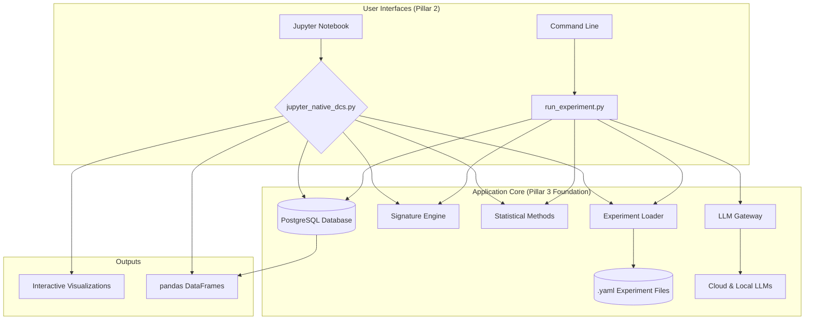

# 02: Technical Implementation Plan

**Status:** Current Plan  
**Strategic Alignment:** This plan details the technical architecture required to support the `01_validation_plan.md` and execute the "Community Foundation & Adoption" phase of the overall strategy.

## Core Principle: Stable Backend, Flexible Frontend

Our technical philosophy is to build upon a robust, stable, and well-tested backend infrastructure while providing a flexible, user-centric frontend that meets researchers where they are. This means we will:
-   **Retain & Enhance Core Logic:** The complex mathematical and statistical engines are the core IP. They will be preserved and wrapped, not replaced.
-   **Prioritize Jupyter-Native Workflows:** The primary user-facing environment for analysis will be Jupyter, adhering to established best practices for academic data science.
-   **Use the Command Line for Heavy Lifting:** Reserve the CLI for complex, multi-step, or batch-heavy operations like corpus analysis and large-scale experiment execution.

## System Architecture Overview

The system is comprised of a modular backend with a clear separation of concerns, designed to be accessed via both a direct CLI and a Jupyter-native interface.

## Key Technical Components

### 1. The Experiment Definition (`.yaml` files)
-   The single source of truth for any analysis.
-   Defines the `framework`, `corpus`, `models`, and `statistical_methods` to be used.
-   Enables reproducible, version-controlled research.

### 2. The Core Backend (`discernus/` package)
-   **Signature Engine (`engine/signature_engine.py`):** The mathematical core. Calculates centroids and distances based on the DCS Mathematical Foundations.
-   **Statistical Methods (`analysis/statistical_methods.py`):** A pluggable registry of statistical tests (e.g., Geometric Similarity, Dimensional Correlation).
-   **LLM Gateway (`gateway/llm_gateway.py`):** Manages all communication with external LLM APIs (OpenAI, Anthropic, etc.) and local models (via Ollama).
-   **Database Models (`database/models.py`):** SQLAlchemy models for persisting all experiments, runs, and results to a PostgreSQL database for full provenance tracking.

### 3. The User-Facing Interfaces
-   **Jupyter Native Interface (`analysis/jupyter_native_dcs.py`):**
    -   The primary tool for **results interpretation (Stage 6)**.
    -   Provides simple, researcher-friendly functions that return pandas DataFrames and interactive Plotly visualizations.
    -   Adheres to the 5 Heuristics of Jupyter-Native design: Data Fluidity, Standard Libraries, Pedagogical Clarity, Self-Containment, and Modularity.
-   **Command Line Runner (`experiments/run_experiment.py`):**
    -   The primary tool for **heavy execution (Stages 4-5)**.
    -   Takes a single `.yaml` file as input and runs the full analysis pipeline.
    -   Handles batch processing, parallelization, and saving results to the database.

## Jupyter-Native Integration Heuristics

Our Jupyter interface is explicitly designed to meet the expectations of academic researchers.

1.  **Data Fluidity:** All analysis functions return pandas DataFrames for easy manipulation. `dcs.export_for_stata(df)` provides an escape hatch to other academic tools.
2.  **Standard Library Integration:** Built exclusively on Plotly, pandas, and NumPy. No proprietary APIs.
3.  **Pedagogical Clarity:** All functions are thoroughly documented, and example notebooks explain the "why" behind the analysis.
4.  **Self-Containment:** Notebooks are designed to be run from top to bottom ("Run All Cells") without errors, with dependencies managed via a provided environment file.
5.  **Modularity & Hackability:** Provides `copy_friendly_` function examples that researchers can easily adapt for their own custom analyses, promoting flexible exploration. 