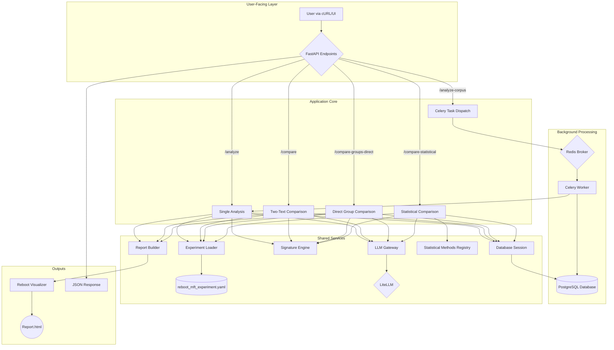

# 03: Current Technical Platform Capabilities

**Document Hierarchy**: Technical foundation documentation
**Strategic Context**: See `01_strategic_synthesis.md` for overall direction  
**Development Plan**: See `06_daily_priorities.md` for gate-driven validation timeline

This document details the technical platform capabilities that provide the foundation for **gate validation testing**. The system infrastructure supports the five validation gates without requiring major architectural changes.

## Platform Purpose: Gate Validation Support

**Technical Foundation for Academic Validation**:
> *"Provide robust infrastructure to systematically test whether LLMs + DCS can replicate, extend, and improve upon existing academic research with the rigor and usability required for strategic academic partnerships."*

**Current Capabilities**: Text analysis, comparison, statistical validation, and report generation across multiple LLMs with academic-grade documentation and reproducibility.

## Architecture

The system is built using a clean, modular architecture that is isolated in the `src/reboot/` directory. It supports multiple, high-performance workflows with a robust PostgreSQL persistence layer.

## Key Components

1.  **FastAPI Endpoints (`api/main.py`):**
    - Provides a suite of endpoints to answer the core research questions:
        - `/analyze`: For a single text.
        - `/compare`: For direct two-text comparison.
        - `/compare-groups-direct`: For high-performance, parallel comparison of two text groups.
        - `/compare-statistical`: For multi-model statistical comparisons with pluggable analysis methods.
        - `/analyze-corpus`: For asynchronous batch processing of a list of text files.
        - `/results/{job_id}`: To retrieve batch results.
        - `/compare-groups`: To compare the results of two completed batch jobs.
    - Orchestrates the flow between the other components.
    - Serves the final HTML reports from a static directory.

2.  **Self-Contained Experiment (`experiments/reboot_mft_experiment.yaml`):**
    - A single, glossary-compliant YAML file.
    - Contains all necessary `framework` definitions (axes, anchors, descriptions).
    - Includes detailed `prompt_guidance` to ensure high-quality, reproducible LLM analysis.

3.  **Prompt Engine (`engine/prompt_engine.py`):**
    - Dynamically constructs a rich, detailed prompt for the LLM using the guidance and framework definitions from the experiment file.

4.  **LLM Gateway (`gateway/`):**
    - Reuses the powerful, legacy `LiteLLMClient` but in a locally-copied, isolated, and refactored form.
    - Uses the `PromptEngine` to get its prompt.
    - Handles all communication with cloud and local LLMs.

5.  **Signature Engine (`engine/signature_engine.py`):**
    - `calculate_coordinates`: Calculates the final `(x, y)` centroid from the LLM scores and the framework's anchor definitions.
    - `calculate_distance`: Calculates the Euclidean distance between two centroids.
    - Acts as the single source of truth for all geometric calculations.

6.  **Report Builder & Visualizer (`reporting/`):**
    - The legacy `PlotlyCircularVisualizer` was copied and "power washed" to be fully glossary-compliant.
    - The `ReportBuilder` uses Jinja2 templates to generate shareable HTML files for all analysis types: single, comparison, and group comparison.
    - The reports for group comparisons now visualize the individual texts as well as the group centroids.

7.  **Persistence Layer (`database/`):**
    - **Models (`models.py`):** SQLAlchemy ORM models for both V1 (`AnalysisJob`, `AnalysisResult`) and V2 (`AnalysisJobV2`, `AnalysisResultV2`, `StatisticalComparison`) tables.
    - **Session (`session.py`):** Database session management with dependency injection for FastAPI.
    - **Migration (`alembic/`):** Dedicated Alembic environment for schema management, isolated from legacy systems.
    - **Storage:** All analysis data and statistical comparisons are persisted in PostgreSQL with proper relational integrity.

8.  **Background Processing (`tasks.py`):**
    - Celery workers that process analysis tasks asynchronously.
    - Results are saved directly to the `AnalysisResult` table with proper error handling.
    - Job status tracking through the `AnalysisJob` model.

9.  **Statistical Methods Registry (`analysis/statistical_methods.py`):**
    - Pluggable architecture for statistical analysis methods.
    - Built-in analyzers: `GeometricSimilarityAnalyzer` (Euclidean distances) and `DimensionalCorrelationAnalyzer` (Pearson correlations).
    - Extensible framework for adding new statistical comparison methods.
    - Handles edge cases like insufficient data and zero-variance scenarios.

## Outcome

The result is a comprehensive system that analyzes and compares texts, groups of texts, and statistical distributions across different models. It provides data responses (centroids, distances, statistical metrics), rich visual artifacts (reports), and sophisticated statistical analysis capabilities. The system fully answers the first five researcher questions and is built on a scalable, production-ready foundation with advanced database persistence and pluggable statistical methods.

## Foundational Improvements

### ✅ Completed: Persistence Layer (PostgreSQL)

**Status:** Successfully implemented and deployed.

The temporary file-based result store has been completely replaced with a robust PostgreSQL persistence layer:

- **Database Models:** `AnalysisJob` and `AnalysisResult` tables with proper relationships and foreign keys.
- **Migration Applied:** Database schema created using dedicated Alembic environment (`src/reboot/alembic/`).
- **Application Integration:** All endpoints (`/analyze-corpus`, `/results/{job_id}`, `/compare-groups`) now use database operations.
- **Celery Integration:** Background workers save results directly to PostgreSQL with error handling and job status updates.
- **Technical Debt Eliminated:** No more temporary files, filesystem dependencies, or data persistence concerns.

### ✅ Completed: Testing & CI Pipeline

**Status:** Successfully implemented and deployed.

A comprehensive testing harness and CI/CD pipeline has been implemented to ensure code quality and prevent regressions:

#### Test Harness (`pytest`)

- **Dependencies:** Added `pytest-asyncio` and `httpx` to `requirements.txt` for async testing and HTTP client support.
- **Structure:** Created `tests/reboot/` directory with proper package structure (`__init__.py` files).
- **Comprehensive Test Suite:** `tests/reboot/api/test_main.py` includes 10 tests covering:
  - Health endpoint validation
  - Single text analysis (success and error cases)
  - Two-text comparison with distance calculation
  - Direct group comparison functionality
  - Asynchronous workflow (job creation and result retrieval)
  - File handling and error scenarios
- **Mocking Strategy:** Uses `@patch('src.reboot.api.main.get_llm_analysis')` to mock LLM calls, ensuring fast, free tests that focus on application logic.
- **Test Results:** 100% pass rate (10/10 tests) with 6-second execution time.

#### Continuous Integration (GitHub Actions)

- **Workflow:** `.github/workflows/ci.yml` provides comprehensive CI/CD pipeline.
- **Multi-Python Testing:** Tests on Python 3.11, 3.12, and 3.13 for future compatibility.
- **Services Integration:** 
  - PostgreSQL 15 with health checks for database testing
  - Redis 7 for Celery background task testing
- **Pipeline Steps:**
  1. Code checkout and Python environment setup
  2. Dependency caching and installation
  3. Environment variable configuration
  4. Database migration testing
  5. Full test suite execution
  6. Code formatting (Black) and linting (Flake8) - non-blocking
  7. Coverage reporting for Python 3.13
- **Quality Gates:** Ensures all tests pass before allowing merges, with linting feedback for code quality improvement.

#### Additional Tooling

- **Configuration:** Added `pyproject.toml` for Black formatting and pytest configuration.
- **Linting:** Added `.flake8` configuration for consistent code style.
- **Status Monitoring:** Created `scripts/check_ci_status.py` for local CI status checking.

This robust testing and CI infrastructure provides immediate feedback on code changes, prevents regressions, and maintains high code quality standards.

### ✅ Completed: Statistical Comparison Infrastructure

**Status:** Successfully implemented and deployed.

A comprehensive statistical comparison system has been built to answer Research Question #5:

#### Database Schema (V2)

- **Advanced Models:** `AnalysisJobV2`, `AnalysisResultV2`, and `StatisticalComparison` tables with proper foreign key relationships.
- **Migration Applied:** New schema created using Alembic migration `58bd99eb37cd_add_statistical_comparison_tables.py`.
- **Enhanced Tracking:** Job configuration storage, detailed analysis metadata, and statistical comparison results persistence.

#### Statistical Methods Framework

- **Pluggable Architecture:** `StatisticalMethodRegistry` allows easy addition of new statistical analysis methods.
- **Built-in Analyzers:**
  - `GeometricSimilarityAnalyzer`: Calculates Euclidean distances between centroids with mean, max, and variance metrics.
  - `DimensionalCorrelationAnalyzer`: Computes Pearson correlations between score dimensions with correlation matrices.
- **Robust Implementation:** Handles edge cases like insufficient data, zero variance, and NaN scenarios.
- **Test Coverage:** 11 comprehensive tests ensuring statistical accuracy and error handling.

#### API Enhancement

- **Generic Endpoint:** `/compare-statistical` supports multi-model, multi-framework, and multi-run comparisons.
- **Concurrent Processing:** Uses `asyncio.gather()` for parallel LLM analysis across multiple models.
- **Database Integration:** Proper job tracking with status updates and comprehensive result persistence.
- **Statistical Output:** Returns both individual condition results and aggregated statistical metrics.

#### Technical Achievements

- **Production Ready:** Full integration testing with real database operations.
- **Extensible Design:** Easy to add new statistical methods and comparison types.
- **Data Integrity:** Proper foreign key constraints and transactional database operations.
- **Performance Optimized:** Concurrent analysis execution and efficient database queries.

## Gate Validation Support Matrix

This technical platform provides the infrastructure needed for systematic gate validation:

### **Gates 1-2: Core Capability Testing**
**Required Infrastructure**: ✅ **Complete**
- **Framework System**: YAML-based definitions with Framework Specification v3.2 compliance
- **LLM Gateway**: Multi-model analysis pipeline with statistical comparison capabilities  
- **Analysis Engine**: Signature calculation, distance metrics, correlation analysis
- **Statistical Validation**: Pluggable methods registry for academic rigor testing
- **Database Persistence**: Complete provenance tracking for reproducibility

**Ready for**: Tamaki & Fuks replication testing, four-condition experimental validation

### **Gates 3-4: Jupyter Integration**  
**Required Infrastructure**: 🔧 **Foundation exists, integration layer needed**
- **Report Builder**: HTML visualization with potential Jupyter notebook export
- **Data Export**: JSON/CSV outputs compatible with pandas DataFrame integration
- **Template System**: Architecture designed for notebook template generation
- **Academic Standards**: Publication-ready outputs and methodology documentation

**Requires**: Jupyter AI integration, notebook templates, workflow optimization

### **Gate 5: Academic Partnership Package**
**Required Infrastructure**: 🔧 **Core capabilities complete, packaging needed**
- **Methodology Documentation**: Comprehensive academic validation and transparency
- **Quality Assurance**: Testing framework and CI/CD pipeline for reliability
- **Scalability**: Database architecture supports large-scale analysis
- **Reproducibility**: Complete environment specification and version control

**Requires**: BYU-specific deliverable packaging, graduate student tutorial materials

## Strategic Implementation Priority

**Current Focus**: Leverage existing infrastructure for Gates 1-2 validation
- **No major technical development** required for basic capability testing
- **Framework enhancement** can proceed using existing experiment system
- **Statistical validation** ready for BYU replication comparison

**Future Development**: Conditional on gate validation success
- **Jupyter integration** only if Gates 1-2 succeed
- **Strategic partnership features** only if complete workflow validates
- **Platform scaling** only if academic value demonstrated

This approach protects development resources while ensuring robust technical foundation for systematic validation testing.