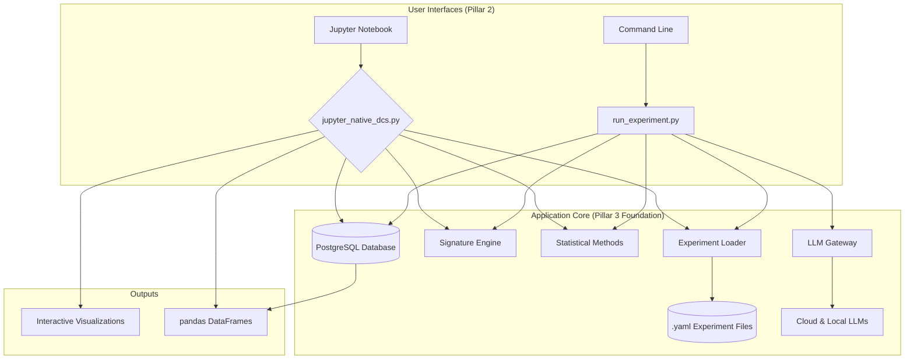

# Discernus Strategy & Planning Package

**Version:** 2.0  
**Date:** January 2025  
**Status:** Internal Review Draft

---

# Part 1: Comprehensive Product & Business Strategy

## Executive Summary

Discernus will become the **essential professional workbench and infrastructure layer** for computational social science, analogous to what RStudio/Posit provides for the world of statistical analysis. Our strategy implements a sophisticated three-pillar product model that separates the **academic public good** (open standards and free tools) from **commercial infrastructure** (a managed platform for scaled research). This approach is designed to build deep trust within the academic community while solving high-value institutional problems.

**Core Value Proposition:** "The research platform that gets you from hypothesis to publication faster, with higher methodological rigor, and better collaboration opportunities."

**Strategic Foundation:** Create a massive user base of individual researchers who naturally discover the need for our paid institutional solutions as their work scales in complexity and collaborative scope.

## The Problem: The "Last Mile" Problem in Computational Social Science

Computational social science is hampered by a lack of standardized, high-quality infrastructure. This creates a "last mile" problem where brilliant research is slowed down by inadequate tooling.
-   **For Individual Researchers:** Reproducibility, methodological rigor, and comparing results across studies are major challenges. Existing tools are often generic, require significant technical overhead, or are proprietary "black boxes" that impede transparency.
-   **For Research Institutions:** There is a critical gap in tools for ensuring IRB compliance, tracking data provenance, and managing large-scale collaborative research projects efficiently, which increases risk and slows the pace of discovery.

## Guiding Principles

These principles will guide our decision-making at every level of the organization.
1.  **Academic Credibility First:** Our value is rooted in methodological rigor and trust. We will never compromise academic integrity for commercial gain.
2.  **The Community is Our Moat:** Our open-source community and open standards are our greatest competitive advantage. We will nurture and serve them.
3.  **Solve and Monetize for Scale:** Provide powerful, free tools for individuals. Generate revenue by solving the complex problems that emerge at institutional scale (collaboration, compliance, security).
4.  **Transparency by Default:** Our methods must be open to scrutiny. We avoid "black box" approaches to build trust and ensure reproducibility.
5.  **Seamless Workflows:** We must integrate into the existing tools and habits of researchers to reduce friction and accelerate adoption.

## Brand Architecture & Naming

To ensure maximum clarity between the open-source project and the commercial entity, we will adopt a brand architecture modeled on the successful RStudio/Posit rebranding.

*   **`Discernus`**: This is the name of the **open standard, the community, and the free tools** (Pillar 1 and Pillar 2). The `discernus-community` package will be the flagship free product.
*   **`[Commercial Entity Name]`**: The commercial company that develops and sells the Pillar 3 infrastructure will have a **distinct, separate name** (e.g., "Axon Analytics," "Discourse Labs," etc. - placeholder TBD).

This separation prevents brand confusion and reinforces the independence of the Academic Standards Board and the open-source project.

## Target Audience & Customer Personas

We have distinct user and buyer personas, and we must serve both to succeed.

### The User: The Individual Adopter
-   **Who:** Individual Academics, Graduate Students, and Postdocs.
-   **Needs:** Powerful, free, and easy-to-use tools for their own research. They value speed-to-insight and compatibility with their existing Jupyter/Python workflows.
-   **Role in Strategy:** They are the seeds of our adoption. Their success and evangelism drive the entire model.

### The Buyer: The Institutional Customer
We have three primary buyers for our commercial offerings:
1.  **Principal Investigators (PIs) & Lab Directors:**
    -   **Manages:** Research teams and grant funding.
    -   **Needs:** Collaboration tools and enhanced analytical power for their team.
    -   **Buys:** `Discernus Cloud Professional` seats for their lab.
2.  **Department Heads & Deans:**
    -   **Manages:** Departmental research output, reputation, and budget.
    -   **Needs:** To elevate the department's research capabilities and ensure methodological rigor.
    -   **Buys:** Champions the adoption of the `Discernus Enterprise Server`.
3.  **University IT & Research Computing Officers:**
    -   **Manages:** Campus-wide software, security, and compliance.
    -   **Needs:** A secure, compliant, and manageable platform that integrates with existing infrastructure.
    -   **Buys:** Vets and implements the `Discernus Enterprise Server`.

## Strategic Architecture: The Three-Pillar Model

Our model mirrors RStudio/Posit's proven framework, adapted for computational social science research:

| Posit Component | Discernus Analogue | What It Is (The Tangible Asset) | Strategic Purpose & Business Model |
| :--- | :--- | :--- | :--- |
| **Pillar 1: The Open Standard** | | | |
| **GNU R Language** | **DCS Mathematical Foundations & Framework Specifications** | A set of peer-reviewed, citable **documents** and **data standards**. | **Builds Trust & Creates a Moat.** This is the non-commercial, academic "public good." We are its primary stewards, not its owners. Its widespread adoption makes our commercial tools more valuable. This is a **cost center** that generates **academic credibility**. |
| **Pillar 2: The Free Individual Tool** | | | |
| **RStudio Desktop IDE** | **`discernus-community` Python Package & Extensions** | A `pip install`-able Python library with core functions and a **local runtime**. Includes Jupyter/VSCode extensions. | **Drives Adoption & Creates Muscle Memory.** This is a powerful, feature-complete tool for individual researchers, free and open-source (GPL). Its limitations are natural consequences of local computing (scale, collaboration). This is our primary **marketing and educational tool**. |
| **Pillar 3: The Commercial Institutional Infrastructure** | | | |
| **Posit Workbench, Connect, Package Manager** | **`Discernus Cloud` & `Discernus Enterprise Server`** | A managed, server-side application: our **orchestrator, API, and database backend**. This is the **managed, server-side runtime.** | **Generates Revenue by Solving Institutional Problems.** This is our **proprietary, paid product.** It solves problems of scale, collaboration, compliance (IRB), security, and high-performance computation that are impossible to manage in a local notebook. |

## Monetization Strategy: Academic Freemium to Infrastructure

### Phase 1: Viral Adoption (GPL Community Package)
**Offering:** Free, open-source Jupyter notebook package
```python
# pip install discernus-community
import discernus_community as dc
df = dc.analyze_text(text, framework="moral_foundations")
dc.plot_results(df)
```

**Included:**
- Core analysis functions and mathematical engine
- 2-3 foundational framework specifications (Moral Foundations Theory, etc.)
- Sample public domain corpus
- Basic visualization capabilities  
- Comprehensive documentation and tutorials

**Strategic Goal:** Establish Discernus frameworks as academic standard, build researcher network

### Phase 2: Natural Pain Point Discovery
**Individual Researcher Friction:**
- Multi-text comparative analysis complexity
- Result reproducibility challenges
- Framework version management  
- Corpus representativeness limitations

**Institutional Friction:**
- Experiment tracking and collaboration needs
- Methodology sharing across teams
- Enterprise-grade corpus licensing requirements
- IRB compliance and provenance tracking

### Phase 3: Tiered Commercial Services

#### 3A: Freemium Cloud Micro-Services (Embedded in GPL Package)
**Strategic Purpose:** Build usage analytics, create upgrade conversion paths, and provide immediate value. These services are **opt-in with privacy controls** and integrated into the free package.

- **Framework Validation Service**: Validates custom frameworks against peer usage patterns
- **Analysis Benchmarking Service**: "Your analysis is in the 73rd percentile for this framework type"
- **Corpus Quality Analysis**: Diversity metrics, bias warnings, sampling suggestions

#### 3B: Cloud-Only Premium Services
**Strategic Purpose:** Provide high-value, centralized services that are economically impossible to self-host.

- **Discernus CorpusCloud**: Centralized, metadata-enriched corpus access with licensing management
- **Framework Marketplace**: Peer-reviewed, specialized framework specifications (academic app store)
- **Publication Support Services**: Statistical review, methodology documentation assistance
- **Collaborative Analysis Platform**: Multi-researcher project management and shared workspaces

#### 3C: Hybrid Deployment Platform (Cloud + On-Premise)
**Strategic Purpose:** Serve both individual cloud users and enterprise on-premise deployments with the same core platform.

- **Discernus Cloud Platform** ($99/month/researcher): Managed, scalable cloud platform for individuals and small teams
- **Discernus Enterprise Server** ($5K/month/institution): Containerized on-premise deployment with SSO, audit logging, enterprise security, and air-gapped operation capabilities

## Competitive Strategy: Learning from Open Source Business Model Evolution

### Successful Models: Anaconda and Red Hat Parallels

#### Anaconda's "Developer-to-Enterprise" Success Pattern Applied
**What Anaconda Did Right → Our Parallel Strategy:**
- **Free Core Distribution** → Free Core Analysis: Make moral analysis accessible to all researchers
- **Natural Pain Points** → Corpus management and collaboration complexity become institutional problems  
- **Value-Added Services** → Enterprise corpus licensing, collaboration tools, compliance tracking
- **Community Respect** → GPL ensures perpetual access to core functionality
- **Clear Differentiation** → Free tools for individual research, enterprise infrastructure for institutions

#### Red Hat's "Support and Services" Success Pattern Applied
**What Red Hat Did Right → Our Parallel Opportunities:**
- **Upstream Investment** → Develop and contribute standard framework specifications
- **Subscription Model** → Predictable revenue through research infrastructure hosting
- **Enterprise Focus** → Solve institutional problems (IRB compliance, multi-researcher collaboration)
- **Professional Services** → Custom framework development, methodology consulting, training programs
- **Exit Strategy** → Platform becomes acquisition target for educational technology or research companies

### Cautionary Tale: Avoiding the Elasticsearch License Trap

#### Risk Mitigation Strategy: How We Avoid Elasticsearch's Mistakes
**1. Permanent GPL Commitment**
- GPL ensures core functionality remains truly free forever
- No retroactive changes or license confusion
- Fork protection: if we misbehave, community can fork and continue development

**2. Value-Added Services Model**
- Hosting services and premium content, not software licensing restrictions
- Professional services (human expertise), not software functionality locks
- Clear separation between free analysis tools and premium services

**3. Community-First Approach**
- Actively contribute to academic standards and open frameworks
- Transparent roadmap with academic input
- Academic advisory board guides product development priorities

## Fork Defense Strategy: Mathematical Complexity Moat

### The "Implementation Hell" Triangular Kill Zone

While GPL licensing makes our code technically forkable, we create a sophisticated defense strategy that makes successful forking practically impossible through mathematical complexity, academic validation requirements, and brand embedding.

#### Mathematical Complexity as Competitive Moat
Our GPL package presents a deceptively simple interface that masks profound mathematical complexity:

```python
# What forkers see (appears simple):
import discernus_community as dc
result = dc.analyze_text(text, framework="moral_foundations")

# What they miss (mathematical foundations complexity):
- Arc positioning mathematics (40+ equations)
- Density correction algorithms (non-trivial implementation)
- Hybrid axes-anchors architecture (component registry complexity)
- Cross-framework normalization (subtle but critical)
- Temporal evolution corrections (easy to get wrong)
```

#### Academic Validation Trap
**Mathematical Standard Ownership:** Every calculation explicitly references our mathematical authority with watermarked provenance, branded function names, and mandatory academic citations.

**Academic Credibility Requirements:**
- Papers citing "Discernus methodology" must use mathematically compatible implementations
- Institutional IRBs require validation against Discernus mathematical standards
- Peer reviewers trained to check for mathematical implementation consistency

#### Trademark Law as Brand & Compliance Defense
While the mathematical moat defends our methodology, trademark law defends our brand and prevents market confusion. This is a standard and essential component of successful commercial open-source strategy.

*   **Founder-held Trademark:** Inspired by proven open-source governance models like Drupal, the founder will personally hold the trademark for the "Discernus" name and logos. This ensures the ultimate steward of the brand's integrity is an individual committed to the mission, independent of the commercial entity.
*   **Compliance & Certification Program:** The founder will grant two key conditional licenses:
    1.  To the **Academic Standards Board**: An exclusive license to award the "Discernus Certified™" mark to compliant projects.
    2.  To the **Commercial Entity**: A license to use the "Discernus" name in its product marketing (e.g., "[Company Name]'s Discernus Enterprise Server"), contingent on its continued good-faith support of the open-source project.
*   **Market Clarity:** This strategy ensures that any product calling itself "Discernus" or "Discernus Certified" is guaranteed to be the genuine article, providing clarity and assurance for researchers, institutions, and peer reviewers.

#### The Nuclear Winter Effect for Forkers
**Academic Adoption Death Spiral:**
- Existing papers cite "Discernus mathematical methodology"
- Forker's implementation produces different results from established research
- Academic institutions resist non-standard approaches due to reproducibility requirements
- Peer reviewers reject papers using "incompatible" mathematical implementations

### Strategic Outcome: "Technically Forkable, Practically Impossible"
This creates a "triangular kill zone" where forkers face simultaneous attacks on technical implementation, academic credibility, and ecosystem compatibility. The more successful our academic adoption becomes, the more devastating the consequences for anyone attempting to fork and compete.

## Technical Architecture: Comprehensive Bill of Materials

### Pillar 1: The Open Standard (Academic Public Good)
**Strategic Goal:** Establish the intellectual foundation of the ecosystem. Build trust and academic credibility.

| Asset Name | Type | Description | File Examples |
| :--- | :--- | :--- | :--- |
| **DCS Mathematical Foundations** | Document (Markdown) | The complete, citable mathematical specification for the Discernus Coordinate System. Our "academic whitepaper" and the root of our methodological authority. | `Discernus_Coordinate_System_Mathematical_Foundations_1_0.md` |
| **Framework Specifications** | Document (Markdown) | Human-readable documents that outline the purpose, philosophy, capabilities, and schema for framework and experiment architecture versions. | `Discernus_Coordinate_System_Framework_Specification_3_2.md`, `Discernus_Experiment_System_Specification_v3.2.0.md` |
| **Framework & Experiment Schemas** | Data Standard (YAML/JSON Schema) | Machine-readable definitions of structure, fields, and constraints that valid Framework and Experiment files must adhere to. | `schemas/framework_schema_v3.2.json`, `schemas/experiment_schema_v3.2.json` |
| **Reference Framework Definitions** | Data (YAML) | Illustrative, version-controlled YAML files for specific frameworks that serve as best-practice examples and starting points. | `reference_frameworks/mft_v3.2.yaml`, `reference_frameworks/populism_v3.2.yaml` |

#### Pillar 1 Governance: The Academic Standards Board
To ensure the long-term academic integrity and credibility of the open standard, we will establish the **Discernus Academic Standards Board**. This is not a corporate advisory board; it is an independent governing body for the Pillar 1 assets.

*   **Mandate & Separation:** The Board's sole mission is to be the guardian of the methodological rigor of the DCS Mathematical Foundations and Framework Specifications. It will operate with full authority over the standard, independent of the commercial interests of the company. This separation is the bedrock of community trust.
*   **Responsibilities:**
    *   Oversee the evolution of the mathematical and framework specifications.
    *   Ratify new versions of the open standards.
    *   Establish and manage a peer-review process for new community-contributed frameworks.
    *   Serve as the final authority for granting the right to use the "Discernus Certified™" mark, as empowered by a formal, conditional trademark license from the founder.
*   **Membership & Motivation:** The board will consist of a small number of highly respected, tenured academics in computational social science and related fields. Their motivation will be intrinsic—the opportunity to provide a lasting contribution to their field by creating a durable, open standard for rigorous research. The founder will hold a seat on the board to ensure alignment, but will not have unilateral control.

This governance model transforms Pillar 1 from being "our project" into "a community-governed standard that we sponsor," which is a far more powerful and sustainable position.

### Pillar 2: The Free Individual Tool (GPL-Licensed)
**Strategic Goal:** Drive widespread adoption, education, and individual research success.

| Asset Name | Type | Description | File Examples & Key Components |
| :--- | :--- | :--- | :--- |
| **`discernus-community` Python Package** | Software (Python Library) | The core `pip install`-able package. Contains all mathematical functions, parsers, and local analysis logic. | `setup.py`, `pyproject.toml`, `discernus/math/`, `discernus/analysis/` |
| **Local Orchestrator** | Software (Python Module) | Simplified, single-threaded orchestrator within GPL package for managing local analysis of small numbers of texts against a single LLM API. | `discernus/engine/local_orchestrator.py` |
| **Jupyter Extension** | Software (Jupyter/IPython) | Interactive widgets and "magic" commands for easy use within Jupyter notebooks. Provides plotting functions and streamlined analysis calls. | `discernus/integrations/jupyter_native_dcs.py`, `discernus.ipynb` examples |
| **VSCode Extension** | Software (TypeScript/Python) | Syntax highlighting for `.discernus-spec` files, command palette integrations, and in-editor visualization capabilities. | `vscode-extension/package.json`, `vscode-extension/src/extension.ts` |
| **Command Line Interface (CLI)** | Software (Python/Typer) | A `discernus` command that allows users to run analyses, validate frameworks, and manage their local environment from the terminal. | `discernus/cli/main.py` |
| **Educational Notebooks** | Document (IPython Notebooks) | Rich set of tutorials and example workflows demonstrating how to use the `discernus-community` package for teaching and research. | `examples/01_introduction.ipynb`, `examples/02_analyzing_a_speech.ipynb` |

### Pillar 3: The Commercial Infrastructure (Comprehensive)

#### Core Platform Infrastructure (Shared Components)
**Strategic Purpose:** Technical foundation that powers both cloud and on-premise deployments.

| Asset Name | Type | Description | File Examples & Key Components |
| :--- | :--- | :--- | :--- |
| **Discernus Cloud API** | Software (FastAPI Backend) | Proprietary, scalable, multi-tenant API that handles all requests from authenticated users. Entry point to the commercial platform. | `platform/api/main.py`, `platform/api/authentication.py`, `platform/api/multi_tenant.py` |
| **Cloud Orchestrator Engine** | Software (Python/Celery/Redis) | Robust, asynchronous engine managing entire analysis lifecycle. Includes parallel orchestration, robust LLM gateway, reproducibility engine, and containerized deployment. | `platform/engine/cloud_orchestrator.py`, `platform/workers/celery_workers.py`, `platform/deployment/docker-compose.yml` |
| **Database Schema & Models** | Software (SQL/SQLAlchemy) | PostgreSQL database schema for storing all user data, experiments, corpora, results, and provenance information. Supports both single-tenant and multi-tenant deployments. | `platform/database/models.py`, `platform/database/migrations/`, `platform/database/multi_tenant_utils.py` |
| **Web Frontend / Dashboard** | Software (React/Vue.js) | User-facing web application for project management, collaboration, analysis, corpus management, and billing. Adapts to both cloud and enterprise deployments. | `platform/frontend/src/App.tsx`, `platform/frontend/src/components/Dashboard.tsx`, `platform/frontend/src/enterprise/` |
| **Statistical Methods Registry** | Software (Python) | Pluggable architecture for statistical analysis methods with built-in analyzers for geometric similarity and dimensional correlation. Extensible for custom institutional methods. | `platform/analysis/statistical_methods.py`, `platform/analysis/custom_analyzers/` |

#### Business Operations & Compliance
**Strategic Purpose:** Legal, operational, and compliance infrastructure for commercial operations in the academic sector.

| Asset Name | Type | Description | File Examples & Key Components |
| :--- | :--- | :--- | :--- |
| **Enterprise Sales Materials** | Document | Commercial contracts, SLAs, privacy policies, and security documentation required for enterprise sales and academic compliance. | `legal/Master_Subscription_Agreement.pdf`, `security/SOC2_Compliance_Overview.pdf`, `academic/IRB_Compliance_Guide.pdf` |
| **Data Privacy & Security Framework** | Document + Software | GDPR, FERPA, and institutional data governance compliance tools, including data anonymization, audit logging, and consent management systems. | `compliance/gdpr_tools.py`, `compliance/audit_logging.py`, `compliance/data_retention_policies.md` |
| **Academic Partnership Materials** | Document | White papers, case studies, pilot program structures, and training materials designed specifically for academic institutional partnerships. | `partnerships/academic_pilot_program.md`, `partnerships/training_materials/`, `partnerships/case_studies/` |

## Market Positioning & Competitive Advantages

### Unique Value Proposition
**Academic Specialization:** Purpose-built for research workflows, not general business use
**Methodology Standards:** Creating frameworks becomes network effect moat stronger than technical lock-in
**Research Impact Focus:** Success measured in publications and collaborations, not just revenue

### Network Effects and Viral Distribution
- **User Growth**: More researchers → Better benchmarking data → More valuable services
- **Framework Ecosystem**: More frameworks → Larger research ecosystem → Higher adoption
- **Institutional Adoption**: More institutions → Better corpus diversity → Higher quality analysis

### Elimination of Traditional Academic Software Barriers
- ❌ **Cost Concerns** → Free to start, grant-fundable upgrades
- ❌ **Vendor Lock-in Fears** → GPL licensing guarantees freedom
- ❌ **Black Box Concerns** → Full methodological transparency  
- ❌ **Learning Curve** → Familiar Jupyter interface
- ❌ **Institutional Approval** → No procurement process for initial adoption

## Data Intelligence Flywheel Strategy

### Intelligence Generation (Anonymized Telemetry)
**Product Development Intelligence:**
- Framework usage patterns and failure modes
- Common analytical workflow pain points
- Corpus type demands and gaps
- Geographic and institutional usage trends

**Sales Intelligence:**
- High-volume usage indicating enterprise opportunities
- Multi-researcher institutional patterns
- Framework specialization trends for premium feature development

### User Value Delivered
- Framework validation and peer benchmarking
- Corpus quality and representativeness analysis
- Citation generation and methodology documentation assistance
- Community analytics and trend insights

## Success Metrics and KPIs

### Adoption Metrics
- Monthly active researchers using GPL package
- Framework downloads and citation rates
- Geographic and institutional distribution
- Community contribution rates (custom frameworks, corpus submissions)

### Conversion Metrics  
- GPL to Professional upgrade conversion rates
- Individual to institutional sales progression
- Average time from first use to paid conversion
- Revenue per researcher and per institution

### Research Impact Metrics
- Publications citing Discernus methodologies
- Framework specifications adopted as academic standards
- Collaborative research projects enabled
- Reproducibility and replication rates in academic literature

## Phased Rollout Strategy

Our implementation will follow a logical sequence, ensuring each phase builds upon the success of the last. This is a strategic sequence, not a time-bound plan; tactical roadmaps with specific dates will be managed in separate planning documents.

### Phase 1: Community Foundation & Adoption
**Goal:** Establish Discernus as the credible, standard tool for individual researchers.
*   **Actions:** Release the core `discernus-community` GPL package, publish foundational framework specifications, and begin community outreach and documentation efforts.

### Phase 2: Commercial Services & Value-Added Features
**Goal:** Introduce the first layer of commercial offerings by solving emergent pain points for individuals and small teams.
*   **Actions:** Launch the `Discernus Cloud Professional` tier, deploy freemium cloud micro-services, and establish initial corpus licensing partnerships.

### Phase 3: Enterprise & Institutional Scaling
**Goal:** Solve problems of scale, compliance, and collaboration for large research institutions.
*   **Actions:** Release the on-premise `Discernus Enterprise Server`, launch the Framework Marketplace and CorpusCloud, and build out institutional partnership programs.

### Phase 4: Ecosystem Maturation
**Goal:** Solidify Discernus as the central, indispensable platform for the entire research field.
*   **Actions:** Drive framework standardization in key academic domains, scale publication support and consulting services, and expand training and certification programs.

## Risk Mitigation

### Technical Risks
- **Complexity Management**: Maintain clear separation between simple interfaces and robust backend
- **Scalability**: Design cloud services for academic usage spikes and international growth
- **Quality Assurance**: Implement peer review processes for framework specifications

### Business Risks  
- **Academic Sales Cycles**: Plan for long institutional decision processes and budget cycles
- **Open Source Competition**: Ensure proprietary services provide clear value over free alternatives
- **Research Funding Volatility**: Diversify revenue across multiple institutions and funding sources

### Market Risks
- **Academic Adoption Resistance**: Provide extensive documentation, tutorials, and migration support
- **Competitive Response**: Establish strong network effects and switching costs early
- **Regulatory Changes**: Monitor data privacy and academic research regulations across jurisdictions

## Long-Term Vision: Beyond the Academy

While our initial, focused strategy is to win the academic market, the technology we are building is fundamentally domain-agnostic. The need for rigorous, auditable, and scalable discourse analysis extends far beyond the university campus.

### Phase 1: Win the Academic Beachhead (Current Strategy)
Our immediate focus is on computational social science to build a powerful foundation of:
-   **Methodological Credibility:** Achieve peer-reviewed, standard-setting status.
-   **User Base & Talent Pipeline:** Cultivate a generation of experts who bring our tools to future employers.
-   **Robust, Battle-Tested Frameworks:** Refine our technology in one of the world's most demanding environments for rigor.

### Phase 2: Commercial & Government Expansion
Once the academic foundation is secure, we will be positioned to expand into high-value adjacent markets. The credibility and user base built in Phase 1 will be our primary wedge for entering these new domains.

**Potential Expansion Markets:**
-   **Public Policy & NGOs:** Think tanks, non-profits, and lobbying firms analyzing policy documents and public sentiment.
-   **Political & Campaign Analytics:** Political parties and campaign consultants tracking messaging and voter response.
-   **Corporate Market Intelligence:** Marketing, brand strategy, and product teams analyzing customer feedback, social media, and market trends.
-   **Media & Journalism:** News organizations analyzing media narratives and source bias.
-   **National Security & Intelligence:** Government agencies analyzing foreign communications, propaganda, and open-source intelligence (OSINT).

By winning the most methodologically demanding market first, we create the strongest possible platform from which to launch into all others.

## Funding & Exit Strategy

Our financial strategy is designed to maximize founder control and align with our community-first model by prioritizing non-dilutive funding and sustainable growth before considering outside capital.

### Funding Strategy: The Path to Sustainable Growth
Our approach mirrors the successful trajectory of companies like Posit (RStudio), prioritizing value creation and revenue before seeking major investment.

1.  **Phase 1: Bootstrapping & Non-Dilutive Funding:**
    *   **Founder-led Bootstrapping:** The founder will self-fund the initial bootstrap phase to maintain 100% control during the critical value-creation period. The founder's extensive network—including luminaries like the Skok brothers, Donald Fischer, and Tim Yeaton—provides a significant strategic advantage for future angel investment, key hires, and strategic advice.
    *   **Government Grants (e.g., SBIR/STTR):** Actively pursue non-dilutive R&D funding from sources like the National Science Foundation. This aligns perfectly with our academic mission, provides capital without dilution, and adds significant credibility.

2.  **Phase 2: Early Revenue Re-investment:**
    *   **Self-Funding through Sales:** Reinvest all early revenue from `Discernus Cloud Professional` subscriptions and professional services (e.g., custom framework development for university departments) to fund the scaling of our engineering and community teams.

3.  **Phase 3: Strategic "Patient" Capital (Optional):**
    *   **Targeted Venture Capital:** If we choose to accelerate our enterprise sales motion, we will *only* seek funding from venture firms with a proven understanding of open-source business models. This ensures our investors are aligned with our long-term, community-focused strategy and will not pressure us to compromise that trust for short-term growth.

### Exit Strategy: Creating Optionality
A successful exit provides returns to founders, employees, and investors. We will build the company to have multiple attractive exit options.

1.  **Strategic Acquisition (Most Likely Path):** Discernus will become a highly desirable asset for established players seeking to enter or expand their footprint in the research analytics market. Potential acquirers include:
    *   **Major Academic Publishers:** Companies like **Elsevier, Springer Nature, or Wiley** who are transitioning from content providers to data and analytics platforms.
    *   **Educational Technology Leaders:** A company like **Instructure (Canvas) or Coursera** looking to add a high-end research tool to their portfolio.
    *   **Data & Analytics Platforms:** As we expand, a company like **Databricks or Palantir** could acquire us to enter a new vertical with a highly credible, specialized tool.

2.  **Private Equity Acquisition:** If the company becomes highly profitable but with a moderate growth rate, an acquisition by a private equity firm is a strong possibility.

3.  **Initial Public Offering (IPO) (The Aspirational Goal):** While not a primary goal, if we achieve massive scale ($100M+ in annual recurring revenue) and a predictable enterprise sales model, going public is a potential outcome. This path has been successfully navigated by other commercial open-source companies like GitLab and HashiCorp.

## Conclusion

Discernus represents a unique opportunity to establish the foundational infrastructure for computational social science research while building a sustainable, profitable business. By combining open-source academic credibility with enterprise-grade functionality, we can achieve both widespread adoption and significant commercial success.

The strategy leverages proven open-source business models while addressing the specific needs and constraints of academic research environments. Success depends on executing the delicate balance between free value delivery and premium service differentiation, while maintaining the trust and credibility essential for academic adoption.

**The ultimate vision: Discernus becomes the standard infrastructure that enables the next generation of computational social science research, making rigorous comparative analysis as accessible and reliable as basic statistical computing is today.**

---

# Part 2: Validation Plan & Gate-Driven Methodology

## The Core Principle: Validate Before Investing

Our development process is anchored by a **validation-first** philosophy. Before making significant investments in platform features or infrastructure, we must prove the core value and technical feasibility of our approach through a series of rigorous, sequential gates. This ensures we build something researchers actually want and need, not something we think they should want.

This approach provides several key benefits:
- **Evidence-Based Decisions:** Prevents major investment without proven research value.
- **Risk Management:** Creates multiple "off-ramps" to prevent sunk cost fallacy.
- **Academic Credibility:** Forces honest, transparent documentation of limitations.
- **Resource Protection:** Focuses effort and capital only on validated capabilities.

## The Five Validation Gates

Our entire initial development plan is structured around answering five fundamental questions. Each must be answered successfully before proceeding to the next.

### **Gate 1: Basic Capability Validation**
-   **Question**: Can LLMs + Discernus Coordinate System (DCS) replicate existing, peer-reviewed research with a reasonable degree of accuracy?
-   **Success Criteria**: Achieve a correlation of r > 0.70 with the manual coding from a known academic study (e.g., Tamaki & Fuks 2018).
-   **Failure Response**: The core premise of using LLMs for this task is flawed. Pivot or terminate the project.

### **Gate 2: Extension & Innovation Validation**
-   **Question**: Can the LLM+DCS approach extend and improve upon existing research, providing novel insights that are difficult to achieve with manual methods?
-   **Success Criteria**: Demonstrate a new analytical capability, such as quantifying discourse competition between rhetorical frames (e.g., populism vs. pluralism).
-   **Failure Response**: The value is limited to replication. Re-evaluate the commercial potential as a pure automation tool.

### **Gate 3: Results Analysis Usability**
-   **Question**: Can a researcher analyze the results of a Discernus experiment using a familiar Jupyter environment, without excessive friction?
-   **Success Criteria**: A target user (e.g., a graduate student) can become productive with the analysis workflow in less than two hours, satisfying at least 4/5 Jupyter Native Integration Heuristics.
-   **Failure Response**: A Jupyter-native approach is not viable. Pivot to a command-line-centric toolset or a more structured GUI.

### **Gate 4: Development Workflow Usability**
-   **Question**: Can a researcher use a Jupyter-native workflow for the *entire* process, from framework development to final analysis?
-   **Success Criteria**: Demonstrate a seamless, end-to-end workflow within the Jupyter environment.
-   **Failure Response**: The "all-in-Jupyter" vision is flawed. Accept that framework development and analysis execution will live in separate environments (e.g., VSCode/YAML for development, Jupyter for analysis).

### **Gate 5: Strategic Partnership Readiness**
-   **Question**: Is the combined package of tooling, documentation, and results compelling enough to secure a strategic partnership with a key academic team?
-   **Success Criteria**: A target academic partner (e.g., BYU's populism team) agrees that the methodology is defensible for publication and commits to a long-term collaboration.
-   **Failure Response**: The value proposition is not strong enough for deep partnerships. Re-evaluate the strategy to focus on individual researcher tools.

## Academic Partnership as Validation Vector: The BYU Case Study

The collaboration with the BYU Populism team serves as the primary testbed for validating all five gates.

-   **Gate 1 (Replication):** Replicate the findings of Tamaki & Fuks 2018.
-   **Gate 2 (Extension):** Analyze the populism vs. pluralism dimension in the Bolsonaro speeches.
-   **Gates 3 & 4 (Usability):** Use their graduate students as the target users for the Jupyter workflow testing.
-   **Gate 5 (Partnership):** The successful outcome of the previous gates will determine the scope and future of the partnership.

This ensures our validation process is grounded in a real-world, high-stakes academic research project, not just internal benchmarks. 

---

# Part 3: Technical Implementation Plan

## Core Principle: Stable Backend, Flexible Frontend

Our technical philosophy is to build upon a robust, stable, and well-tested backend infrastructure while providing a flexible, user-centric frontend that meets researchers where they are. This means we will:
-   **Retain & Enhance Core Logic:** The complex mathematical and statistical engines are the core IP. They will be preserved and wrapped, not replaced.
-   **Prioritize Jupyter-Native Workflows:** The primary user-facing environment for analysis will be Jupyter, adhering to established best practices for academic data science.
-   **Use the Command Line for Heavy Lifting:** Reserve the CLI for complex, multi-step, or batch-heavy operations like corpus analysis and large-scale experiment execution.

## System Architecture Overview

The system is comprised of a modular backend with a clear separation of concerns, designed to be accessed via both a direct CLI and a Jupyter-native interface.



## Key Technical Components

### 1. The Experiment Definition (`.yaml` files)
-   The single source of truth for any analysis.
-   Defines the `framework`, `corpus`, `models`, and `statistical_methods` to be used.
-   Enables reproducible, version-controlled research.

### 2. The Core Backend (`discernus/` package)
-   **Signature Engine (`engine/signature_engine.py`):** The mathematical core. Calculates centroids and distances based on the DCS Mathematical Foundations.
-   **Statistical Methods (`analysis/statistical_methods.py`):** A pluggable registry of statistical tests (e.g., Geometric Similarity, Dimensional Correlation).
-   **LLM Gateway (`gateway/llm_gateway.py`):** Manages all communication with external LLM APIs (OpenAI, Anthropic, etc.) and local models (via Ollama).
-   **Database Models (`database/models.py`):** SQLAlchemy models for persisting all experiments, runs, and results to a PostgreSQL database for full provenance tracking.

### 3. The User-Facing Interfaces
-   **Jupyter Native Interface (`analysis/jupyter_native_dcs.py`):**
    -   The primary tool for **results interpretation (Stage 6)**.
    -   Provides simple, researcher-friendly functions that return pandas DataFrames and interactive Plotly visualizations.
    -   Adheres to the 5 Heuristics of Jupyter-Native design: Data Fluidity, Standard Libraries, Pedagogical Clarity, Self-Containment, and Modularity.
-   **Command Line Runner (`experiments/run_experiment.py`):**
    -   The primary tool for **heavy execution (Stages 4-5)**.
    -   Takes a single `.yaml` file as input and runs the full analysis pipeline.
    -   Handles batch processing, parallelization, and saving results to the database.

## Jupyter-Native Integration Heuristics

Our Jupyter interface is explicitly designed to meet the expectations of academic researchers.

1.  **Data Fluidity:** All analysis functions return pandas DataFrames for easy manipulation. `dcs.export_for_stata(df)` provides an escape hatch to other academic tools.
2.  **Standard Library Integration:** Built exclusively on Plotly, pandas, and NumPy. No proprietary APIs.
3.  **Pedagogical Clarity:** All functions are thoroughly documented, and example notebooks explain the "why" behind the analysis.
4.  **Self-Containment:** Notebooks are designed to be run from top to bottom ("Run All Cells") without errors, with dependencies managed via a provided environment file.
5.  **Modularity & Hackability:** Provides `copy_friendly_` function examples that researchers can easily adapt for their own custom analyses, promoting flexible exploration. 

---

# Part 4: Implementation Roadmap

## Phase 1: Foundation Validation (Gates 1-2)
**Goal:** Prove the fundamental viability of the LLM+DCS approach for academic research.

*   **Milestone 1.1: Framework Enhancement**
    *   **Action:** Develop an enhanced, v3.2-compliant `populism_pluralism` framework based on the Tamaki & Fuks study.
    *   **Deliverable:** `populism_pluralism_v3.2.yaml`.
*   **Milestone 1.2: Replication Study**
    *   **Action:** Execute a four-condition experiment to replicate the original study's findings using the new framework.
    *   **Success Criteria:** Achieve >0.70 correlation with manual coding (Gate 1).
*   **Milestone 1.3: Extension Study**
    *   **Action:** Use the enhanced framework to quantify the populism vs. pluralism discourse competition in the target corpus.
    *   **Success Criteria:** Generate novel insights not present in the original study (Gate 2).
*   **Milestone 1.4: BYU Phase 1 Deliverable**
    *   **Action:** Package the findings from the replication and extension studies into a Jupyter notebook.
    *   **Deliverable:** `bolsonaro_methodological_validation.ipynb` for review by our academic partner.

## Phase 2: Integration & Usability (Gates 3-4)
**Goal:** Ensure the tooling is not just powerful, but also natural and intuitive for researchers to use within their existing workflows.

*   **Milestone 2.1: Results Analysis Interface**
    *   **Action:** Develop and refine the `jupyter_native_dcs.py` module for seamless results analysis.
    *   **Success Criteria:** A graduate student can become productive with the interface in under 2 hours (Gate 3).
*   **Milestone 2.2: End-to-End Workflow**
    *   **Action:** Create documentation and example notebooks demonstrating the full workflow from framework editing to final visualization within a Jupyter environment.
    *   **Success Criteria:** The entire research lifecycle can be managed within a Jupyter-native context (Gate 4).
*   **Milestone 2.3: BYU Phase 2 Deliverable**
    *   **Action:** Deliver an interactive analysis tools package to the BYU team.
    *   **Deliverable:** An enhanced notebook with interactive widgets and tools for deeper data exploration.

## Phase 3: Partnership & Packaging (Gate 5)
**Goal:** Solidify the value proposition and deliver a package compelling enough to secure a long-term strategic academic partnership.

*   **Milestone 3.1: Academic Deliverable Creation**
    *   **Action:** Generate publication-ready outputs, including methodology documentation, visualizations, and data exports.
*   **Milestone 3.2: Partnership Proposal Package**
    *   **Action:** Assemble a complete package including the validated tools, results, and a framework for future multi-university collaborations and grant applications.
    *   **Success Criteria:** The academic partner agrees to a long-term collaboration, confirming the success of Gate 5.

## Phase 4: Community Foundation (Post-Validation)
**Goal:** Transition from a single-partner validation project to the public launch of the Pillar 2 `discernus-community` package.

*   **Milestone 4.1: Public Package Release**
    *   **Action:** Clean up, document, and publish the first version of the `discernus-community` Python package to PyPI.
*   **Milestone 4.2: Tutorial & Documentation Site**
    *   **Action:** Create a public-facing website with a "Getting Started" guide, tutorials, and comprehensive documentation.
*   **Milestone 4.3: Launch Freemium Micro-services**
    *   **Action:** Deploy the initial cloud-connected services (e.g., Framework Validation) that provide value to free users and telemetry to the company. 

---

# Appendix: Concept Storage Cabinet

## Future Platform Enhancements (Post-Validation)

### Advanced Infrastructure
-   **Workflow Engine Integration:** For experiments exceeding 1-2 hours, introduce a formal workflow engine like `Prefect` or `Airflow`. The current `execute_experiment()` functions would become tasks within this engine, allowing for sophisticated retry logic, scheduling, and concurrency management.
-   **Multi-Provider Orchestration:** An intelligent LLM gateway that can perform load balancing, cost optimization, and automatic failover between different API providers (e.g., if the OpenAI API is slow, route traffic to Anthropic).
-   **Real-Time Analytics Dashboard:** A web-based frontend (likely React/Vue) for live experiment monitoring, quality assessment, and results visualization, moving beyond the Jupyter-only interface for large-scale institutional use.

### Research & Analysis Capabilities
-   **Conversational Interface ("English as Code"):**
    -   **Vision:** Allow researchers to design and run experiments using natural language queries (e.g., "Compare OpenAI and Anthropic on my corpus of political speeches").
    -   **Architecture:** Use an LLM to translate natural language queries into the structured `.yaml` experiment definitions, which are then fed into the existing execution pipeline. This maintains rigor while dramatically improving accessibility.
-   **DCS-Aware AI Research Assistant:**
    -   **Vision:** A Jupyter AI chat participant that has deep knowledge of our Framework Specifications, mathematical foundations, and validation protocols.
    -   **Capabilities:** Can help a researcher generate a compliant framework from a natural language description, design a valid experiment, and automatically generate the methodology section for a paper.
-   **Advanced Research Dimensions:**
    -   **Unified `evaluators` Layer:** Extend the experiment definition to support not just LLMs, but also `human_crowd` (e.g., Mechanical Turk) and `human_offline` (for integrating pre-existing coded data) as analysts.
    -   **Context Enrichment (RAG):** Allow experiments to connect to a vector database to provide Retrieval-Augmented Generation capabilities to the analyzing LLM.
-   **Analysis Recipes (AR):** A simple YAML-based DSL for defining common post-analysis statistical operations (`filter`, `groupby`, `stats`) that can be chained together.

### Reporting & Visualization
-   **Stakeholder-Specific Reports:** A reporting engine that can generate different views of the same results: a high-level executive summary, a full academic technical report, and an accessible public version.
-   **Advanced Visualizations:** A library of additional DCS-specific plots, such as model centroid overlays with confidence ellipses and similarity heatmaps.
-   **Expanded Export Formats:** Direct export to LaTeX, Word, and other formats common in academic publishing pipelines.

### Resilience & Quality of Service
-   **Sufficiency Thresholds:** Define minimum requirements for a result to be considered valid (e.g., `min_overlapping_analyses: 20`, `min_success_rate_per_model: 0.75`).
-   **Graceful Degradation:** If an experiment has partial failures, it should assess if it still meets the sufficiency threshold. If so, it should complete with a "degraded analysis" warning; otherwise, it should abort with a clear failure report.
-   **Failure Classification:** Systematically track and classify failures (transient API errors vs. text-specific parsing errors vs. model-specific failures) to enable intelligent retry and failover logic.
-   **Pre-flight Health Checks:** Before running a costly experiment, assess external factors like API provider health and corpus complexity, and provide warnings to the user. 