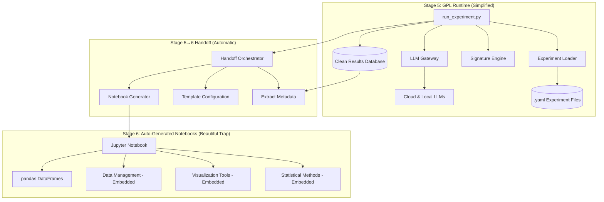

# 02: Technical Implementation Plan

**Status:** Updated Plan v2.0  
**Date:** January 27, 2025  
**Strategic Alignment:** This plan implements the GPL → Pillar 3 Conversion Strategy ("Free Will Trap") through simplified GPL runtime and Stage 6 auto-generated Jupyter integration.  
**Cross-References:** GPL → Pillar 3 Conversion Strategy, DCS Research Workflow Specification v1.0

## Core Principle: Simplified GPL, Beautiful Stage 6 Handoff

Our technical philosophy implements the "Free Will Trap" strategy through clean architectural separation:

**GPL Runtime Simplification:**
-   **Keep Core Essential:** Mathematical engines, LLM orchestration, clean data export
-   **Remove Enterprise Creep:** Statistical analysis, report generation, web dashboards  
-   **Perfect Individual Experience:** Researchers get exactly what they want from GPL

**Stage 6 Auto-Generation:**
-   **Jupyter Paradise:** Complete analysis notebooks auto-generated with data pre-loaded
-   **Statistical Complexity:** All analytical methods embedded in notebooks (creates scaling challenges)
-   **Academic Workflow Optimization:** Familiar tools with advanced capabilities

**Strategic Outcome:** GPL provides superior individual research experience while Stage 6 notebooks naturally create scaling problems that drive Pillar 3 conversion.

## System Architecture Overview

Simplified GPL runtime with automatic Stage 6 notebook generation implementing the "Free Will Trap" strategy.



**Key Architectural Changes:**
- **Removed from GPL:** Statistical analysis, report builder, web dashboard
- **Added to Stage 6:** All analytical capabilities embedded in auto-generated notebooks
- **Strategic Result:** Individual researchers love the experience, teams encounter scaling challenges

## Key Technical Components

### 1. GPL Runtime (Simplified Core)

**Experiment Definition (`.yaml` files):**
-   Single source of truth for reproducible analysis
-   Defines `framework`, `corpus`, `models` (no statistical methods)
-   Clean configuration for automated Stage 6 handoff

**Core Engine (`discernus/` package):**
-   **Signature Engine:** Mathematical coordinate calculation (core IP)
-   **LLM Gateway:** Provider-agnostic model orchestration
-   **Clean Data Export:** Structured results for notebook consumption
-   **Simple Database:** Results storage only (no enterprise analytics)

**Command Line Runner (`run_experiment.py`):**
-   Executes experiments and triggers Stage 6 handoff
-   No built-in statistical analysis or visualization
-   Perfect for individual researcher workflow

### 2. Stage 5→6 Handoff System (New)

**Handoff Orchestrator:**
-   Automatic trigger after successful experiment completion
-   Extracts framework, experiment, and results metadata
-   Configures universal notebook template
-   Saves notebook to `results/{job_id}/stage6_interactive_analysis.ipynb`

**Template Configuration:**
-   Framework-agnostic template selection
-   Dynamic data injection and method embedding
-   DROI metadata preparation (local-only)

### 3. Stage 6 Auto-Generated Notebooks (Strategic Component)

**Embedded Capabilities (Creates Scaling Challenges):**
-   **Statistical Methods:** All analysis functions embedded in notebook
-   **Visualization Tools:** Advanced plotting capabilities
-   **Data Management:** Cross-experiment data loading utilities
-   **Export Functions:** Publication-ready figure generation

**Strategic Design:**
-   Perfect for single experiments (researchers love it)
-   Becomes complex with multiple experiments (scaling pain)
-   Creates natural need for enterprise organization tools

## Stage 6 Auto-Generation Design Principles

Stage 6 notebooks implement the "Beautiful Trap" strategy through academic workflow optimization that creates natural scaling challenges.

**Academic Excellence (Individual Researcher Paradise):**
1.  **Data Pre-loaded:** Experiment results imported as clean pandas DataFrames
2.  **Standard Libraries:** Built on matplotlib, seaborn, plotly, pandas, numpy
3.  **Statistical Completeness:** All analysis methods embedded and ready to use
4.  **Self-Containment:** "Run All Cells" executes without errors
5.  **Academic Export:** Publication-ready figures and tables

**Strategic Scaling Challenges (Natural Pillar 3 Drivers):**
1.  **Notebook Proliferation:** Each experiment generates separate notebook
2.  **Cross-Experiment Analysis:** Manual data integration required
3.  **Version Control Complexity:** Notebook collaboration challenges
4.  **Reproducibility Management:** Environment dependency overhead
5.  **Publication Pipeline:** Manual figure export and organization

**Implementation Strategy:**
```python
# Stage 6 Auto-Generated Notebook Structure
# 1. Framework configuration (pre-loaded)  
# 2. Experiment metadata (auto-documented)
# 3. Results data (pandas DataFrame ready)
# 4. Statistical analysis functions (embedded)
# 5. Visualization capabilities (full featured)
# 6. Export utilities (publication ready)
```

**Strategic Outcome:** Perfect individual experience that naturally creates enterprise needs at scale. 