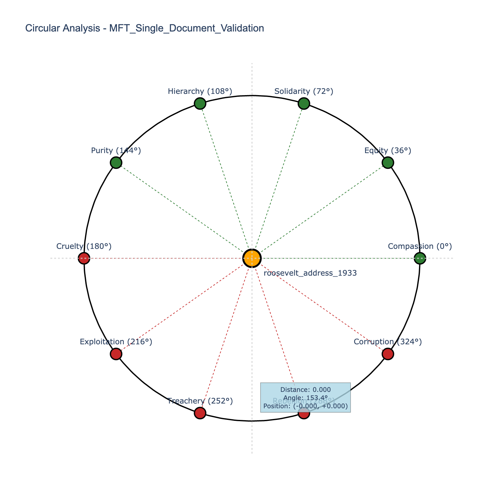

# Enhanced Experiment Report: MFT_Single_Document_Validation

**Generated**: June 13, 2025 at 10:35 AM  
**Experiment ID**: 27  
**Status**: Active  
**Framework**: mft_persuasive_force vv2025.06.13

---

## Executive Summary

This experiment demonstrates strong validation of the mft_persuasive_force framework 
with an average fit score of 0.800. 

**Key Findings:**
- **Success Rate**: 1/1 (100.0%)
- **High-scoring wells**: Compassion, Cruelty
- **Framework effectiveness**: Strong support for hypothesis
- **Cost efficiency**: $0.0339 total analysis cost
- **Processing speed**: 11.62s average execution time

The results support 
the original hypothesis and demonstrate the framework's utility for narrative analysis.

---

## Visualizations (Standard Pipeline)

### Circular Analysis

*Figure 1: Circular visualization showing narrative positioning using mft_persuasive_force framework wells*

📊 **Interactive Version**: [enhanced_visualizations/circular_analysis_roosevelt_address_1933.html](enhanced_visualizations/circular_analysis_roosevelt_address_1933.html)

---

## Experiment Configuration

### Research Design
- **Hypothesis**: MFT Persuasive Force framework will show distinct foundation emphasis patterns in presidential rhetoric, demonstrating framework effectiveness
- **Research Context**: Initial validation study for MFT framework implementation with real LLM analysis
- **Framework**: mft_persuasive_force (ID: 5c85376b-cc78-434c-a70a-b82e31f7192e)
- **Analysis Mode**: single_model
- **Selected Models**: gpt-4

### Execution Summary
- **Total Runs**: 1
- **Successful Runs**: 1 (100.0%)
- **Texts Analyzed**: 1
- **Total Cost**: $0.0339
- **Average Duration**: 11.62 seconds
- **Average Framework Fit**: 0.800

---

## Academic Pipeline Integration

### Academic Pipeline Outputs
- 📁 [experiment_27_20250613_081006](analysis_results/experiment_27_20250613_081006) - Academic Pipeline Output

### Validation Reports
- ✅ [exp_27_20250613_081006_pipeline_results.json](analysis_results/experiment_27_20250613_081006/validation_reports/exp_27_20250613_081006_pipeline_results.json) - Validation Report

---

## Detailed Results

### Well Score Statistics

| Well | Mean Score | Std Dev | Min | Max | Runs |
|------|------------|---------|-----|-----|------|
| Compassion | 1.000 | 0.000 | 1.000 | 1.000 | 1 |
| Equity | 0.300 | 0.000 | 0.300 | 0.300 | 1 |
| Solidarity | 0.300 | 0.000 | 0.300 | 0.300 | 1 |
| Hierarchy | 0.300 | 0.000 | 0.300 | 0.300 | 1 |
| Purity | 0.300 | 0.000 | 0.300 | 0.300 | 1 |
| Cruelty | 1.000 | 0.000 | 1.000 | 1.000 | 1 |
| Exploitation | 0.300 | 0.000 | 0.300 | 0.300 | 1 |
| Treachery | 0.300 | 0.000 | 0.300 | 0.300 | 1 |
| Rebellion | 0.300 | 0.000 | 0.300 | 0.300 | 1 |
| Corruption | 0.300 | 0.000 | 0.300 | 0.300 | 1 |

### Run Details

| Run | Text ID | Model | Framework Fit | Cost | Duration | Success |
|-----|---------|-------|---------------|------|----------|----------|
| 1 | roosevelt_address_1933 | gpt-4 | 0.800 | $0.0339 | 11.62s | ✅ |

---

## Technical Details

### Framework Configuration
- **Framework**: mft_persuasive_force vv2025.06.13
- **Framework ID**: 5c85376b-cc78-434c-a70a-b82e31f7192e
- **Wells Configuration**: Loaded from mft_persuasive_force framework JSON
- **Visualization Engine**: PlotlyCircularVisualizer (proper circular visualizations)

### Methodology
- **Pipeline**: Enhanced experiment report generator with standard visualization integration
- **Visualization Tools**: Circular pipeline (PlotlyCircularVisualizer), Academic charts
- **Data Storage**: PostgreSQL with complete provenance tracking

### Provenance
- **Created**: June 13, 2025 at 08:08 AM
- **Last Updated**: June 13, 2025 at 08:14 AM
- **Database ID**: 27
- **Report Generated**: June 13, 2025 at 10:35 AM

---

*Enhanced report generated by the Narrative Gravity Analysis System*  
*Using standard PlotlyCircularVisualizer with proper framework wells configuration*
