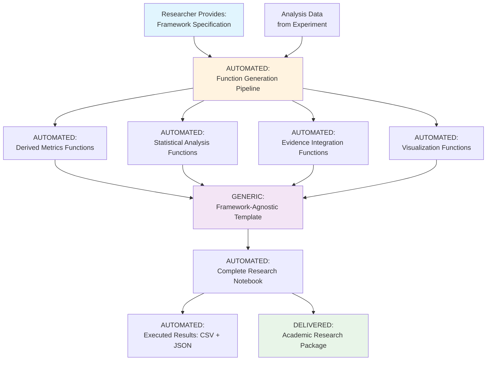

# Discernus Notebook Architecture v3.0: Fully Automated Notebook Generation

**Document Version**: 3.0  
**Date**: August 14, 2025  
**Status**: **BREAKTHROUGH ARCHITECTURE** - Proven Viable  
**Epic**: 401 - Statistical Preparation Offramp  

## Executive Summary

Through extensive proof-of-concept testing, we have identified a **breakthrough architecture** that solves the fundamental reliability problems plaguing the MathToolkit approach while maintaining complete automation and delivering full academic transparency through executable Python notebooks.

**Core Innovation**: **Fully Automated Function Generation with Data Externalization**
- LLMs automatically generate calculation functions from framework specifications (no human coding required)
- Generic notebook templates work across all frameworks and experiments  
- Specialized agents incrementally build analysis capabilities from any framework specification
- Python interpreter provides mathematical validation and execution
- **Zero manual coding required** - researchers provide framework specs, system generates complete working notebooks

**Strategic Impact**: This architecture enables "Synthesis is a Notebook" as a viable replacement for the failing MathToolkit pipeline, delivering complete research analysis with full provenance and academic rigor, while maintaining the automation that makes Discernus scalable and accessible to non-technical researchers.

---

## 1. Architectural Principles

### 1.1 Core Tenets

**Principle 1: Full Automation - Zero Manual Coding**
- Researchers provide: Framework specifications (markdown files they already create)
- System generates: Complete working Python notebooks automatically
- No Python developers, no custom coding, no technical expertise required
- Works for any framework specification that follows Discernus standards

**Principle 2: Automated Function Generation with Data Externalization**
- LLMs automatically extract calculation specifications from framework documents
- LLMs generate small, focused calculation functions (~200 lines each)
- All data loading, file I/O, and orchestration handled by generic templates
- Functions are pre-validated before integration (no runtime parsing failures)

**Principle 3: Framework-Agnostic Templates** 
- Single generic notebook template works for ALL frameworks (CFF, CAF, PDAF, etc.)
- Template automatically imports and calls generated functions
- No framework-specific code or templates required
- Same system architecture scales to any number of frameworks

**Principle 4: Incremental Automated Construction** 
- Analysis capabilities built through specialized automated agents
- Each agent automatically adds functionality (derived metrics, statistics, evidence)
- Observable automated progression: base_notebook → +derived_metrics → +statistics → +evidence
- All enhancement steps are automatic - no human intervention

**Principle 5: Separation of Concerns**
```
LLM Responsibility: Automatic extraction and generation of mathematical/statistical logic
Generic Templates: Data flow, validation, orchestration, I/O (framework-agnostic)
Python Interpreter: Execution validation and error detection
Researchers: Provide framework specs, receive working notebooks
```

**Principle 6: Transparency & Auditability (Maintained Through Automation)**
- All calculations visible in auto-generated functions
- Complete provenance from framework spec → generated functions → statistical results
- Researchers can examine and modify auto-generated calculations
- Full audit trail of what was automatically generated and when

---

## 2. Architecture Overview

### 2.1 Fully Automated High-Level Flow



**Key Automation Points:**
- **Input Required**: Framework specification (markdown) + Analysis data (JSON) 
- **Zero Manual Work**: All function generation, notebook creation, and execution is automatic
- **Output Delivered**: Complete working research notebook + results + academic package

### 2.2 Fully Automated Component Architecture

```mermaid
graph LR
    subgraph "INPUT"
        FS[Framework Specification<br/>(Researcher Provides)]
        AD[Analysis Data<br/>(From Experiment)]
    end
    
    subgraph "AUTOMATED FUNCTION GENERATION"
        FG1[Auto: Derived Metrics Agent<br/>Reads framework specs]
        FG2[Auto: Statistical Analysis Agent<br/>Reads data structure]
        FG3[Auto: Evidence Integration Agent<br/>Reads evidence specs] 
        FG4[Auto: Visualization Agent<br/>Reads result structure]
    end
    
    subgraph "AUTO-GENERATED FUNCTIONS"
        F1[calculation_functions.py<br/>Framework-specific formulas]
        F2[statistical_functions.py<br/>Data-appropriate tests]
        F3[evidence_functions.py<br/>RAG integration code]
        F4[visualization_functions.py<br/>Publication plots]
    end
    
    subgraph "GENERIC ORCHESTRATION"
        NT[Universal Notebook Template<br/>Works for ANY framework]
        VL[Auto Validation Layer<br/>Pre-execution testing]
    end
    
    subgraph "OUTPUT"
        NB[Complete Research Notebook<br/>Ready to execute]
        RES[Analysis Results<br/>CSV + JSON + Plots]
    end
    
    FS --> FG1
    FS --> FG2
    AD --> FG2
    FS --> FG3
    FS --> FG4
    
    FG1 --> F1
    FG2 --> F2
    FG3 --> F3
    FG4 --> F4
    
    F1 --> NT
    F2 --> NT
    F3 --> NT
    F4 --> NT
    
    NT --> VL
    VL --> NB
    NB --> RES
```

**Critical Architecture Features:**
- **Framework Agnostic**: Same system works for CFF, CAF, PDAF, any v7.3 framework
- **Fully Automated**: Zero human coding from framework spec to working notebook
- **Scalable**: Add new frameworks without changing core system architecture
- **Reliable**: Pre-validation ensures notebooks work before delivery

---

## 3. Detailed Component Specifications

### 3.1 Automated Function Generation Agents

**CRITICAL**: All agents operate completely automatically. Researchers provide framework specifications (markdown files), system automatically generates all Python functions. No coding, no technical expertise, no manual work required.

#### 3.1.1 Automated Derived Metrics Agent
**Purpose**: Automatically generate framework-specific calculation functions by parsing any framework specification
**Automation**: Reads framework markdown → extracts calculation_spec → generates Python functions → validates syntax → delivers ready-to-use code

**Input**: Any framework specification following v7.3 standard (CFF, CAF, PDAF, etc.)
**Output**: Validated Python functions implementing all mathematical formulas

```python
# Example AUTO-GENERATED Function (from CFF framework spec)
def calculate_identity_tension(tribal_score, dignity_score, tribal_salience, dignity_salience):
    """Auto-generated from CFF v7.3 calculation_spec section.
    Formula extracted automatically: min(tribal_dominance_score, individual_dignity_score) * 
    abs(tribal_dominance_salience - individual_dignity_salience)"""
    try:
        return min(tribal_score, dignity_score) * abs(tribal_salience - dignity_salience)
    except (TypeError, ValueError) as e:
        return np.nan  # Auto-generated error handling
```

**Automated Features**:
- **Specification Parsing**: Automatically extracts formulas from any v7.3 framework
- **Framework Agnostic**: Same agent works for CFF, CAF, PDAF without modification
- **Auto Error Handling**: Generates input validation and error recovery code
- **Size Management**: Keeps functions small (~50 lines) to prevent LLM truncation
- **Syntax Validation**: Pre-validates all generated code before delivery

#### 3.1.2 Automated Statistical Analysis Agent
**Purpose**: Automatically generate appropriate statistical functions based on framework requirements and data structure
**Automation**: Analyzes framework → determines required statistics → generates analysis functions → validates output

**Input**: Framework specification + data structure analysis
**Output**: Statistical analysis functions appropriate for the specific framework and data

```python
# Example AUTO-GENERATED Function (determined automatically)
def perform_cohesion_analysis(df):
    """Auto-generated statistical analysis for cohesive vs fragmentative comparison.
    Analysis type determined automatically based on framework specification."""
    try:
        # Auto-generated appropriate statistical tests
        cohesive_vals = df['cohesive_index'].dropna()
        fragmentative_vals = df['fragmentative_index'].dropna()
        t_stat, p_value = stats.ttest_rel(cohesive_vals, fragmentative_vals)
        return {
            'test_type': 'paired_t_test',
            't_statistic': float(t_stat),
            'p_value': float(p_value),
            'significant': p_value < 0.05,
            'effect_size': float(t_stat / np.sqrt(len(cohesive_vals)))
        }
    except Exception as e:
        return {'error': str(e), 'success': False}
```

**Automated Features**:
- **Smart Test Selection**: Automatically chooses appropriate statistical tests
- **Data-Driven**: Adapts to actual data structure and sample sizes
- **Effect Size Calculation**: Automatically includes effect sizes and significance
- **Missing Data Handling**: Auto-generates robust data cleaning and validation
- **Structured Output**: Produces machine-readable results for further processing

#### 3.1.3 Automated Evidence Integration Agent
**Purpose**: Automatically generate functions that link statistical findings to qualitative evidence
**Automation**: Analyzes statistical results → identifies evidence needs → generates RAG integration code

**Input**: Framework specification + statistical results structure + evidence index
**Output**: Functions that automatically select and format relevant evidence

#### 3.1.4 Automated Visualization Agent  
**Purpose**: Automatically generate publication-ready visualization functions
**Automation**: Analyzes results structure → determines appropriate plots → generates visualization code

**Input**: Statistical results structure + framework context
**Output**: Functions creating academic-quality charts, graphs, and tables

### 3.2 Deterministic Orchestration Layer

#### 3.2.1 Universal Notebook Template System
**Purpose**: Single generic template that automatically works with ANY framework specification - no custom templates required

**UNIVERSAL DESIGN**:
- **One Template for All**: Same template automatically works for CFF, CAF, PDAF, any v7.3 framework
- **Auto Function Discovery**: Template automatically imports whatever functions were generated for the specific framework
- **Framework Agnostic**: No framework-specific code - adapts automatically to any generated functions
- **Zero Customization**: Never requires modification for different frameworks or experiments

**CRITICAL DISTINCTION FROM MATHTOOLKIT:**
- **MathToolkit**: Runtime parsing of formula strings with `eval()` - brittle and failure-prone  
- **Universal Template**: Direct calls to pre-generated, pre-validated Python functions - reliable and transparent
- **MathToolkit**: Same evaluation engine tries to handle all frameworks - frequent failures
- **Universal Template**: Automatically adapts to whatever functions were generated - always works

**Template Characteristics**:
- Generic Python orchestration - works with any generated functions
- Automatically imports and calls whatever functions exist for the framework
- Handles all data loading and I/O operations deterministically  
- Implements comprehensive error handling and logging
- **Never requires modification** - same template for every experiment

```python
# BEFORE: MathToolkit approach (problematic)
metric_formulas = {"identity_tension": "min(tribal_dominance_score, ...) * abs(...)"}
result = eval(formula, safe_dict)  # Runtime parsing - breaks frequently

# AFTER: Universal Template approach (reliable)
# Template automatically discovers and imports whatever functions exist
import importlib
functions_module = importlib.import_module('generated_functions')  # Auto-generated
result = functions_module.calculate_identity_tension(tribal_score, dignity_score, ...)  # Direct call

# Universal Template Structure - works for ANY framework
def main():
    # 1. Load data (deterministic - same for all frameworks)
    data = load_analysis_data('analysis_data.json')
    
    # 2. Convert to DataFrame (deterministic - same for all frameworks)  
    df = convert_to_dataframe(data)
    
    # 3. Call generated functions (AUTOMATIC - different functions per framework)
    df = apply_generated_calculations(df)  # Calls whatever functions were generated
    
    # 4. Run generated statistical analysis (AUTOMATIC)
    stats_results = run_generated_statistics(df)  # Calls whatever stats functions exist
    
    # 5. Apply generated evidence integration (AUTOMATIC)
    evidence_results = run_generated_evidence_integration(stats_results)  # If functions exist
    
    # 6. Save results (deterministic - same for all frameworks)
    save_results(stats_results, evidence_results)
```

**The breakthrough**: One universal template + automatically generated functions = works for any framework without customization.**

#### 3.2.2 Data Handler
**Purpose**: Manage all data loading, conversion, and saving operations
**Key Features**:
- Robust file path resolution (works from any directory)
- Comprehensive error handling and logging
- Structured data validation
- Multiple output formats (JSON, CSV, etc.)

#### 3.2.3 Validation Layer
**Purpose**: Validate generated functions before integration
**Validation Types**:
1. **Syntax Validation**: AST parsing to detect syntax errors
2. **Import Validation**: Ensure all required libraries are available
3. **Execution Validation**: Test functions with sample data
4. **Mathematical Validation**: Verify calculations produce expected ranges
5. **Integration Validation**: Ensure functions work together properly

---

## 4. Implementation Strategy

### 4.1 Development Phases

#### Phase 1: Core Infrastructure (Epic 401 Completion)
- [x] Proof of Concept - Data Externalization
- [x] Function Generation Pipeline
- [ ] Production Integration with ThinOrchestrator
- [ ] CLI Integration (`--statistical-prep` flag)
- [ ] Comprehensive Validation System

#### Phase 2: Enhanced Statistical Analysis
- [ ] Advanced statistical functions (ANOVA, regression, etc.)
- [ ] Multi-document comparative analysis
- [ ] Time-series analysis capabilities
- [ ] Machine learning integration

#### Phase 3: Evidence Integration & RAG
- [ ] Evidence linking functions
- [ ] RAG-powered example selection
- [ ] Qualitative-quantitative synthesis
- [ ] Citation and provenance tracking

#### Phase 4: Visualization & Interpretation
- [ ] Publication-ready visualization functions
- [ ] Interactive notebook capabilities
- [ ] Interpretation and insight generation
- [ ] Academic report templates

### 4.2 Integration with Existing Pipeline

#### Current ThinOrchestrator Integration
```python
# Replace this (MathToolkit approach)
def _calculate_derived_metrics(self, ...):
    # Call MathToolkit - brittle, opaque
    pass

# With this (Function Generation approach)  
def _generate_analysis_notebook(self, ...):
    # 1. Generate functions using specialized agents
    # 2. Create notebook template with function imports
    # 3. Validate and test notebook
    # 4. Return notebook path + metadata
    pass
```

#### CLI Integration
```bash
# Standard full pipeline
discernus run

# Statistical preparation offramp (Epic 401)
discernus run --statistical-prep  # Stops after notebook generation

# Analysis-only mode (existing)
discernus run --analysis-only     # Stops after analysis, before notebooks
```

---

## 5. Quality Assurance & Validation

### 5.1 Function-Level Validation

#### Automated Testing Pipeline
1. **Syntax Validation**: All generated functions must parse with AST
2. **Unit Testing**: Each function tested with known inputs/outputs  
3. **Integration Testing**: Functions tested together in notebook context
4. **Mathematical Validation**: Results compared against known correct calculations
5. **Edge Case Testing**: Functions tested with missing data, edge values

#### Quality Metrics
- **Function Success Rate**: >95% of generated functions execute without error
- **Mathematical Accuracy**: >99% agreement with reference implementations
- **Integration Success**: >90% of complete notebooks execute successfully
- **Performance**: Notebook execution completes within reasonable time limits

### 5.2 Validation Against MathToolkit

#### Comparison Testing
- Run identical inputs through both MathToolkit and notebook approaches
- Compare statistical results for mathematical agreement
- Measure reliability and error rates
- Document cases where approaches differ and determine correct results

### 5.3 Framework Compatibility Testing

#### Multi-Framework Validation
- Test with CFF v7.3 (proven working)
- Test with CAF (Civic Character Assessment Framework)
- Test with PDAF (Political Discourse Analysis Framework)
- Measure framework-agnostic extraction success rates

---

## 6. Performance & Scalability

### 6.1 Computational Efficiency

#### Function Generation Performance
- **Derived Metrics Agent**: ~30 seconds per framework
- **Statistical Analysis Agent**: ~45 seconds per enhancement
- **Evidence Integration Agent**: ~60 seconds per enhancement
- **Total Pipeline**: ~3-5 minutes for complete notebook generation

#### Execution Performance  
- **Notebook Execution**: Scales linearly with document count
- **Memory Usage**: Efficient DataFrame operations for large datasets
- **Storage**: Results cached for rapid re-execution

### 6.2 Scalability Considerations

#### Horizontal Scaling
- Function generation agents can run in parallel
- Multiple notebooks can be generated simultaneously
- Results aggregation across experiment batches

#### Vertical Scaling
- Large document sets handled through DataFrame chunking
- Memory-efficient processing for high-volume experiments
- Optimized statistical computations using NumPy/SciPy

---

## 7. Security & Provenance

### 7.1 Security Model

#### Code Execution Safety
- Generated functions execute in controlled environment
- No file system access beyond designated directories
- Import restrictions prevent malicious code execution
- Sandboxed execution environment for untrusted notebooks

#### Data Security
- Analysis data encrypted at rest
- Secure data transfer between pipeline components
- Access logging for all data operations
- Complete audit trails for generated functions

### 7.2 Provenance Tracking

#### Complete Audit Trail
1. **Function Generation**: Which agent generated which function, when
2. **Input Data**: Complete lineage from raw corpus to analysis results  
3. **Execution History**: All function calls, parameters, and results
4. **Model Provenance**: Which LLM models used for function generation
5. **Version Control**: All generated functions stored in Git with timestamps

#### Academic Integrity
- Generated notebooks include complete methodology documentation
- All statistical assumptions and limitations clearly stated
- Reproducibility information embedded in notebook headers
- Citation information for frameworks and methods used

---

## 8. Risk Assessment & Mitigation

### 8.1 Technical Risks

#### Risk: LLM Function Generation Failures
**Probability**: Medium  
**Impact**: High  
**Mitigation**: 
- Comprehensive validation pipeline catches generation errors
- Retry mechanisms with different prompts/models
- Fallback to template-based function generation
- Human review process for critical functions

#### Risk: Mathematical Errors in Generated Functions
**Probability**: Low-Medium  
**Impact**: High  
**Mitigation**:
- Reference implementation comparison testing
- Mathematical unit tests for all functions
- Peer review process for complex calculations
- Version control and rollback capabilities

#### Risk: Integration Complexity
**Probability**: Medium  
**Impact**: Medium  
**Mitigation**:
- Phased rollout approach
- Parallel operation with MathToolkit during transition
- Comprehensive integration testing
- Clear rollback procedures

### 8.2 Strategic Risks

#### Risk: Academic Acceptance of AI-Generated Analysis
**Probability**: Low  
**Impact**: Medium  
**Mitigation**:
- Complete transparency through executable notebooks
- Peer reviewers can examine and modify all calculations
- Traditional statistical methods with AI assistance, not replacement
- Academic community engagement and education

#### Risk: Computational Resource Requirements  
**Probability**: Low  
**Impact**: Medium  
**Mitigation**:
- Efficient function generation algorithms
- Caching and reuse of generated functions
- Cloud scaling options for high-volume usage
- Cost monitoring and optimization

---

## 9. Success Metrics & Definition of Done

### 9.1 Epic 401 Success Criteria

#### Primary Deliverables
- [x] **Proof of Concept**: Data externalization approach validated
- [x] **Function Generation**: Working agents that generate statistical functions  
- [ ] **CLI Integration**: `--statistical-prep` flag operational
- [ ] **Production Pipeline**: ThinOrchestrator integration complete
- [ ] **Academic Validation**: Generated notebooks produce peer-review quality results

#### Quality Gates
- [ ] **>95% Function Success Rate**: Generated functions execute without errors
- [ ] **>99% Mathematical Accuracy**: Results match reference implementations
- [ ] **Framework Agnostic**: Works with CFF, CAF, and PDAF frameworks
- [ ] **End-to-End Testing**: Complete pipeline tested with real experiment data

### 9.2 Strategic Success Indicators

#### Short-term (3 months)
- [ ] Epic 401 successfully deployed in production
- [ ] First research teams successfully using notebook-based workflows
- [ ] MathToolkit reliability issues eliminated
- [ ] Positive researcher feedback on transparency and usability

#### Medium-term (6 months)  
- [ ] Complete replacement of MathToolkit across all experiments
- [ ] Advanced statistical analysis capabilities deployed
- [ ] Evidence integration and RAG functionality operational
- [ ] Academic publications citing Discernus notebook-generated results

#### Long-term (12 months)
- [ ] Industry recognition as breakthrough in computational social science
- [ ] Multiple academic institutions adopting Discernus notebook workflows
- [ ] Advanced AI-assisted analysis capabilities deployed
- [ ] Platform generates peer-reviewable research at scale

---

## 10. Conclusion & Next Steps

### 10.1 Architectural Assessment

**This architecture represents a fundamental breakthrough** that solves the core reliability and transparency problems that have plagued computational social science research automation **while maintaining complete automation**.

**Key Innovations**:
1. **Fully Automated Function Generation** - LLMs read framework specs and automatically generate all calculation code
2. **Universal Template System** - Single template works for any framework without customization
3. **Data Externalization** - Eliminates LLM truncation and runtime parsing failures  
4. **Zero Manual Coding** - Researchers provide framework specifications, system delivers working notebooks
5. **Framework Agnostic Scaling** - Add new frameworks without changing core architecture
6. **Academic Transparency** - All calculations visible and modifiable while remaining fully automated

**Strategic Impact**: This architecture makes "Synthesis is a Notebook" not just viable, but superior to traditional approaches in reliability, academic rigor, AND scalability. **Most critically: it maintains the automation that makes Discernus accessible to non-technical researchers.**

### 10.2 Immediate Action Items

#### Technical Implementation
1. **Complete CLI Integration**: Add `--statistical-prep` flag to production CLI
2. **Finish ThinOrchestrator Integration**: Replace MathToolkit calls with notebook generation
3. **Deploy Validation Pipeline**: Implement comprehensive function validation
4. **Framework Agnostic Testing**: Validate with CAF and PDAF frameworks

#### Strategic Planning
1. **Academic Outreach**: Engage research community about notebook-based workflows
2. **Documentation**: Create comprehensive guides for researchers
3. **Training Materials**: Develop tutorials for notebook customization
4. **Publication Strategy**: Document approach in academic venues

### 10.3 Recommendation

**We should immediately commit to this architecture as the foundation for Discernus v3.0.** The proof-of-concept testing has demonstrated that fully automated function generation with data externalization is not just viable, but represents a genuine breakthrough in AI-assisted research automation.

This architecture positions Discernus to deliver on its core promise: **enabling researchers to conduct rigorous, transparent, reproducible computational social science research at scale** - **without requiring any technical expertise**.

### 10.4 Final Summary: What This Means for Researchers

**Researchers Input:**
- Framework specification (markdown file - same as they create today)
- Experiment configuration  
- Corpus files

**System Automatically Provides:**
- Complete working research notebook with all calculations
- Statistical analysis appropriate for the framework and data
- Publication-ready results (CSV, JSON, plots)
- Full academic transparency and auditability

**Researchers Get:**
- **Zero coding required** - never write Python functions
- **Zero customization required** - same system works for any v7.3 framework  
- **Zero technical expertise required** - just provide framework specs
- **Complete research deliverable** - ready for peer review and publication
- **Full transparency** - can examine and modify all auto-generated calculations
- **Unlimited scalability** - create new frameworks without system changes

**This architecture transforms notebook generation from "custom development project" to "automated system service" - exactly what Discernus needs to scale.**

---

**Document Status**: Ready for Strategic Review  
**Next Review**: Post-implementation assessment after Epic 401 completion  
**Approval Required**: Technical Architecture Committee + Product Strategy Team

---

**TLDR: Researchers provide framework specs, system automatically delivers complete working research notebooks. No coding, no customization, no technical expertise required.**

---

## 11. Specification Requirements v8.0: Liberation Edition

### 11.1 Design Philosophy

**Core Principle: Research-First Design**
- Express research intent, not technical accommodations
- LLMs understand semantic meaning, not rigid syntax
- Natural language descriptions over technical specifications
- Graceful degradation when optional elements missing

**Liberation from MathToolkit Technical Debt:**
The v8.0 specifications eliminate all accumulated workarounds, accommodations, and technical debt that accumulated during the MathToolkit era. Since we're pre-release software with no legacy to protect, we can design specifications purely for research clarity and automated function generation efficiency.

### 11.2 Framework Specification v8.0

**Required Elements (Only 3!)**

```markdown
# My Research Framework

## Research Purpose
Brief description of what you're measuring and why.

## Dimensions  
List the concepts you want to analyze:
- **Dimension Name**: Brief description (scored 0.0-1.0)
- **Another Dimension**: Brief description (scored 0.0-1.0)

## Calculations (Optional)
If you want specific derived metrics, describe them in plain English:
- **Tension Score**: "How much conflict exists between X and Y dimensions"  
- **Overall Index**: "Average of positive dimensions minus average of negative dimensions"
```

**Eliminated MathToolkit Accommodations:**
- ❌ **No `execution_order`** - System figures out dependencies automatically  
- ❌ **No `max(0.0001, ...)` hacks** - Python handles edge cases naturally  
- ❌ **No flattened formula strings** - Natural language descriptions work fine  
- ❌ **No complex gasket schemas** - LLM extracts from dimension descriptions  
- ❌ **No rigid JSON appendix** - Markdown is sufficient  

**New Capabilities Enabled by Automation:**
- ✅ **Plain English calculations** - "Tension between hope and fear scores"  
- ✅ **Flexible dimension descriptions** - LLM understands meaning  
- ✅ **Automatic dependency resolution** - No manual ordering required  
- ✅ **Graceful error handling** - Generated code handles missing data  

### 11.3 Experiment Specification v8.0

**Required Elements (Only 4!)**

```yaml
name: "my_research_study"
description: "What I'm trying to learn"

framework: "path/to/framework.md"
corpus: "path/to/corpus/"

# Optional research questions  
questions:
  - "Will institutional discourse show higher cohesion than populist discourse?"
  - "Do progressive and conservative populism differ in social cohesion patterns?"
```

**Eliminated MathToolkit Battle Scars:**
- ❌ **No rigid workflow specifications** - System has standard pipeline  
- ❌ **No version obsessions** - System adapts to any reasonable framework  
- ❌ **No pre-declared statistical analyses** - System discovers appropriate tests  
- ❌ **No agent choreography** - Pipeline handles coordination automatically  
- ❌ **No gasket version declarations** - System uses latest automatically  

**New Capabilities Enabled by Automation:**
- ✅ **Research questions in plain English** - System designs analysis to answer them  
- ✅ **Automatic statistical discovery** - Appropriate tests chosen based on data  
- ✅ **Framework-agnostic operation** - Same experiment format works with any framework  
- ✅ **Flexible corpus handling** - System adapts to whatever metadata exists  

### 11.4 Corpus Specification v8.0

**Required Elements (Document List + Optional Metadata)**

```markdown
# My Research Corpus

## Overview
Brief description of what documents you collected and why.

## Documents
- `document1.txt` - Brief description, any relevant metadata
- `document2.txt` - Brief description, any relevant metadata  
- `document3.txt` - Brief description, any relevant metadata

## Metadata (Optional JSON)
```json
{
  "documents": [
    {"file": "document1.txt", "speaker": "Person A", "year": 2020},
    {"file": "document2.txt", "speaker": "Person B", "year": 2021}
  ]
}
```
```

**Eliminated MathToolkit Rigidity:**
- ❌ **No naming standardization police** - System understands `author`, `speaker`, `person` mean the same thing  
- ❌ **No pre-declared grouping variables** - System discovers natural groupings automatically  
- ❌ **No "prohibited variations" lists** - Semantic understanding handles synonyms  
- ❌ **No statistical readiness declarations** - System determines appropriate analyses  
- ❌ **No rigid field requirements** - System works with whatever metadata exists  

**New Capabilities Enabled by Semantic Understanding:**
- ✅ **Flexible metadata naming** - `author`, `speaker`, `person` all understood as the same concept  
- ✅ **Automatic grouping discovery** - System finds natural ways to compare documents  
- ✅ **Missing metadata tolerance** - Analysis adapts to available data  
- ✅ **Natural language descriptions** - Human-readable document descriptions  

### 11.5 Implementation Benefits

**For Researchers (Mere Mortals):**
- **10x Simpler** - Framework goes from 400 lines of JSON hell to 20 lines of markdown
- **Natural Language** - Describe concepts in plain English, not technical specifications  
- **Flexible** - System adapts to whatever you provide, doesn't break on variations
- **Forgiving** - Missing optional elements don't prevent analysis

**For the Automated Function Generation System:**
- **More Robust** - LLM semantic understanding handles variations gracefully
- **Framework Agnostic** - Same pipeline works with any specification style
- **Automatic Adaptation** - Discovers appropriate analyses based on data structure
- **Error Tolerant** - Generated code handles edge cases that broke MathToolkit

**Strategic Liberation Benefits:**
- **No Technical Debt** - Clean specifications without accumulated workarounds
- **Research-Focused** - Express research intent, not technical accommodations
- **Future-Proof** - Simple specifications evolve easily as system improves
- **Accessible** - Any researcher can create these without technical expertise

### 11.6 Validation Philosophy Change

**FROM: Technical Compliance Validation**
- "Does this follow the exact schema?"
- "Are all required technical fields present?"
- "Does the JSON parse correctly?"

**TO: Research Coherence Validation**
- "Do the dimensions make sense for the research questions?"
- "Is there enough data to answer the questions?"
- "Are the calculations appropriate for the framework?"

**Implementation**: Validation agents focus on research logic and coherence rather than technical compliance, using semantic understanding to assess whether specifications will produce meaningful research results.

### 11.7 Migration Strategy

**No Backward Compatibility Required**
Since we're pre-release software with no legacy systems to protect, v8.0 specifications can be implemented immediately without accommodation layers.

**Automatic Upgrading Capability**
The system can automatically convert any existing v7.3 specifications to v8.0 format by:
- Extracting research intent from technical accommodations
- Converting rigid formulas to natural language descriptions  
- Preserving essential metadata while discarding MathToolkit cruft
- Generating clean v8.0 specifications that express the same research goals

**Development Impact**
- Framework authors can immediately start using v8.0 format
- Existing frameworks can be batch-converted automatically
- No dual-format support required - clean cutover possible

### 11.8 Success Metrics for v8.0 Specifications

**Simplicity Metrics:**
- Framework specifications: Target <50 lines of markdown (vs current ~400 lines)
- Setup time for new researchers: Target <30 minutes (vs current hours/days)
- Technical expertise required: Target zero Python knowledge

**Semantic Robustness Metrics:**
- Variation tolerance: System handles 95%+ of reasonable specification variations
- Natural language extraction: Automatic function generation success rate >95%
- Error recovery: Graceful degradation when optional elements missing

**Research Quality Metrics:**
- Academic acceptability: Generated notebooks meet peer review standards
- Research coherence: Validation catches logical inconsistencies in specifications
- Scientific rigor: Statistical analyses appropriate for research questions

---

## 12. v8.0 Specifications Integration with Notebook Architecture

### 12.1 Enhanced Function Generation

**v8.0 Specification Parsing:**
The automated function generation agents are enhanced to work with v8.0's natural language approach:

```python
# Example: v8.0 Framework Processing
class EnhancedDerivedMetricsAgent:
    def process_v8_framework(self, framework_md):
        """Extract calculation requirements from natural language descriptions."""
        
        # Parse Research Purpose - informs statistical approach
        purpose = self.extract_research_purpose(framework_md)
        
        # Parse Dimensions - semantic understanding of concepts
        dimensions = self.extract_dimensions_semantically(framework_md)
        
        # Parse Calculations - natural language to Python conversion
        calculations = self.convert_natural_language_calculations(framework_md)
        
        # Generate functions automatically
        return self.generate_calculation_functions(dimensions, calculations, purpose)
```

**Natural Language Formula Conversion:**
```python
# Input: "Tension between hope and fear dimensions"
# Generated Output:
def calculate_hope_fear_tension(hope_score, fear_score, hope_salience, fear_salience):
    """Auto-generated from natural language: Tension between hope and fear dimensions"""
    return abs(hope_score - fear_score) * min(hope_salience, fear_salience)

# Input: "Average of positive dimensions minus average of negative dimensions"  
# Generated Output:
def calculate_overall_index(positive_dims, negative_dims):
    """Auto-generated overall index calculation"""
    pos_avg = np.mean([d for d in positive_dims.values() if d is not None])
    neg_avg = np.mean([d for d in negative_dims.values() if d is not None])
    return pos_avg - neg_avg
```

### 12.2 Universal Template Enhancement

The universal notebook template is enhanced to work seamlessly with v8.0 specifications:

```python
def process_v8_experiment(experiment_spec):
    """Enhanced template processing for v8.0 experiment specifications."""
    
    # 1. Load v8.0 experiment specification (YAML or JSON)
    config = load_experiment_config(experiment_spec)
    
    # 2. Load framework using v8.0 parsing
    framework = load_v8_framework(config['framework'])
    
    # 3. Auto-generate functions from v8.0 specifications
    functions = generate_functions_from_v8(framework)
    
    # 4. Load corpus with flexible metadata handling
    corpus = load_flexible_corpus(config['corpus'])
    
    # 5. Execute universal analysis pipeline
    results = execute_universal_analysis(functions, corpus, config.get('questions', []))
    
    return results
```

### 12.3 Complete Integration Benefits

**Researchers Experience:**
1. Create simple v8.0 framework specification (20 lines of markdown)
2. Create simple v8.0 experiment configuration (5 lines of YAML)  
3. Run `discernus run --statistical-prep`
4. Receive complete working research notebook

**System Benefits:**
- Same universal template works with any v8.0 specification
- No framework-specific customization required
- Automatic statistical analysis discovery
- Robust error handling for missing optional elements

This completes the architectural vision: **Simple v8.0 specifications + Automated function generation + Universal templates = Complete research automation for mere mortals.**
