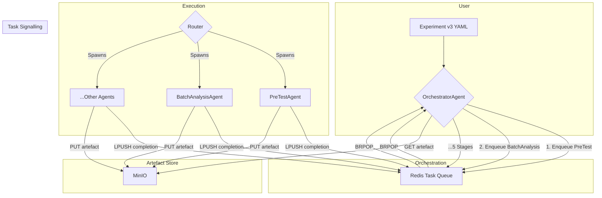

# Discernus System Architecture (v3.0 - Radical Simplification)

## About Discernus

**Discernus** is a computational research platform that enables systematic, reproducible analysis of text corpora using analytical frameworks developed by researchers. Rather than requiring technical implementation of each framework, Discernus allows researchers to specify their analytical approach in natural language and applies it consistently across large document collections.

### What Discernus Does

Discernus transforms the traditional research workflow:

**Traditional Approach**: Researcher manually applies analytical framework → Individual document analysis → Manual synthesis across findings → Subjective aggregation

**Discernus Approach**: Researcher specifies framework once → Automated batch analysis across corpus → LLM-powered synthesis with statistical validation → Reproducible, peer-reviewable results

### Core Capabilities
- **Framework Agnostic**: Works with any analytical framework (political analysis, content analysis, discourse analysis, etc.)
- **Format Agnostic**: Processes any document type (PDF, DOCX, plain text, etc.) without preprocessing
- **Corpus Agnostic**: Scales from dozens to thousands of documents with consistent quality
- **Academically Rigorous**: Complete provenance, statistical validation, peer-review ready outputs

### The THIN vs THICK Philosophy

**Discernus embodies THIN software architecture principles**:

**THIN Architecture** (Discernus):
- **LLM Intelligence**: Complex reasoning, format detection, framework application handled by language models
- **Software Infrastructure**: Minimal routing, caching, orchestration - no business logic
- **Principle**: "Make it easier to do the right thing and harder to do the wrong thing"
- **Result**: Framework/experiment/corpus agnostic system that adapts to researcher needs

**THICK Architecture** (Traditional Systems):
- **Software Intelligence**: Complex parsing, format-specific processors, hardcoded business rules
- **LLM Usage**: Limited to simple tasks, constrained by software assumptions
- **Problem**: Brittle, framework-specific, requires engineering for each new research approach
- **Result**: Researchers constrained by what software developers anticipated

---

## 1 · Current Implementation Objective

Stand up a **minimal, reproducible pipeline** that demonstrates the *THIN* architecture while validating that modern LLMs can shoulder nearly all domain reasoning:

- **No bespoke parsers** for frameworks or outputs.
- **Artefact‑oriented caching** so finished LLM calls are never repeated.
- **Abort / resume** and **cost‑guard** controls proven in practice.

The architecture has now evolved into **Radical Simplification Mode** to support **batched multi‑framework analysis** using a single, bulletproof 5-stage pipeline. Reliability > Flexibility.

---

## 2 · Core Concepts (Glossary)

| Term | Plain‑English meaning |
| ---- | --------------------- |
| **Redis Stream** | Append‑only log used for firehose logging (not critical path after simplification). |
| **Task Queue (list)** | Redis list used for deterministic completion signalling (no consumer group races). |
| **MinIO** | Local S3‑compatible object store for artefacts. |
| **Artefact** | Any file (JSON, Parquet, prompt) saved by SHA‑256. |
| **Router** | ~150 lines: spawns workers / loads registry; *no business logic*. |
| **Agent** | Stateless worker: *read task → call LLM with prompt → write result*. |
| **OrchestratorAgent** | LLM that plans execution for a fixed 5‑stage pipeline. |

---

## 3 · Architecture Overview (Radical Simplification Mode)


---

## 4 · Radical Simplification Mode (Phase 1)

> **Goal:** Replace growing coordination complexity with a **single, bulletproof workflow** and strict input contracts. Reliability > flexibility.

### 4.1 Fixed 5‑Stage Pipeline
```
PreTest → BatchAnalysis → CorpusSynthesis → Review → Moderation
```
All runs follow this exact order. No custom workflows, branching, or parallel variations.

### 4.2 Coordination Simplification
Legacy consumer‑group races are eliminated. Completion signalling uses Redis keys/lists:

1. Agent finishes: writes artefact → `SET task:<id>:status done EX 86400` → `LPUSH run:<run_id>:done <id>`.
2. Orchestrator waits via `BRPOP run:<run_id>:done` (blocking). No dynamic consumer groups.
3. Cache check: if status key exists + artefact present → skip.

### 4.3 Strict Input Specifications (v3 / v5)
All inputs validated **before** first LLM call.

**Experiment v3** (YAML excerpt):
```yaml
name: "phase3_chf_constitutional_debate"
corpus_path: projects/exp1/corpus/
frameworks: [CAF_v4.3.md, CHF_v1.1.md, ECF_v1.0.md]
statistical_runs: 3   # optional override
```
Constraints: `max_documents`, `max_frameworks_per_run`, **no** `custom_workflow` / `parallel_processing` fields.

**Framework v5**: Markdown file with embedded JSON block declaring `output_contract` (schema) + optional `precision`. Enforced via deterministic validator post‑analysis.

**Corpus v3**: Directory with `manifest.json` listing file names & metadata. System does **no discovery** outside manifest. Binary‑first principle: all files base64 encoded for LLM.

### 4.4 Batch Planner & PreTest
`PreTestAgent` samples corpus to estimate variance & token footprint → returns `recommended_runs_per_batch`.
`BatchPlanner` (inside Orchestrator) uses model registry fields:
- `optimal_batch_tokens` (≈ 70% of context window)
- `max_documents_per_batch`

Generates batch tasks: `{batch_id, text_uris[], framework_hashes[], runs=recommended}`.

### 4.5 AnalyseBatchAgent (Layer 1)
Processes multiple documents + frameworks in one call.
Output schema (per run):
```json
{
  "batch_id": "B01",
  "run_index": 1,
  "framework_scores": {"CAF": {...}, "CHF": {...}},
  "per_doc_notes": {...},
  "batch_summary": "Structured qualitative summary"
}
```
Artefact naming: `analysis/B01.caf<hash>-chf<hash>.run1.json`.

### 4.6 Layered Synthesis & Review

| Layer | Agent(s) | Purpose | Model class |
| ----- | -------- | ------- | ----------- |
| 1 In‑Batch | AnalyseBatchAgent | Raw scores + per‑batch summary | Expensive (Gemini Flash) |
| 2 Corpus | CorpusSynthesisAgent | Deterministic aggregation/statistics | Cheap (Claude Haiku) |
| 3 Review | 2× ReviewerAgent + ModeratorAgent | Adversarial critique → reconciled narrative | Mixed |

`debate/<RUN_ID>.html` captures transcript for audit.

### 4.7 Model Registry
`models/registry.yaml` + `models/provider_defaults.yaml` supply pricing, context windows, and batching parameters.

Example entry:
```yaml
vertex_ai/gemini-2.5-flash:
  provider: vertex_ai
  context_window: 1000000
  costs: {input_per_million_tokens: 0.075, output_per_million_tokens: 0.30}
  task_suitability: [batch_analysis, multi_framework_synthesis, review]
  optimal_batch_tokens: 700000
  max_documents_per_batch: 300
  last_updated: '2025-07-23'
```

### 4.8 Metrics
Logged per run into `manifest.json`:
- `run_success`: boolean
- `cache_hit_ratio` (re‑run) = skipped_batches / total_batches
- `mean_stage_latency`
- `cost_usd`

### 4.9 Acceptance Criteria
1. **Full Pipeline:** PreTest → BatchAnalysis (≥1 batch) → CorpusSynthesis → Review → Moderation produces artefacts:
   - `analysis/*.json` with `batch_summary`
   - `synthesis/<RUN>.json`
   - `debate/<RUN>.html`
2. **Cache Hit:** Re‑running identical experiment triggers zero Layer‑1 calls (verified via LiteLLM logs).
3. **Cost Guard:** Live mode prompts for confirmation using batch token estimates.
4. **Variance‑Driven Runs:** PreTestAgent sets `runs_per_batch`; system executes that many replicate analyses.
5. **Review Integrity:** Moderator output cites batch summaries and statistics (traceable).
6. **Metrics:** `cache_hit_ratio == 1.0` on second run; success rate ≥95% across test suite.

---

## 5 · Example Commands
```bash
# Start infra
$ docker compose up -d redis minio

# Validate inputs
$ discernus validate experiments/exp_v3.yaml

# Run experiment (live)
$ discernus run experiments/exp_v3.yaml --mode live

# Pause / resume
$ discernus pause RUN123; discernus resume RUN123

# Re-run (cache hit)
$ discernus run experiments/exp_v3.yaml --mode live

# Export for archival
$ discernus export RUN123 --out-dir projects/my_project/experiment_1/run_001
```

---

## 6 · Experiment Export & Directory Structure
```
projects/<PROJECT>/<EXPERIMENT>/<RUN_ID>/
├─ corpus/            # original input files
├─ analysis/          # batch JSON artefacts
├─ synthesis/         # <RUN_ID>.json corpus statistics
├─ debate/            # review transcript (html/markdown)
├─ framework/         # copies of framework files
├─ logs/              # router / agent / proxy logs
├─ manifest.json      # machine provenance (hashes, metrics)
└─ manifest.md        # human summary
```
Replay exactly:
```bash
$ discernus run --from-manifest projects/<P>/<E>/<RUN_ID>/manifest.json
```

---

## 7 · Security Hardening (Post‑PoC)

> Threat: malicious prompt/framework causes exfiltration or arbitrary execution.

### 7.1 Static Policy Gate
Allow‑lists enforced in Router (drop + log on violation): task types, model IDs (from registry), URI regex (`^s3://discernus-artifacts/(corpus|frameworks|runs)/`), SHA‑256 length, max tasks/run.

### 7.2 Sentinel Agent
`SecuritySentinelAgent` inspects tasks for secrets patterns; quarantines suspicious ones to `tasks.quarantine`.

### 7.3 Sandboxing
Agents run in containers with `--network none` (except LiteLLM egress). Read‑only corpus mount; ephemeral scratch.

### 7.4 Prompt Integrity
Hash pinning + immutable UUID preamble in each prompt file.

### 7.5 Secrets Scanning
CLI `artefact put` rejects files matching `/.env($|[._-])/` or high‑entropy key patterns.

---

## 8 · Next‑Step Wishlist
1. Precision‑aware normaliser & framework `precision` field.
2. Non‑deterministic averaging (`runs_per_chunk`).
3. ValidationAgent for custom schemas.
4. PostHocMathAgent for retro metrics.
5. Composite framework synthesis.
6. Security package activation + metrics dashboard.

---
*Last updated 2025‑07‑24 by Jeff*