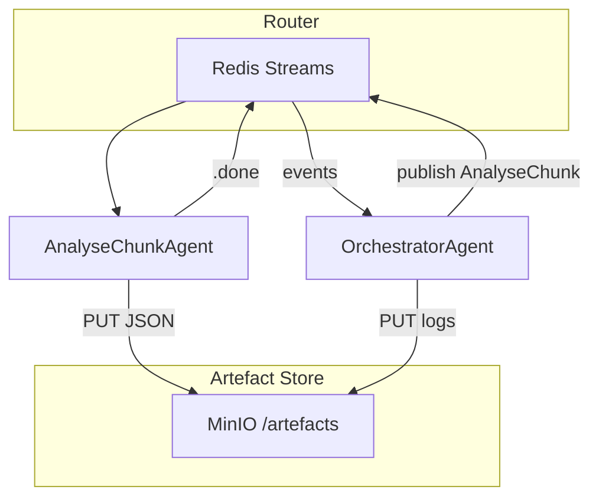

# Discernus Thin‑Orchestration PoC – Implementation Brief

## About Discernus

**Discernus** is a computational research platform that enables systematic, reproducible analysis of text corpora using analytical frameworks developed by researchers. Rather than requiring technical implementation of each framework, Discernus allows researchers to specify their analytical approach in natural language and applies it consistently across large document collections.

### What Discernus Does

Discernus transforms the traditional research workflow:

**Traditional Approach**: Researcher manually applies analytical framework → Individual document analysis → Manual synthesis across findings → Subjective aggregation

**Discernus Approach**: Researcher specifies framework once → Automated batch analysis across corpus → LLM-powered synthesis with statistical validation → Reproducible, peer-reviewable results

### Core Capabilities
- **Framework Agnostic**: Works with any analytical framework (political analysis, content analysis, discourse analysis, etc.)
- **Format Agnostic**: Processes any document type (PDF, DOCX, plain text, etc.) without preprocessing
- **Corpus Agnostic**: Scales from dozens to thousands of documents with consistent quality
- **Academically Rigorous**: Complete provenance, statistical validation, peer-review ready outputs

### The THIN vs THICK Philosophy

**Discernus embodies THIN software architecture principles**:

**THIN Architecture** (Discernus):
- **LLM Intelligence**: Complex reasoning, format detection, framework application handled by language models
- **Software Infrastructure**: Minimal routing, caching, orchestration - no business logic
- **Principle**: "Make it easier to do the right thing and harder to do the wrong thing"
- **Result**: Framework/experiment/corpus agnostic system that adapts to researcher needs

**THICK Architecture** (Traditional Systems):
- **Software Intelligence**: Complex parsing, format-specific processors, hardcoded business rules
- **LLM Usage**: Limited to simple tasks, constrained by software assumptions
- **Problem**: Brittle, framework-specific, requires engineering for each new research approach
- **Result**: Researchers constrained by what software developers anticipated

### Why This PoC Matters

This implementation brief demonstrates how THIN architecture principles enable a **framework/experiment/corpus agnostic research platform** that:
- Reduces research time from months to hours
- Eliminates format compatibility issues
- Ensures reproducible, auditable results  
- Scales research capabilities without engineering bottlenecks

The empirical discovery that modern LLMs (Gemini 2.5 Flash) can process **9 speeches + multiple frameworks** in a single request validates that THIN architecture can deliver both **efficiency** and **quality** at production scale.

## Why This Architectural Direction Became Necessary

### The Orchestration Brittleness Problem

Despite strong THIN architectural principles, the orchestration pipeline has become a persistent source of brittleness and THICK software that undermines reliable execution. The fundamental issue: **traditional software orchestration inherently conflicts with THIN philosophy**.

### Specific Manifestations of THICK Creep

**Framework/Experiment Parsing Addiction**:
- Cursor agents consistently write upfront parsers for frameworks and experiments
- LLM agents are perfectly capable of understanding these documents with far greater depth than any parser
- Yet parsing code appears reflexively, introducing bugs every time new frameworks or experiment types are introduced
- **Root Cause**: Traditional orchestration assumes software must "understand" before delegating to LLMs

**LLM Response Parsing Obsession**:
- LLM outputs get scrutinized by yet more parsers: "Oh no! The LLM wrapped JSON in Markdown!"
- The orchestration should be **LLM-to-LLM handoffs** where downstream agents handle upstream responses naturally
- **Root Cause**: Software-centric thinking where "clean data" must be extracted rather than letting LLMs handle contextual interpretation

**Performance Bottlenecks**:
- System fails to parallelize operations that could be parallelized
- LLMs can ingest frameworks and process multiple corpus files in single transactions
- Round-robin parallel processing with rate limiting should be standard, but requires "intricate buggy software"
- **Root Cause**: Traditional orchestration treats LLMs as isolated function calls rather than intelligent agents

### The Security Wake-Up Call

A catastrophic regression demonstrated the fragility of software-driven orchestration: the system attempted to submit **4,000 files** (entire project including source code, docs, experiments, results) to LLM analysis due to a orchestration bug. Only manual intervention prevented .env file exposure.

**Key Insight**: Software orchestration complexity creates unpredictable failure modes that threaten both performance and security.

### The LLM-Orchestrated Solution

**Proposed Architecture**:
- **Fully externalized agent prompts** - no hardcoded intelligence in software
- **Thinnest possible agent wrappers** - minimal infrastructure for LLM execution
- **LLM Orchestrator Agent** - intelligent agent manages Redis streams/pub-subs dynamically  
- **Agent Invitation/Dismissal** - orchestrator summons agents for specific tasks and releases them
- **Append-Only Provenance Logging** - everything on Redis channels logged for complete audit trail
- **Flexible Review Patterns** - linear review cycles or red/blue team debates as orchestrator determines

**Why This Works**:
- **No Parsing Temptation**: LLMs don't need parsers - they understand context directly
- **Natural Parallelization**: LLM orchestrator can intelligently manage concurrent operations within rate limits
- **Adaptive Orchestration**: Same system handles any framework/experiment/corpus combination
- **Inherent Security**: LLM orchestrator understands context boundaries unlike brittle software rules

### Validation Through Pain

This architectural direction emerged from **empirical failure** of traditional approaches:
- Repeated THICK software bugs despite THIN intentions
- Performance limitations from software-imposed serialization
- Security vulnerabilities from orchestration complexity
- Developer productivity blocked by constant parsing/routing bugs

The solution: **Make orchestration itself an LLM intelligence problem, not a software engineering problem.**

---

## 1 · Objective

Stand up a **minimal, reproducible pipeline** that demonstrates the *THIN* architecture:

- **No bespoke parsers** for frameworks or outputs.
- **Artefact‑oriented caching** so finished LLM calls are never repeated.
- **Abort / resume** and **cost‑guard** controls proven in practice.

The PoC targets a 10‑document sample corpus and a single uploaded framework (CAF\_v4.3) running on one LiteLLM model.

---

## 2 · Core Concepts (Glossary)

| Term                  | Plain‑English meaning                                                                        |
| --------------------- | -------------------------------------------------------------------------------------------- |
| **Redis Stream**      | A shared append‑only task list.                                                              |
| **MinIO**             | Local S3‑compatible object store for artefacts.                                              |
| **Artefact**          | Any file (JSON, Parquet, prompt) saved by SHA‑256.                                           |
| **Router**            | 150‑line Python service that moves tasks between Redis streams—nothing else.                 |
| **Agent**             | Stateless container whose entrypoint is *“read task → call LLM with prompt → write result.”* |
| **OrchestratorAgent** | The *only* reasoning component; decides which tasks to queue next.                           |

---

## 3 · PoC Scope & Non‑Goals

### In‑Scope

1. Skeleton Router (Redis Streams).
2. Local MinIO + tiny CLI (`put|get|lookup`).
3. Two agents: **AnalyseChunkAgent** & **OrchestratorAgent**.
4. Artefact hashing + cache check.
5. Pause / resume via Redis `run_status`.
6. Live vs dev mode cost guard (Lua script).

### Out‑of‑Scope (for now)

- ValidationAgent, non‑deterministic averaging, composite synthesis, PostHocMathAgent.
- Multi‑framework support beyond CAF\_v4.3.

### 3.5 · Agent Ecosystem & Workflow

The Discernus system is composed of a tiered ecosystem of intelligent agents and core infrastructure components that work together to execute research experiments.

#### Core THIN Infrastructure (Python Services)

| Component | Function |
| :--- | :--- |
| **`Router`** | Listens to Redis streams and spawns the correct agent container based on task type. Contains no business logic. |
| **`Execution Bridge`** | Thin script that translates a master plan from the `OrchestratorAgent` into discrete tasks in Redis. |
| **`Artefact Storage`** | Provides content-addressable storage (put/get by SHA-256 hash) via MinIO. |

#### Tier 1: Batch Analysis Agents (LLM-Driven)

| Agent | Function |
| :--- | :--- |
| **`PreTestAgent`** | Performs variance estimation on a corpus sample to recommend the optimal number of runs for statistical confidence. |
| **`AnalyseBatchAgent`**| The workhorse analysis agent. Handles multi-document, multi-framework analysis. Its output is **structured, numerical data only**. |

#### Tier 2: Statistical Synthesis Agent (LLM-Driven)

| Agent | Function |
| :--- | :--- |
| **`CorpusSynthesisAgent`**| Performs **deterministic mathematical aggregation** of structured data from all Tier 1 batches to produce a corpus-level statistical report. |

#### Tier 3: Quality Assurance & Synthesis Agents (LLM-Driven)

| Agent | Function |
| :--- | :--- |
| **`ReviewerAgent`** | Provides adversarial critique of the finalized Tier 2 statistical report from a specific analytical perspective. |
| **`ModeratorAgent`** | Reconciles adversarial reviews and performs the **final qualitative synthesis** to produce the academic narrative, grounded in the Tier 2 statistics. |

#### Tier 4: Orchestration Intelligence Agent (LLM-Driven)

| Agent | Function |
| :--- | :--- |
| **`OrchestratorAgent`**| The **master planning LLM**. It receives the experiment, calls the `PreTestAgent`, and generates the complete, parallelized execution plan for the `Execution Bridge`. |

### 3.7 · Core Architectural Principles

#### Principle 1: Separation of Orchestration Intelligence from Execution
This is the ultimate expression of the THIN philosophy for orchestration.
- **Orchestration Intelligence (LLM):** The `OrchestratorAgent` is a pure reasoning engine. It understands the experiment's goals, the capabilities of other agents, and the constraints of the models. It produces a natural language *plan*.
- **Orchestration Execution (Thin Python):** The `Execution Bridge` is a simple, non-intelligent script. It does not make decisions. It parses the LLM's plan and translates it into a series of commands (e.g., `redis.xadd(...)`).
- **Benefit:** This prevents THICK, brittle logic from entering the Python codebase and keeps the system flexible and adaptive.

#### Principle 2: Deterministic Layer Separation
This principle ensures the scientific validity of the synthesis process.
- **Tier 1 (Data Generation):** The `AnalyseBatchAgent` produces only structured, numerical data and direct evidence (quotes). It performs no qualitative interpretation.
- **Tier 2 (Mathematical Aggregation):** The `CorpusSynthesisAgent` performs deterministic, verifiable mathematical operations on the Tier 1 data.
- **Tier 3 (Qualitative Synthesis):** The `ModeratorAgent` performs the final, interpretive, qualitative analysis **only after** all statistics have been finalized and reviewed.
- **Benefit:** This creates a transparent and auditable pipeline, clearly separating objective statistical findings from subjective academic interpretation.

#### Principle 3 (Provisional): The Text-First Fallback Principle
This principle is a pragmatic evolution of the original "Binary-First" principle, designed to balance efficiency with the core THIN philosophy. It serves as an architectural guardrail against the primary cause of THICK software: complex file parsing. This principle is provisional and subject to review based on the PoC outcomes.

- **The Rule**:
  1. **Attempt UTF-8 Decode First**: The software makes one attempt to decode file content using UTF-8.
  2. **On Success, Pass as Text**: If the decode is successful, the content is passed directly to the LLM as a clean text string. This is significantly more efficient for the majority of corpus files (e.g., `.txt`, `.md`).
  3. **On Failure, Fallback to Binary**: If the UTF-8 decode fails, the system immediately reverts to the strict binary-handling protocol. The raw file bytes are base64 encoded and passed to the LLM, with instructions for the model to handle the decoding.

- **The Guardrail**: This is **not** an invitation to write complex parsing or multi-encoding logic. It is a single, simple check. If a file is not valid UTF-8, it is treated as opaque binary. There are no other attempts to guess the encoding. This prevents the system from bloating with format-specific handlers.

- **Provisional Status**: This approach is a deliberate test. If it is found to encourage THICK software development or leads to agent implementation errors, the project will revert to the strict "Binary-First" principle for all file types without exception.

- **Benefit**: This approach provides the efficiency of direct text handling for common formats while maintaining a strong, clear, and simple architectural rule that prevents "parser creep" and ensures the system remains format-agnostic and robust.
  
### 3.8 · Layered Synthesis & Review Architecture

**Problem Solved**: How to handle analytic synthesis when batching is cheap - a layered approach that maintains quality while leveraging large context windows.

#### Layer 1: In-Batch Synthesis (Expensive Model, Large Context)
**Purpose**: Convert raw framework scores → coherent per-batch summary
**Agent**: `AnalyseBatchAgent` (enhanced output schema)
**Model**: `gemini-2.5-flash` (1M token context window)
**Input**: Multi-framework analysis request with document batch
**Output**: Enhanced schema with `batch_summary` field containing structured insights

```json
{
  "batch_id": "B42",
  "framework_scores": {...},
  "per_doc_notes": {...},
  "batch_summary": "Structured qualitative insights across documents and frameworks"
}
```

#### Layer 2: Cross-Batch Aggregation (Cheap Model, Stats Focus)  
**Purpose**: Merge N batch summaries → corpus-level statistics
**Agent**: `CorpusSynthesisAgent` (replaces SynthesisAgent)
**Model**: `claude-3-haiku` (cost-optimized for computational tasks)
**Input**: Collection of `batch_summary` artifacts from Layer 1
**Output**: Statistical analysis with means, confidence intervals, effect sizes

**Why Separate Layer**: 
- Keeps payloads tiny (few KB) for cheaper models
- Enables batch parallelization without context window issues
- Isolates statistical computation failures from expensive Layer 1 analyses

#### Layer 3: Moderated Review / Red-Blue Debate
**Purpose**: Stress-test conclusions, surface contradictions, produce "refereed" narrative
**Agents**: 
- `ReviewerAgent` (2 instances with different models/temperatures for adversarial analysis)
- `ModeratorAgent` (reconciles debate and signs off)
**Models**: Mixed (2x `gemini-2.5-flash` for review, `claude-3-haiku` for moderation)
**Output**: `debate/RUN1.html` - Complete review transcript with audit trail

**Review Protocol**:
1. Spawn two `ReviewerAgent` instances with different perspectives
2. Each critiques corpus synthesis from different analytical angle  
3. `ModeratorAgent` reconciles positions and produces final signed-off analysis
4. Creates explainable audit trail for academic peer review

#### Why This Architecture Works
- **Context Window Management**: No single layer exceeds token limits
- **Failure Isolation**: Statistical code errors → redo Layer 2+, not expensive Layer 1  
- **Explainability Trail**: Reviewers trace per-doc signals → batch summaries → corpus claims
- **Cost Optimization**: Expensive models only for complex analysis, cheap for computation/review
- **Quality Assurance**: Multi-model validation prevents LLM hallucination

### 3.6 · Model Registry

We maintain a **Model Registry** in `models/registry.yaml` (with optional overrides in `models/provider_defaults.yaml`) that drives which LLMs are available and how they're pinned. **Enhanced for batch processing with empirical capacity measurements.**

**File: `models/provider_defaults.yaml`**
```yaml
vertex_ai:
  forbidden_params:
    - max_tokens
  required_params:
    safety_settings:
      - category: HARM_CATEGORY_HARASSMENT
        threshold: BLOCK_NONE
      - category: HARM_CATEGORY_HATE_SPEECH
        threshold: BLOCK_NONE
      - category: HARM_CATEGORY_SEXUALLY_EXPLICIT
        threshold: BLOCK_NONE
      - category: HARM_CATEGORY_DANGEROUS_CONTENT
        threshold: BLOCK_NONE
  timeout: 180
  batch_processing:
    optimal_batch_tokens: 0.7  # 70% of context window for safety
    max_documents_per_batch: 300  # Conservative estimate
openai:
  forbidden_params:
    - max_tokens
  requires_pre_moderation: true
  timeout: 120
  batch_processing:
    optimal_batch_tokens: 0.6  # More conservative for OpenAI
    max_documents_per_batch: 100
# etc…

vertex_ai/gemini-2.5-flash:
  provider: vertex_ai
  performance_tier: premium
  context_window: 1000000
  costs:
    input_per_million_tokens: 0.075
    output_per_million_tokens: 0.30
  utility_tier: 5
  task_suitability:
    - batch_analysis
    - multi_framework_synthesis
    - adversarial_review
  tpm: 2000000
  rpm: 1000
  optimal_batch_tokens: 700000  # 70% of 1M context window
  max_speeches_per_batch: 341    # Based on 2,925 tokens per 30-min speech
  variance_estimation_cost: 0.001  # Extremely cheap for PreTest
  last_updated: '2025-07-23'
  review_by: '2026-01-23'
  empirical_validation: "Gemini MVA batch analysis: 9 speeches + 3 frameworks successful"

anthropic/claude-3-haiku-20240307:
  provider: anthropic  
  performance_tier: budget
  context_window: 200000
  costs:
    input_per_million_tokens: 0.25
    output_per_million_tokens: 1.25
  utility_tier: 3
  task_suitability:
    - statistical_computation
    - corpus_synthesis
    - review_moderation
  tpm: 400000
  rpm: 4000
  optimal_batch_tokens: 140000  # 70% of 200k context window
  statistical_reliability: "Excellent for computational tasks with explicit code"
  cost_optimization_role: "Layer 2 & 3 processing"
  last_updated: '2025-07-23'
  review_by: '2026-01-23'

openai/gpt-4o:
  provider: openai
  performance_tier: top-tier
  context_window: 128000
  costs:
    input_per_million_tokens: 2.5
    output_per_million_tokens: 10.0
  utility_tier: 4
  task_suitability:
    - synthesis
    - code_interpreter
  tpm: 300000
  rpm: 5000
  optimal_batch_tokens: 89600  # 70% of 128k context window  
  max_speeches_per_batch: 30   # Conservative for smaller context
  last_updated: '2025-07-21'
  review_by: '2026-01-17'
```

---

## 4 · Architecture Overview



---

## 5 · Implementation Phases & Estimates

| #     | Deliverable                      | Timebox (hrs) | Key Tasks                                                                                                                                                     |
| ----- | -------------------------------- | ------------- | ------------------------------------------------------------------------------------------------------------------------------------------------------------- |
| **1** | **Skeleton Router**              | 2             | • Set up Redis Streams `tasks` / `tasks.done`.• Consumer group example.                                                                                       |
| **2** | **Artefact Registry CLI**        | 2             | • MinIO docker‑compose.• CLI commands: `put`, `get`, `lookup`.                                                                                                |
| **3** | **Agents & Prompts**             | 4             | • Externalise prompts to `agents/*/prompt.yaml`.• AnalyseChunkAgent splits corpus, calls LiteLLM proxy, emits `{output_uri, sha256, prompt_hash, chunk_id}` to Redis metadata.• OrchestratorAgent hard‑codes simple linear pipeline.• Create `agents/SynthesisAgent/prompt_v1.yaml` + container stub in docker-compose.yml |
| **4** | **Cache & Resume**               | 2             | • SHA‑256 before enqueue.• Redis key `run:{id}:status` (RUNNING/PAUSED).                                                                                      |
| **5** | **Cost Guard** (optional in PoC) | 2             | • Pre‑run cost estimate via LiteLLM `/pricing`.• Lua script aborts run if `spent > cap` in live mode.                                                         |

*Total*: **12 hrs dev time**.

---

## 5.1 · Critical Implementation Notes

**AnalyseChunkAgent Response Schema**: Phase 3 → Phase 4 handoff requires AnalyseChunkAgent to emit structured metadata for cache detection. In `agents/AnalyseChunkAgent/prompt_v1.yaml`:

```yaml
# Response format requirement:
"Respond with JSON: {output_uri, sha256, prompt_hash, chunk_id}."
```

This ensures Phase 4 cache logic can immediately detect existing artifacts without additional Redis queries.

---

## 5.5 · Implementation FAQs (decisions)

| Question from Cursor             | Decision for PoC                                                                                                                                                                   | Rationale                                                                                    |
| -------------------------------- | ---------------------------------------------------------------------------------------------------------------------------------------------------------------------------------- | -------------------------------------------------------------------------------------------- |
| **LiteLLM proxy setup**          | *Integrate with the existing proxy* we already run. No infra spin‑up.                                                                                                              | Keeps PoC surface minimal; in production users will point to their own.                      |
| **Cache‑hit strategy**           | **Dependency‑aware artefact check**: For each *(chunk, framework\_hash)* ensure analysis JSON exists before enqueue.                                                               | Guarantees we skip only what is truly complete; avoids false positives when corpora overlap. |
| **Artefact manifest format**     | **JSON** file (`runs/<run_id>/manifest.json`) containing: `{sha256, uri, parent_sha256, task_type, timestamp, prompt_hash}`. *Optional Markdown* summary auto‑generated from JSON. | JSON is machine‑diffable; Markdown is human‑readable.                                        |
| **File reconstruction / naming** | Preserve **original filename** & MIME in manifest; retrieval still by SHA hash.                                                                                                    | Aids human traceability without weakening immutability guarantees.                           |
| **Next blocker to tackle first** | 1. `SynthesisAgent` ➜ run completion2. PEL reclaim on resume3. Live‑mode cost guard end‑to‑end test4. JSON manifest writer                                                         | Unblocks cache hit demo, then reliability, then safety.                                      |

---

## 6 · Acceptance Criteria

### Core System Validation

1. **Batch Processing Success**: `discernus run experiment.yaml --mode live` with 30+ documents completes using batch processing, producing batch analysis artifacts with embedded summaries in Layer 1.
2. **Layered Synthesis Pipeline**: System demonstrates all 3 synthesis layers:
   - Layer 1: AnalyseBatchAgent produces `batch_summary` in each analysis artifact
   - Layer 2: CorpusSynthesisAgent aggregates batch summaries into statistical analysis
   - Layer 3: ReviewerAgent + ModeratorAgent produce quality-assured final report
3. **Pause / Resume**: While RUNNING, `discernus pause <run_id>` pauses; `discernus resume <run_id>` completes without duplicate batch processing calls. Verified by filtering proxy logs for AnalyseBatchAgent calls: zero redundant batch calls on second run.
4. **Cache Hit with Batching**: Re‑running identical experiment with identical batching strategy makes **zero** LLM calls for previously completed batches.

### Batch Intelligence Validation

5. **PreTest Variance Estimation**: PreTestAgent successfully estimates corpus variance and recommends optimal `runs_per_batch` count based on statistical requirements.
6. **BatchPlanner Optimization**: OrchestratorAgent queries model registry, estimates tokens correctly, and creates batches at ~70% of model context window capacity.
7. **Multi-Framework Batching**: Single AnalyseBatch task successfully processes multiple frameworks (CAF + CHF + ECF) against document batch in one LLM call.

### Cost & Quality Validation  

8. **Cost Guard with Batching**: CLI displays batch-level cost estimates (accounting for reduced call count) and requires `y/N` confirmation in live mode.
9. **Quality Assurance**: Layer 3 review process catches and flags analytical inconsistencies or LLM hallucinations in synthesis.
10. **Empirical Capacity**: System successfully processes batches approaching model limits (e.g., 300+ speeches for Gemini 2.5 Flash) without context window overflow.

### Legacy Compatibility

11. **Dev Mode**: `--mode dev` auto‑confirms and bypasses cost guard for all layers.
12. **Export Structure**: Export maintains academic folder structure with new artifact types:
         ```
     analysis/B01.caf92ab-chf77ff.run1.json    # Batch analysis with summary
     synthesis/RUN1.json                        # Corpus-level statistics  
     debate/RUN1.html                          # Review transcript
     manifest.json                             # Links all layers
     ```

---

## 7 · Practical Next Experiment

**Validation Test for Batch-Enhanced Architecture**

Based on the architect's recommendation, implement and validate the enhanced system using your proven Gemini discoveries:

### Test Configuration
```yaml
# Enhanced experiment specification  
corpus_size: 30 documents (political speeches)
frameworks: [CAF, CHF, ECF]  # Multi-framework batch processing
model_strategy:
  layer_1: vertex_ai/gemini-2.5-flash  # Batch analysis with summaries
  layer_2: anthropic/claude-3-haiku    # Statistical computation
  layer_3_review: vertex_ai/gemini-2.5-flash  # Red team  
  layer_3_moderate: anthropic/claude-3-haiku  # Blue team + moderation
batch_configuration:
  max_batch_size: 10 documents  # Conservative for initial validation
  pretest_variance: true        # Enable PreTestAgent
  runs_per_batch: 3            # Based on statistical requirements
```

### Expected Outputs
1. **Layer 1**: 3 batch analysis files with embedded `batch_summary` sections
2. **Layer 2**: Single `synthesis/RUN1.json` with cross-batch statistical analysis  
3. **Layer 3**: Quality review transcript in `debate/RUN1.html`
4. **Export**: Complete academic folder structure with new artifact naming

### Success Metrics
- **Performance**: 10-20x improvement in wall-clock time vs. micro-task approach
- **Cost**: 5-10x reduction in total API costs through intelligent batching
- **Quality**: ReviewerAgent flags any analytical inconsistencies for human review
- **Provenance**: Complete audit trail from documents → batch summaries → final claims

### Validation Against Manual Baseline
Compare automated pipeline results to your manual Gemini 2.5 Flash experiment baseline:
- Same corpus subset (9 speeches from MVA)
- Same multi-framework analysis depth
- Equivalent synthesis quality and statistical rigor
- Automated results should match or exceed manual analysis quality

---

## 7 · Example Commands

```bash
# Start infra
$ docker compose up -d redis minio

# Put sample corpus & framework
$ discernus artefact put data/corpus/sample1.txt
$ discernus artefact put frameworks/CAF_v4.3.md

# Run experiment (live)
$ discernus run experiments/caf_sample.yaml --mode live

# Pause mid‑run
$ discernus pause RUN123
# Resume
$ discernus resume RUN123

# Re‑run (should hit cache)
$ discernus run experiments/caf_sample.yaml --mode live

# After run
$ discernus manifest my_project/caf_experiment/run_001 > projects/my_project/caf_experiment/run_001/manifest.json
```

---

## 9 · Experiment Export & Directory Structure

Discernus organizes research using a three-tier academic hierarchy: **Project → Experiment → Run**. This structure mirrors real research workflows where scholars work on multiple projects, each containing several experiments, with multiple runs per experiment.

### 8.1 · Academic Directory Structure

```
projects/
├─ my_research_project/
│  ├─ experiment_1/
│  │  ├─ run_001/
│  │  ├─ run_002/
│  │  └─ run_003/
│  ├─ experiment_2/
│  │  ├─ run_001/
│  │  └─ run_002/
│  └─ comparative_analysis/
│     └─ run_001/
└─ collaboration_study/
   ├─ pilot_experiment/
   │  └─ run_001/
   └─ main_experiment/
      ├─ run_001/
      └─ run_002/
```

### 8.2 · Export Command

After a successful run, export creates a self-contained experiment folder:

```bash
$ discernus export <PROJECT>/<EXPERIMENT>/<RUN_ID> --out-dir projects/<PROJECT>/<EXPERIMENT>/<RUN_ID>
```

This produces the complete research artifact:

```
projects/<PROJECT>/<EXPERIMENT>/<RUN_ID>/
├─ corpus/               ← all original input files (e.g., *.txt, *.docx, *.pdf)
├─ analysis/             ← one JSON per chunk named <chunk_id>.<framework_hash>.json
├─ synthesis/            ← <RUN_ID>.json (the merged report)
├─ framework/            ← analytical framework used
├─ logs/                 ← router.log, lite_llm_proxy.log, agent logs
├─ manifest.json         ← machine-readable provenance chain & metadata
└─ manifest.md           ← human-readable experiment summary
```

### 8.3 · Academic Workflow Integration

- **manifest.md** provides publication-ready experiment documentation with SHA-256 provenance
- **manifest.json** enables programmatic replication and citation
- The entire project folder integrates with Git, DVC, and institutional repositories
- Cross-experiment analysis becomes trivial: `find projects/ -name "synthesis/*.json" | xargs analyze`

### 8.4 · Replication & Citation

To replay an exported run exactly:
```bash
$ discernus run --from-manifest projects/<PROJECT>/<EXPERIMENT>/<RUN_ID>/manifest.json
```

For cross-institutional sharing:
```bash
$ tar -czf research_package.tar.gz projects/<PROJECT>/
$ # Share complete project with colleagues for independent replication
```

---

## 10 · Security Hardening – Guarding the Orchestrator Attack Surface

> **Threat model**: A compromised prompt or malicious framework convinces the **OrchestratorAgent** to enqueue tasks that exfiltrate secrets, invoke shell commands, or leak private data to remote endpoints.

### 9.1 Static policy gate (router‑side, deterministic)

| Check                      | Enforcement                                                                      | Failure action                |
| -------------------------- | -------------------------------------------------------------------------------- | ----------------------------- |
| **Task type allow‑list**   | Router rejects any message whose `type` ∉ {analyse, synth, math, pause, resume} | Drop + log ERR\_INVALID\_TYPE |
| **URI scheme & path**      | Must match regex `^s3://discernus-artifacts/(corpus\|frameworks\|runs)/`        | Drop + log ERR\_BAD\_URI      |
| **Model allow‑list**       | Must be in `models/registry.yaml` (gpt‑4o-mini, llama3‑70b‑instruct, …)         | Drop + log ERR\_BAD\_MODEL    |
| **SHA256 length**          | Exactly 64 hex chars                                                            | Drop                          |
| **Max tasks per run**      | Config param (e.g., 1 000)                                                      | Abort run when exceeded       |

### 9.2 Runtime sentinel agent (cheap LLM watchdog)

- `SecuritySentinelAgent` subscribes to `tasks` and **mirrors** each message through an “adversarial lens”:
  - Quickly inspects for `.env`, PEM blocks, or URLs outside approved domains.
  - Flagged tasks are moved to `tasks.quarantine`; Orchestrator is notified.

### 9.3 Sandboxing & least privilege

| Component             | Execution profile                                                                                | Limits                                                        |
| --------------------- | ------------------------------------------------------------------------------------------------ | ------------------------------------------------------------- |
| **Agent containers**  | Docker with `--network none` (egress blocked) unless task type requires external call (LiteLLM). | Read‑only mount of `/corpus`, temp scratch dir wiped on exit. |
| **OrchestratorAgent** | Same container stack; *no* OS shell allowed.                                                     | Only IPC is Redis.                                            |

### 9.4 Prompt integrity

1. **Hash pinning** – Every prompt file hash is included in the task metadata; Router validates it matches what is in Git.
2. **Immutable system preamble** – Prefix each prompt with a non‑editable UUID line. If payload lacks the preamble → reject.

### 9.5 Secrets scanning before artefact upload

- `registry_cli.py put` runs a regex + entropy scan (<30 LOC) to refuse uploading `.env`, SSH keys, or AWS creds.
- Block any file whose name matches `/.env($|[._-])/` (covers .env, .env.local, .env_dev, .env-prod, etc.)

---

## 11 · Next‑Step Wishlist (post‑PoC)

1. Precision‑aware normaliser & framework `precision` field.
2. `non_deterministic` averaging and `runs_per_chunk`.
3. ValidationAgent for custom schemas.
4. PostHocMathAgent for retro metrics.
5. Composite framework synthesis.
6. **Security package above once PoC stabilises.**

---

*Last updated 2025‑07‑22 by Jeff*