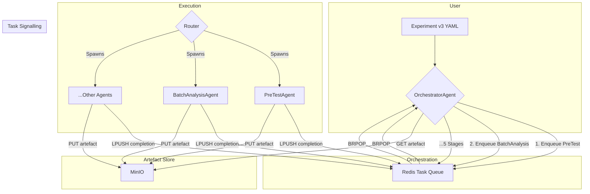

# Discernus System Architecture (v3.0 - Radical Simplification)

## About Discernus

**Discernus** is a computational research platform that enables systematic, reproducible analysis of text corpora using analytical frameworks developed by researchers. Rather than requiring technical implementation of each framework, Discernus allows researchers to specify their analytical approach in natural language and applies it consistently across large document collections.

### What Discernus Does

Discernus transforms the traditional research workflow:

**Traditional Approach**: Researcher manually applies analytical framework → Individual document analysis → Manual synthesis across findings → Subjective aggregation

**Discernus Approach**: Researcher specifies framework once → Automated batch analysis across corpus → LLM-powered synthesis with statistical validation → Reproducible, peer-reviewable results

### Core Capabilities
- **Framework Agnostic**: Works with any analytical framework (political analysis, content analysis, discourse analysis, etc.)
- **Format Agnostic**: Processes any document type (PDF, DOCX, plain text, etc.) without preprocessing
- **Corpus Agnostic**: Scales from dozens to thousands of documents with consistent quality
- **Academically Rigorous**: Complete provenance, statistical validation, peer-review ready outputs

---

## Fundamental Architectural Principles

These principles guide every design decision in Discernus:

**1. Reliability Over Flexibility**
- Single, predictable pipeline over infinite customization options
- Boring, bulletproof behavior over theoretical capability
- "It works every time" trumps "it can do anything"

**2. Intelligence in Prompts, Not Software**
- LLMs handle reasoning, interpretation, and domain knowledge
- Software provides coordination, storage, and deterministic operations only
- Components limited to <150 lines to prevent intelligence creep

**3. Empirical Technology Choices**
- Decisions based on actual testing, not theoretical optimization
- Gemini 2.5 Pro chosen over Flash due to CHF complexity test failure
- Cost optimization secondary to reliability validation

**4. Artifact-Oriented State Management**
- All data flows through immutable, hashed artifacts in MinIO
- No mutable state in agents or orchestrator
- Perfect reproducibility through artifact chains

**5. Fail-Fast Input Validation**
- Strict contracts enforced at system boundaries
- Clear error messages over expensive debugging cycles
- "Garbage in, clear error out"

**6. Linear Progression with Perfect Caching**
- Fixed 5-stage pipeline with deterministic progression
- Cache hits eliminate redundant computation entirely
- Predictable resource usage and timing

**7. Academic Provenance by Design**
- Every decision, artifact, and transformation logged
- Git-based version control for all research materials
- Audit trails sufficient for peer review and replication

**8. Externalized Intelligence, Internalized Coordination**
- Agent prompts live in external YAML files (intelligence belongs outside code)
- Agent discovery uses hardcoded mappings (coordination stays predictable)
- Researchers modify prompts, not coordination logic
- Balances THIN principles with Radical Simplification reliability

---

### The THIN vs THICK Philosophy

**Discernus embodies THIN software architecture principles**:

**THIN Architecture** (Discernus):
- **LLM Intelligence**: Complex reasoning, format detection, framework application handled by language models
- **Software Infrastructure**: Minimal routing, caching, orchestration - no business logic
- **Principle**: "Make it easier to do the right thing and harder to do the wrong thing"
- **Result**: Framework/experiment/corpus agnostic system that adapts to researcher needs

**THICK Architecture** (Traditional Systems):
- **Software Intelligence**: Complex parsing, format-specific processors, hardcoded business rules
- **LLM Usage**: Limited to simple tasks, constrained by software assumptions
- **Problem**: Brittle, framework-specific, requires engineering for each new research approach
- **Result**: Researchers constrained by what software developers anticipated

---

## 1 · Current Implementation Objective

Stand up a **minimal, reproducible pipeline** that demonstrates the *THIN* architecture while validating that modern LLMs can shoulder nearly all domain reasoning:

- **No bespoke parsers** for frameworks or outputs.
- **Artefact‑oriented caching** so finished LLM calls are never repeated.
- **Abort / resume** and **cost‑guard** controls proven in practice.

The architecture has now evolved into **Radical Simplification Mode** to support **batched multi‑framework analysis** using a single, bulletproof 5-stage pipeline. Reliability > Flexibility.

---

## 2 · Core Concepts (Glossary)

| Term | Plain‑English meaning |
| ---- | --------------------- |
| **Redis Stream** | Append‑only log used for firehose logging (not critical path after simplification). |
| **Task Queue (list)** | Redis list used for deterministic completion signalling (no consumer group races). |
| **MinIO** | Local S3‑compatible object store for artefacts. |
| **Artefact** | Any file (JSON, Parquet, prompt) saved by SHA‑256. |
| **Router** | ~150 lines: spawns workers / loads registry; *no business logic*. |
| **Agent** | Stateless worker: *read task → call LLM with prompt → write result*. |
| **OrchestratorAgent** | LLM that plans execution for a fixed 5‑stage pipeline. |

---

## 3 · Architecture Overview (Radical Simplification Mode)


---

## 4 · Radical Simplification Mode (Phase 1)

> **Goal:** Replace growing coordination complexity with a **single, bulletproof workflow** and strict input contracts. Reliability > flexibility.

### 4.1 Fixed 5‑Stage Pipeline
```
PreTest → BatchAnalysis → CorpusSynthesis → Review → Moderation
```
All runs follow this exact order. No custom workflows, branching, or parallel variations.

### 4.2 Coordination Simplification
Legacy consumer‑group races are eliminated. Completion signalling uses Redis keys/lists:

1. Agent finishes: writes artefact → `SET task:<id>:status done EX 86400` → `LPUSH run:<run_id>:done <id>`.
2. Orchestrator waits via `BRPOP run:<run_id>:done` (blocking). No dynamic consumer groups.
3. Cache check: if status key exists + artefact present → skip.

### 4.3 Strict Input Specifications (v3 / v5)
All inputs validated **before** first LLM call.

**Experiment v3** (YAML excerpt):
```yaml
name: "phase3_chf_constitutional_debate"
corpus_path: projects/exp1/corpus/
frameworks: [CAF_v4.3.md, CHF_v1.1.md, ECF_v1.0.md]
statistical_runs: 3   # optional override
```
Constraints: `max_documents`, `max_frameworks_per_run`, **no** `custom_workflow` / `parallel_processing` fields.

**Framework v5**: Markdown file with embedded JSON block declaring `output_contract` (schema) + optional `precision`. Enforced via deterministic validator post‑analysis.

**Corpus v3**: Directory with `manifest.json` listing file names & metadata. System does **no discovery** outside manifest. Binary‑first principle: all files base64 encoded for LLM.

### 4.4 Batch Planner & PreTest
`PreTestAgent` samples corpus to estimate variance & token footprint → returns `recommended_runs_per_batch`.
`BatchPlanner` (inside Orchestrator) uses model registry fields:
- `optimal_batch_tokens` (≈ 70% of context window)
- `max_documents_per_batch`

Generates batch tasks: `{batch_id, text_uris[], framework_hashes[], runs=recommended}`.

### 4.5 AnalyseBatchAgent (Layer 1)
Processes multiple documents + frameworks in one call.
Output schema (per run):
```json
{
  "batch_id": "B01",
  "run_index": 1,
  "framework_scores": {"CAF": {...}, "CHF": {...}},
  "per_doc_notes": {...},
  "batch_summary": "Structured qualitative summary"
}
```
Artefact naming: `analysis/B01.caf<hash>-chf<hash>.run1.json`.

### 4.6 Layered Synthesis & Review

| Layer | Agent(s) | Purpose | Model class |
| ----- | -------- | ------- | ----------- |
| 1 In‑Batch | AnalyseBatchAgent | Raw scores + per‑batch summary | Gemini 2.5 Pro |
| 2 Corpus | CorpusSynthesisAgent | Deterministic aggregation/statistics | Gemini 2.5 Pro |
| 3 Review | 2× ReviewerAgent + ModeratorAgent | Adversarial critique → reconciled narrative | Gemini 2.5 Pro |

`debate/<RUN_ID>.html` captures transcript for audit.

### 4.7 Model Registry
`models/registry.yaml` + `models/provider_defaults.yaml` supply pricing, context windows, and batching parameters.

Example entry:
```yaml
vertex_ai/gemini-2.5-pro:
  provider: vertex_ai
  context_window: 8000000
  costs: {input_per_million_tokens: 1.25, output_per_million_tokens: 5.00}
  task_suitability: [batch_analysis, multi_framework_synthesis, review]
  optimal_batch_tokens: 5600000
  max_documents_per_batch: 300
  last_updated: '2025-07-24'
```

**Note**: Standardized on Gemini 2.5 Pro after Flash reliability failure on CHF complexity test (2025-07-24).

### 4.8 Metrics
Logged per run into `manifest.json`:
- `run_success`: boolean
- `cache_hit_ratio` (re‑run) = skipped_batches / total_batches
- `mean_stage_latency`
- `cost_usd`

### 4.9 Acceptance Criteria
1. **Full Pipeline:** PreTest → BatchAnalysis (≥1 batch) → CorpusSynthesis → Review → Moderation produces artefacts:
   - `analysis/*.json` with `batch_summary`
   - `synthesis/<RUN>.json`
   - `debate/<RUN>.html`
2. **Cache Hit:** Re‑running identical experiment triggers zero Layer‑1 calls (verified via LiteLLM logs).
3. **Cost Guard:** Live mode prompts for confirmation using batch token estimates.
4. **Variance‑Driven Runs:** PreTestAgent sets `runs_per_batch`; system executes that many replicate analyses.
5. **Review Integrity:** Moderator output cites batch summaries and statistics (traceable).
6. **Metrics:** `cache_hit_ratio == 1.0` on second run; success rate ≥95% across test suite.

---

## 5 · Example Commands
```bash
# Start infrastructure
$ docker compose up -d redis minio

# Run experiment with hardcoded 5-stage pipeline
$ python3 scripts/phase3_test_runner.py --test full_pipeline

# Monitor system status
$ python3 scripts/debug_monitor.py

# Check Redis task queues
$ redis-cli xlen orchestrator.tasks
$ redis-cli xlen tasks
```

---

## 6 · Experiment Export & Directory Structure
```
projects/<PROJECT>/<EXPERIMENT>/<RUN_ID>/
├─ corpus/            # original input files
├─ analysis/          # batch JSON artefacts
├─ synthesis/         # <RUN_ID>.json corpus statistics
├─ debate/            # review transcript (html + json)
├─ framework/         # copies of framework files
├─ logs/              # router / agent / proxy logs
├─ manifest.json      # machine provenance (hashes, metrics)
└─ manifest.md        # human summary
```

---

## 7 · Security Controls

### 7.1 Enabled Now
- **Hash Pinning**: All framework/corpus artifacts validated by SHA-256
- **Secrets Scanning**: CLI rejects files matching `/.env($|[._-])/` patterns  
- **Path Validation**: Corpus paths restricted to project boundaries
- **Task Type Validation**: Router enforces allowed task types from agent registry

### 7.2 Deferred (Post-Production)
- **Sandboxing**: Agent containers with `--network none`
- **Sentinel Agent**: Advanced prompt injection detection
- **Audit Logging**: Comprehensive security event logging

---

## 8 · Radical Simplification Constraints

The architecture enforces strict constraints to ensure reliability:

### 8.1 Single Pipeline Path
- **Fixed 5-Stage Sequence**: PreTest → BatchAnalysis → CorpusSynthesis → Review → Moderation
- **No Custom Workflows**: System rejects experiments with `custom_workflow` or `parallel_processing` fields
- **Linear Progression**: Each stage completes before next stage begins
- **Predictable Behavior**: Users know exactly what will happen for any valid experiment

### 8.2 Model Standardization  
- **Single Model**: All stages use `vertex_ai/gemini-2.5-pro` for reliability
- **No Model Selection**: System does not support model choice per stage
- **Proven Reliability**: Model selection based on empirical testing, not cost optimization

### 8.3 Input Contract Enforcement
- **Hash-Required Frameworks**: All frameworks must include valid SHA-256 hashes
- **Manifest-Based Corpus**: Corpus directories require explicit `manifest.json`
- **Specification Compliance**: Bouncer validates against strict Pydantic schemas
- **No Legacy Support**: System rejects v2 specifications with clear upgrade guidance

### 8.4 Architectural Principles
- **THIN Components**: All software components limited to <150 lines
- **No Business Logic**: Intelligence resides in LLM prompts, not software
- **Stateless Agents**: Agents read task → call LLM → write result
- **Artifact-Oriented**: All state persisted as SHA-256 addressable artifacts

---

*Last updated 2025‑07‑24 - Aligned with Implementation Plan V4*