# Discernus System Architecture (THIN Orchestration)

> **Document Structure**: This document is organized into three distinct sections: (1) **Universal Principles** - immutable architectural foundations, (2) **Current Implementation** - operational architecture and capabilities, and (3) **Evolution Roadmap** - planned enhancements and future vision. Each section serves different stakeholders and development phases.

---

## Architecture at a Glance

**Discernus** implements a 4-stage THIN synthesis pipeline with comprehensive RAG (Retrieval-Augmented Generation) for academic research at scale:

```
Analysis → Knowledge Indexing → Intelligent Synthesis → Reporting
   ↓              ↓                    ↓               ↓
Raw Scores   Knowledge Graph    Cross-Domain      Statistical
Evidence     All Data Types     Evidence          Analysis
Metadata     txtai Index        Retrieval         Reports
```

### **Core Design Philosophy**
- **THIN Architecture**: LLMs handle intelligence; software provides minimal orchestration (<150 lines per component)
- **Comprehensive RAG**: Unified knowledge graph indexes all 6 experiment data types for cross-domain reasoning
- **Academic Integrity**: Computational verification, complete provenance, zero hallucinated statistics
- **Multi-Model Support**: Gemini 2.5 defaults with cross-model compatibility for ensemble validation

### **Key Capabilities**
- **Framework Agnostic**: Any analytical approach expressible in natural language
- **Enterprise Scale**: Hash-based caching, content-addressable storage, persistent knowledge graphs
- **Research Quality**: Peer review readiness with full audit trails and statistical transparency
- **Day-1 Productivity**: No programming required - researchers focus on methodology, not implementation

### **Technology Stack**
- **Knowledge Indexing**: txtai semantic search with comprehensive data type integration
- **Mathematical Operations**: MathToolkit with provenance metadata and secure code execution
- **Storage**: LocalArtifactStorage with Git-based version control (no databases)
- **LLM Integration**: Multi-provider gateway supporting Gemini, Claude, OpenAI with rate limiting

---

## About Discernus

**Discernus** is a computational research platform that amplifies researcher expertise through systematic, reproducible analysis of text corpora. Rather than replacing human judgment, Discernus enables researchers to apply their analytical frameworks at scale while maintaining transparency and academic integrity.

### What Discernus Does

Discernus transforms research capacity without compromising scholarly control:

**Traditional Approach**: 
- Researcher manually codes documents → Individual analysis → Manual synthesis → Subjective aggregation
- Limited scale, inconsistent application, difficult replication

**Discernus Approach**: 
- Researcher designs framework once → Automated consistent application across corpus → LLM-powered synthesis with computational verification → Transparent, statistically validated results
- Institutional scale, improved consistency, enhanced auditability

### Foundational Philosophy

**Human Amplification, Not Replacement**: Researchers retain complete control over analytical approach, interpretation, and synthesis. Discernus provides computational scale and methodological consistency while preserving human expertise and judgment.

**Day-1 Extensibility**: Create unlimited frameworks, experiments, and corpora within specifications. No programming required - analytical approaches expressed in natural language enable immediate research productivity.

**Academic Integrity by Design**: Calculations verified through code execution, decisions logged for audit, provenance maintained for peer review. Statistical results computed rather than hallucinated.

**LLM Consistency Approach**: LLMs can provide more consistent evaluation than human panels in many contexts, representing averaged human perception patterns while reducing fatigue and bias effects.

### Core Capabilities
- **Flexible Analytical Frameworks**: Approaches expressible in natural language (political analysis, discourse analysis, content analysis, literary criticism, etc.)
- **Scalable Text Processing**: Handles document collections from dozens to thousands with hash-based anonymization for sensitive materials
- **Computational Verification**: Statistics computed and verified through code execution
- **Process Transparency**: Audit trails, variance reporting, confidence intervals, methodological constraints
- **Git-based Collaboration**: Framework and experiment sharing enables academic community building

---

# Part I: Universal Principles (Immutable)

These foundational principles are the "constitutional" bedrock of Discernus - they remain constant regardless of implementation maturity or technology evolution:

**1. Day-1 Extensibility Through Specifications**
- Researchers can create unlimited frameworks, experiments, and corpora within specifications
- Any analytical approach expressible in natural language can be implemented
- Diverse methodological approaches and research designs supported
- External prompts allow analytical customization without code changes
- Git-based sharing enables immediate academic collaboration and framework distribution

**2. Human Intellectual Value Amplification, Not Replacement**
- Real value creation comes from researcher expertise: framework design, corpus curation, experiment methodology
- Discernus amplifies human intuition and domain knowledge rather than substituting for it
- Researchers retain full control over analytical approach, interpretation, and synthesis
- System provides computational scale and consistency while preserving human judgment
- End-to-end transparency enables researchers to audit, validate, and refine their analytical choices
- Post-hoc analysis, synthesis, and scholarly interpretation remain fundamentally human activities
- Technology serves scholarship, not the reverse - researchers drive insights, system provides rigor

**3. Researcher-Centric Information Architecture**
- **Mirror Research Thinking**: System organization reflects how researchers naturally conceptualize and organize their work
- **Cognitive Load Management**: Present the right information at the right time in the right format for clarity
- **Human-Readable Interfaces**: Meaningful names, logical structures, and rich context over cryptic technical identifiers
- **Progressive Disclosure**: Surface relevant details when needed while maintaining clean primary workflows
- **Research Narrative Preservation**: File organization tells the story of the research process and decision-making
- **Balance Rigor with Usability**: Maintain underlying technical precision while providing researcher-friendly abstractions
- **Workflow Integration**: Support natural research patterns rather than forcing adaptation to system constraints

**4. No Black Box - Complete Process Transparency**
- **LLM Reasoning Visibility**: All agent reasoning traces and decision logic captured and accessible
- **Framework Interpretation Transparency**: How natural language analytical frameworks are operationalized and applied to specific texts
- **Computational Process Transparency**: Every mathematical calculation shows its work through executable code
- **Agent Orchestration Transparency**: Why specific agents were invoked, in what order, and with what parameters
- **Synthesis Methodology Transparency**: How conflicting analyses are identified, weighted, and resolved
- **Error Resolution Transparency**: What failed, why it failed, and how the system responded
- **Academic Requirement**: Researchers must be able to understand, validate, and replicate every step of the analytical process
- **Peer Review Enablement**: Complete methodological transparency sufficient for rigorous academic review

**5. Academic Provenance by Design**
- Every decision, artifact, and transformation logged with complete context
- Git-based version control for all research materials and process history
- Audit trails sufficient for peer review and replication
- Tamper-evident chains of analytical custody

**6. Computational Verification ("Show Your Math")**
- LLMs must execute code for all mathematical calculations
- Statistical results verified through secure code execution
- No hallucinated statistics - all numbers computed and logged
- Provenance systems detect content tampering and ensure analysis integrity
- Academic integrity through transparent, auditable computational processes

**7. LLM Consistency Superiority Over Human Evaluation Panels**
- **Fundamental Assumption**: Properly managed LLMs are more consistently perceptive than human evaluator panels
- LLMs represent global-scale averaging of human perception patterns across training data
- Individual humans may be more perceptive, but panels suffer from inconsistency, fatigue, and bias drift
- LLM evaluation provides speed and precision impossible with human panels at institutional scale
- Consistency enables reliable cross-document, cross-time, and cross-researcher comparisons
- Statistical validation (variance measurement, confidence intervals) quantifies this consistency advantage
- This assumption justifies computational methodology over traditional human coding approaches

**8. Variance-Aware Adaptive Processing with Transparency**
- Accept LLM response variance as natural and expected phenomenon (not a bug to fix)
- Use statistical methods to measure variance and determine optimal sample sizes
- Adaptive sampling stops when confidence intervals meet requirements
- Balance statistical confidence with budget through empirical stopping rules
- Always report uncertainty, confidence intervals, and methodological constraints
- Employ multi-run statistical validation for reliability assessment

**9. Reliability Over Flexibility**
- Single, predictable pipeline over infinite customization options
- Boring, bulletproof behavior over theoretical capability
- "It works every time" trumps "it can do anything"
- **Direct function calls over distributed coordination** - proven through prototype experience

**10. Resource-Conscious Cost Management**
- Empirical cost-performance optimization through model selection and batching
- Variance-driven adaptive sampling reduces unnecessary LLM calls
- Caching eliminates redundant computation on re-runs
- Transparent cost reporting enables institutional budget planning

**11. Specialized Agent Processing Over Monolithic Analysis**
- Task-specific agents outperform single-LLM approaches (empirically validated)
- Enhanced pipeline: Analysis → Knowledge Indexing → Intelligent Synthesis → Reporting with comprehensive cross-domain provenance
- Natural language communication between stages (no complex JSON parsing)
- Agent specialization: focused analysis agents with clear input/output contracts
- Cross-domain knowledge integration through comprehensive RAG architecture

**12. Empirical Model Selection Based on Performance Requirements**
- Context window requirements determined by analysis complexity
- Rate limiting needs based on institutional processing scale
- Accuracy demands: Consistent performance across full context window
- Empirical validation: Models chosen through actual complexity testing
- Cost-performance optimization through systematic evaluation
- Provider reliability considerations for predictable academic pricing

**13. Security and Privacy by Design**
- Corpus anonymization and hash-based identity protection as standard practice
- Process isolation and sandboxing for secure agent execution (implemented upfront)
- Comprehensive audit logging for academic integrity and compliance (implemented upfront)
- API key management and rate limiting to prevent abuse
- Git-based provenance provides tamper-evident audit trails
- **Academic Data Sensitivity**: Text corpora often contain sensitive political, corporate, or personal content requiring proper security controls from day one

**13a. Orchestrator Trust Boundary Model**
- **Trust Layering**: Security architecture distinguishes between trusted infrastructure (orchestrators) and untrusted workloads (agents)
- **Orchestrator Privileges**: Can resolve canonical framework references (`../../frameworks/`) as trusted infrastructure operations
- **Agent Restrictions**: All agent file access constrained to experiment directory via `ExperimentSecurityBoundary`
- **Pre-Injection Security**: Orchestrators pre-resolve external dependencies before agent execution, eliminating agent access to system files
- **Canonical Framework Support**: Enables single-source-of-truth frameworks while maintaining strict agent isolation
- **Audit Compliance**: All framework access (canonical and local) logged with security context for complete provenance

**14. Graceful Degradation and Error Recovery**
- Fail-fast validation prevents expensive downstream failures
- Partial artifact preservation on timeout or interruption
- Clear error messages with actionable remediation steps
- System continues processing remaining batches when individual items fail

**15. Intelligence in Prompts, Not Software**
- LLMs handle reasoning, interpretation, and domain knowledge
- Software provides coordination, storage, and deterministic operations only
- Components limited to <150 lines to prevent intelligence creep

**16. Externalized Intelligence, Internalized Coordination**
- Agent prompts live in external YAML files (intelligence belongs outside code)
- Agent discovery via file-based scanning (THIN principle: simple filesystem patterns over hardcoded logic)
- Researchers modify prompts, not coordination logic
- Balances THIN principles with Radical Simplification reliability

**17. Empirical Technology Choices**
- Decisions based on actual testing, not theoretical optimization
- Model selection validated through complexity testing
- Cost optimization secondary to reliability validation

**18. Linear Progression with Caching**
- Enhanced 4-stage pipeline with deterministic progression: Analysis → Knowledge Indexing → Intelligent Synthesis → Reporting
- Cache hits eliminate redundant computation on identical inputs and knowledge graphs
- Predictable resource usage and timing with comprehensive RAG integration

**19. Artifact-Oriented State Management**
- All data flows through immutable, hashed artifacts in content-addressable storage
- No mutable state in agents or orchestrator
- Reproducibility through artifact chains

**20. Fail-Fast Input Validation**
- Strict contracts enforced at system boundaries
- Clear error messages over expensive debugging cycles
- "Garbage in, clear error out"

**21. Decentralized Architecture Policy - Independence Over Infrastructure**
- **No Required Centralized Infrastructure**: Researchers work independently on their own machines without requiring shared servers or databases
- **Academic Transparency**: All research data stored as flat files (CSV/JSON) that are transparent to auditors and replication researchers
- **Distributed Collaboration**: Git-based collaboration without centralized infrastructure dependencies
- **Project Isolation**: Individual experiments remain self-contained and portable
- **Replication Ready**: Complete research packages as Git repositories with flat file data
- **Tool Agnostic**: CSV/JSON outputs work with any analysis tool (Excel, R, Python, etc.)
- **Optional Local Databases**: Embedded databases (SQLite, vector stores) permitted for performance optimization if they don't require centralized infrastructure
- **Hash Cross Referenced CSV**: When relational data is needed, use CSV files with shared artifact keys
- GitHub serves as the collaboration layer - no proprietary formats or database dumps

---

# Part II: Current Implementation 

This section describes the implemented architecture and operational capabilities.

## Current Technology Stack

**Infrastructure**:
- LocalArtifactStorage content-addressable storage for artifact management
- Git-based provenance and version control (no centralized databases required)
- Local filesystem storage (no external dependencies)
- Direct function calls over distributed coordination
- Optional local embedded databases (SQLite) for performance optimization

**LLM Integration**:
- Multi-model architecture with Gemini 2.5 series as development defaults
- Cross-model compatibility validation for ensemble testing and targeted use cases
- Comprehensive RAG integration with LLM-powered query intelligence
- Adaptive query generation and refinement capabilities
- Cost-performance optimization through empirical model selection

**Specification System**:
- Framework specifications enable natural language analytical approaches
- Experiment specifications support multi-model research designs  
- Corpus specifications provide text collection management

## Current Processing Pipeline

### **Visual Architecture Overview**

```mermaid
graph TD
    A["🔍 Analysis Stage<br/>Enhanced Analysis Agents"] --> B["📊 Knowledge Indexing<br/>ComprehensiveKnowledgeCurator"]
    B --> C["🧠 Intelligent Synthesis<br/>RAGEnhancedResultsInterpreter"]
    C --> D["📋 Reporting Stage<br/>Statistical Analysis & Output"]
    
    A1["Raw Scores<br/>Evidence Quotes<br/>Metadata"] --> A
    A2["Framework<br/>Specification"] --> A
    A3["Corpus<br/>Documents"] --> A
    
    A --> B1["txtai Knowledge Graph<br/>All 6 Data Types<br/>Semantic Index"]
    B1 --> B
    
    B --> C1["Cross-Domain Queries<br/>Intelligent Retrieval<br/>Evidence Grounding"]
    C1 --> C
    
    C --> D1["MathToolkit<br/>Statistical Verification<br/>Provenance Chain"]
    D1 --> D
    
    D --> E["📄 Academic Reports<br/>Peer Review Ready<br/>Full Audit Trail"]
    
    style A fill:#e1f5fe
    style B fill:#f3e5f5
    style C fill:#e8f5e8
    style D fill:#fff3e0
```



### **Enhanced 4-Stage Architecture with Comprehensive RAG**

**🔍 Analysis Stage**: Enhanced analysis agents with framework-specific prompts and dimensional scoring, producing raw scores and evidence with computational verification

**📊 Knowledge Indexing Stage**: Comprehensive knowledge graph construction from all 6 experiment data types with persistent hash-based caching for enterprise scalability

**🧠 Intelligent Synthesis Stage**: Cross-domain reasoning and evidence retrieval with LLM-powered query optimization, replacing evidence-only curation with comprehensive knowledge retrieval

**📋 Reporting Stage**: Statistical analysis and academic-quality output with full cross-domain provenance, computational verification, and peer review readiness

### **Data Flow Architecture**

**Input Data Types** (6 comprehensive categories):
1. **Corpus Documents**: Full text with speaker attribution and context
2. **Framework Specification**: Analytical methodology and dimension definitions  
3. **Raw Scores**: Individual dimension scores with calculation provenance
4. **Statistical Results**: Verified mathematical findings and computations
5. **Evidence Quotes**: Supporting textual evidence with confidence scores
6. **Experiment Metadata**: Research context, hypotheses, and configuration

**Content-Addressable Caching**: SHA256-based storage eliminates redundant computation on identical inputs

**Comprehensive Knowledge RAG**: 
- Unified indexing of corpus documents, framework specifications, raw scores, statistical results, evidence quotes, and experiment metadata
- Cross-domain semantic search enabling queries across all data types
- Hash-based persistent caching for enterprise scalability (<2s query performance)
- LLM-powered adaptive query generation and refinement

**Security Model**: 
- Orchestrator trust boundary with agent restrictions
- ExperimentSecurityBoundary constrains agent file access
- Comprehensive audit logging for all operations

**Transparency Approach**:
- LLM reasoning traces captured in artifacts where possible
- Framework interpretation steps logged for review
- Agent orchestration decisions recorded for audit
- Mathematical calculations executed and verified through code
- Continuous improvement toward complete process transparency

---

# Part III: Evolution Roadmap (Future Vision)

This section outlines planned enhancements organized by development timeline. Features here are aspirational and may require architectural changes.

## Near-Term: Foundational Reliability (Next 6 Months)

**Enhanced Prompt Management**:
- Complete externalization of all agent prompts to YAML files
- Version-controlled prompt templates and systematic testing
- Framework-agnostic prompt libraries

**Cross-Domain Query Optimization**:
- Advanced semantic search patterns for complex research questions spanning multiple data types
- Intelligent evidence gap detection for statistical findings lacking sufficient textual support
- Multi-perspective reasoning with structured validation and contradiction detection workflows

**Enhanced Transparency Infrastructure**:
- Structured reasoning trace capture and visualization
- Interactive transparency browsers for process exploration
- Framework interpretation workflow documentation
- Decision audit trails with searchable metadata

**Researcher-Centric Information Architecture**:
- Human-readable file naming and organization systems
- Rich metadata and context preservation
- Progressive disclosure interfaces for complex data
- Research narrative preservation in file structures

**Systematic Evaluation Framework**:
- Automated testing pipeline using promptfoo or similar
- Golden dataset for regression testing
- LLM-as-judge validation for semantic quality
- Continuous integration for prompt changes

**Graceful Error Recovery**:
- Comprehensive fail-fast validation
- Partial artifact preservation on interruption
- Clear error messages with remediation steps
- Retry logic for transient failures

## Medium-Term: Performance Optimization (6-18 Months)

**Intelligent Model Routing**:
- Task complexity classification for optimal model selection
- Cost-performance optimization based on request characteristics
- Fallback chains for reliability

**Enhanced Multi-Agent Patterns**:
- Structured debate between specialized analysis agents
- Red team / blue team validation workflows
- Consensus mechanisms for complex reasoning tasks

**Adaptive Knowledge Graph Construction**:
- Dynamic optimization of indexing strategies based on experiment characteristics and query patterns
- Advanced cross-domain analytics with statistical pattern recognition across textual evidence
- Collaborative knowledge graphs with shared semantic indexes and privacy-preserving protocols

**Advanced Caching Strategies**:
- Semantic similarity caching using local vector embeddings (embedded SQLite with vector extensions)
- Prompt optimization through retrieval-augmented generation
- Dynamic few-shot example selection
- Local vector stores for framework similarity matching

## Long-Term: Autonomous Systems (18+ Months)

**Self-Healing Architecture**:
- Dynamic quality monitoring and correction
- Automated prompt optimization based on performance metrics
- Real-time adaptation to model capability changes

**Cost-Performance Frontier**:
- RAG-based dynamic prompt construction
- Context window optimization
- Predictive model selection based on task analysis

**Advanced Academic Features**:
- Automated literature integration
- Citation networks and research lineage tracking
- Collaborative framework development tools

## Risk Assessment & Mitigation Strategies

### **Technical Risks**

**🔴 High Priority Risks:**

**LLM Model Deprecation/Changes**: 
- *Risk*: Provider model updates breaking existing prompts and workflows
- *Mitigation*: Multi-model architecture with cross-model validation; externalized prompts in version-controlled YAML; systematic prompt testing harness

**Knowledge Graph Consistency**: 
- *Risk*: txtai index corruption or inconsistent semantic search results  
- *Mitigation*: Content-addressable storage with SHA256 verification; immutable artifact chains; automated consistency checking

**Statistical Computation Errors**: 
- *Risk*: MathToolkit producing incorrect calculations affecting research validity
- *Mitigation*: Secure code execution with complete transparency; all calculations logged with provenance; computational verification required

**🟡 Medium Priority Risks:**

**Evidence Retrieval Quality**: 
- *Risk*: RAG system returning irrelevant or biased evidence selections
- *Mitigation*: Variance-aware processing with confidence intervals; multi-run validation; human oversight integration points

**Scale Performance Degradation**: 
- *Risk*: Knowledge graph queries becoming too slow at enterprise scale (>1000 documents)
- *Mitigation*: Hash-based persistent caching; performance monitoring; adaptive indexing strategies

### **Academic Integrity Risks**

**🔴 Critical Academic Risks:**

**Provenance Chain Breaks**: 
- *Risk*: Loss of audit trail from conclusions back to source texts
- *Mitigation*: Git-based version control; immutable artifact storage; comprehensive logging; peer review integration

**Statistical Hallucination**: 
- *Risk*: LLMs fabricating statistical results instead of computing them
- *Mitigation*: Computational verification requirement; secure code execution; zero-hallucination synthesis protocols

**Evidence Misattribution**: 
- *Risk*: Evidence quotes linked to wrong sources or contexts
- *Mitigation*: Deterministic semantic search with metadata preservation; cross-validation workflows; transparent retrieval logging

### **Operational Risks**

**🟡 Medium Priority Operational Risks:**

**Dependency Management**: 
- *Risk*: Critical dependencies (txtai, LLM providers) becoming unavailable
- *Mitigation*: Local-first architecture; no required centralized infrastructure; fallback provider chains

**Cost Escalation**: 
- *Risk*: LLM API costs becoming prohibitive for research budgets
- *Mitigation*: Intelligent model routing; cost-performance optimization; local model fallbacks where feasible

**User Experience Complexity**: 
- *Risk*: THIN architecture becoming too complex for researchers to adopt
- *Mitigation*: Day-1 extensibility focus; natural language specifications; comprehensive documentation

### **Mitigation Success Metrics**

- **Provenance Completeness**: 100% traceability from all statistical findings to source texts
- **Computational Accuracy**: Zero hallucinated statistics (all numbers computed and verified)
- **Cross-Model Consistency**: <10% variance across different LLM providers for identical tasks
- **Performance Standards**: <2 second query response time at 500+ document scale
- **Academic Adoption**: Framework specifications expressible in natural language without programming

---

### The THIN vs THICK Philosophy

**Discernus embodies THIN software architecture principles**:

**THIN Architecture** (Discernus):
- **LLM Intelligence**: Complex reasoning, format detection, framework application handled by language models
- **Software Infrastructure**: Minimal routing, caching, orchestration - no business logic
- **Principle**: "Make it easier to do the right thing and harder to do the wrong thing"
- **Result**: Framework/experiment/corpus agnostic system that adapts to researcher needs

**THICK Architecture** (Traditional Systems):
- **Software Intelligence**: Complex parsing, format-specific processors, hardcoded business rules
- **LLM Usage**: Limited to simple tasks, constrained by software assumptions
- **Problem**: Brittle, framework-specific, requires engineering for each new research approach
- **Result**: Researchers constrained by what software developers anticipated

---

*Last updated 2025‑08‑09 - Added Modern RAG Synthesis Architecture with comprehensive knowledge indexing, cross-domain reasoning, and intelligent retrieval capabilities*
**22. Epistemic Trust through Intelligent Cross-Domain Retrieval**
- **Core Mandate**: The platform must build and maintain epistemic trust by ensuring every analytical conclusion is transparently and verifiably linked to source texts through intelligent, cross-domain retrieval mechanisms
- **Comprehensive Knowledge Foundation**: Statistical findings, evidence quotes, framework dimensions, and corpus content are indexed in a unified knowledge graph enabling cross-domain reasoning and targeted evidence discovery
- **Intelligent Retrieval over Fuzzy Curation**: The synthesis pipeline operates on "Intelligent Retrieval" principles - using statistical findings to execute targeted, programmatic queries across the comprehensive knowledge graph. This retrieval identifies specific evidence that supports findings, which is then passed to LLMs for nuanced summarization and narrative construction
- **Cross-Domain Reasoning**: Researchers can investigate connections between statistical patterns and textual evidence through natural language queries that span multiple data types (e.g., "What evidence supports the correlation between dignity and cohesion scores?")
- **Causality over Inference**: The connection between statistical results and supporting evidence is established through deterministic semantic search and provenance tracking, not through subsequent LLM inference that might lose the causal chain
- **Scalable Academic Validation**: The comprehensive knowledge architecture enables evidence linking at institutional scale while maintaining perfect academic accountability and peer review standards

**23. Evidence Linking Scope Theory**
- **Dimensional Score Validation**: Evidence linking is required only for dimensional scores (dignity_score = 0.0) and their direct mathematical derivatives (tension scores, indices calculated from dimensional components). These scores represent the foundational analytical judgments that require textual justification.
- **Mathematical Transparency Sufficiency**: Complex statistical relationships (correlations, ANOVA results, multivariate analyses) require mathematical transparency rather than evidence linking. These are computational operations on validated dimensional scores - showing the formula and input data provides sufficient academic accountability.
- **Two-Layer Validation Model**: (1) Dimensional scores must be grounded in specific textual evidence with clear causal links, (2) All mathematical operations on those scores must be transparent and reproducible. This separation allows scalable academic validation without requiring evidence for every statistical relationship.
- **Academic Integrity Preservation**: By constraining evidence linking to the foundational layer (dimensional assessment), we maintain perfect academic accountability while avoiding the impossible task of providing textual justification for mathematical relationships between variables.

**24. txtai as Comprehensive Research Knowledge Index**
- **Comprehensive Knowledge Graph**: txtai serves as a unified index for all experiment data types (corpus, framework, scores, statistics, evidence, metadata), enabling cross-domain reasoning and intelligent synthesis
- **Academic Standards Alignment**: Vector search and semantic indexing provide deterministic, reproducible retrieval across heterogeneous research data types with full provenance preservation
- **Cross-Domain Query Capability**: Semantic search enables natural language queries that span multiple data types, supporting research questions like "What statistical patterns correlate with specific textual evidence?"
- **Immutable Research Data**: All indexed content represents immutable research artifacts generated during analysis, with txtai providing fast, consistent retrieval without introducing database dependencies
- **Enterprise Scalability**: Hash-based persistent caching enables <2 second query performance at 500+ document scale while maintaining research-grade consistency and reproducibility
- **Provenance Preservation**: Every query result includes complete metadata linking back to original analysis artifacts, ensuring perfect traceability across all data types

**25. Comprehensive Knowledge Architecture for Cross-Domain Reasoning**
- **Unified Data Indexing**: All experiment data types indexed in unified knowledge graph for cross-domain reasoning and intelligent synthesis (extends Principles #22, #24)
- **Six Data Type Integration**: (1) Corpus Documents - full text with speaker attribution, (2) Framework Specification - analytical methodology and dimensions, (3) Raw Scores - individual dimension scores with provenance, (4) Statistical Results - verified mathematical findings, (5) Evidence Quotes - supporting textual evidence with confidence, (6) Experiment Metadata - research context and hypotheses
- **Cross-Domain Query Capability**: Enable queries like "What evidence supports this F-statistic?" and "How does McCain demonstrate civic virtue in the framework?" through semantic search across all data types
- **Intelligent Retrieval Architecture**: LLM-powered adaptive query generation with targeted evidence retrieval based on statistical findings, eliminating context window limitations of massive evidence pools (implements Principle #26 patterns)
- **Academic Provenance Preservation**: Full traceability from cross-domain queries to source artifacts with complete metadata preservation (maintains Principle #5 standards)
- **Enterprise Scalability**: Hash-based persistent caching with <2 second query performance at 500+ document scale (supports Principle #10 cost management)

**26. Modern AI Systems Architecture Patterns**
- **RAG-First Design**: Retrieval-Augmented Generation as the primary synthesis paradigm, moving beyond simple evidence-only approaches to comprehensive knowledge retrieval (operationalizes Principle #25)
- **LLM Query Intelligence**: Language models generate and refine queries adaptively based on statistical context and research hypotheses, enabling sophisticated cross-domain investigation (maintains Principle #15 intelligence externalization)
- **Semantic Search Integration**: Vector embeddings and semantic search as core infrastructure for research artifact discovery, not auxiliary features (extends Principle #24 txtai usage)
- **Knowledge Graph Reasoning**: Enable reasoning across heterogeneous data types (statistical, textual, methodological) through unified semantic indexing (supports Principle #22 epistemic trust)
- **Adaptive Query Refinement**: LLM-powered query optimization that improves retrieval quality iteratively based on result relevance and completeness (aligns with Principle #8 variance-aware processing)
- **Multi-Perspective Investigation**: Support validation, contradiction detection, and explanatory reasoning through structured cross-domain queries (enhances Principle #4 transparency requirements)

---

## Developer Contribution Guidelines

### **Architecture Contribution Principles**

**🎯 THIN-First Development**: 
- All components must remain under 150 lines to prevent intelligence creep
- LLMs handle reasoning and domain knowledge; code provides minimal orchestration
- Externalize prompts to YAML files rather than embedding in code
- Question any parsing logic - prefer passing raw data to LLMs

**📋 Specification-Driven Changes**:
- Framework, Experiment, and Corpus specifications are user-controlled contracts
- Changes to specifications require community discussion and backward compatibility analysis
- New capabilities should extend specifications rather than hardcode assumptions
- Test with multiple real-world frameworks to ensure agnostic design

**🔍 Academic Integrity Validation**:
- Every statistical calculation must be computationally verified (no LLM hallucination)
- Provenance chains must remain intact from source texts to final conclusions
- New features require evidence linking validation and audit trail preservation
- Cross-model consistency testing required for synthesis pipeline changes

### **Code Quality Standards**

**Testing Requirements**:
- Integration tests required for pipeline modifications
- Cross-model validation for any LLM-dependent functionality  
- Performance benchmarks for knowledge graph and caching changes
- Academic integrity tests ensuring zero statistical hallucination

**Documentation Standards**:
- Architecture decision records for principle changes
- Specification updates for user-facing capability changes
- Performance impact analysis for scaling modifications
- Academic validation documentation for research quality changes

### **Review Process**

**Technical Review Criteria**:
- THIN compliance verification (component size, intelligence externalization)
- Multi-model compatibility validation
- Performance impact assessment
- Academic provenance preservation

**Academic Review Requirements**:
- Statistical computation verification
- Evidence linking validation
- Peer review readiness confirmation
- Cross-domain reasoning capability preservation

### **Extension Development**

**Preferred Extension Patterns**:
- New analytical frameworks through specification files (no coding required)
- Custom agents through YAML prompt externalization
- Enhanced knowledge curation through txtai index extensions
- Statistical analysis extensions through MathToolkit additions

**Discouraged Patterns**:
- Framework-specific hardcoded logic in orchestration
- LLM output parsing (prefer LLM envelope extraction)
- Database dependencies (maintain local-first architecture)
- Intelligence embedded in coordination code

---

## Architectural Versioning Policy

### **Versioning Philosophy**

**Immutable Principles vs Evolving Implementation**: Universal Principles (Part I) represent constitutional bedrock that changes only through community consensus. Current Implementation (Part II) and Evolution Roadmap (Part III) evolve with technological capabilities and research needs.

### **Change Classification**

**🔴 Breaking Changes** (Major Version):
- Universal Principle modifications
- Specification contract changes affecting existing frameworks/experiments
- Core pipeline architecture restructuring
- LLM integration pattern changes requiring prompt rewrites

**🟡 Feature Additions** (Minor Version):
- New agent capabilities maintaining backward compatibility
- Enhanced knowledge graph features
- Additional statistical analysis capabilities
- Extended multi-model support

**🟢 Improvements** (Patch Version):
- Performance optimizations
- Bug fixes maintaining existing behavior
- Documentation enhancements
- Prompt refinements within existing patterns

### **Compatibility Commitments**

**Specification Stability**: Framework, Experiment, and Corpus specifications maintain backward compatibility within major versions. Researchers' existing work remains functional across minor and patch updates.

**Academic Provenance**: Audit trails and provenance chains remain accessible across all version updates. Research conducted on previous versions maintains peer review validity.

**Multi-Model Support**: LLM provider changes do not constitute breaking changes if they maintain cross-model compatibility through the gateway architecture.

### **Version Communication**

**Release Documentation**: Each version includes academic impact analysis, performance benchmarks, and migration guidance for breaking changes.

**Community Process**: Major version changes require RFC (Request for Comments) process with academic community input and peer review validation.

**Deprecation Policy**: Breaking changes require 6-month deprecation notice with clear migration paths and compatibility bridges where feasible.

---

*Last updated: 2025-08-09*
*Document Version: 2.1 - Enhanced RAG Architecture*
