# Discernus System Architecture

## Overview

Discernus implements a 5-phase pipeline for computational text analysis:

```
Validation → Analysis → Statistical → Evidence → Synthesis
     ↓           ↓           ↓           ↓           ↓
Specification  Framework   Mathematical  Evidence   Academic
Validation     Analysis    Analysis     Curation   Reports
```

**Key Characteristics:**
- **THIN Architecture**: LLMs handle reasoning; software provides minimal orchestration
- **Framework Agnostic**: Analytical approaches defined in natural language specifications
- **Local Storage**: Git-based version control without external databases
- **Alpha Release**: Currently supports Gemini 2.5 series models only

---

# System Implementation

This section describes the implemented architecture and operational capabilities for the Alpha Release.

## Current Technology Stack

**Core Platform**:

- Python 3.13+ with standard library and common packages
- Pydantic for data validation and serialization
- YAML for configuration and prompt templates
- Git for version control and provenance tracking

**Infrastructure**:

- LocalArtifactStorage content-addressable storage for artifact management
- Git-based provenance and version control
- Local filesystem storage
- Direct function calls over distributed coordination

**LLM Integration**:

- Gemini 2.5 series models (alpha release)
- Enhanced LLM Gateway with tool calling support
- Cost-performance optimization through empirical model selection

**Specification System**:

- Framework specifications enable natural language analytical approaches
- Experiment specifications define hypotheses based and exploratory research designs
- Corpus specifications provide text collection management

## Current Processing Pipeline

### **Visual Architecture Overview**

```mermaid
graph TD
    subgraph "V2 Orchestrator with Simple Executor"
        A["🔍 Analysis Stage<br/>V2AnalysisAgent"] --> B["📊 Statistical Stage<br/>V2StatisticalAgent"]
        B --> C["🔎 Evidence Stage<br/>IntelligentEvidenceRetrievalAgent"]
        C --> D["📝 Synthesis Stage<br/>TwoStageSynthesisAgent"]
    end
    
    A1["Framework<br/>Specification"] --> A
    A2["Corpus<br/>Documents"] --> A
    
    D --> E["📄 Research Reports<br/>Full Audit Trail<br/>Researcher Analysis Support"]
    
    style A fill:#e1f5fe
    style B fill:#e8f5e8
    style C fill:#fff3e0
    style D fill:#f3e5f5
```



### **Unified 5-Phase Architecture**

**🔍 Analysis Stage**: The `V2AnalysisAgent` performs framework-based dimensional scoring using three-shot scoring (Evidence-First, Context-Weighted, Pattern-Based approaches) with median aggregation and variance-based confidence measures.

**📊 Statistical Stage**: The `V2StatisticalAgent` executes statistical analysis functions using LLM internal calculations.

**🔎 Evidence Stage**: The `IntelligentEvidenceRetrievalAgent` performs strategic evidence curation, anchoring scores with multiple evidence quotes and complete provenance tracking.

**📝 Synthesis Stage**: The `TwoStageSynthesisAgent` implements two-stage synthesis to prevent hallucination:
* **Stage 1**: Data-driven analysis anchored in statistical findings
* **Stage 2**: Evidence integration with supporting quotes and audit trail

**📋 Finalization Stage**: The `SimpleExperimentExecutor` completes the process by organizing all artifacts for provenance and generating comprehensive documentation.

### **Data Flow Architecture**

**Input Data Types** (6 comprehensive categories):

1. **Corpus Documents**: Full text with speaker attribution and context
2. **Framework Specification**: Analytical methodology and dimension definitions  
3. **Scores and Metrics**: Individual dimension scores and calculation derived metrics
4. **Statistical Results**: Verified mathematical findings and computations
5. **Evidence Quotes**: Supporting textual evidence with confidence scores
6. **Experiment Metadata**: Research context, hypotheses, and configuration

**Content-Addressable Storage**: SHA256-based storage eliminates redundant computation on identical inputs

**Evidence Curation**:

- Gemini's large context window enables comprehensive document analysis and evidence curation
- Direct access to full corpus documents for evidence quote selection
- LLM-powered evidence curation with adaptive query generation and refinement
- Evidence grounding through direct document access with complete provenance preservation

---

## Agent Implementation

The system uses specialized agents that implement the THIN architecture principles:

### **Production Agents**

#### 1. Validation Agent
**V2ValidationAgent** - Validates experiment artifacts against Discernus specifications
- **Model**: vertex_ai/gemini-2.5-pro
- **Location**: `discernus/agents/validation_agent/v2_validation_agent.py`

#### 2. Analysis Agent
**V2AnalysisAgent** - Framework-based document analysis with LLM-based calculations
- **Model**: vertex_ai/gemini-2.5-pro (configurable)
- **Location**: `discernus/agents/analysis_agent/v2_analysis_agent.py`

#### 3. Statistical Agent
**V2StatisticalAgent** - Statistical analysis using LLM internal calculations
- **Model**: vertex_ai/gemini-2.5-pro (configurable)
- **Location**: `discernus/agents/statistical_agent/v2_statistical_agent.py`

#### 4. Evidence Agent
**IntelligentEvidenceRetrievalAgent** - Strategic evidence curation
- **Model**: vertex_ai/gemini-2.5-flash
- **Location**: `discernus/agents/intelligent_evidence_retriever/intelligent_evidence_retriever_agent.py`

#### 5. Synthesis Agent
**TwoStageSynthesisAgent** - Two-stage synthesis to prevent hallucination
- **Model**: vertex_ai/gemini-2.5-pro (Stage 1), vertex_ai/gemini-2.5-flash (Stage 2)
- **Location**: `discernus/agents/two_stage_synthesis_agent/two_stage_synthesis_agent.py`

#### 6. Orchestration
**V2Orchestrator** - Orchestrates the complete 5-phase experiment pipeline
- **Location**: `discernus/core/v2_orchestrator.py`

**SimpleExperimentExecutor** - Executes phases with clean progression
- **Location**: `discernus/core/simple_executor.py`

---

## Current Limitations (Alpha Release)

### **Mathematical Operations**

**Current State**: The alpha release relies on LLM internal calculations for mathematical operations rather than external computational verification.

**Implementation Details**:
- Modern LLMs (Gemini 2.5, Claude, GPT-4) have full ability to generate and execute Python code using standard libraries internally
- The system directs LLMs to use these capabilities for statistical analysis and derived metrics
- Calculations include derived metrics and statistical analysis that appears in reports

**Limitations**:
- Calculations do not yet show their work in a robust way
- No external verification of mathematical operations
- Limited transparency into the computational process
- Statistical results depend on LLM internal accuracy

**Future Development**:
- Planned enhancement to external computational verification
- Improved transparency and auditability of mathematical operations
- Integration with external mathematical verification systems

### **Model Support**

**Current State**: The alpha release only supports Gemini 2.5 series models.

**Implementation Details**:
- System is configured for Gemini 2.5 Pro and Gemini 2.5 Flash models
- Enhanced LLM Gateway with tool calling support for Gemini models
- Cost-performance optimization through Gemini model selection

**Limitations**:
- No support for Claude, OpenAI, or other LLM providers in alpha release
- No cross-model compatibility validation
- Limited to Gemini model capabilities and limitations

**Future Development**:
- Planned multi-model support for Claude, OpenAI, and other providers
- Cross-model compatibility validation for ensemble testing
- Enhanced model selection and fallback capabilities

### **Evidence Curation**

**Current State**: The alpha release uses Gemini's large context window for evidence curation rather than RAG systems.

**Implementation Details**:
- Gemini's large context window enables direct access to full corpus documents
- Evidence curation performed through LLM analysis of full document context
- No external RAG indexing or semantic search systems

**Limitations**:
- Limited to Gemini's context window size for document analysis
- No external knowledge indexing or retrieval systems
- Evidence curation depends on LLM's ability to process many documents
- No cross-document semantic search capabilities

### **Scalability Limits**

**Current State**: System scalability is primarily limited by LLM context windows and API costs, not computational constraints.

**Analysis Phase Scalability**:
- **Dimension Scoring**: No practical limit - scales linearly with documents and dimensions
- **Derived Metrics**: No practical limit - calculated from dimension scores
- **Evidence Collection**: No practical limit - scales with document count and framework complexity
- **Cost Factor**: API costs scale linearly with document count and framework dimensions

**Synthesis Phase Scalability**:
- **Primary Constraint**: Gemini 2.5 Pro context window (2M tokens)
- **Evidence Collection Limit**: Determined by total evidence quotes that fit in context window

**Scalability Calculation** (Large Framework Example):
- **Framework**: 10-dimensional framework (e.g., CFF - Cognitive Frames Framework)
- **Evidence Collection**: 5 quotes per dimension score
- **Total Evidence Quotes**: 10 dimensions × 5 quotes = 50 evidence quotes per document

**Token Estimation**:
- Average evidence quote: ~100 tokens
- Total evidence quotes: 50 × 100 = 5,000 tokens per document
- Synthesis overhead (prompt, formatting): ~10,000 tokens
- Available for evidence: 2,000,000 - 10,000 = 1,990,000 tokens
- **Maximum Documents**: 1,990,000 ÷ 5,000 = ~398 documents

**Practical Limits**:
- **Small frameworks** (3-5 dimensions): ~800-1,200 documents
- **Medium frameworks** (6-8 dimensions): ~500-800 documents
- **Large frameworks** (9-12 dimensions): ~300-500 documents
- **Very large frameworks** (15+ dimensions): ~200-300 documents

**Cost Scaling**:
- Analysis phase: ~$0.10-0.50 per document (depending on framework complexity)
- Synthesis phase: ~$2-5 per experiment (depending on evidence volume)
- Total cost scales linearly with document count

**Analysis-Only Runs**:
- **No Synthesis Limit**: Analysis-only runs can process unlimited documents
- **Document-Level Artifacts**: Each document produces scores, metrics, and evidence quotes
- **Aggregation Required**: Researchers must write scripts to aggregate document-level artifacts
- **Third-Party Analysis**: Statistical analysis requires external platforms (R, Python, SPSS, etc.)
- **Workflow**: Analysis → Script-based aggregation → External statistical analysis → Manual interpretation

---

## Provenance and Audit System

**Content-Addressable Storage (CAS)**:
- All artifacts stored with SHA-256 content hashes
- Tamper-evident storage prevents data corruption
- Complete audit trail from source to final results
- Git-based version control for experiment tracking

**Resume Provenance Tracking**:
- All resume operations tracked with complete metadata
- Source run identification and resume timestamps
- Phase-level tracking of copied vs. newly executed operations
- Artifact-level provenance with source run metadata

**Audit Capabilities**:
- CLI commands for viewing resume provenance: `discernus artifacts --show-resume`
- Complete artifact integrity verification through content hashes
- Transparent data flow tracking from source to destination
- Academic-grade provenance for reproducibility and compliance

**Data Integrity**:
- Cryptographic verification of all artifact content
- Source run tracking prevents data forgery
- Complete audit trail for academic and regulatory compliance
- Transparent resume operations with full traceability

---

# Developer Contribution Guidelines

As Discernus is in an alpha stage, we are primarily focused on stabilizing the core platform. At this time, we are prioritizing contributions that address bug fixes and improve the reliability of existing features. We are not actively seeking new feature development until the architecture has matured. If you encounter a bug, please submit a pull request with a clear description of the issue and the fix.

---

*Last updated: 2025-09-24*
*Document Version: 4.16 - Reorganized for Better Flow*
