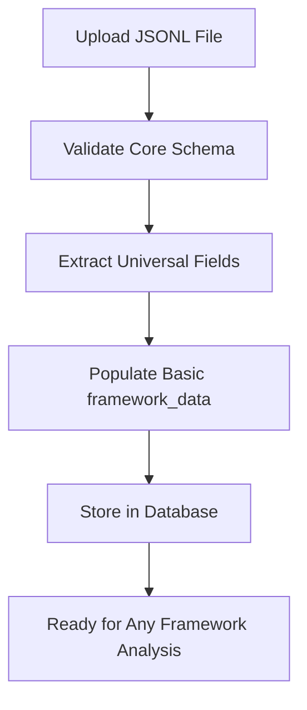
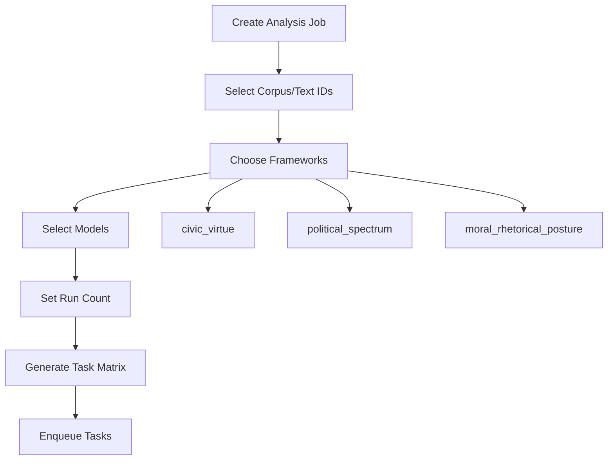
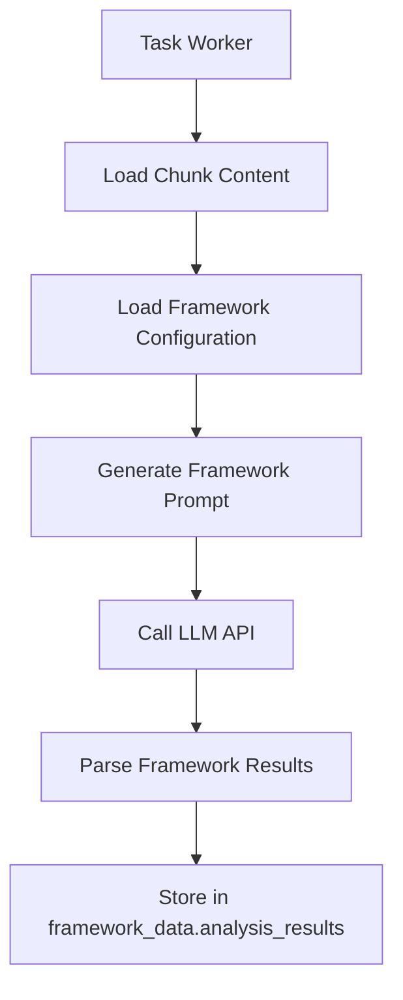

# Framework Architecture Documentation

## Overview

The Narrative Gravity Analysis system implements a **framework-agnostic ingestion with runtime framework selection** architecture. This design enables:

- **Universal corpus ingestion** that works with any framework
- **Cross-framework comparative analysis** on the same texts
- **Flexible framework evolution** without requiring corpus re-ingestion
- **Scalable processing** with multiple frameworks running in parallel

## Architecture Principles

### 1. Universal Core + Framework Extensions

**Core Schema (`core_schema_v1.0.0.json`)**
- Universal document+chunk structure that ALL narratives conform to
- Framework-agnostic fields: text content, metadata, chunk structure
- `framework_data` field serves as extension point for framework-specific data

**Framework Extension Schemas**
- `cv_extension_v1.0.0.json` - Civic Virtue framework extensions
- `ps_extension_v1.0.0.json` - Political Spectrum framework extensions  
- `mrp_extension_v1.0.0.json` - Moral Rhetorical Posture framework extensions

### 2. Three-Stage Data Population Model

The `framework_data` field supports data population at different stages:

```json
{
  "framework_data": {
    "ingestion_metadata": {
      // Populated during corpus upload
      "pre_analysis_tags": ["political_speech", "moral_argument"],
      "language_complexity": "moderate",
      "content_type": "narrative"
    },
    "preprocessing_markers": {
      // Populated during ingestion processing
      "dignity_markers": ["individual worth", "human rights"],
      "truth_indicators": ["evidence shows", "data indicates"]
    },
    "analysis_results": {
      // Populated during framework analysis
      "civic_virtue": {
        "well_scores": {"dignity": 0.85, "truth": 0.72},
        "narrative_position": {"x": 0.34, "y": 0.67},
        "civic_metrics": {"narrative_polarity_score": 0.73}
      },
      "political_spectrum": {
        "well_scores": {"liberal": 0.78, "conservative": 0.23},
        "political_metrics": {"left_right_position": -0.65}
      }
    }
  }
}
```

## Framework Selection Workflow

### 1. Corpus Ingestion (Framework-Agnostic)



**Process:**
- Upload validates against `core_schema_v1.0.0.json` only
- Universal fields extracted (text_id, content, metadata)
- Optional `ingestion_metadata` and `preprocessing_markers` populated
- Corpus becomes available for analysis by ANY framework

### 2. Job Creation (Runtime Framework Selection)



**Job Creation Parameters:**
```json
{
  "corpus_id": 123,
  "text_ids": ["speech_001", "speech_002"],
  "frameworks": ["civic_virtue", "political_spectrum"],
  "models": ["gpt-4", "claude-3"],
  "run_count": 3
}
```

**Task Generation:**
- **Total Tasks** = chunks × frameworks × models × runs
- Each task processes one chunk with one framework using one model
- Enables cross-framework comparison on identical content

### 3. Task Processing (Framework-Specific Analysis)



**Framework-Specific Processing:**
- Worker loads framework configuration (wells, prompts, weights)
- Generates framework-specific prompts for LLM analysis
- Parses results according to framework schema
- Stores results under framework key in `analysis_results`

## Cross-Framework Analysis Capabilities

### 1. Same Text, Multiple Frameworks

A single presidential speech can be analyzed by all three frameworks:

```json
{
  "text_id": "obama_inaugural_2009",
  "framework_data": {
    "analysis_results": {
      "civic_virtue": {
        "well_scores": {"dignity": 0.89, "hope": 0.82, "pragmatism": 0.75},
        "civic_elevation": 0.78
      },
      "political_spectrum": {
        "well_scores": {"progressive": 0.72, "solidarity": 0.68},
        "left_right_position": -0.45
      },
      "moral_rhetorical_posture": {
        "well_scores": {"restorative": 0.85, "universalist": 0.79},
        "primary_posture": "healer"
      }
    }
  }
}
```

### 2. Comparative Analysis Queries

The architecture enables powerful comparative queries:

```sql
-- Compare civic virtue vs political spectrum positioning
SELECT 
    text_id,
    framework_data->'analysis_results'->'civic_virtue'->>'civic_elevation' as civic_score,
    framework_data->'analysis_results'->'political_spectrum'->>'left_right_position' as political_score
FROM chunks 
WHERE framework_data->'analysis_results' ? 'civic_virtue' 
  AND framework_data->'analysis_results' ? 'political_spectrum';
```

### 3. Framework Agreement Analysis

Measure how different frameworks assess the same content:

```python
# Framework correlation analysis
def analyze_framework_agreement(chunks):
    civic_scores = [c.civic_virtue.dignity for c in chunks]
    political_scores = [c.political_spectrum.progressive for c in chunks]
    return correlation(civic_scores, political_scores)
```

## Available Frameworks

### 1. Civic Virtue Framework
- **Purpose**: Moral analysis of political discourse
- **Dimensions**: 5 dipoles, 10 wells (Dignity↔Tribalism, Truth↔Manipulation, etc.)
- **Metrics**: Civic elevation, narrative polarity, directional purity
- **Use Case**: Assessing moral character of political narratives

### 2. Political Spectrum Framework  
- **Purpose**: Traditional political positioning
- **Dimensions**: Liberal, Conservative, Libertarian, Authoritarian orientations
- **Metrics**: Left-right position, authority orientation, ideological consistency
- **Use Case**: Political ideology classification and comparison

### 3. Moral Rhetorical Posture Framework
- **Purpose**: Communication style and moral stance analysis
- **Dimensions**: Restorative↔Retributive, Universalist↔Partisan, etc.
- **Metrics**: Justice orientation, moral scope, epistemic stance
- **Use Case**: Rhetorical strategy and moral posture assessment

## Framework Development Guidelines

### Adding New Frameworks

1. **Create Framework Configuration**
   ```json
   // frameworks/new_framework/framework.json
   {
     "framework_name": "new_framework",
     "version": "v1.0.0",
     "wells": { /* framework wells */ },
     "metrics": { /* framework metrics */ }
   }
   ```

2. **Create Extension Schema**
   ```json
   // schemas/new_extension_v1.0.0.json
   {
     "properties": {
       "analysis_results": {
         "properties": {
           "well_scores": { /* framework wells */ },
           "framework_metrics": { /* specific metrics */ }
         }
       }
     }
   }
   ```

3. **Implement Analysis Logic**
   ```python
   # src/tasks/analysis_tasks.py
   def analyze_new_framework(text_content, model):
       # Framework-specific analysis
       return results, cost
   ```

4. **Update Framework Registry**
   ```python
   # src/api/schemas.py
   SUPPORTED_FRAMEWORKS = [
       'civic_virtue', 
       'political_spectrum', 
       'moral_rhetorical_posture',
       'new_framework'  # Add here
   ]
   ```

## Benefits of This Architecture

### 1. **Flexibility**
- Any framework can analyze any corpus
- New frameworks work with existing data
- Framework evolution doesn't break existing corpora

### 2. **Comparative Analysis**
- Cross-framework studies on identical texts
- Framework agreement/disagreement analysis
- Multi-dimensional narrative positioning

### 3. **Scalability**
- Parallel processing across frameworks
- Independent framework development
- Modular system architecture

### 4. **Academic Rigor**
- Consistent data structures across frameworks
- Reproducible analysis with version tracking
- Framework-specific validation and confidence scoring

### 5. **Cost Efficiency**
- Single corpus ingestion for multiple frameworks
- Selective framework application based on research needs
- Efficient cross-framework comparison without re-processing

## Future Enhancements

### 1. Framework Recommendation Engine
- Suggest optimal frameworks based on content type
- Confidence scoring for framework suitability
- Automatic framework selection for broad analysis

### 2. Meta-Framework Analysis
- Compare framework results across multiple dimensions
- Identify framework consensus and divergence patterns
- Develop framework-agnostic narrative metrics

### 3. Dynamic Framework Loading
- Runtime framework registration
- Plugin-based framework architecture
- User-defined custom frameworks

This architecture positions the Narrative Gravity Analysis system as a flexible, scalable platform for multi-dimensional narrative analysis across diverse theoretical frameworks. 