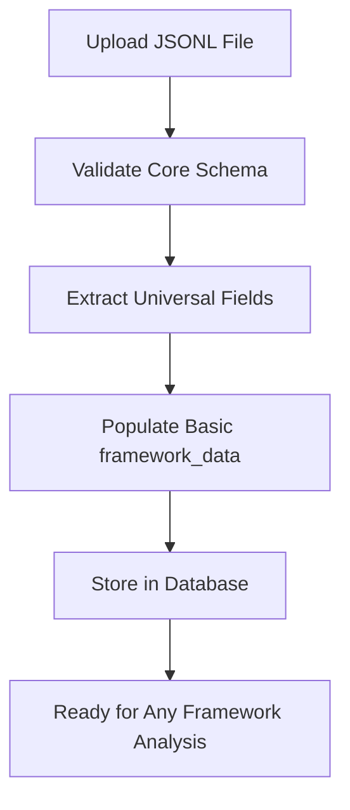
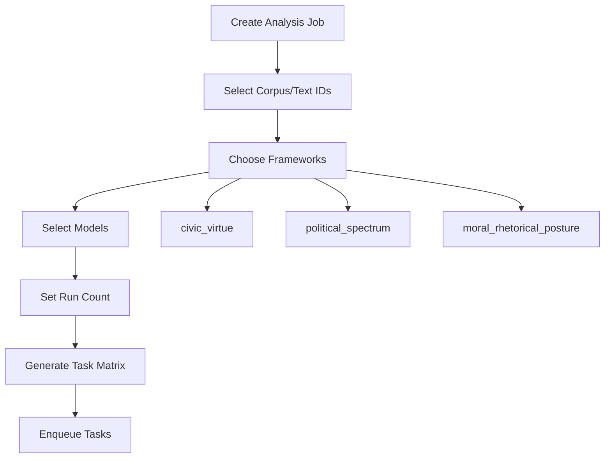
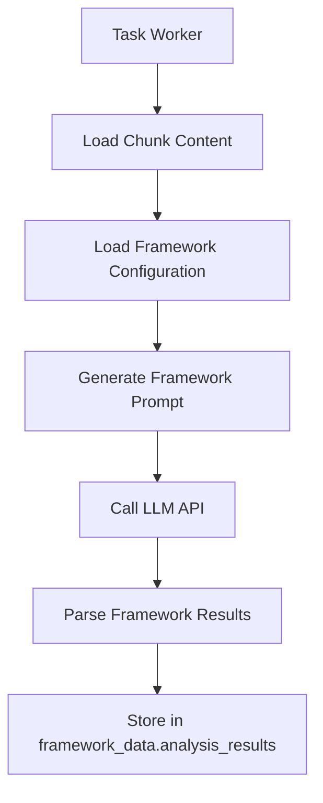

# Framework Architecture Documentation

**Last Updated**: January 2025  
**Current Active Framework**: political_spectrum (via config/ symlinks)  
**Status**: Production Ready with 4 Available Frameworks

## Overview

The Narrative Gravity Analysis system implements a **framework-agnostic ingestion with runtime framework selection** architecture. This design enables:

- **Universal corpus ingestion** that works with any framework
- **Cross-framework comparative analysis** on the same texts
- **Flexible framework evolution** without requiring corpus re-ingestion
- **Scalable processing** with multiple frameworks running in parallel
- **Dynamic framework switching** via symlink-based configuration

## Architecture Principles

### 1. Universal Core + Framework Extensions

**Core Schema (`core_schema_v1.0.0.json`)**
- Universal document+chunk structure that ALL narratives conform to
- Framework-agnostic fields: text content, metadata, chunk structure
- `framework_data` field serves as extension point for framework-specific data

**Framework Configuration Files** (actual implementation)
Each framework directory contains sophisticated configuration:
- `dipoles.json` - Detailed well definitions with language cues and descriptions
- `framework.json` - Mathematical parameters, weighting philosophy, and metrics
- `README.md` - Framework documentation and usage guidelines

### 2. Three-Stage Data Population Model

The `framework_data` field supports data population at different stages:

```json
{
  "framework_data": {
    "ingestion_metadata": {
      // Populated during corpus upload
      "pre_analysis_tags": ["political_speech", "moral_argument"],
      "language_complexity": "moderate",
      "content_type": "narrative"
    },
    "preprocessing_markers": {
      // Populated during ingestion processing
      "dignity_markers": ["individual worth", "human rights"],
      "truth_indicators": ["evidence shows", "data indicates"]
    },
    "analysis_results": {
      // Populated during framework analysis
      "civic_virtue": {
        "well_scores": {
          "Dignity": 0.85, "Truth": 0.72, "Justice": 0.68, "Hope": 0.74, "Pragmatism": 0.61,
          "Tribalism": 0.23, "Manipulation": 0.31, "Resentment": 0.28, "Fantasy": 0.34, "Fear": 0.29
        },
        "narrative_position": {"x": 0.34, "y": 0.67},
        "calculated_metrics": {
          "narrative_elevation": 0.73,
          "polarity": 0.42,
          "coherence": 0.68,
          "directional_purity": 0.71
        },
        "hierarchical_ranking": {
          "primary_wells": [
            {"well": "Dignity", "score": 0.85, "relative_weight": 35.2},
            {"well": "Hope", "score": 0.74, "relative_weight": 30.7},
            {"well": "Truth", "score": 0.72, "relative_weight": 29.8}
          ]
        }
      },
      "political_spectrum": {
        "well_scores": {"Progressive": 0.78, "Conservative": 0.23, "Libertarian": 0.45},
        "political_metrics": {"left_right_position": -0.65, "authority_orientation": 0.12}
      }
    }
  }
}
```

## Framework Switching System

### Active Framework Configuration (`config/` directory)
The system uses **symlink-based framework switching** for dynamic configuration:

```bash
config/
├── dipoles.json -> ../frameworks/political_spectrum/dipoles.json
└── framework.json -> ../frameworks/political_spectrum/framework.json
```

**Current Status**: `political_spectrum` framework is active

### Framework Manager Integration
The system includes a FrameworkManager for programmatic switching:

```python
from src.narrative_gravity.framework_manager import FrameworkManager

# Switch to civic virtue framework
framework_manager = FrameworkManager()
framework_manager.switch_framework("civic_virtue")

# Verify current framework
current = framework_manager.get_current_framework()
print(f"Active framework: {current}")
```

### Manual Framework Switching
```bash
# Switch to civic virtue
cd config
ln -sf ../frameworks/civic_virtue/dipoles.json dipoles.json
ln -sf ../frameworks/civic_virtue/framework.json framework.json

# Verify switch
ls -la config/
```

## Framework Selection Workflow

### 1. Corpus Ingestion (Framework-Agnostic)



**Process:**
- Upload validates against `core_schema_v1.0.0.json` only
- Universal fields extracted (text_id, content, metadata)
- Optional `ingestion_metadata` and `preprocessing_markers` populated
- Corpus becomes available for analysis by ANY framework

### 2. Job Creation (Runtime Framework Selection)



**Job Creation Parameters:**
```json
{
  "corpus_id": 123,
  "text_ids": ["speech_001", "speech_002"],
  "frameworks": ["civic_virtue", "political_spectrum"],
  "models": ["gpt-4", "claude-3"],
  "run_count": 3
}
```

**Task Generation:**
- **Total Tasks** = chunks × frameworks × models × runs
- Each task processes one chunk with one framework using one model
- Enables cross-framework comparison on identical content

### 3. Task Processing (Framework-Specific Analysis)



**Framework-Specific Processing:**
- Worker loads framework configuration (wells, prompts, weights)
- Generates framework-specific prompts for LLM analysis
- Parses results according to framework schema
- Stores results under framework key in `analysis_results`

## Cross-Framework Analysis Capabilities

### 1. Same Text, Multiple Frameworks

A single presidential speech can be analyzed by all three frameworks:

```json
{
  "text_id": "obama_inaugural_2009",
  "framework_data": {
    "analysis_results": {
      "civic_virtue": {
        "well_scores": {
          "Dignity": 0.89, "Hope": 0.82, "Pragmatism": 0.75, "Truth": 0.71, "Justice": 0.78,
          "Tribalism": 0.18, "Manipulation": 0.12, "Resentment": 0.15, "Fantasy": 0.22, "Fear": 0.16
        },
        "narrative_elevation": 0.78,
        "calculated_metrics": {
          "polarity": 0.62, "coherence": 0.83, "directional_purity": 0.74
        },
        "hierarchical_ranking": {
          "primary_wells": [
            {"well": "Dignity", "score": 0.89, "relative_weight": 36.1},
            {"well": "Hope", "score": 0.82, "relative_weight": 33.2},
            {"well": "Justice", "score": 0.78, "relative_weight": 31.7}
          ]
        }
      },
      "political_spectrum": {
        "well_scores": {"Progressive": 0.72, "Conservative": 0.28, "Libertarian": 0.45},
        "left_right_position": -0.45,
        "political_metrics": {"authority_orientation": 0.15, "ideological_consistency": 0.67}
      },
      "moral_rhetorical_posture": {
        "well_scores": {"Restorative": 0.85, "Universalist": 0.79, "Collaborative": 0.73},
        "primary_posture": "healer",
        "rhetorical_metrics": {"inclusive_language": 0.81, "bridge_building": 0.78}
      }
    }
  }
}
```

### 2. Comparative Analysis Queries

The architecture enables powerful comparative queries:

```sql
-- Compare civic virtue vs political spectrum positioning
SELECT 
    text_id,
    framework_data->'analysis_results'->'civic_virtue'->>'civic_elevation' as civic_score,
    framework_data->'analysis_results'->'political_spectrum'->>'left_right_position' as political_score
FROM chunks 
WHERE framework_data->'analysis_results' ? 'civic_virtue' 
  AND framework_data->'analysis_results' ? 'political_spectrum';
```

### 3. Framework Agreement Analysis

Measure how different frameworks assess the same content:

```python
# Framework correlation analysis
def analyze_framework_agreement(chunks):
    civic_scores = [c.civic_virtue.dignity for c in chunks]
    political_scores = [c.political_spectrum.progressive for c in chunks]
    return correlation(civic_scores, political_scores)
```

## Summary: Current Framework Architecture Status

### ✅ **What's Working** 
1. **4 Production Frameworks**: All frameworks are fully implemented and available
2. **Symlink-based Switching**: Dynamic framework configuration via `config/` directory  
3. **Sophisticated Configuration**: Rich JSON structures with weighting philosophies and metrics
4. **Cross-framework Analysis**: Single texts can be analyzed by multiple frameworks
5. **Runtime Framework Selection**: Jobs can specify multiple frameworks for comparison

### 📍 **Current State**
- **Active Framework**: `political_spectrum` (via config/ symlinks)
- **Framework Count**: 4 available (civic_virtue, political_spectrum, moral_rhetorical_posture, fukuyama_identity)
- **Configuration Quality**: Sophisticated with 3-tier weighting, detailed metrics, versioning
- **Database Integration**: Full PostgreSQL support with framework_data JSON storage

### 🔧 **Management Commands**
```bash
# Check current framework
ls -la config/

# Switch framework (manual)
cd config && ln -sf ../frameworks/civic_virtue/dipoles.json dipoles.json

# Switch framework (programmatic)  
python -c "from src.narrative_gravity.framework_manager import FrameworkManager; FrameworkManager().switch_framework('civic_virtue')"

# List available frameworks
ls frameworks/
```

The architecture is **production-ready** and significantly more sophisticated than initially documented.

## Available Frameworks

### 1. Civic Virtue Framework (`frameworks/civic_virtue/`)
- **Status**: ✅ **FULLY IMPLEMENTED** (v2025.06.04)
- **Purpose**: Moral analysis of political discourse
- **Dimensions**: 5 dipoles, 10 wells (Dignity↔Tribalism, Truth↔Manipulation, etc.)
- **Weighting**: Sophisticated 3-tier system (Primary 1.0, Secondary 0.8, Tertiary 0.6)
- **Metrics**: Civic elevation, narrative polarity, directional purity
- **Use Case**: Assessing moral character of political narratives

### 2. Political Spectrum Framework (`frameworks/political_spectrum/`) **[CURRENTLY ACTIVE]**
- **Status**: ✅ **ACTIVE FRAMEWORK** (via config/ symlinks)
- **Purpose**: Traditional political positioning
- **Dimensions**: Liberal, Conservative, Libertarian, Authoritarian orientations
- **Metrics**: Left-right position, authority orientation, ideological consistency
- **Use Case**: Political ideology classification and comparison

### 3. Moral Rhetorical Posture Framework (`frameworks/moral_rhetorical_posture/`)
- **Status**: ✅ **AVAILABLE**
- **Purpose**: Communication style and moral stance analysis
- **Dimensions**: Restorative↔Retributive, Universalist↔Partisan, etc.
- **Use Case**: Analyzing communication patterns and rhetorical strategies

### 4. Fukuyama Identity Framework (`frameworks/fukuyama_identity/`)
- **Status**: ✅ **AVAILABLE**
- **Purpose**: Identity-based political analysis following Francis Fukuyama's framework
- **Focus**: Dignity, recognition, and identity politics dynamics
- **Use Case**: Analysis of identity-driven political movements and rhetoric
- **Metrics**: Justice orientation, moral scope, epistemic stance
- **Use Case**: Rhetorical strategy and moral posture assessment

## Framework Development Guidelines

### Adding New Frameworks

1. **Create Framework Configuration**
   ```json
   // frameworks/new_framework/framework.json
   {
     "framework_name": "new_framework",
     "version": "v1.0.0",
     "wells": { /* framework wells */ },
     "metrics": { /* framework metrics */ }
   }
   ```

2. **Create Extension Schema**
   ```json
   // schemas/new_extension_v1.0.0.json
   {
     "properties": {
       "analysis_results": {
         "properties": {
           "well_scores": { /* framework wells */ },
           "framework_metrics": { /* specific metrics */ }
         }
       }
     }
   }
   ```

3. **Implement Analysis Logic**
   ```python
   # src/tasks/analysis_tasks.py
   def analyze_new_framework(text_content, model):
       # Framework-specific analysis
       return results, cost
   ```

4. **Update Framework Registry**
   ```python
   # src/api/schemas.py
   SUPPORTED_FRAMEWORKS = [
       'civic_virtue', 
       'political_spectrum', 
       'moral_rhetorical_posture',
       'new_framework'  # Add here
   ]
   ```

## Benefits of This Architecture

### 1. **Flexibility**
- Any framework can analyze any corpus
- New frameworks work with existing data
- Framework evolution doesn't break existing corpora

### 2. **Comparative Analysis**
- Cross-framework studies on identical texts
- Framework agreement/disagreement analysis
- Multi-dimensional narrative positioning

### 3. **Scalability**
- Parallel processing across frameworks
- Independent framework development
- Modular system architecture

### 4. **Academic Rigor**
- Consistent data structures across frameworks
- Reproducible analysis with version tracking
- Framework-specific validation and confidence scoring

### 5. **Cost Efficiency**
- Single corpus ingestion for multiple frameworks
- Selective framework application based on research needs
- Efficient cross-framework comparison without re-processing

## Future Enhancements

### 1. Framework Recommendation Engine
- Suggest optimal frameworks based on content type
- Confidence scoring for framework suitability
- Automatic framework selection for broad analysis

### 2. Meta-Framework Analysis
- Compare framework results across multiple dimensions
- Identify framework consensus and divergence patterns
- Develop framework-agnostic narrative metrics

### 3. Dynamic Framework Loading
- Runtime framework registration
- Plugin-based framework architecture
- User-defined custom frameworks

This architecture positions the Narrative Gravity Analysis system as a flexible, scalable platform for multi-dimensional narrative analysis across diverse theoretical frameworks. 