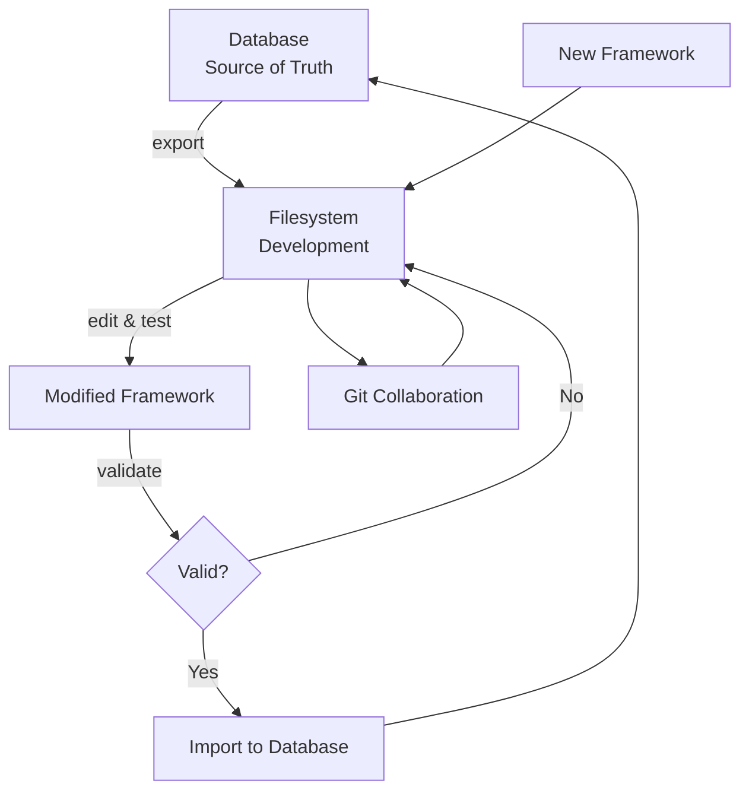

# Framework Source of Truth Architecture

**Database = Source of Truth | Filesystem = Development Workspace**

## Problem Statement

Previously, frameworks existed in two places without clear authority:
- **Database**: Used by application, versioned, with metadata
- **Filesystem**: Used for development, manual editing, git tracking

This dual-source situation created:
- ❌ **Drift**: Files and database getting out of sync
- ❌ **Confusion**: Unclear which version is "correct"
- ❌ **Manual overhead**: Humans forgetting to sync both places
- ❌ **Development friction**: Unclear workflow for changes
- ❌ **Deployment issues**: Which source gets deployed?

## Solution: Database-First Architecture

### Database as Single Source of Truth

**Why Database-First:**
- ✅ **Versioning**: Built-in version control with timestamps and provenance
- ✅ **Integration**: Already connected to analysis pipeline
- ✅ **Consistency**: Single source used by all application components
- ✅ **Backup/Recovery**: Part of database backup strategy
- ✅ **Concurrent access**: Multiple developers can work safely
- ✅ **Validation**: Schema enforcement and consistency checks
- ✅ **Metadata**: Rich metadata (creator, validation status, usage stats)

### Filesystem as Development Workspace

**Filesystem Role:**
- 🔧 **Development workspace**: Edit and test new framework versions
- 🔧 **Import/Export**: Tools to sync with database when ready
- 🔧 **Version control**: Git tracks development history and collaboration
- 🔧 **Documentation**: README files and development notes
- 🔧 **Validation**: Test frameworks before importing to database

## Workflow Patterns

### 1. Creating New Framework

```bash
# 1. Create framework files in filesystem
mkdir frameworks/new_framework
cd frameworks/new_framework

# 2. Create framework files
# - framework.json (main configuration)
# - dipoles.json (dipole definitions)
# - weights.json (mathematical weights)

# 3. Validate framework files
python scripts/framework_sync.py validate new_framework

# 4. Import to database (becomes source of truth)
python scripts/framework_sync.py import new_framework
```

### 2. Modifying Existing Framework

```bash
# 1. Export current version from database to filesystem
python scripts/framework_sync.py export existing_framework

# 2. Edit files in filesystem
# - Make changes to framework.json, dipoles.json, weights.json
# - Update version number
# - Document changes in development notes

# 3. Validate changes
python scripts/framework_sync.py validate existing_framework

# 4. Import new version to database
python scripts/framework_sync.py import existing_framework
```

### 3. Checking Sync Status

```bash
# Show sync status between filesystem and database
python scripts/framework_sync.py status
```

### 4. Framework Development Cycle



## Framework Sync Tool

The `scripts/framework_sync.py` tool manages the relationship between filesystem and database:

### Commands

```bash
# Show synchronization status
python scripts/framework_sync.py status

# Export framework from database to filesystem
python scripts/framework_sync.py export framework_name [--version v1.0]

# Import framework from filesystem to database
python scripts/framework_sync.py import framework_name [--force]

# Validate framework files in filesystem
python scripts/framework_sync.py validate framework_name

# Migrate all frameworks to v2.0 specification
python scripts/framework_sync.py migrate-all
```

### Status Output Example

```
🔄 Framework Synchronization Status
==================================================

📁 Filesystem: 5 frameworks
🗄️  Database: 5 framework versions

📁 Filesystem Frameworks (Development Workspace):
   📄 civic_virtue:v2025.06.04 (hash:3bdb3d40, modified:2025-06-12 18:00)
   📄 political_spectrum:v2025.06.04 (hash:befcd111, modified:2025-06-12 17:29)

🗄️  Database Frameworks (Source of Truth):
   ✅ civic_virtue:v2025.06.04 (validated, created:2025-06-12 14:48)
   ⚪ political_spectrum:v2025.06.04 (draft, created:2025-06-12 14:49)

🔍 Sync Analysis:
   ✅ All frameworks are in sync!
```

## Database Schema

Frameworks are stored in the `framework_versions` table with complete metadata:

```sql
CREATE TABLE framework_versions (
    id VARCHAR(36) PRIMARY KEY,
    framework_name VARCHAR(100) NOT NULL,
    version VARCHAR(20) NOT NULL,
    dipoles_json JSON NOT NULL,
    framework_json JSON NOT NULL,
    weights_json JSON NOT NULL,
    description TEXT,
    theoretical_foundation TEXT,
    created_by INTEGER REFERENCES user(id),
    created_at TIMESTAMP DEFAULT NOW(),
    parent_version_id VARCHAR(36) REFERENCES framework_versions(id),
    usage_count INTEGER DEFAULT 0,
    validation_status VARCHAR(20) DEFAULT 'draft',
    UNIQUE(framework_name, version)
);
```

## Validation Statuses

- **draft**: Newly created, not yet tested
- **tested**: Has been used in analysis runs
- **validated**: Passed formal validation (v2.0 spec compliance)
- **deprecated**: Superseded by newer version

## Best Practices

### Development Workflow

1. **Always check sync status** before starting work
2. **Export before editing** existing frameworks
3. **Validate before importing** new versions
4. **Use descriptive version numbers** (semantic versioning)
5. **Document changes** in framework description
6. **Test frameworks** before marking as validated

### Version Management

- **Semantic versioning**: `v1.0`, `v1.1`, `v2.0`
- **Date-based versioning**: `v2025.06.12` for major updates
- **Increment minor versions** for small changes
- **Increment major versions** for breaking changes

### Collaboration

- **Git tracks filesystem changes** for collaboration
- **Database provides deployment consistency**
- **Use branches** for experimental framework development
- **Merge to main** only after validation

## Migration Strategy

### Phase 1: Establish Database Authority ✅ **COMPLETED**
- ✅ Create framework sync tool
- ✅ Populate database with existing frameworks
- ✅ Establish clear workflow documentation

### Phase 2: Migrate to v2.0 Specification ✅ **COMPLETED** (June 2025)
- ✅ **All 5 frameworks migrated** to v2.0 spec (v2025.06.14)
- ✅ **Validation system updated** to v2.0 schema (framework_name field)
- ✅ **Color optimization implemented** with WCAG AA compliance
- ✅ **Database synchronization** fully operational
- ✅ **Quality assurance integration** with 6-layer validation system

### Phase 3: Enhanced Framework Standards ✅ **PARTIALLY COMPLETED**
- ✅ **Academic accessibility standards** (WCAG AA compliance)
- ✅ **Production validation pipeline** operational
- ✅ **Color optimization workflow** established
- 🔄 **Community contribution guidelines** (planned)
- 🔄 **Framework lifecycle management** (in development)

## Enhanced Workflow Patterns

### 5. Color Optimization Workflow ✅ **NEW**

```bash
# 1. Optimize framework colors for accessibility and academic standards
python scripts/optimize_framework_colors.py --dry-run  # Preview changes
python scripts/optimize_framework_colors.py           # Apply optimizations

# 2. Update version numbers to reflect color changes
# (automatically handled by optimization script)

# 3. Synchronize to database
python scripts/framework_sync.py migrate-all

# 4. Verify accessibility compliance
python scripts/framework_sync.py validate framework_name
```

**Color Optimization Features:**
- **WCAG AA Compliance**: All colors pass 4.5:1 contrast ratio requirements
- **Academic Publication Ready**: Journal-compatible colors with grayscale print optimization
- **Framework-Specific Rationales**: Each framework has optimized color choices with theoretical justification
- **Consistency**: Coherent visual identity while maintaining framework distinctions

### 6. Quality-Assured Framework Development ✅ **NEW**

```bash
# 1. Create framework with quality validation
mkdir frameworks/new_framework
cd frameworks/new_framework

# 2. Develop framework files following v2.0 specification
# - framework.json (uses "framework_name" field, not "name")
# - dipoles.json, weights.json
# - Include accessibility-compliant colors

# 3. Comprehensive validation
python scripts/framework_sync.py validate new_framework  # v2.0 schema validation
python scripts/optimize_framework_colors.py --report-only # Color accessibility check

# 4. Import with quality assurance
python scripts/framework_sync.py import new_framework
```

**Quality Standards:**
- **v2.0 Schema Compliance**: Proper framework_name field and structure
- **Color Accessibility**: WCAG AA compliant color schemes
- **Academic Standards**: Publication-ready visualization requirements
- **Validation Pipeline**: 3-tier validation (Schema, Semantic, Academic)

## Framework Development Standards ✅ **ENHANCED**

### Academic Publication Requirements

**Color Accessibility Standards:**
- **WCAG AA Compliance**: 4.5:1 contrast ratio minimum for all framework colors
- **Colorblind Compatibility**: Deuteranopia/Protanopia safe color choices
- **Grayscale Rendering**: Colors distinguishable when printed in black and white
- **Journal Compatibility**: Colors meet requirements for major academic journals

**Framework Color Assignments (Current Standards):**
- **civic_virtue**: Green/red (#2E7D32/#C62828) - classic virtue/vice clarity
- **political_spectrum**: Blue/red (#1565C0/#B71C1C) - improved accessibility over previous blue
- **fukuyama_identity**: Teal/red (#00695C/#C62828) - identity distinction from civic virtue
- **mft_persuasive_force**: Green/red (#2E7D32/#C62828) - maintains MFT theoretical foundations
- **moral_rhetorical_posture**: Purple/red (#4A148C/#C62828) - rhetorical distinction

### Version Management ✅ **UPDATED**

- **Date-based versioning**: `v2025.06.14` for major updates (current standard)
- **Semantic versioning**: `v1.0`, `v1.1`, `v2.0` for logical increments
- **Color optimization versions**: New versions created when colors are optimized
- **Schema updates**: Version increments for structural changes

### Framework Structure Requirements ✅ **v2.0 SPECIFICATION**

**Required Fields (v2.0 Schema):**
```json
{
  "framework_name": "framework_name",        // NOT "name" (legacy)
  "display_name": "Framework Display Name",
  "version": "v2025.06.14",
  "description": "Framework description",
  "coordinate_system": { ... },
  "positioning_strategy": { ... },
  "wells": { ... },
  "well_type_colors": {                      // WCAG AA compliant
    "integrative": "#2E7D32",
    "disintegrative": "#C62828"
  },
  "theoretical_foundation": { ... },
  "compatibility": { ... },
  "last_modified": "2025-06-14T13:31:04.925899"
}
```

## Troubleshooting ✅ **UPDATED**

### Common Issues

**"Framework validation failed - missing 'name' field"**
```bash
# This error indicates legacy validation logic
# Framework should use "framework_name" not "name" (v2.0 spec)
# Check framework.json structure:
grep -n "framework_name\|\"name\"" frameworks/framework_name/framework.json
```

**"Color accessibility validation failed"**
```bash
# Run color optimization to fix accessibility issues
python scripts/optimize_framework_colors.py framework_name
```

**"Framework version conflicts after color optimization"**
```bash
# Color optimization automatically updates version numbers
# Check sync status and migrate if needed
python scripts/framework_sync.py status
python scripts/framework_sync.py import framework_name --force
```

**"Schema validation failed"**
```bash
# Ensure framework follows v2.0 specification
python scripts/framework_sync.py validate framework_name

# Use migration tool if needed
python scripts/migrate_frameworks_to_v2.py framework_name
```

## Current Framework Status ✅ **JUNE 2025**

### Production Frameworks (All v2025.06.14)
- ✅ **civic_virtue**: WCAG AA compliant, v2.0 schema, fully operational
- ✅ **political_spectrum**: WCAG AA compliant, v2.0 schema, fully operational  
- ✅ **fukuyama_identity**: WCAG AA compliant, v2.0 schema, fully operational
- ✅ **mft_persuasive_force**: WCAG AA compliant, v2.0 schema, fully operational
- ✅ **moral_rhetorical_posture**: WCAG AA compliant, v2.0 schema, fully operational

### Infrastructure Status
- ✅ **Database Synchronization**: All frameworks synced to v2025.06.14
- ✅ **Validation System**: Updated for v2.0 schema compliance
- ✅ **Color Optimization**: WCAG AA accessibility compliance achieved
- ✅ **Quality Assurance**: 6-layer validation system integrated
- ✅ **Academic Standards**: Publication-ready visualization requirements met

## Integration Points

### Application Usage

```python
# CORRECT: Load from database (source of truth)
from narrative_gravity.models.component_models import FrameworkVersion

session = Session()
framework = session.query(FrameworkVersion).filter_by(
    framework_name="civic_virtue",
    validation_status="validated"
).order_by(FrameworkVersion.created_at.desc()).first()

# DEPRECATED: Direct filesystem loading
# with open('frameworks/civic_virtue/framework.json') as f:
#     framework = json.load(f)
```

### Analysis Pipeline

The analysis pipeline automatically uses the latest validated framework version from the database, ensuring consistency across all runs.

### API Endpoints

Framework management API endpoints use database as source:
- `GET /api/frameworks` - List all framework versions
- `GET /api/frameworks/{name}/latest` - Get latest version
- `POST /api/frameworks/{name}/validate` - Validate framework

---

This architecture ensures **consistency**, **traceability**, and **collaboration** while maintaining **development flexibility**. 