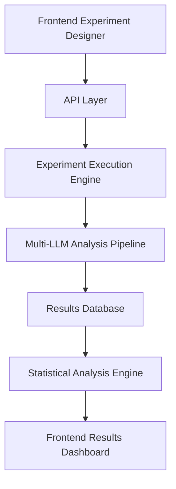

# User Stories: Narrative Gravity Wells v2.1 - Consolidated View

## Current Implementation Status (January 2025)

**✅ COMPLETED Infrastructure:**
- Backend services with multi-LLM integration (181/182 tests passing)
- PostgreSQL database with enhanced schema for v2.1
- React frontend research workbench (fully functional standalone)
- Comprehensive testing infrastructure

**🔴 CRITICAL BLOCKER:**
- Backend API integration between frontend and existing analysis engine
- Missing API endpoints for experiments, runs, and configuration data

**📋 PROJECT PHASE:** Moving from infrastructure completion to validation-first development

---

## Primary User Personas (Priority Order)

### 1. **Project Founder** (YOU) - Independent Research Author
**Current Need:** LLM validation workbench for systematic evidence generation and academic confidence building
**Priority:** Immediate - critical for validation-first development phase

**Core Workflow:** Comprehensive 15-step validation experimentation cycle:
- **Phase 1:** Experiment Design (text corpus, framework variants, prompt templates, LLM configurations)
- **Phase 2:** Execution & Monitoring (batch processing, framework fit assessment, real-time progress)
- **Phase 3:** Deep Analysis (cross-LLM consensus, evidence passages, metadata patterns)
- **Phase 4:** Evidence Synthesis (confidence assessment, academic export, methodology documentation)

**Recent Infrastructure Additions:**
- Complete paper development system (`paper/` directory with version control and validation checking)
- Detailed requirements specification for LLM validation workbench (see `docs/development/LLM_VALIDATION_WORKBENCH_REQUIREMENTS.md`)
- Clear validation sequence: Build LLM confidence first, then validate LLM against human judgment

### 2. **Dr. Sarah Chen** - Validation Researcher  
**Current Need:** Co-author rigorous academic validation studies
**Priority:** Phase 2 - critical for publication credibility

### 3. **Dr. Elena Vasquez** - Framework Developer
**Current Need:** Research workbench for framework experimentation
**Priority:** Phase 2 - enables platform extensibility  

### 4. **Marcus Rodriguez** - Media Analyst
**Current Need:** Fast, credible analysis tools for journalism
**Priority:** Phase 3 - public platform deployment

### 5. **Jessica Park** - Casual User
**Current Need:** Simple interface for understanding political rhetoric  
**Priority:** Phase 3 - broader adoption

---

## Epic 1: LLM Validation Workbench (v2.1 Phase 1) 🔴 IN PROGRESS

**Development Strategy:** Backend-first approach to ensure solid data structures and API services before frontend integration

### User Story 1.1: Multi-Variable LLM Validation Experiments
**As an** independent research author, **I want** to systematically construct experiments with multiple variables (texts + metadata, framework variants, prompt templates, LLM configurations, scoring methodologies), **so that** I can build confidence in the LLM-based approach through comprehensive validation evidence.

**Acceptance Criteria:**
- 🔴 **Backend API services** for experiment configuration (CRITICAL BLOCKER)
- 🔴 **Database schema** for multi-variable experiment storage (CRITICAL BLOCKER)  
- 🔴 **Experiment execution engine** with batch processing (CRITICAL BLOCKER)
- ✅ Frontend "Experiment Designer" interface (COMPLETED)
- 🟡 Framework fit assessment system (PLANNED)

**Current Status:** Frontend complete, backend development prioritized

### User Story 1.2: Framework Fit Assessment & Quality Gates
**As an** independent research author, **I want** the system to automatically detect when frameworks are inappropriate for texts (like analyzing Shakespeare sonnets for political content), **so that** I can trust my validation results and avoid meaningless analyses.

**Acceptance Criteria:**
- 🔴 **Automatic fit scoring** (0.0-1.0) with confidence metrics (CRITICAL BLOCKER)
- 🔴 **Threshold management** with configurable quality gates (CRITICAL BLOCKER)
- 🔴 **Alternative framework suggestions** when fit is poor (CRITICAL BLOCKER)
- 🟡 Fit explanation generation (PLANNED)
- 🟡 Historical fit performance tracking (PLANNED)

**Current Status:** Requirements defined, backend implementation needed

### User Story 1.3: Cross-LLM Consensus & Evidence Analysis
**As an** independent research author, **I want** to analyze cross-LLM consensus (target >0.90 correlation) with supporting evidence passages, **so that** I can build statistical confidence in the methodology before human validation studies.

**Acceptance Criteria:**
- 🔴 **Cross-LLM correlation analysis** with statistical significance testing (CRITICAL BLOCKER)
- 🔴 **Evidence passage extraction** and quality assessment (CRITICAL BLOCKER)
- 🔴 **Metadata pattern analysis** (temporal trends, speaker differences) (CRITICAL BLOCKER)
- ✅ Frontend comparison interface (COMPLETED)
- 🟡 Academic export formats (R, Python, CSV) (PLANNED)

**Current Status:** Frontend ready, backend statistical analysis engine needed

---

## Epic 2: Validation Infrastructure (Phase 2) 🟡 PLANNED

### User Story 2.1: Expert Validation Studies
**As the** project founder, **I want** to coordinate expert validation studies comparing LLM outputs to human annotations, **so that** I can establish academic credibility before publication.

**Acceptance Criteria:**
- 🟡 Expert annotation interface
- 🟡 Inter-rater reliability calculations
- 🟡 Human-machine alignment metrics
- 🟡 Validation study reporting tools

**Dependencies:** Completion of Epic 1 (Research Workbench)

### User Story 2.2: Academic Publication Support  
**As** Dr. Sarah Chen (validation researcher), **I want** to export complete replication packages with all versioned components, **so that** I can co-author methodologically rigorous papers.

**Acceptance Criteria:**
- 🟡 Academic format exports (CSV/JSON/R-compatible)
- 🟡 Replication package generation
- 🟡 Methodology documentation templates
- 🟡 Statistical significance testing

**Dependencies:** Validation studies completion

---

## Epic 3: Framework Extension Platform (Phase 2-3) 🟡 PLANNED

### User Story 3.1: Custom Framework Development
**As** Dr. Elena Vasquez (framework developer), **I want** a visual framework designer and testing harness, **so that** I can create domain-specific gravity well frameworks efficiently.

**Acceptance Criteria:**
- 🟡 Visual framework designer interface
- 🟡 JSON schema validation for custom frameworks
- 🟡 Multi-LLM testing harness for framework validation
- 🟡 Framework sharing and repository system

**Dependencies:** Research workbench completion

### User Story 3.2: Framework Fit Detection
**As a** researcher, **I want** the system to detect when narratives don't fit existing frameworks, **so that** I can identify when custom frameworks are needed.

**Acceptance Criteria:**
- 🟡 Framework fit scoring algorithm
- 🟡 Low-fit case analysis tools
- 🟡 New dimension suggestion system
- 🟡 Extended framework testing capabilities

**Dependencies:** Core analysis engine enhancement

---

## Epic 4: Public Platform (Phase 3) ⚪ FUTURE

### User Story 4.1: Journalist Quick Analysis
**As** Marcus Rodriguez (media analyst), **I want** to analyze political speeches within 30 minutes with embedded quotes and visualizations, **so that** I can publish data-backed analysis under tight deadlines.

**Acceptance Criteria:**
- ⚪ Public web interface with one-click analysis  
- ⚪ 30-minute end-to-end analysis pipeline
- ⚪ Automated quote extraction for high-scoring dimensions
- ⚪ Embeddable charts and attribution tools

**Dependencies:** Validation studies, academic credibility established

### User Story 4.2: Casual User Education
**As** Jessica Park (engaged citizen), **I want** to understand why political rhetoric feels persuasive, **so that** I can make informed decisions and discuss politics confidently.

**Acceptance Criteria:**
- ⚪ Mobile-friendly interface
- ⚪ Plain-English explanations (1-2 minute results)
- ⚪ Social media sharing capabilities
- ⚪ Educational tooltips and guides

**Dependencies:** Public platform infrastructure

---

## Cross-Cutting Technical Requirements

### API Integration (Immediate Priority)
```typescript
// Required API endpoints for v2.1 Phase 1
POST /api/experiments          // Create new experiment
GET  /api/experiments          // List experiments  
PUT  /api/experiments/:id      // Update experiment
POST /api/experiments/:id/run  // Execute experiment
GET  /api/runs                 // List analysis runs
GET  /api/configurations       // Framework/prompt/scoring configs
```

### Data Flow Requirements


---

## Implementation Roadmap

### Phase 1: Complete LLM Validation Workbench (3-4 weeks)
**Backend-First Development Strategy:**

1. **Week 1-2:** Data Structures & API Services
   - Implement comprehensive database schema for multi-variable experiments
   - Build core API endpoints for experiment configuration and execution
   - Create batch processing engine with LLM provider integration
   - Implement framework fit assessment algorithms

2. **Week 3:** Statistical Analysis Engine
   - Cross-LLM correlation analysis with significance testing
   - Evidence passage extraction and quality assessment
   - Metadata pattern analysis capabilities
   - Academic export functionality (R, Python, CSV)

3. **Week 4:** Frontend Integration & Testing
   - Connect existing frontend to completed backend services
   - End-to-end testing of complete validation workflows
   - Performance optimization and error handling
   - User acceptance testing of full validation cycle

### Phase 2: Validation Studies (4-6 weeks)  
1. **Weeks 3-4:** Expert validation infrastructure
2. **Weeks 5-6:** Academic publication support tools
3. **Weeks 7-8:** Framework extension capabilities

### Phase 3: Public Platform (Future)
- Timeline dependent on validation study results
- Academic credibility establishment required first

---

## Success Metrics by Phase

### Phase 1 Success (LLM Validation Workbench)
- [ ] **Multi-variable experiment construction** working end-to-end
- [ ] **Framework fit assessment** preventing inappropriate analyses (Shakespeare sonnet test case)
- [ ] **Cross-LLM consensus analysis** achieving >0.90 correlation targets
- [ ] **Evidence passage extraction** providing coherent supporting quotes
- [ ] **Metadata pattern analysis** detecting historical/speaker trends
- [ ] **Academic export formats** generating publication-ready datasets
- [ ] **Complete 15-step validation workflow** functioning as specified in user journey
- [ ] **Statistical confidence** enabling academic paper methodology claims

### Phase 2 Success (Validation)
- [ ] Expert validation studies completed with acceptable reliability
- [ ] Academic paper draft ready for submission
- [ ] Framework extension tools validated by researchers
- [ ] Replication packages generate successfully

### Phase 3 Success (Public Platform)  
- [ ] First 100 registered users completing analyses
- [ ] Media mentions or pilot newsroom integrations
- [ ] Positive usability feedback from non-technical users
- [ ] Platform sustainability demonstrated

---

## Risk Mitigation

### Technical Risks
- **Frontend-backend integration complexity:** Mitigated by comprehensive testing
- **LLM API reliability:** Mitigated by multi-provider fallback
- **Performance at scale:** Mitigated by incremental load testing

### Product Risks
- **Academic acceptance:** Mitigated by validation-first approach
- **User adoption:** Mitigated by persona-driven design
- **Commercial appropriation:** Mitigated by copyleft licensing strategy

---

*This consolidated view reflects the current state as of January 2025, with clear priorities focused on completing the research workbench (Phase 1) before advancing to validation studies (Phase 2) and eventual public deployment (Phase 3).* 