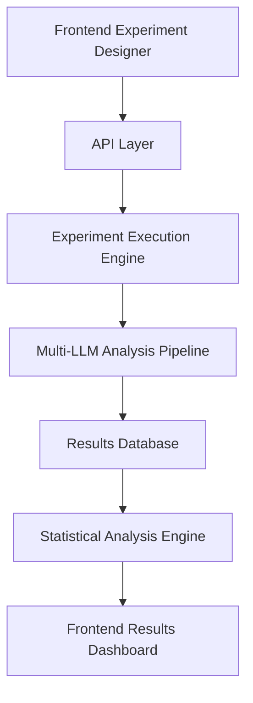

# User Stories: Narrative Gravity Wells v2.1 - Consolidated View

## Current Implementation Status (January 2025)

**✅ COMPLETED Infrastructure:**
- Backend services with multi-LLM integration (181/182 tests passing)
- PostgreSQL database with enhanced schema for v2.1
- React frontend research workbench (fully functional standalone)
- Comprehensive testing infrastructure

**🔴 CRITICAL BLOCKER:**
- Backend API integration between frontend and existing analysis engine
- Missing API endpoints for experiments, runs, and configuration data

**📋 PROJECT PHASE:** Moving from infrastructure completion to validation-first development

---

## Primary User Personas (Priority Order)

### 1. **Project Founder** (YOU) - Independent Research Author
**Current Need:** Paper development system for academic publication process
**Priority:** Immediate - critical for validation-first development phase

**Recent Infrastructure Addition:** Complete paper development system now available:
- Dedicated `paper/` directory with version control, evidence tracking, and workflow management
- Automated paper management tools for maintaining academic integrity standards
- Clear separation of technical validation (achieved) from human validation (required)
- Professional workflow supporting independent researcher publication goals

### 2. **Dr. Sarah Chen** - Validation Researcher  
**Current Need:** Co-author rigorous academic validation studies
**Priority:** Phase 2 - critical for publication credibility

### 3. **Dr. Elena Vasquez** - Framework Developer
**Current Need:** Research workbench for framework experimentation
**Priority:** Phase 2 - enables platform extensibility  

### 4. **Marcus Rodriguez** - Media Analyst
**Current Need:** Fast, credible analysis tools for journalism
**Priority:** Phase 3 - public platform deployment

### 5. **Jessica Park** - Casual User
**Current Need:** Simple interface for understanding political rhetoric  
**Priority:** Phase 3 - broader adoption

---

## Epic 1: Research Workbench (v2.1 Phase 1) 🔴 IN PROGRESS

### User Story 1.1: Unified Experiment Design
**As a** framework researcher, **I want** to design experiments that combine prompt templates, framework configurations, and scoring algorithms as unified testable hypotheses, **so that** I can systematically evaluate thematic hierarchy detection improvements.

**Acceptance Criteria:**
- ✅ Frontend "Experiment Designer" interface (COMPLETED)
- 🔴 Backend API endpoints for experiment creation (BLOCKER)
- 🔴 Experiment execution engine integration (BLOCKER)
- 🟡 Hypothesis bundling and comparison tools (PLANNED)

**Current Status:** Frontend complete, backend integration needed

### User Story 1.2: Research-Grade Version Control
**As a** framework developer, **I want** comprehensive provenance tracking for all experimental components, **so that** I can reproduce any analysis and understand performance changes.

**Acceptance Criteria:**
- ✅ Database schema for experiment lineage (COMPLETED)
- 🔴 API endpoints for version management (BLOCKER)
- 🔴 Provenance metadata in analysis results (BLOCKER)
- 🟡 Rollback and forking capabilities (PLANNED)

**Current Status:** Database ready, API integration needed

### User Story 1.3: Comparative Analysis Dashboard
**As a** researcher, **I want** to compare experimental results across multiple dimensions with statistical rigor, **so that** I can identify which changes improve thematic hierarchy detection.

**Acceptance Criteria:**
- ✅ Frontend comparison interface (COMPLETED)
- 🔴 Statistical comparison API endpoints (BLOCKER)
- 🔴 Hierarchy sharpness metrics calculation (BLOCKER)
- 🟡 Multi-dimensional filtering (PLANNED)

**Current Status:** Frontend ready, backend calculation engine needed

---

## Epic 2: Validation Infrastructure (Phase 2) 🟡 PLANNED

### User Story 2.1: Expert Validation Studies
**As the** project founder, **I want** to coordinate expert validation studies comparing LLM outputs to human annotations, **so that** I can establish academic credibility before publication.

**Acceptance Criteria:**
- 🟡 Expert annotation interface
- 🟡 Inter-rater reliability calculations
- 🟡 Human-machine alignment metrics
- 🟡 Validation study reporting tools

**Dependencies:** Completion of Epic 1 (Research Workbench)

### User Story 2.2: Academic Publication Support  
**As** Dr. Sarah Chen (validation researcher), **I want** to export complete replication packages with all versioned components, **so that** I can co-author methodologically rigorous papers.

**Acceptance Criteria:**
- 🟡 Academic format exports (CSV/JSON/R-compatible)
- 🟡 Replication package generation
- 🟡 Methodology documentation templates
- 🟡 Statistical significance testing

**Dependencies:** Validation studies completion

---

## Epic 3: Framework Extension Platform (Phase 2-3) 🟡 PLANNED

### User Story 3.1: Custom Framework Development
**As** Dr. Elena Vasquez (framework developer), **I want** a visual framework designer and testing harness, **so that** I can create domain-specific gravity well frameworks efficiently.

**Acceptance Criteria:**
- 🟡 Visual framework designer interface
- 🟡 JSON schema validation for custom frameworks
- 🟡 Multi-LLM testing harness for framework validation
- 🟡 Framework sharing and repository system

**Dependencies:** Research workbench completion

### User Story 3.2: Framework Fit Detection
**As a** researcher, **I want** the system to detect when narratives don't fit existing frameworks, **so that** I can identify when custom frameworks are needed.

**Acceptance Criteria:**
- 🟡 Framework fit scoring algorithm
- 🟡 Low-fit case analysis tools
- 🟡 New dimension suggestion system
- 🟡 Extended framework testing capabilities

**Dependencies:** Core analysis engine enhancement

---

## Epic 4: Public Platform (Phase 3) ⚪ FUTURE

### User Story 4.1: Journalist Quick Analysis
**As** Marcus Rodriguez (media analyst), **I want** to analyze political speeches within 30 minutes with embedded quotes and visualizations, **so that** I can publish data-backed analysis under tight deadlines.

**Acceptance Criteria:**
- ⚪ Public web interface with one-click analysis  
- ⚪ 30-minute end-to-end analysis pipeline
- ⚪ Automated quote extraction for high-scoring dimensions
- ⚪ Embeddable charts and attribution tools

**Dependencies:** Validation studies, academic credibility established

### User Story 4.2: Casual User Education
**As** Jessica Park (engaged citizen), **I want** to understand why political rhetoric feels persuasive, **so that** I can make informed decisions and discuss politics confidently.

**Acceptance Criteria:**
- ⚪ Mobile-friendly interface
- ⚪ Plain-English explanations (1-2 minute results)
- ⚪ Social media sharing capabilities
- ⚪ Educational tooltips and guides

**Dependencies:** Public platform infrastructure

---

## Cross-Cutting Technical Requirements

### API Integration (Immediate Priority)
```typescript
// Required API endpoints for v2.1 Phase 1
POST /api/experiments          // Create new experiment
GET  /api/experiments          // List experiments  
PUT  /api/experiments/:id      // Update experiment
POST /api/experiments/:id/run  // Execute experiment
GET  /api/runs                 // List analysis runs
GET  /api/configurations       // Framework/prompt/scoring configs
```

### Data Flow Requirements


---

## Implementation Roadmap

### Phase 1: Complete Research Workbench (1-2 weeks)
1. **Week 1:** Backend API integration
   - Create missing API endpoints
   - Connect frontend to real backend
   - Test experiment creation/execution flow

2. **Week 2:** Enhanced features
   - Real-time progress tracking
   - Advanced filtering and comparison
   - Error handling improvements

### Phase 2: Validation Studies (4-6 weeks)  
1. **Weeks 3-4:** Expert validation infrastructure
2. **Weeks 5-6:** Academic publication support tools
3. **Weeks 7-8:** Framework extension capabilities

### Phase 3: Public Platform (Future)
- Timeline dependent on validation study results
- Academic credibility establishment required first

---

## Success Metrics by Phase

### Phase 1 Success (Research Workbench)
- [ ] End-to-end experiment creation and execution working
- [ ] Statistical comparison tools functional
- [ ] Version control and provenance tracking operational
- [ ] All user workflows validated through automated testing

### Phase 2 Success (Validation)
- [ ] Expert validation studies completed with acceptable reliability
- [ ] Academic paper draft ready for submission
- [ ] Framework extension tools validated by researchers
- [ ] Replication packages generate successfully

### Phase 3 Success (Public Platform)  
- [ ] First 100 registered users completing analyses
- [ ] Media mentions or pilot newsroom integrations
- [ ] Positive usability feedback from non-technical users
- [ ] Platform sustainability demonstrated

---

## Risk Mitigation

### Technical Risks
- **Frontend-backend integration complexity:** Mitigated by comprehensive testing
- **LLM API reliability:** Mitigated by multi-provider fallback
- **Performance at scale:** Mitigated by incremental load testing

### Product Risks
- **Academic acceptance:** Mitigated by validation-first approach
- **User adoption:** Mitigated by persona-driven design
- **Commercial appropriation:** Mitigated by copyleft licensing strategy

---

*This consolidated view reflects the current state as of January 2025, with clear priorities focused on completing the research workbench (Phase 1) before advancing to validation studies (Phase 2) and eventual public deployment (Phase 3).* 