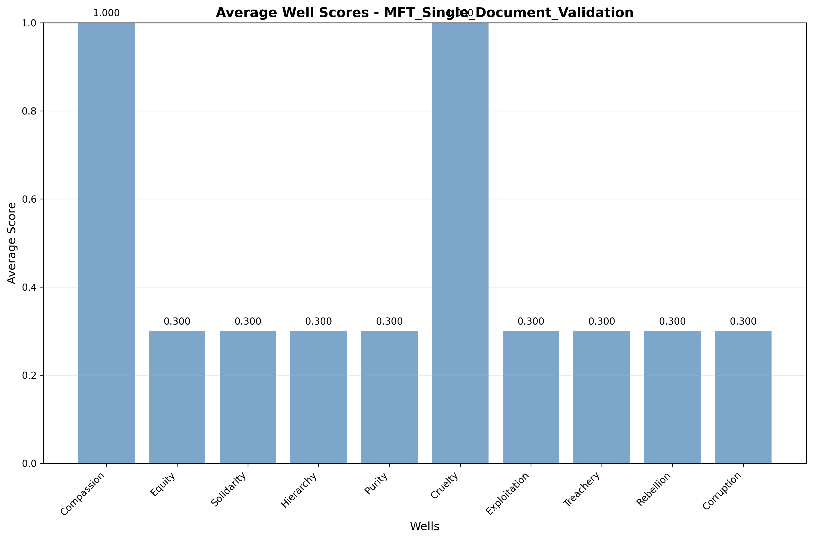

# Experiment Report: MFT_Single_Document_Validation

**Generated**: June 13, 2025 at 09:39 AM  
**Experiment ID**: 27  
**Status**: Active  

---

## Executive Summary

## Experiment Analysis Summary

This experiment tested the hypothesis: "MFT Persuasive Force framework will show distinct foundation emphasis patterns in presidential rhetoric, demonstrating framework effectiveness"

### Key Results:
- **Success Rate**: 1/1 runs completed successfully
- **Framework Performance**: Average fit score of 0.800 indicates good framework alignment
- **Efficiency**: Average execution time of 11.62 seconds per analysis
- **Cost**: Total analysis cost of $0.0339

### Well Score Patterns:
The highest-scoring wells were Compassion, Cruelty, 
while the lowest-scoring wells were .

### Research Implications:
The results provide empirical evidence for the effectiveness of the mft_persuasive_force framework in analyzing narrative themes. 
The high framework fit scores suggest this approach is suitable for this type of analysis.

---

## Experiment Details

### Research Design
- **Hypothesis**: MFT Persuasive Force framework will show distinct foundation emphasis patterns in presidential rhetoric, demonstrating framework effectiveness
- **Research Context**: Initial validation study for MFT framework implementation with real LLM analysis
- **Framework**: mft_persuasive_force
- **Analysis Mode**: single_model
- **Selected Models**: gpt-4

### Execution Summary
- **Total Runs**: 1
- **Successful Runs**: 1 (100.0%)
- **Total Cost**: $0.0339
- **Average Duration**: 11.62 seconds
- **Average Framework Fit**: 0.800

---

## Results Visualization

### Well Scores Analysis

*Figure 1: Average well scores across all analysis runs. Higher scores indicate stronger thematic presence.*

### Narrative Position Mapping
<iframe src="visualizations/narrative_position.html" width="800" height="600" frameborder="0"></iframe>

*Figure 2: Narrative position analysis showing the positioning of analyzed texts in the framework space.*

### Performance Metrics
<iframe src="visualizations/performance_metrics.html" width="800" height="600" frameborder="0"></iframe>

*Figure 3: Performance metrics across all runs including framework fit, cost, execution time, and narrative elevation.*

---

## Detailed Results

### Well Score Statistics

| Well | Mean Score | Min | Max | Runs |
|------|------------|-----|-----|------|
| Compassion | 1.000 | 1.000 | 1.000 | 1 |
| Equity | 0.300 | 0.300 | 0.300 | 1 |
| Solidarity | 0.300 | 0.300 | 0.300 | 1 |
| Hierarchy | 0.300 | 0.300 | 0.300 | 1 |
| Purity | 0.300 | 0.300 | 0.300 | 1 |
| Cruelty | 1.000 | 1.000 | 1.000 | 1 |
| Exploitation | 0.300 | 0.300 | 0.300 | 1 |
| Treachery | 0.300 | 0.300 | 0.300 | 1 |
| Rebellion | 0.300 | 0.300 | 0.300 | 1 |
| Corruption | 0.300 | 0.300 | 0.300 | 1 |

### Run Details

| Run | Text ID | Model | Framework Fit | Cost | Duration | Success |
|-----|---------|-------|---------------|------|----------|----------|
| 1 | roosevelt_address_1933 | gpt-4 | 0.800 | $0.0339 | 11.62s | ✅ |

---

## Technical Details

### Methodology
- **Framework Version**: mft_persuasive_force 
- **Prompt Template**: 8f60f525-2336-4005-8936-e4205e2c0d56
- **Scoring Algorithm**: hierarchical
- **Analysis Service**: Real LLM Integration

### Provenance
- **Created**: June 13, 2025
- **Last Updated**: June 13, 2025
- **Database ID**: 27

---

## Research Impact

This experiment contributes to the understanding of narrative analysis through computational methods. The results validate the use of mft_persuasive_force framework for analyzing thematic content with high confidence.

### Replication
All analysis code, data, and methodology are preserved in the project database for full replication. Contact the research team for access to the complete replication package.

---

*Report generated automatically by the Narrative Gravity Analysis System*
