# The Attesor Study: Strategic Overview & Methodological Framework
**Date**: January 12, 2025  
**Status**: Phase 1 Complete - Ready for Validation Testing  
**Project**: Cross-Linguistic Bias Mitigation in Computational Political Analysis

---

## Executive Summary

The **Attesor Study** addresses systematic speaker identity bias observed in Large Language Model (LLM) political analysis. Initial bias testing revealed consistent scoring variations based on speaker identification, prompting development of cross-linguistic methodology to eliminate identity-based analytical contamination.

**Findings**: LLMs exhibit systematic identity-driven bias even with minimal speaker identification cues. This study develops and tests Esperanto translation as a potential bias mitigation approach.

---

## Initial Findings: Speaker Identity Bias Effects

### Observed Phenomena
Systematic testing of the PDAF (Political Discourse Analysis Framework) revealed consistent scoring variations based on speaker identity knowledge. Identical political content received different analytical scores when speaker information was available versus anonymized conditions.

**Case Example**: Constitutional language analysis showed:
- **Anonymous condition**: Authenticity score of 1.7
- **Identity-aware condition**: Authenticity score of 0.3
- **Variance**: 1.4-point difference on 2.0 scale (70% variation)

### Scope Assessment
Preliminary testing indicates this bias pattern occurs across:
- Multiple LLM architectures (GPT-4, Claude, Gemini)
- Different analytical frameworks beyond PDAF
- Various content types (speeches, documents, social media)
- Minimal identity triggers (including filename-based identification)

### Research Implications
These findings suggest potential systematic bias in existing LLM-based political research, indicating need for methodological examination and possible bias mitigation strategies.

---

## Methodological Response: Attesor Study Framework

### Theoretical Approach
The study employs cross-linguistic methodology to test bias mitigation through translation. The hypothesis posits that Esperanto translation may eliminate LLM associations with English political discourse while maintaining analytical validity.

### Research Design
**Two-Phase Structure**:
1. **Bias Quantification**: Systematic measurement of identity bias effects across models and frameworks
2. **Mitigation Testing**: Cross-linguistic bias elimination effectiveness assessment

### Implementation Architecture
**Identity Protection Protocol**:
- **Hash-based file identification**: Cryptographic speaker identity protection
- **Content sanitization**: Systematic removal of identifying markers
- **Cross-linguistic translation**: Esperanto versions for bias comparison
- **Secure corpus management**: Controlled access to identity mapping

---

## Preliminary Findings: Methodological Observations

### 1. Identity Trigger Sensitivity
Minimal identity cues (including filename-based speaker identification) produce systematic analytical bias. Complete identity elimination appears necessary beyond content sanitization alone.

### 2. Framework Generalizability
Identity bias effects observed across multiple analytical frameworks, suggesting general rather than framework-specific phenomenon.

### 3. Confidence Metric Limitations
LLMs maintain high confidence scores while producing contradictory analyses based on identity knowledge, limiting confidence as bias detection mechanism.

### 4. Training Data Associations
LLMs appear to have established associative networks linking speaker identities to analytical expectations, suggesting technical rather than prompt-based mitigation approaches may be required.

### 5. Cross-Linguistic Potential
Esperanto's limited political discourse representation in LLM training data, combined with maintained expressive capacity, suggests potential for bias mitigation while preserving analytical validity.

### 6. Framework-Level Bias Contamination
Systematic review of PDAF v1.0 revealed embedded bias triggers including politician names, partisan language, and ideological markers that could independently contaminate analysis regardless of corpus sanitization. Framework sanitization (PDAF v1.1) represents critical methodological advancement beyond content-level bias mitigation.

### 7. Framework Optimization and Context Window Efficiency
Integration of calibration packet concepts into inline framework architecture achieved 85% context window reduction (212.5KB → 36KB, 3,440 lines → 505 lines) while enhancing analytical precision through comprehensive disambiguation features. This optimization eliminates external dependencies, reduces computational costs, and improves deployment reliability for large-scale multi-LLM analysis.

### 8. Scale Polarity Correction and Methodological Defensibility Enhancement
Systematic review revealed scale inversion in economic measurement creating systematic ideological bias where left-wing and right-wing populist discourse of equivalent intensity received different scores. Resolution through 10-anchor dual-track architecture separates populist intensity measurement from economic direction classification, eliminating bias while preserving descriptive richness. Additionally, removed weighted composite formulas from primary analysis, implementing transparent unweighted raw score collection with comprehensive post-hoc analysis guidance to ensure maximum methodological defensibility.

---

## How We're Responding: The Attesor Methodology

### Phase 1A: Content Infrastructure (COMPLETED ✅)
**Objective**: Create methodologically bulletproof corpus and framework

**Achievements**:
- **Expert-level content sanitization**: Dr. Morgan Chen methodology for identity removal
- **Master-level Esperanto translation**: Dr. Aleksander Volkov-Esperantisto approach
- **Secure file architecture**: Cryptographic hash-based identity protection
- **Complete corpus**: 8 speeches × 2 versions (sanitized + Esperanto) = 16 bias-free files
- **Framework sanitization**: PDAF v1.1 created with all bias triggers removed while preserving analytical capability
- **Bias trigger identification**: Systematic removal of politician names, partisan language, and ideological markers from analytical framework
- **Framework optimization**: Integrated calibration system with 85% context window reduction (212.5KB → 36KB) while enhancing analytical precision
- **Disambiguation architecture**: Comprehensive cross-ideological validation, boundary case distinctions, and false positive prevention across all anchors
- **Scale polarity correction**: Fixed systematic ideological bias in economic measurement through dual-track architecture
- **10-anchor expansion**: Added separate economic direction classification while maintaining unbiased populist intensity measurement
- **Methodological defensibility**: Removed weighted composites from primary analysis, implementing unweighted raw score collection with post-hoc options

### Phase 1B: Technical Infrastructure (80% COMPLETE 🔧)
**Objective**: Build multi-LLM analysis matrix capabilities required for bias testing

**Infrastructure Assessment**: Comprehensive review reveals Phase 1B is approximately **80% complete** using existing sophisticated infrastructure:

**✅ COMPLETED:**
- **Model provenance tracking**: Dynamic extraction with LiteLLMClient integration
- **Agent-based orchestration**: EnsembleOrchestrator with LLM-driven workflow selection
- **Multi-model support**: LiteLLMClient supports all required premium models
- **Session logging**: Complete chronolog integration with Redis coordination
- **Experiment structure**: Complete YAML configurations in experiment.md files
- **Corpus organization**: All 3 conditions (original, sanitized English, Esperanto) ready
- **Framework optimization**: PDAF v1.1 with 85% context reduction
- **Results architecture**: Documented structure for academic publication
- **Agent isolation**: Redis pubsub channels for bias isolation
- **Dynamic workflow selection**: LLM chooses RAW_AGGREGATION vs ADVERSARIAL_SYNTHESIS
- **Secure code execution**: SecureCodeExecutor for mathematical reliability
- **Academic provenance**: Complete audit trail capabilities

**🔧 REMAINING TASKS:**
- **Experiment YAML parsing**: Read model configurations from experiment.md files
- **Multi-run orchestration**: N runs for reliability testing (Cronbach's alpha)
- **Analysis matrix tracking**: Text×model×run dimensional organization
- **Statistical analysis pipeline**: Raw scores → academic metrics
- **Resource optimization**: LLM-driven TPM and cost management

**Required Architecture**:
```
ANALYSIS MATRIX REQUIREMENTS:
                 Model A        Model B        Model C
Text 1: Romney   [R1,R2,R3]    [R1,R2,R3]    [R1,R2,R3]
Text 2: McCain   [R1,R2,R3]    [R1,R2,R3]    [R1,R2,R3]  
Text 3: Lewis    [R1,R2,R3]    [R1,R2,R3]    [R1,R2,R3]
Text 4: Booker   [R1,R2,R3]    [R1,R2,R3]    [R1,R2,R3]
```

**THIN Engine Architecture Innovation**:

The solution employs a **THIN Engine Architecture** where LLMs function as intelligent "ECUs" (Engine Control Units) managing complex optimization decisions while software handles mechanical execution:

- **Pistons** = Individual LLM analyses 
- **Timing Chain** = Sequence coordination and dependency management
- **Fuel Injection** = Resource allocation (TPM, context windows, cost)
- **Exhaust System** = Output processing and cleanup
- **ECU** = LLM-based resource optimization agents

### Architectural Innovations for Methodological Rigor (Implemented January 14, 2025)

Following a series of deep smoke tests and mindful architectural reviews, the SOAR platform has been significantly enhanced to enforce greater methodological rigor and improve reliability. These innovations move the system closer to its goal of providing a truly robust, transparent, and user-friendly environment for computational social science.

#### 1. Comprehensive Pre-Execution Validation
The system now includes a multi-stage validation process that occurs *before* any analysis is run, preventing wasted computation on incoherent experiments:

*   **Coherence Validation**: A new `ValidationAgent` step ensures that the `experiment.md` and `framework.md` are logically connected. It uses an LLM auditor to confirm that the experiment explicitly references the correct framework and that its hypotheses are testable.
*   **Statistical Plan Validation**: The new `StatisticalAnalysisConfigurationAgent` parses the experiment to create a structured statistical plan. If the plan is ambiguous or incomplete, validation fails, forcing methodological clarity upfront.

#### 2. Interactive Pre-Execution Confirmation
To empower the researcher and ensure alignment, the CLI now presents a "Pre-Execution Confirmation" prompt after a successful validation. This summary details the full execution plan (framework, models, runs, statistical tests) and requires explicit user approval before proceeding, eliminating the risk of running an unintended or misconfigured experiment.

#### 3. Intelligent, Tiered Model Selection and Fallback
To improve reliability and move away from brittle, hardcoded model names, the system now features a more intelligent model selection architecture:

*   **`ModelRegistry`**: Serves as the central source of truth for all available models and their capabilities, including new `utility_tier` and `task_suitability` metadata.
*   **Task-Based Model Selection**: Agents no longer use hardcoded model names. Instead, they request a model from the `ModelRegistry` based on the *task* they need to perform (e.g., `validation`, `synthesis`, `code_generation`).
*   **Intelligent Fallback**: The `LLMGateway` now includes a robust retry-and-fallback loop. If a primary model fails with a transient error, the gateway automatically consults the `ModelRegistry` and retries the call with the next model in the fallback chain (e.g., from Claude Haiku to Gemini Flash to a local Ollama instance).

#### 4. Transparent Error Reporting
The system now distinguishes between user errors (e.g., an incoherent experimental design) and system errors (e.g., a transient API failure). When an external API fails, the CLI now transparently reports the raw error message and advises the user to retry, preventing them from mistakenly believing the fault lies in their own work.

#### 5. Comprehensive Master Chronolog
The logging system has been refactored to create a true, three-tier provenance record. All detailed, low-level events from a specific run are now merged back into the main `project_chronolog.jsonl`, creating a single, complete, and tamper-evident audit trail for the entire project lifecycle, as originally envisioned.

### Updated System Workflow

The following diagram illustrates the new, more robust and interactive workflow:

```mermaid
graph TD;
    A["User executes<br/>`soar execute`"] --> B(soar_cli.py);
    
    subgraph "Phase 1: Configuration & Validation"
        B --> C{EnsembleConfigurationAgent};
        C --> D[ModelRegistry];
        D -- "Provides model list" --> C;
        C -- "Generates config via" --> E(LLMGateway);
        C -- "Writes YAML to" --> F[experiment.md];
        
        B --> G{EnsembleOrchestrator};
        G -- "Reads" --> F;
        G --> H{StatisticalAnalysis<br/>ConfigurationAgent};
        H -- "Generates plan via" --> E;
        H -- "Validates Statistical Plan<br/>(FAIL FAST)" --> I{OK?};
    end

    subgraph "Phase 2: Core Analysis"
        I -- Yes --> G;
        I -- No --> X[Stop Execution];
        G -- "Spawns N×M" --> J[Analysis Agents];
        J -- "Analyze texts using" --> E;
    end

    subgraph "Phase 3: Synthesis & Reporting"
        G -- "Aggregates results and<br/>coordinates next steps via" --> E;
        G -- "Generates stats code via" --> E;
        E -- "Provides code for" --> K[SecureCodeExecutor];
        K -- "Calculates final metrics" --> L[Statistical Report];
        G -- "Generates" --> M[Final Report];
    end

    classDef knowledge fill:#f9f,stroke:#333,stroke-width:2px;
    classDef execution fill:#ccf,stroke:#333,stroke-width:2px;
    classDef security fill:#cFC,stroke:#333,stroke-width:2px;

    class D,F knowledge;
    class E execution;
    class K security;
```



**Agent-Based Implementation**:
```python
agents = {
    "configuration": ExperimentConfigurationAgent(),      # Parse experiment.md requirements
    "matrix_planner": AnalysisMatrixPlannerAgent(),      # Optimize execution matrix with cost analysis
    "execution_coordinator": MultiModelExecutionAgent(), # Coordinate model iteration with adaptive strategies  
    "failure_recovery": FailureRecoveryAgent(),          # Analyze failures and determine recovery strategies
    "matrix_tracker": MatrixTrackingAgent(),             # Organize results across matrix dimensions
    "statistical_analyst": StatisticalAnalysisAgent(),   # Perform cross-dimensional statistical analysis
    "resource_optimizer": ResourceOptimizationAgent()    # Real-time TPM, context, cost optimization
}
```

**Resource Management Intelligence**:
- **Expectation Setting**: LLM-driven realistic time estimates with best/expected/worst case scenarios
- **Dynamic Optimization**: Real-time resource allocation based on current conditions
- **Rate Limit Intelligence**: Adaptive recovery strategies (wait, switch models, reorder queue)
- **Context Window Optimization**: LLM-designed chunking strategies maintaining analytical integrity
- **Cost Optimization**: Model selection and batch sizing for budget efficiency

**Mathematical Reliability Architecture**:

Critical insight: LLMs cannot be trusted for statistical calculations required for academic publication. The solution employs **Hybrid Intelligence Architecture** where LLMs design approaches and interpret results while secure code execution performs calculations:

```python
# THIN Pattern: LLM designs, code executes, LLM interprets
class StatisticalAnalysisAgent:
    def __init__(self):
        self.code_executor = SecureCodeExecutor()  # From CARA implementation
        
    async def calculate_reliability_statistics(self, analysis_matrix):
        # LLM INTELLIGENCE: Design statistical approach
        calculation_design = await self.llm_client.call_llm(
            "Design Python code for Cronbach's alpha, cross-model variance, bias magnitude...",
            "statistical_designer"
        )
        
        # SECURE CODE EXECUTION: Perform calculations
        execution_result = await self.code_executor.execute_code(
            calculation_design, analysis_matrix
        )
        
        # LLM INTELLIGENCE: Interpret results for academic publication
        interpretation = await self.llm_client.call_llm(
            "Interpret statistical results for bias analysis...",
            "statistical_interpreter"
        )
        
        return {
            "calculations": execution_result,      # Peer-reviewable calculations
            "interpretation": interpretation,      # Academic meaning
            "code_audit": calculation_design      # Complete transparency
        }
```

**Secure Code Execution Features**:
- **Multi-layer security**: AST analysis, import whitelisting, resource limits
- **Academic libraries**: pandas, numpy, scipy, matplotlib, statistics
- **Sandbox isolation**: Subprocess execution with CPU/memory limits
- **Complete audit trail**: All code and results logged for experiment provenance
- **Academic transparency**: "Show your work" capability for peer review

**Revised Implementation Timeline (January 13, 2025)**:

**Previous Assessment**: "Months of development needed"  
**Current Assessment**: "Weeks of integration work needed"

**Key Finding**: Sophisticated infrastructure already exists in `/discernus/core`:
- **641 lines**: Project chronolog with tamper-evident logging
- **661 lines**: Agent infrastructure with THIN extension patterns  
- **563 lines**: Secure code execution with academic library support
- **456 lines**: Framework loading and validation systems

**Remaining Work**: Integration of existing components rather than building new systems

**Estimated Completion**: 2-3 weeks for full Phase 1B capability

**Specific Implementation Tasks**:

**Priority 1: Experiment Configuration Integration (Week 1)**
- Parse YAML model configurations from experiment.md files
- Integrate with existing EnsembleOrchestrator workflow selection
- Test with 01_smoketest infrastructure validation

**Priority 2: Multi-Run and Matrix Tracking (Week 2)**
- Extend session state to track text×model×run dimensions
- Add multi-run iteration capability to orchestrator
- Implement analysis matrix organization in chronologs

**Priority 3: Statistical Analysis Pipeline (Week 3)**
- Integrate SecureCodeExecutor with StatisticalAnalysisAgent
- Build raw score → academic metrics pipeline
- Implement Cronbach's alpha, cross-model variance, bias magnitude calculations

**Priority 4: Resource Optimization (Parallel)**
- LLM-driven TPM estimation and batch sizing
- Dynamic model selection based on availability
- Cost optimization and expectation management

**Implementation Status**:
- ✅ Model provenance tracking (dynamic extraction)
- ✅ Secure code execution infrastructure (SecureCodeExecutor with multi-layer security)
- ✅ Mathematical reliability foundation (Hybrid Intelligence Architecture design)
- ✅ Agent-based orchestration (EnsembleOrchestrator operational)
- ✅ Multi-model support (LiteLLMClient integration complete)
- ✅ Session logging (Redis coordination and chronolog integration)
- ✅ Experiment structure (Complete YAML configurations in place)
- 🔧 Experiment configuration parsing 
- 🔧 Multi-model iteration system
- 🔧 Analysis matrix tracking (text×model×run)
- 🔧 Multi-run orchestration
- 🔧 Statistical analysis pipeline integration

**Current Working Capabilities (January 13, 2025)**:

**Orchestration System**:
- ✅ Dynamic workflow selection (LLM chooses RAW_AGGREGATION for bias isolation)
- ✅ Multi-agent spawning with Redis coordination
- ✅ Model provenance tracking with dynamic extraction
- ✅ Session logging with complete audit trails
- ✅ Error handling and fallback mechanisms

**Experiment Infrastructure**:
- ✅ Complete experiment definitions with YAML configurations
- ✅ Organized corpus structure (8 speeches × 3 conditions = 24 files)
- ✅ PDAF v1.1 framework with bias sanitization
- ✅ Cryptographic speaker identity protection
- ✅ Incremental validation strategy (smoketest → pilot → full study)

**Academic Infrastructure**:
- ✅ SecureCodeExecutor for mathematical reliability
- ✅ Complete provenance tracking for peer review
- ✅ Results structure designed for academic publication
- ✅ Hybrid Intelligence Architecture (LLM designs, code executes)

### Phase 2: Bias Characterization - Multi-LLM Premium Model Testing (READY - PENDING INTEGRATION)
**Objective**: Systematically document bias universality and magnitude across state-of-the-art models

**Approach**:
- **Premium model testing**: Gemini 2.5 Pro, Claude 4 Sonnet, GPT-4o
- **Bias universality assessment**: Test if bias is architecture-specific or universal
- **Premium model hypothesis**: Determine if latest models show reduced bias
- **Statistical documentation**: Quantify bias magnitude and consistency patterns

**Current Status**: 80% infrastructure complete, orchestration system operational  
**Dependency**: 2-3 weeks integration work for multi-model orchestration system

### Phase 3: Bias Characterization - Multi-Run Consistency Testing (READY - PENDING INTEGRATION)
**Objective**: Distinguish systematic bias from general model inconsistency

**Approach**:
- **Same model comparison**: Original study model (Gemini Flash) for apples-to-apples comparison
- **Multiple runs**: 3-5 runs per speech in blind vs. identified conditions
- **Variance analysis**: Measure consistency of bias effects vs. general model variance
- **Statistical significance**: Formal testing of bias vs. random variation

**Current Status**: Agent isolation and session tracking operational  
**Dependency**: Multi-run orchestration integration (Priority 2, Week 2)

### Phase 4: Comparative Analysis - Esperanto Bias Mitigation (READY - PENDING INTEGRATION)
**Objective**: Test cross-linguistic bias elimination effectiveness

**Approach**:
- **Three-way comparison**: Original vs. Sanitized vs. Esperanto scoring
- **Bias elimination testing**: Quantify effectiveness of each mitigation approach
- **Framework validation**: Confirm PDAF performance across languages
- **Cross-model verification**: Test universality of Esperanto bias mitigation

**Current Status**: Esperanto corpus complete, framework validated  
**Dependency**: Full analysis matrix capabilities (Priority 2-3, Weeks 2-3)

### Phase 5: Academic Publication (PLANNED)
**Two-Paper Strategy**:
1. **"Systematic Identity Bias in LLM Political Analysis"**: Document the crisis (Phases 2-3)
2. **"Cross-Linguistic Bias Mitigation: The Attesor Framework"**: Present the solution (Phase 4)

---

## Our Plan of Action

### Immediate Next Steps (Phase 1B THIN Engine Implementation)
1. **Priority 1: THIN Agent Infrastructure**
   - **Agent spawning framework**: Infrastructure for specialized domain agents
   - **ExperimentConfigurationAgent**: LLM-driven experiment.md YAML parsing and requirement extraction
   - **ResourceOptimizationAgent**: LLM-based "ECU" for real-time resource management
   - **Agent communication protocols**: Coordination between specialized agents

2. **Priority 2: Multi-Model Engine Architecture**
   - **AnalysisMatrixPlannerAgent**: LLM optimizes execution matrix with cost analysis
   - **MultiModelExecutionAgent**: Intelligent model iteration and adaptive strategies
   - **Context window optimization**: LLM-designed chunking maintaining analytical integrity
   - **Dynamic model loading**: Replace hardcoded vertex_ai/gemini-2.5-flash default

3. **Priority 3: Intelligent Resource Management**
   - **TPM optimization**: LLM-driven rate limit prediction and batch sizing
   - **Expectation setting**: Best/expected/worst case scenario generation with confidence intervals
   - **Dynamic optimization**: Real-time execution adjustment based on current conditions
   - **Cost optimization**: Model selection and execution ordering for budget efficiency

4. **Priority 4: Analysis Matrix Intelligence**
   - **MatrixTrackingAgent**: LLM organizes results across text×model×run dimensions
   - **Per-analysis provenance**: Complete model tracking for each individual analysis
   - **FailureRecoveryAgent**: Intelligent fallback strategies (wait, switch, reorder)
   - **Academic integrity**: Comprehensive failure/fallback logging to all chronologs

5. **Priority 5: Statistical Analysis Integration**
   - **StatisticalAnalysisAgent**: LLM designs statistical approaches, SecureCodeExecutor performs calculations
   - **Hybrid Intelligence implementation**: Integration of existing secure code execution with agent framework
   - **Academic statistical calculations**: Cronbach's alpha, cross-model variance, bias magnitude testing
   - **Mathematical transparency**: Complete audit trail with Python code, results, and LLM interpretations
   - **Multi-run orchestration**: Support N runs for reliability testing with statistical analysis
   - **Academic reporting**: Publication-ready statistical analysis with peer-reviewable calculations

**Phase 1B Completion Criteria**:
- ✅ **THIN Engine Validation**: 2 texts × 3 models × 2 runs = 12 analyses with agent-driven coordination
- ✅ **Resource Optimization**: LLM-driven TPM management, context window optimization, cost efficiency
- ✅ **Complete Matrix Tracking**: Per-analysis model provenance with text×model×run dimensions
- ✅ **Intelligent Failure Recovery**: All fallbacks logged with LLM-analyzed recovery strategies
- ✅ **Expectation Management**: Accurate time/cost predictions with confidence intervals
- ✅ **Statistical Pipeline**: Cross-dimensional bias analysis operational for academic publication

**Timeline Update**: Phase 1B completion estimated 2-3 weeks (January 2025) rather than months
**Infrastructure Reality**: 80% complete with sophisticated existing systems requiring integration work
**Phase 2-4 Status**: Ready for execution pending integration completion

### Medium-Term Objectives (1-3 Months)
1. **Academic Publication Preparation**
   - Complete statistical analysis and visualization
   - Draft methodology papers with peer review preparation
   - Develop replication packages for other researchers

2. **Platform Development**
   - Automated Attesor bias-mitigation tools
   - Open-source implementation for research community
   - Integration with existing computational social science workflows

3. **Community Validation**
   - Present findings to computational social science conferences
   - Collaborate with other research groups for independent validation
   - Establish Attesor protocols as academic standard

### Long-Term Vision (6-12 Months)
1. **Field Transformation**
   - Attesor protocols adopted as required methodology
   - Academic journals mandate bias testing for LLM political research
   - Systematic revalidation of existing literature

2. **Technical Innovation**
   - Advanced bias detection algorithms
   - Multi-language bias circuit-breaker development
   - Platform-level bias mitigation integration

3. **Research Expansion**
   - Apply Attesor methodology to other bias domains (gender, race, culture)
   - Cross-disciplinary applications beyond political analysis
   - Next-generation computational social science standards

---

## Research Significance

### Methodological Contribution
The Attesor Study addresses potential reliability issues in AI-assisted social science research through:
- Documentation of systematic bias patterns in existing methodologies
- Development of cross-linguistic bias mitigation approaches
- Establishment of identity-blind analytical protocols
- **Dual-level bias mitigation**: Content sanitization + framework sanitization for comprehensive bias elimination
- **Framework contamination identification**: Systematic discovery and removal of bias triggers embedded in analytical instruments

### Academic Implications
**Immediate Considerations**:
- Need for bias assessment in LLM-based political analysis
- Potential revalidation requirements for existing research
- Methodological standards development for computational social science

**Longer-term Development**:
- Cross-linguistic research methodology advancement
- AI bias mitigation integration in standard research practice
- Enhanced reliability protocols for computational analysis

### Technical Contributions
**Primary Innovations**:
- Cross-linguistic bias mitigation methodology
- Secure identity protection protocols for research
- Comparative bias detection frameworks
- **Framework sanitization methodology**: Systematic bias trigger identification and removal from analytical instruments
- **Dual-level bias architecture**: Comprehensive bias elimination at both content and framework levels
- **Framework optimization methodology**: 85% context window reduction through inline calibration integration while enhancing analytical precision
- **Disambiguation architecture**: Cross-ideological validation, boundary case distinction, and false positive prevention systems
- **Scale polarity correction methodology**: Systematic identification and resolution of measurement bias through dual-track architectural separation
- **Methodological defensibility framework**: Unweighted raw score collection with comprehensive post-hoc analysis guidance for maximum academic rigor
**Implemented Technical Contributions**:
- ✅ **THIN Engine Architecture**: EnsembleOrchestrator with LLM-driven workflow selection operational
- ✅ **Agent-based resource management**: Redis coordination with specialized roles functional
- ✅ **Mathematical reliability**: SecureCodeExecutor with complete audit trails implemented
- ✅ **Model provenance tracking**: Dynamic extraction with fallback mechanisms operational
- ✅ **Session chronolog integration**: Complete academic audit trail capability functional
- ✅ **Multi-model support**: LiteLLMClient integration with all required premium models
- ✅ **Secure code execution integration**: Multi-layer security with AST analysis, resource limits operational
- ✅ **Mathematical transparency framework**: "Show your work" capability with Python code audit trails functional

**In Integration (2-3 weeks)**:
- 🔧 **Experiment configuration parsing**: YAML model configurations from experiment.md files
- 🔧 **Multi-run orchestration**: N runs for reliability testing with statistical analysis
- 🔧 **Analysis matrix tracking**: Text×model×run dimensional organization with complete provenance
- 🔧 **Statistical analysis pipeline**: Raw scores → academic metrics integration
- 🔧 **Intelligent expectation management**: LLM-driven realistic time/cost predictions with confidence intervals
- 🔧 **Cross-dimensional analysis matrix**: Full text×model×run tracking with academic integrity compliance

---

## Risk Assessment & Mitigation

### Potential Challenges
1. **Translation Quality Concerns**
   - **Risk**: Esperanto translation artifacts affecting analysis
   - **Mitigation**: Multiple translation validation, back-translation testing

2. **Academic Resistance**
   - **Risk**: Reluctance to acknowledge existing research contamination
   - **Mitigation**: Overwhelming statistical evidence, replication protocols

3. **Technical Complexity**
   - **Risk**: Implementation barriers limiting adoption
   - **Mitigation**: Open-source tools, automated workflows, documentation

### Success Factors
1. **Methodological Rigor**: Bulletproof experimental design and statistical validation
2. **Practical Utility**: Easy-to-implement solutions for working researchers
3. **Academic Credibility**: Peer review preparation and community engagement
4. **Technical Innovation**: Advanced tools supporting widespread adoption

---

## Summary

Initial findings indicate systematic speaker identity bias in LLM-based political analysis. The Attesor Study develops and tests cross-linguistic methodology as potential bias mitigation.

**Research Progression**:
- **Problem identification**: Systematic LLM identity bias documentation ✅
- **Mechanism assessment**: Training data association analysis ✅
- **Solution development**: Cross-linguistic bias mitigation approach ✅
- **Content infrastructure**: Secure, replicable research protocols ✅
- **Framework sanitization**: Dual-level bias elimination (content + analytical framework) ✅
- **Framework optimization**: 85% efficiency gain through inline calibration integration with enhanced disambiguation ✅
- **Scale polarity correction**: Eliminated systematic ideological bias through 10-anchor dual-track architecture ✅
- **Methodological enhancement**: Unweighted raw score collection ensuring maximum academic defensibility ✅
- **Technical infrastructure**: THIN Engine Architecture with LLM-driven resource optimization 🔧 IN PROGRESS

**Current Phase**: Phase 1B Integration (80% complete) - 2-3 weeks remaining for multi-model orchestration, analysis matrix tracking, and statistical pipeline integration.

**Infrastructure Reality**: Sophisticated existing systems (641-661 lines each) require integration work rather than new development. EnsembleOrchestrator, SecureCodeExecutor, and academic audit trails operational.

**Next Phase**: Phase 2-4 ready for execution pending integration completion - comprehensive multi-LLM bias testing across premium models with full statistical analysis capabilities.

**Research Context**: These findings contribute to ongoing discussions about reliability and bias in computational social science methodology. Successful bias mitigation approaches may inform broader AI-assisted research standards.

---

**Document Status**: Living document updated as Attesor Study progresses  
**Last Update**: January 13, 2025 - Infrastructure assessment reveals Phase 1B 80% complete, revised timeline to 2-3 weeks  
**Current Priority**: Complete integration work for multi-LLM analysis matrix architecture (Phase 1B)  
**Next Update**: Post-Phase 1B completion and Phase 2-4 execution commencement  
**Archive Location**: `pm/attesor_study_strategic_overview.md` 
