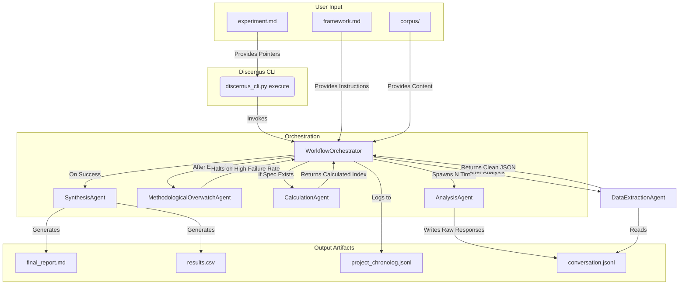

# Architectural Recovery and Unification Plan

**Version**: 1.1  
**Date**: January 13, 2025  
**Status**: UPDATED - Post-MVA Experiment 2 Analysis

This document outlines the strategic plan to unify the Discernus platform, recovering lost capabilities and establishing a robust, flexible, and philosophically coherent architecture for future development. It is based on a comprehensive review of the project's history, including successes and regressions.

**Latest Update**: Realistic assessment of current workflow status and integration of fault-tolerant provenance system requirements based on actual experiment failure analysis.

---

## Part 1: The Conceptual Shift (The "Why")

### 1.1. Post-Mortem of Past Architectures

A detailed review of the project's history, guided by the `INDEPENDENT_TECHNICAL_AUDIT_REPORT.md`, reveals a "cycle of over-correction" between two architectural extremes. Understanding this cycle is critical to defining a stable path forward.

#### **The "Schema-Driven" Era (e.g., Framework Spec v3.1/v3.2)**

*   **Description**: This early architecture was characterized by highly structured, machine-readable YAML files for both frameworks and experiments. The system was powerful and theoretically rigorous, defining a multi-stage analytical process with detailed prompts and output schemas directly in the framework files.
*   **What Worked**: It was incredibly precise and capable of performing sophisticated, multi-step analyses.
*   **Why It Was Abandoned**: The audit and historical READMEs show this approach was ultimately **too THICK and complex**. The rigid schemas were difficult for researchers to create and maintain, acting as a barrier to entry. The system was "over-engineered" and collapsed under its own weight, failing the primary goal of being a usable research tool.

#### **The "Great Regression" (e.g., The `EnsembleOrchestrator`)**

*   **Description**: In reaction to the complexity of the schema-driven era, the system was radically simplified. The schemas were abandoned in favor of freeform markdown frameworks and a simple, linear orchestrator that contained hardcoded prompt templates.
*   **What Worked**: It was simpler to understand and implement a single analysis path.
*   **Why It Failed**: This approach was **too THIN and brittle**. By removing the structured contract, the system lost its ability to perform complex, multi-stage analysis. It led to "process hallucination," where agents would ignore the framework's intent, and it required the software itself to contain "universal" prompt logic, which proved impossible to maintain across different frameworks, leading to unreliable results.

#### **The "Lost Future" (`ThinOrchestrator`)**

*   **Description**: The audit uncovered evidence of a third path that was started but never integrated: a `ThinOrchestrator` designed to be both framework-agnostic and sophisticated. This architecture was the correct synthesis, but it was abandoned before it became the production system.

### 1.2. The "Best of Both Worlds" Philosophy: Our New Direction

The core lesson from our history is that neither extreme is correct. We must forge a **pragmatic middle path** that combines the best of both worlds. Our new architecture will be based on the following principle:

**Human-Readable Markdown as a "Single Source of Truth" with Embedded Machine-Readable Configuration.**

*   **For the Human Researcher**: The primary artifact is a `framework.md`. This document is written in clear, self-documenting prose, explaining the theory, methodology, and anchors of the analysis. It is a conceptual document, first and foremost.
*   **For the Machine**: Embedded within the `framework.md` is a fenced YAML block (`# --- Discernus Configuration ---`). This block is the strict, machine-readable "API contract." It contains the specific prompts, output JSON schemas, and calculation specifications that the software will execute.

This approach puts the researcher in charge of the "thick" conceptual work, while the software remains a "thin," reliable executor of the explicit instructions embedded within the framework. Crucially, the specifications themselves are designed to be used as **meta-prompts**, allowing researchers to use general-purpose chatbots to help them create compliant framework, experiment, and corpus files.

### 1.3. Reinterpreting the THIN/THICK Vision

Our new "Markdown + embedded YAML" approach is not a departure from the THIN/THICK philosophy; it is its highest and most practical expression.

#### **What Survives**
The core principles and components of the THIN architecture remain vital:
*   **The `LLMGateway`**: A pure, stateless utility for calling models.
*   **The `ModelRegistry`**: The single source of truth for model capabilities and costs.
*   **The `AgentRegistry`**: The discovery mechanism for our specialized agents.
*   **The `ProjectChronolog`**: The immutable source of truth for academic provenance.
*   **The `SecureCodeExecutor`**: The sandboxed environment for verifying calculations when needed.
*   **The Core Philosophy**: We still believe that intelligence belongs in the "prompt" and infrastructure belongs in the software.

#### **How the Vision Evolves**
Our understanding of "prompt" has matured. We have learned that a single, universal prompt template hardcoded in an agent is a THICK anti-pattern. Our new vision is more nuanced and powerful:

*   **THICK Researcher, THIN Framework File**: We empower the human researcher—the true source of intelligence—to do the "thick" conceptual work. They author a `framework.md` that is primarily a human-readable, self-documenting text. This lowers the barrier to entry and keeps the focus on ideas.
*   **THIN Agent, THICK Framework Configuration**: The agent becomes radically "thinner." It no longer contains complex prompt templates. Instead, it reads a small, precise YAML configuration block embedded within the framework markdown. This YAML block is the "thick" part of the framework file—it contains the detailed, explicit instructions (the *real* prompt) that the agent will use.
*   **The Best of Both Worlds**: This hybrid approach keeps the software simple and stupid (THIN), places the burden of intelligence on the researcher (THICK), and provides a clear, machine-readable contract (the YAML block) that eliminates the mystery and unreliability of our previous approaches. It is the ultimate implementation of our philosophy.

### 1.4. User Personas & Journeys

Our architecture must be grounded in the needs of our users. The following personas, recovered from the project archives, define our target audience and their goals.

*   **Persona 1: Dr. Sarah Chen (The Validation Researcher)**
    *   **Profile**: An associate professor who needs to publish rigorous, computationally-assisted research using established methods. She is not a developer.
    *   **Needs**: Cares deeply about methodological validity, reproducibility, and evidence. Requires tools that are transparent and can be defended in peer review. The human-readable part of the `framework.md` is for her.
    *   **Journey**: She collaborates with a graduate student to adapt an existing, validated framework for her specific research question. She reviews the qualitative output and the evidence to ensure it meets her standards.

*   **Persona 2: David Chen (The Graduate Student)**
    *   **Profile**: A technically savvy graduate student responsible for executing the analysis.
    *   **Needs**: Needs a clear, unambiguous technical contract to follow. The embedded YAML configuration inside the `framework.md` is for him. He uses the `prompt_engineering_harness.py` to test and refine the `analysis_prompt` until it is perfect.
    *   **Journey**: He takes Dr. Chen's conceptual framework and implements it in the YAML block, ensuring the prompts and required JSON structure are precise. He runs the experiment and provides the validated, structured results back to Dr. Chen.

*   **Persona 3: Dr. Elena Vasquez (The Framework Developer)**
    *   **Profile**: A digital humanities researcher who creates new, bespoke frameworks for consulting clients.
    *   **Needs**: Needs a powerful and flexible system for creating new analytical tools. The `v4.0` specification gives her the power to define her own multi-stage analysis protocols and required outputs, without needing to write new Python code for the orchestrator.
    *   **Journey**: She authors a completely new `framework.md` from scratch, defining her theory in prose and her execution logic in the embedded YAML. She delivers this single file to her client, who can then run it using the standard Discernus platform.

---

## Part 2: The New System Specifications (The "What")

To implement this vision, we will standardize on a set of clear, concise specifications. These documents define the "API contract" between the human researcher and the Discernus system. The full, canonical versions of these documents are now located in the `/docs/specifications/` directory.

### 2.1. Framework Specification (`v4.0`)

A framework is a self-contained `framework.md` file that is both human-readable and machine-parsable. It MUST contain an embedded `# --- Discernus Configuration ---` YAML block.

**Key Feature: Analysis Variants**. The YAML block defines a dictionary of `analysis_variants`. This allows a single framework to support multiple modes of analysis (e.g., a quick descriptive pass vs. a full normative evaluation). A `default` variant is required. The framework author has full control over the prompt, the required JSON output structure, and any post-analysis calculations for each variant.

### 2.2. Experiment Specification (`v2.0`)

The `experiment.md` file is a simple YAML file that points to the assets needed for a run. It specifies the `framework`, `corpus`, `models`, and `num_runs`. It also requires a falsifiable `hypothesis` and allows the user to select an `analysis_variant` from the framework and a `corpus_state` (e.g., `sanitized`) for the run.

### 2.3. Corpus Specification (`v2.0`)

The new corpus specification codifies the bias-aware methodology from the Attesor study. It defines three official corpus states (`original`, `sanitized`, `translated`), requires the use of hashed filenames for sanitized corpora, and specifies the format for a secure `speaker_mapping.jsonl` lookup table. It also preserves the ability to use an optional `corpus.md` for metadata.

---

## Part 3: The New Orchestration Flow (The "How")

This new architecture simplifies the orchestration flow significantly. The system becomes a straightforward, schema-driven executor.

### 3.1. Step-by-Step Orchestration

1.  **Initiation**: The user runs `python3 discernus_cli.py execute ./my_project`.
2.  **Parsing**: The `CLI` parses the `experiment.md` to get the framework file, corpus path, models, and number of runs.
3.  **Orchestrator Invocation**: The `WorkflowOrchestrator` is invoked with this information.
4.  **Framework Loading**: The orchestrator loads the specified `framework.md` and parses the `# --- Discernus Configuration ---` YAML block to get the metadata, `analysis_prompt`, and optional `calculation_spec`.
5.  **Agent Spawning (`AnalysisAgent`)**:
    *   For each text file in the corpus, for each model, for each `num_runs`, the orchestrator spawns an `AnalysisAgent`.
    *   The orchestrator populates the variables in the `analysis_prompt` (e.g., `{framework_text}`, `{corpus_text}`).
    *   The `AnalysisAgent` sends the completed prompt to the `LLMGateway`.
6.  **Response Capture**:
    *   The `AnalysisAgent` receives the raw, potentially messy response from the LLM.
    *   It performs NO validation. Its only job is to faithfully record the entire raw response to the Tier 3 `conversation.jsonl` file for the current session. A run is considered successful if a non-empty response is received.
7.  **Data Extraction (`DataExtractionAgent` - New)**:
    *   After all `AnalysisAgent` runs are complete, a new `DataExtractionAgent` is invoked.
    *   It reads the raw responses from the session's `conversation.jsonl` file.
    *   For each raw response, it uses a targeted "JSON fixer" prompt to ask a powerful LLM (e.g., GPT-4o) to extract the clean, valid JSON object.
    *   If the extraction succeeds, the clean JSON is added to the `workflow_state`. If it fails, the error is logged, and the workflow continues with the successful extractions.
8.  **Quality Control (`MethodologicalOverwatchAgent`)**:
    *   After all `AnalysisAgent` runs are complete, the `MethodologicalOverwatchAgent` inspects the collected results.
    *   After the `DataExtractionAgent` runs, the `MethodologicalOverwatchAgent` inspects the cleaned JSON results.
    *   It checks for a high failure rate in the extraction process. If a significant percentage of analyses could not be cleaned, it can halt the workflow to save resources.
9.  **Calculation (`CalculationAgent` - New)**:
    *   If a `calculation_spec` exists in the framework's YAML config, a new `CalculationAgent` is invoked.
    *   It takes the `scores` dictionary from the `AnalysisAgent`'s output and performs the specified mathematical operations deterministically.
    *   The results (e.g., `cohesion_index`) are added to the `workflow_state`.
10. **Synthesis & Reporting (`SynthesisAgent` - New)**:
    *   A new `SynthesisAgent` takes all the data from the `workflow_state` (qualitative summaries, scores, evidence, calculated indices).
    *   It generates the final, human-readable `final_report.md` and any other required artifacts (e.g., `results.csv`).

### 3.2. System Architecture Diagram

---

## Part 4: Asset Inventory and Migration Plan

This plan requires a targeted refactoring, keeping our robust components while simplifying or replacing those that are no longer aligned with our new architecture.

### 4.1. Existing Assets to Keep (The Foundation)

These components are well-designed, THIN, and will be central to the new system:
*   **`LLMGateway`**: Remains the single point of entry for all model calls. Its moderation guardrail is a key feature.
*   **`ModelRegistry`**: Remains the source of truth for model capabilities and costs.
*   **`AgentRegistry`**: Remains the discovery mechanism for all specialized agents.
*   **`ProjectChronolog`**: Continues to provide our essential, tamper-evident audit trail.
*   **`SecureCodeExecutor`**: While the `AnalysisAgent` will no longer use it, the new `CalculationAgent` might, making it a valuable utility to keep for verifiable math.
*   **`MethodologicalOverwatchAgent`**: Its role as a QC check becomes even more important. It will be enhanced to parse the new, richer JSON output.

### 4.2. Assets to Refactor (The Evolution)

*   **`WorkflowOrchestrator`**: The core logic remains, but it will be simplified. It no longer needs to manage a complex, hardcoded sequence of agents. Its main loop will become a simple executor of the `AnalysisAgent` and the new post-processing agents.
*   **`AnalysisAgent`**: This will undergo a significant, simplifying refactoring. All hardcoded prompt logic and all JSON parsing/validation logic will be removed. Its new role is to parse the framework YAML, populate the prompt template, execute the call, and save the raw response to the conversation log.
*   **`discernus_cli`**: The `execute` command will be simplified to just parse the `experiment.md` and pass the paths to the `WorkflowOrchestrator`.

### 4.3. Assets to Create (The New Components)

*   **`DataExtractionAgent`**: A new agent whose sole responsibility is to read raw LLM responses from the conversation log and use a targeted "fixer" prompt to extract clean, valid JSON.
*   **`CalculationAgent`**: A new, simple agent that takes a dictionary of scores and a formula from the `calculation_spec` and performs deterministic math.
*   **`SynthesisAgent`**: A new agent responsible for taking all the rich data from the `workflow_state` (qualitative summaries, scores, evidence, calculations) and creating the final `final_report.md` and `results.csv`.

### 4.4. Assets to Deprecate

*   **The "Universal Prompt Template"**: This concept is now obsolete. All prompt intelligence will reside in the framework files.
*   **`StatisticalAnalysisAgent` & `StatisticalInterpretationAgent`**: The functionality of these agents will be absorbed into the new, more capable `SynthesisAgent`.

---

## Part 5: User-Centric Design

This new architecture is fundamentally more user-centric because it places the researcher's intellectual work at the center of the system.

### 5.1. User Personas

*   **Dr. Anya Sharma (The Senior Academic)**: A tenured professor with deep theoretical knowledge but limited time for complex software. For her, the human-readable markdown framework is perfect. She can express her sophisticated theories in prose and rely on a graduate student or the "prompt engineer" persona to handle the YAML block.
*   **David Chen (The Graduate Student)**: Technically savvy and tasked with running the analysis. For him, the clear, rigorous YAML contract is essential. He can use the `prompt_engineering_harness.py` to iterate on the `analysis_prompt` until it is perfect, ensuring the results for Dr. Sharma are reliable.
*   **Maria Garcia (The Think Tank Analyst)**: Needs to quickly adapt existing frameworks for rapid-response analysis on current events. The simplicity of editing a self-contained `.md` file, changing the prompt, and re-running the analysis is ideal for her fast-paced environment.

### 5.2. User Journeys

1.  **Framework Creation**: Dr. Sharma opens a general-purpose chatbot (e.g., ChatGPT). She pastes in the content of the Discernus `framework_specification_v4.0.md` and says, "Help me create a new framework for analyzing the rhetoric of corporate sustainability reports. It must conform to this specification." The chatbot guides her through defining her anchors and methodology, then generates a complete, compliant `framework.md` file with the embedded YAML configuration.
2.  **Experiment Execution**: David receives the `framework.md` from Dr. Sharma. He creates a simple `experiment.md` pointing to her framework and a new corpus. He runs `discernus execute` and receives a rich set of results, including scores and evidence.
3.  **Analysis & Reporting**: Maria takes an existing framework, tweaks the `analysis_prompt` in the YAML block for a new question, and runs it against a new corpus of articles. The system generates a `results.csv` that she can immediately use to create charts and a `final_report.md` that gives her the qualitative context she needs for her report.

---

## Part 6: Requirements and Definition of Done

### 6.1. Functional Requirements

*   [ ] The system MUST successfully parse framework files that conform to the `v4.0` specification.
*   [ ] The `AnalysisAgent` MUST correctly substitute variables into the `analysis_prompt` from the framework YAML.
*   [ ] The `AnalysisAgent` MUST fail loudly if the LLM response is not valid JSON.
*   [ ] The `CalculationAgent` MUST correctly parse and execute formulas from the `calculation_spec`.
*   [ ] The `SynthesisAgent` MUST generate a human-readable markdown report and a machine-readable CSV file.

### 6.2. Non-Functional Requirements

*   [ ] The framework creation process MUST be human-centric, prioritizing clarity and self-documentation.
*   [ ] The system MUST be framework-agnostic, requiring zero code changes to run a new, compliant framework.
*   [ ] The core orchestration logic MUST remain "THIN" and easy to understand.
*   [ ] All generated artifacts MUST be logged in the `ProjectChronolog` to ensure reproducibility.

### 6.3. Definition of Done

This architectural recovery project will be considered **DONE** when:
1.  All specifications (`framework_v4.0`, `experiment_v2.0`, `corpus_v2.0`) are formally documented in the `docs/specifications/` directory.
2.  **Fault-tolerant provenance system** (Research Provenance Guide v3.0) is fully implemented with immediate LLM persistence.
3.  The `AnalysisAgent`, `WorkflowOrchestrator`, and `discernus_cli` have been refactored to conform to the new architecture.
4.  The new `DataExtractionAgent`, `CalculationAgent`, and `SynthesisAgent` have been created and integrated.
5.  **End-to-end workflow validation**: The `pdaf_retest` project executes successfully from start to finish, producing complete deliverables even with intentional failures at each stage.
6.  **Cost protection verified**: Zero duplicate LLM calls during session resumption after crashes.

---

## Part 7: Implementation Progress

### Step 1: Refactor `discernus_cli.py` - ✅ COMPLETE

*   **Date**: July 17, 2025
*   **Outcome**: The CLI has been successfully refactored by a specialist agent to be fully compliant with the v4.0 architecture.
*   **Details**:
    *   The "intermediate file" violation (`statistical_plan.json`) has been removed.
    *   The CLI is now a "thin" invoker, passing only the `project_path` and `experiment_config` to the orchestrator.
    *   Legacy helper functions were removed, and the codebase was reduced by 33% while preserving all essential functionality.
*   **AAR**: See specialist "After Action Report" for full details.

### Step 2: Enhanced Provenance Architecture - ✅ COMPLETE  

*   **Date**: January 13, 2025
*   **Outcome**: Comprehensive provenance system redesign to address critical fault tolerance gaps
*   **Documents Created**:
    *   `docs/RESEARCH_PROVENANCE_GUIDE_V3.md` - Updated provenance specification with fault-tolerant design
    *   `pm/active_projects/PROVENANCE_SYSTEM_GAP_ANALYSIS.md` - Detailed implementation roadmap
*   **Key Insights**:
    *   **Current three-tier provenance system works but has critical gaps**
    *   **Fault tolerance failure**: $50+ in LLM costs lost per failed experiment
    *   **MECE violations**: Overlapping file responsibilities cause confusion
    *   **Model provenance gaps**: Insufficient forensic detail for academic replication
*   **Priority**: Critical - blocking research progress until implemented

### Current Status Assessment (January 13, 2025)

**Reality Check: We are NOT "one bug away" from end-to-end workflow completion.**

#### What MVA Experiment 2 Revealed:

**✅ What's Working:**
- **AnalysisAgent**: Successfully completed 46/48 analyses (95.8% success rate)
- **Framework processing**: CFF v4.1 framework correctly loaded and applied
- **Three-tier provenance**: Comprehensive data capture (943 lines of chronolog, 449KB session logs)
- **LLM integration**: Reliable model calls with proper response capture

**❌ What's Broken:**
- **DataExtractionAgent**: Crashes with `'str' object has no attribute 'get'` parsing error
- **Workflow continuation**: Stops after Step 1, never reaches CalculationAgent or SynthesisAgent
- **Fault tolerance**: $50+ in LLM analyses lost when workflow fails
- **Result accessibility**: 46 analyses trapped in 1,339-line JSON blob, unusable for researchers
- **File organization**: MECE violations cause confusion about data location and purpose

#### Remaining Implementation Gaps:

**🔴 Critical (Blocking):**
1. **Fault tolerance implementation** (Phase 1 of Gap Analysis)
   - Immediate LLM persistence system
   - Progressive checkpointing
   - Session resumption capability
2. **DataExtractionAgent bug fixes** 
   - JSON parsing error resolution
   - Robust error handling for malformed LLM responses
3. **Workflow orchestration hardening**
   - Continue execution despite agent failures
   - Graceful degradation with partial results

**🟡 Important (Quality):**
4. **Directory structure migration** (Phase 2 of Gap Analysis)
   - MECE file organization
   - Experiment/framework snapshots
   - Corpus manifest generation
5. **CalculationAgent & SynthesisAgent completion**
   - Currently unimplemented
   - Required for final deliverables

**🟢 Nice-to-Have (Polish):**
6. **Enhanced model provenance** (Phase 3 of Gap Analysis)
   - Forensic-grade model tracking
   - Academic integrity compliance

#### Next Steps (Prioritized):

**Week 1: Critical Fault Tolerance**
- [ ] Implement `LLMArchiveManager` for immediate persistence
- [ ] Create `CheckpointManager` for progressive state saving
- [ ] Fix DataExtractionAgent JSON parsing bug
- [ ] Test workflow resumption without duplicate LLM calls

**Week 2: Complete Core Workflow**
- [ ] Implement missing `CalculationAgent` 
- [ ] Implement missing `SynthesisAgent`
- [ ] End-to-end workflow validation with `MVA/experiment2`
- [ ] Verify complete deliverables generation

**Week 3: Production Hardening**
- [ ] Directory structure migration
- [ ] Enhanced error handling and logging
- [ ] Performance optimization
- [ ] Academic integrity compliance

**Estimated Completion: 3-4 weeks of focused development** 