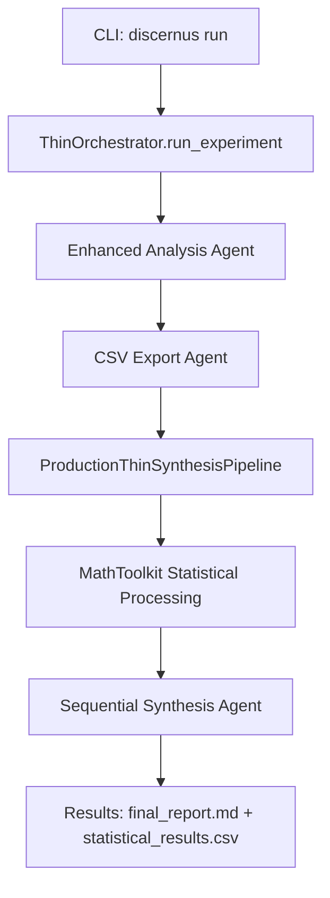
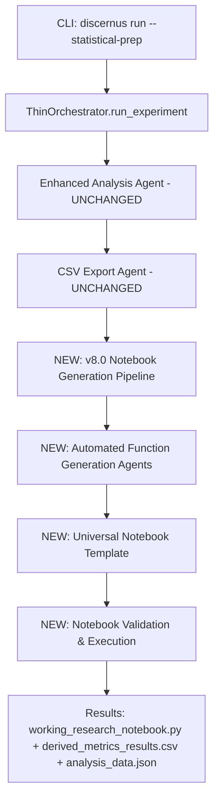

# Discernus v8.0 Implementation Roadmap: simple_test Migration

**Document Version**: 1.0  
**Date**: August 14, 2025  
**Status**: Implementation Planning  
**Parent Architecture**: [discernus_notebook_architecture_v3.md](discernus_notebook_architecture_v3.md)

## Executive Summary

This document provides the detailed implementation roadmap for migrating the `simple_test` experiment to the v8.0 notebook architecture. It analyzes current assets, maps required changes, and provides concrete development phases for transitioning from the MathToolkit-based v7.3 system to the automated function generation v8.0 system.

**Strategic Context**: This roadmap operationalizes the architectural vision documented in `discernus_notebook_architecture_v3.md` by providing specific implementation details for the first v8.0 experiment execution.

---

## 📋 Input Asset Analysis

### **Current v7.3 Assets (What We Have)**

**Experiment Specification** (`projects/simple_test/experiment.md`):
- **Current**: Complex v7.3 YAML with gasket versions, workflow orchestration, agent choreography (75 lines)
- **Target v8.0**: Simple 4-element specification 

**Framework Specification** (`frameworks/reference/flagship/cff_v7.3.md`):
- **Current**: 400+ line specification with MathToolkit accommodations, execution orders, JSON appendices
- **Target v8.0**: <50 lines with natural language calculations

**Corpus Specification** (`projects/simple_test/corpus/corpus.md`):
- **Current**: v7.1 with rigid JSON manifest, prohibited variations, statistical readiness declarations
- **Target v8.0**: Simple document list + optional metadata

### **Required v8.0 Asset Conversions**

**1. Convert Experiment Specification**
```yaml
# NEW: simple_test/experiment_v8.md
name: "democratic_discourse_cohesion_study"
description: "Comparative analysis of social cohesion patterns across institutional and populist democratic discourse styles"

framework: "frameworks/reference/flagship/cff_v8.md" 
corpus: "corpus/"

questions:
  - "Will McCain's institutional discourse show higher cohesion than populist styles?"
  - "Do populist progressive and conservative variants differ in social cohesion patterns?"
```

**2. Convert CFF v7.3 → v8.0**
```markdown
# NEW: frameworks/reference/flagship/cff_v8.md
# Cohesive Flourishing Framework v8.0

## Research Purpose
Measure how political discourse impacts social cohesion through five dimensions of human social psychology.

## Dimensions
- **Tribal Dominance**: In-group supremacy and exclusionary identity patterns (0.0-1.0)
- **Individual Dignity**: Universal human worth and inclusive recognition (0.0-1.0)
- **Fear**: Crisis mentality and existential threat perception (0.0-1.0)
- **Hope**: Progress orientation and optimistic collective vision (0.0-1.0)
- **Envy**: Resentment toward others' success, zero-sum thinking (0.0-1.0)
- **Compersion**: Celebration of others' success, abundance mindset (0.0-1.0)
- **Enmity**: Hostility and adversarial positioning (0.0-1.0)
- **Amity**: Friendship appeals and cooperative framing (0.0-1.0)
- **Fragmentative Goals**: Divisive zero-sum objectives (0.0-1.0)  
- **Cohesive Goals**: Integrative positive-sum objectives (0.0-1.0)

## Calculations
- **Identity Tension**: "Conflict between tribal dominance and individual dignity"
- **Emotional Balance**: "Hope scores minus fear scores"
- **Success Climate**: "Compersion scores minus envy scores" 
- **Relational Climate**: "Amity scores minus enmity scores"
- **Goal Orientation**: "Cohesive goals minus fragmentative goals"
- **Overall Cohesion Index**: "Average of positive dimensions minus average of negative dimensions"
```

**3. Convert Corpus Specification**
```markdown
# NEW: corpus/corpus_v8.md
# Democratic Discourse Corpus

## Overview
Four paradigmatic examples of American political communication spanning institutional and populist approaches to democratic discourse.

## Documents
- `john_mccain_2008_concession.txt` - Institutional gracious concession speech, Republican, 2008
- `bernie_sanders_2025_fighting_oligarchy.txt` - Populist progressive economic critique, Independent, 2025  
- `steve_king_2017_house_floor.txt` - Populist conservative cultural rhetoric, Republican, 2017
- `alexandria_ocasio_cortez_2025_fighting_oligarchy.txt` - Populist progressive systemic advocacy, Democratic, 2025

## Optional Metadata
```json
{
  "documents": [
    {"file": "john_mccain_2008_concession.txt", "speaker": "John McCain", "party": "Republican", "year": 2008, "style": "institutional"},
    {"file": "bernie_sanders_2025_fighting_oligarchy.txt", "speaker": "Bernie Sanders", "party": "Independent", "year": 2025, "style": "populist_progressive"},
    {"file": "steve_king_2017_house_floor.txt", "speaker": "Steve King", "party": "Republican", "year": 2017, "style": "populist_conservative"},
    {"file": "alexandria_ocasio_cortez_2025_fighting_oligarchy.txt", "speaker": "Alexandria Ocasio-Cortez", "party": "Democratic", "year": 2025, "style": "populist_progressive"}
  ]
}
```
```

---

## 🔧 Orchestration Flow Mapping

### **Current v7.3 Flow (What Exists Today)**



### **Target v8.0 Flow (What We Need to Build)**



---

## 📊 Component-by-Component Analysis

### **Components That Can Be ADAPTED (70%)**

#### **1. Enhanced Analysis Agent** ✅ **NO CHANGES NEEDED**
- **Current**: Already generates analysis data compatible with v8.0
- **Status**: REUSABLE AS-IS
- **Output**: JSON analysis data that v8.0 agents can consume

#### **2. CSV Export Agent** ✅ **NO CHANGES NEEDED** 
- **Current**: Already generates structured CSV data 
- **Status**: REUSABLE AS-IS
- **Output**: CSV files that notebooks can import directly

#### **3. Security Boundary** ✅ **ADAPT**
- **Current**: Handles experiment path validation and isolation
- **Changes Needed**: Add v8.0 specification validation
- **Estimate**: 10% modification

#### **4. Audit Logger** ✅ **ADAPT**
- **Current**: Complete audit trail system
- **Changes Needed**: Add notebook generation events
- **Estimate**: 5% modification

#### **5. Local Artifact Storage** ✅ **ADAPT** 
- **Current**: Content-addressable storage system
- **Changes Needed**: Handle notebook and function artifacts
- **Estimate**: 10% modification

#### **6. CLI Interface** ✅ **ADAPT**
- **Current**: Has `--analysis-only` flag 
- **Changes Needed**: Add `--statistical-prep` flag, v8.0 validation
- **Estimate**: 20% modification

### **Components That Need TOTAL REWRITE (30%)**

#### **1. Framework Specification Parser** ❌ **TOTAL REWRITE NEEDED**
- **Current**: Parses v7.3 JSON gasket schemas with rigid field requirements
- **v8.0 Needs**: Natural language processing for calculation descriptions
- **New Component**: `v8_framework_parser.py`
- **Estimate**: 100% new code

#### **2. Experiment Specification Loader** ❌ **TOTAL REWRITE NEEDED**
- **Current**: Loads v7.3 workflow orchestration specifications
- **v8.0 Needs**: Simple YAML parser for 4-field specifications
- **New Component**: `v8_experiment_loader.py` 
- **Estimate**: 100% new code

#### **3. Synthesis Pipeline** ❌ **TOTAL REWRITE NEEDED**
- **Current**: `ProductionThinSynthesisPipeline` with MathToolkit integration
- **v8.0 Needs**: Notebook generation pipeline with automated function generation
- **New Component**: `NotebookGenerationPipeline`
- **Estimate**: 100% new code

#### **4. Mathematical Processing** ❌ **TOTAL REWRITE NEEDED**
- **Current**: MathToolkit with `eval()` and formula string parsing
- **v8.0 Needs**: Automated function generation from natural language
- **New Components**: Function generation agents (4 specialized agents)
- **Estimate**: 100% new code

#### **5. ThinOrchestrator Integration** ❌ **SIGNIFICANT MODIFICATION NEEDED**
- **Current**: `_run_thin_synthesis()` method integrates MathToolkit
- **v8.0 Needs**: `_run_notebook_generation()` method with agent coordination
- **Estimate**: 60% modification

---

## 🏗️ Implementation Architecture

### **Phase 1: v8.0 Specification Infrastructure**

#### **NEW: V8 Specification Parsers**
```python
# NEW: discernus/core/v8_specifications.py
class V8FrameworkParser:
    def parse_natural_language_calculations(self, framework_md: str) -> Dict[str, str]:
        """Extract calculation descriptions from v8.0 frameworks."""
        pass

class V8ExperimentLoader:  
    def load_simple_experiment(self, experiment_path: Path) -> Dict[str, Any]:
        """Load 4-field v8.0 experiment specifications."""
        pass

class V8CorpusHandler:
    def load_flexible_corpus(self, corpus_path: Path) -> Dict[str, Any]:
        """Load corpus with semantic metadata understanding."""
        pass
```

#### **MODIFIED: ThinOrchestrator** 
```python
# MODIFIED: discernus/core/thin_orchestrator.py
class ThinOrchestrator:
    def run_experiment(self, ..., statistical_prep: bool = False):
        """Add statistical_prep parameter for notebook generation mode."""
        if statistical_prep:
            return self._run_notebook_generation(...)
        else:
            return self._run_traditional_synthesis(...)
    
    def _run_notebook_generation(self, ...):
        """NEW: Coordinate v8.0 notebook generation pipeline."""
        # 1. Run analysis (unchanged)
        # 2. Generate functions using specialized agents  
        # 3. Create notebook with universal template
        # 4. Validate and test notebook
        # 5. Return notebook + metadata
        pass
```

### **Phase 2: Automated Function Generation Agents**

#### **NEW: Function Generation Agent Suite**
```python
# NEW: discernus/agents/automated_function_generation/
class AutomatedDerivedMetricsAgent:
    def generate_calculation_functions(self, framework_v8: str) -> str:
        """Generate calculation functions from v8.0 natural language descriptions using THIN-compliant extraction."""
        # Pass raw framework content to LLM (THIN)
        llm_response = self._generate_with_delimiters(framework_v8)
        
        # Extract using proprietary delimiters (THIN)
        clean_functions = self._extract_functions_with_delimiters(llm_response)
        
        return clean_functions
    
    def _extract_functions_with_delimiters(self, response: str) -> List[str]:
        """Extract function code using proprietary delimiters."""
        pattern = r'<<<DISCERNUS_FUNCTION_START>>>(.*?)<<<DISCERNUS_FUNCTION_END>>>'
        matches = re.findall(pattern, response, re.DOTALL)
        return [match.strip() for match in matches]

class AutomatedStatisticalAnalysisAgent:
    def generate_statistics_functions(self, data_structure: Dict, framework_context: str) -> str:
        """Generate appropriate statistical analysis functions."""
        pass

class AutomatedEvidenceIntegrationAgent: 
    def generate_evidence_functions(self, statistical_results: Dict, evidence_data: Dict) -> str:
        """Generate functions linking statistics to qualitative evidence."""
        pass

class AutomatedVisualizationAgent:
    def generate_visualization_functions(self, results_structure: Dict) -> str:
        """Generate publication-ready visualization code.""" 
        pass
```

#### **NEW: Function Validation System**
```python
# NEW: discernus/core/function_validation.py
class FunctionValidator:
    def validate_syntax(self, function_code: str) -> bool:
        """Validate extracted function syntax using AST parsing."""
        pass
    def validate_execution(self, function_code: str, sample_data: Dict) -> bool:
        """Test extracted function execution with sample data."""
        pass
    def validate_mathematical_correctness(self, function_code: str) -> bool:
        """Verify mathematical correctness of extracted functions."""
        pass
    def validate_integration(self, functions: List[str]) -> bool:
        """Ensure extracted functions work together properly."""
        pass

# NEW: discernus/core/thin_output_extraction.py  
class ThinOutputExtractor:
    def extract_function_code(self, llm_response: str) -> List[str]:
        """THIN-compliant function extraction using proprietary delimiters."""
        pattern = r'<<<DISCERNUS_FUNCTION_START>>>(.*?)<<<DISCERNUS_FUNCTION_END>>>'
        matches = re.findall(pattern, llm_response, re.DOTALL)
        return [match.strip() for match in matches]
    
    def validate_extraction_success(self, llm_response: str) -> bool:
        """Validate that delimiter extraction was successful."""
        return len(self.extract_function_code(llm_response)) > 0
```

### **Phase 3: Componentized Notebook Template System**

#### **NEW: Token-Limit Compliant Architecture**
**Critical Constraint**: Gemini models have ~8,192 output token limits, but complete research notebooks often exceed 10,000+ tokens.

**Solution**: Componentized generation - multiple small LLM components + deterministic assembly = complete notebooks that never hit token limits.

#### **NEW: Componentized Template Engine**
```python
# NEW: discernus/core/componentized_notebook_generation.py
class ComponentizedNotebookGeneration:
    """Generate notebooks through multiple small components, each under token limits."""
    
    def __init__(self):
        # Small, focused agents (each <1000 output tokens)
        self.methodology_agent = NotebookMethodologyAgent()      # <800 tokens
        self.interpretation_agent = NotebookInterpretationAgent() # <1000 tokens  
        self.discussion_agent = NotebookDiscussionAgent()        # <800 tokens
        
        # Deterministic template system (no token limits)
        self.template_engine = UniversalNotebookTemplate()
    
    def generate_notebook(self, artifacts: Dict) -> str:
        """Generate complete notebook without hitting token limits."""
        
        # Generate small narrative components with LLMs
        methodology = self.methodology_agent.generate(artifacts['framework'])
        interpretation = self.interpretation_agent.generate(artifacts['results']) 
        discussion = self.discussion_agent.generate(artifacts['findings'])
        
        # Deterministic assembly (no LLM, no token limits)
        return self.template_engine.render(
            methodology_section=methodology,        # <800 tokens
            interpretation_section=interpretation,  # <1000 tokens
            discussion_section=discussion,          # <800 tokens
            generated_functions=artifacts['functions'],  # Raw code (no token limits)
            data_file_paths=artifacts['data_paths']      # File paths only
        )

# NEW: Notebook Component Agents
class NotebookMethodologyAgent:
    """Generate methodology sections <800 tokens."""
    def generate(self, framework_content: str) -> str:
        """Generate methodology description from framework."""
        pass

class NotebookInterpretationAgent:
    """Generate results interpretation <1000 tokens."""
    def generate(self, statistical_results: Dict) -> str:
        """Generate interpretation of statistical findings."""
        pass

class NotebookDiscussionAgent:
    """Generate discussion sections <800 tokens."""
    def generate(self, findings: Dict) -> str:
        """Generate academic discussion of findings."""
        pass
```

#### **NEW: Data Externalization Architecture**
```python
# Template generates notebooks that load data externally
class UniversalNotebookTemplate:
    def render(self, **components) -> str:
        """Render notebook with external data loading patterns."""
        return f"""
# EXTERNAL DATA LOADING (file paths only, not data)
data_path = Path('{components['data_file_paths']['analysis']}')  # ~10 tokens
evidence_index = Path('{components['data_file_paths']['evidence']}')  # ~10 tokens

# LOAD DATA FROM EXTERNAL FILES (no token impact)
analysis_data = pd.read_json(data_path)
evidence_curator = ComprehensiveKnowledgeCurator()
evidence_curator.load_index(evidence_index)

# GENERATED FUNCTIONS (raw code, no token limits)
{components['generated_functions']}

# METHODOLOGY (LLM-generated, <800 tokens)
\"\"\"
{components['methodology_section']}
\"\"\"

# RESULTS INTERPRETATION (LLM-generated, <1000 tokens)
\"\"\"
{components['interpretation_section']}
\"\"\"

# DISCUSSION (LLM-generated, <800 tokens)
\"\"\"
{components['discussion_section']}
\"\"\"
"""
```

#### **NEW: Notebook Execution & Validation**
```python
# NEW: discernus/core/notebook_executor.py  
class NotebookExecutor:
    def validate_notebook(self, notebook_path: Path) -> ValidationResult:
        """Pre-validate notebook before delivery."""
        pass
    
    def execute_notebook(self, notebook_path: Path) -> ExecutionResult:
        """Execute notebook and capture results."""
        pass
```

### **Phase 4: CLI Integration**

#### **MODIFIED: CLI Interface**
```python
# MODIFIED: discernus/cli.py
@click.option('--statistical-prep', is_flag=True, 
              help='Generate analysis notebook instead of full synthesis (Epic 401)')
def run(..., statistical_prep: bool):
    """Add --statistical-prep flag for notebook generation mode."""
    orchestrator.run_experiment(..., statistical_prep=statistical_prep)
```

---

## 📂 File Structure Changes

### **NEW Files Needed (22+ files)**

```
discernus/
├── core/
│   ├── v8_specifications.py                 # NEW: v8.0 raw content loading (no parsing)
│   ├── thin_output_extraction.py            # NEW: proprietary delimiter extraction
│   ├── componentized_notebook_generation.py # NEW: componentized template system
│   ├── universal_notebook_template.py       # NEW: Jinja2 template engine  
│   ├── notebook_executor.py                 # NEW: notebook validation/execution
│   └── function_validation.py               # NEW: function validation system
├── agents/
│   ├── automated_function_generation/       # NEW: function generation agents
│   │   ├── __init__.py
│   │   ├── derived_metrics_agent.py         # Uses delimiter extraction + distributed coordination
│   │   ├── statistical_analysis_agent.py    # Uses delimiter extraction + distributed coordination
│   │   ├── evidence_integration_agent.py    # Uses delimiter extraction + distributed coordination
│   │   ├── visualization_agent.py           # Uses delimiter extraction + distributed coordination
│   │   └── notebook_generation_orchestrator.py # NEW: distributed, transactional orchestration
│   └── notebook_component_generation/       # NEW: token-limit compliant components
│       ├── __init__.py
│       ├── methodology_agent.py             # <800 tokens
│       ├── interpretation_agent.py          # <1000 tokens
│       └── discussion_agent.py              # <800 tokens
└── templates/
    └── universal_notebook_template.py.j2    # NEW: Jinja2 notebook template with data externalization
```

### **MODIFIED Files (8 files)**
```
discernus/
├── cli.py                                   # ADD: --statistical-prep flag
├── core/
│   ├── thin_orchestrator.py                # ADD: _run_notebook_generation()
│   ├── security_boundary.py                # ADD: v8.0 validation  
│   ├── audit_logger.py                     # ADD: notebook generation events
│   └── local_artifact_storage.py           # ADD: notebook artifact handling
└── agents/
    └── notebook_generator_agent/            # ENHANCE: existing agent
        └── agent.py                         # ADD: v8.0 integration
```

---

## ⚖️ Effort Estimation

### **Development Phases**

| Phase | Description | New Code | Modified Code | Estimated Days |
|-------|-------------|----------|---------------|----------------|
| **Phase 1** | v8.0 Specification Infrastructure | 800 lines | 400 lines | 5-7 days |
| **Phase 2** | Automated Function Generation + Distributed Orchestration | 1600 lines | 300 lines | 10-12 days |  
| **Phase 3** | Componentized Template System + Token Limit Compliance | 1000 lines | 400 lines | 6-8 days |
| **Phase 4** | CLI & Orchestrator Integration + Comprehensive Validation | 300 lines | 600 lines | 4-6 days |
| **Phase 5** | Testing & Token Limit Validation | 500 lines | 150 lines | 4-5 days |

**Total Estimate**: 29-38 days for complete v8.0 implementation with componentized architecture

### **Risk Assessment**

**HIGH CONFIDENCE** (Existing code works well):
- Analysis Agent integration (no changes needed)
- CSV export compatibility (no changes needed)
- Audit and security systems (minor modifications)

**MEDIUM CONFIDENCE** (Standard development):
- v8.0 specification parsing (straightforward)
- Universal template system (proven approach)
- CLI integration (standard feature addition)

**REQUIRES VALIDATION** (Novel LLM capabilities):
- Natural language → Python function generation (success rate needs validation)
- Mathematical correctness of auto-generated functions (validation pipeline critical)
- **Token limit compliance** (componentized generation must stay within Gemini limits)
- **Data externalization scalability** (external loading must work with any dataset size)
- **Transactional Integrity**: The isolated workspace model must correctly commit on success and roll back on failure, with complete logging.
- Distributed agent coordination through artifact storage

---

## 🎯 Success Criteria for `simple_test`

### **Input Conversion Success**
- [x] Convert CFF v7.3 → v8.0 (400 lines → <50 lines)
- [x] Convert experiment specification (75 lines → 8 lines)  
- [x] Convert corpus specification (115 lines → 20 lines)

### **Pipeline Success Metrics**
- [ ] **Function Generation**: 95%+ success rate for CFF dimension calculations
- [ ] **Mathematical Accuracy**: 99%+ agreement with reference implementation
- [ ] **Notebook Execution**: Generated notebook runs without errors
- [ ] **Results Quality**: Academic-quality analysis comparable to current synthesis

### **Integration Success**  
- [ ] **CLI Integration**: `discernus run --statistical-prep` works end-to-end
- [ ] **Performance**: Notebook generation completes in <5 minutes  
- [ ] **Provenance**: Complete audit trail from v8.0 specs → notebook → results

### **Academic Quality** 
- [ ] **Statistical Rigor**: Appropriate tests for 4-document comparative analysis
- [ ] **Evidence Integration**: Links statistical findings to qualitative examples
- [ ] **Transparency**: All calculations visible and modifiable in notebook
- [ ] **Reproducibility**: Notebook + data produces identical results

---

## 🚀 Bottom Line Assessment

**What We Have**: 70% of infrastructure already exists and is reusable  
**What We Need**: 30% new development focused on v8.0 specifications + automated function generation

**Strategic Impact**: This implementation would deliver the **complete v8.0 vision** - researchers provide simple markdown specifications, system automatically generates working research notebooks.

**For `simple_test` specifically**: The 4-document comparative cohesion analysis becomes a **perfect proof-of-concept** demonstrating that complex political science research can be conducted through simple specifications + automated notebook generation.

**Timeline**: 3-4 weeks for complete v8.0 implementation, with `simple_test` as the validation case.

---

## 🏛️ Architectural Compliance Requirements

This implementation must fully integrate with the project's established architectural principles for provenance, logging, and agent organization. The following requirements are non-negotiable and must be incorporated into the development phases.

### **1. Provenance System Integration (PROVENANCE_SYSTEM.md)**

The v8.0 pipeline must adhere to the existing content-addressed, Git-based provenance system.

- **✅ Artifact Storage**: All new artifacts (`generated_functions.py`, `research_notebook.py`, result files) **must** be stored as hashed, immutable files in the content-addressable `shared_cache/artifacts/`.
- **✅ Dependency Tracking**: The `provenance.json` manifest for each run **must** be updated to track the full dependency graph for notebook generation:
  - `research_notebook.py` ← (`v8_framework.md`, `analysis_data.json`, `generated_functions.py`)
  - `derived_metrics_results.csv` ← (`research_notebook.py`)
- **✅ Human-Readable Symlinks**: The final run directory **must** use symlinks to organize these new artifacts into the `results/` and `artifacts/` subdirectories for human review.
- **✅ Auto-Commit**: All new artifacts generated by the notebook pipeline **must** be included in the automatic Git commit to ensure a complete, verifiable research record.

### **2. Dual-Track Logging Integration (DUAL_TRACK_LOGGING_ARCHITECTURE.md)**

The new pipeline and its agents must emit signals to both logging tracks.

- **✅ Development Track**: The `NotebookGenerationPipeline` and its agents must write to `application.log`, `errors.log`, and `performance.log` to provide real-time visibility for developers.
- **✅ Research Provenance Track**: The pipeline **must** generate structured `jsonl` logs for academic integrity:
  - **`orchestrator.jsonl`**: Must include new event types like `notebook_generation_started`, `function_generation_complete`, and `notebook_validated`.
  - **`agents.jsonl`**: Each automated function generation agent must log its inputs, outputs, and model usage.
  - **`artifacts.jsonl`**: Must log the creation, hash, and dependencies of every new artifact, including generated Python files and the final notebook.

### **3. Agent Ecosystem Reconciliation (DISCERNUS_SYSTEM_ARCHITECTURE.md)**

The v8.0 notebook architecture is an evolution of the existing synthesis stage, not a replacement of the entire system architecture.

- **✅ Pipeline Evolution**: The `NotebookGenerationPipeline` **replaces** the `ProductionThinSynthesisPipeline` as the primary implementation of the "Synthesis Stage" for experiments using the `--statistical-prep` flag.
- **✅ Agent Classification**: The new automated function generation agents fit within the existing 6-layer agent model:
  - **Planning & Mathematical**: `AutomatedDerivedMetricsAgent`, `AutomatedStatisticalAnalysisAgent`.
  - **Synthesis & Interpretation**: `AutomatedEvidenceIntegrationAgent`, `AutomatedVisualizationAgent`.
- **✅ RAG Integration**: The `AutomatedEvidenceIntegrationAgent` **must** leverage the existing `ComprehensiveKnowledgeCurator` and its txtai-based RAG capabilities to link statistical findings to textual evidence, upholding Principle #22 (Epistemic Trust).

By integrating these core architectural requirements, the v8.0 implementation will be a robust, compliant, and seamless evolution of the Discernus platform.

---

## 📋 Next Steps

### **Immediate Actions Required**

1. **Create v8.0 Asset Conversions**
   - Convert `simple_test/experiment.md` to v8.0 format
   - Convert `cff_v7.3.md` to `cff_v8.md` format  
   - Convert corpus specification to v8.0 format

2. **Begin Phase 1 Development**
   - Implement v8.0 specification parsers
   - Add CLI `--statistical-prep` flag
   - Create notebook generation entry point in ThinOrchestrator

3. **Prototype Function Generation**
   - Build first automated function generation agent
   - Test natural language → Python conversion with CFF calculations
   - Validate mathematical accuracy of generated functions

### **Decision Points**

**Technical Architecture Approval**: Confirm v8.0 approach before major development investment  
**Resource Allocation**: Assign development team for 3-4 week implementation cycle  
**Success Metrics**: Agree on quality gates before beginning implementation

---

**Document Status**: Ready for Implementation Planning Review  
**Next Update**: Weekly progress reports during Phase 1 development  
**Dependencies**: Technical Architecture Committee approval of parent document
