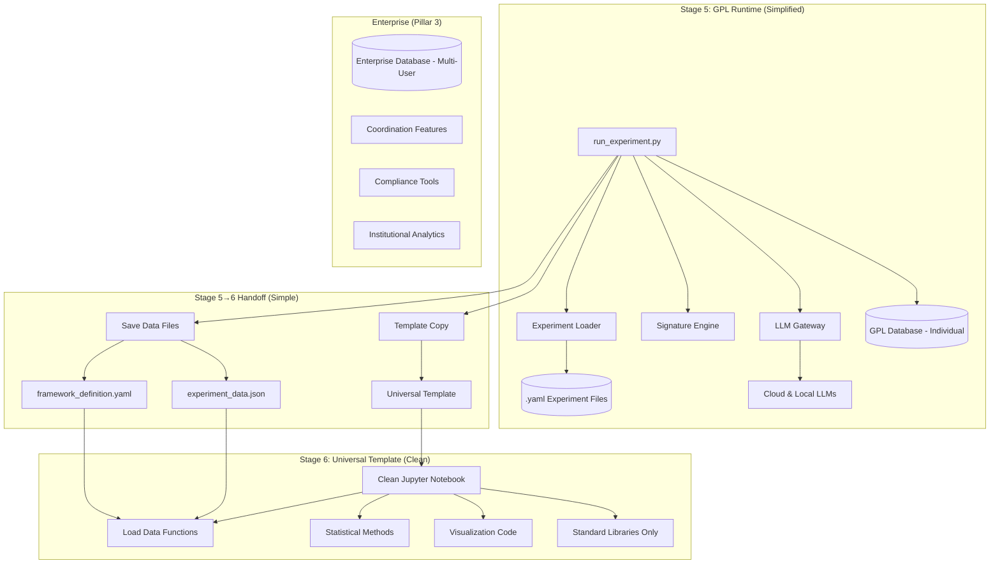

# 02: Technical Implementation Plan

**Status:** Updated Plan v3.0  
**Date:** January 25, 2025  
**Strategic Alignment:** This plan implements the GPL → Pillar 3 Conversion Strategy ("Free Will Trap") through simplified GPL runtime with database scope separation and universal Stage 6 templates.  
**Cross-References:** GPL → Pillar 3 Conversion Strategy, Universal Template Specification

## Core Principle: Simplified GPL, Clean Universal Templates

Our technical philosophy implements the "Free Will Trap" strategy through clear architectural separation:

**GPL Runtime Simplification:**
-   **Keep Core Essential:** Mathematical engines, LLM orchestration, clean data export, individual database
-   **Remove Enterprise Features:** Multi-user coordination, institutional analytics, enterprise compliance  
-   **Perfect Individual Experience:** Researchers get exactly what they want from GPL

**Universal Template Approach:**
-   **Clean Templates:** Simple, executable notebooks that intelligently load experiment data
-   **Standard Libraries:** NumPy, Matplotlib, Pandas - no custom abstractions
-   **Academic Transparency:** Researchers run and understand all code naturally

**Database Scope Separation:**
-   **GPL Database:** Individual research tracking, local analytics, experiment management
-   **Enterprise Database:** Multi-user coordination, institutional features, compliance

**Strategic Outcome:** GPL provides superior individual research experience while natural scaling creates enterprise coordination needs.

## System Architecture Overview

Simplified GPL runtime with universal template approach implementing the "Free Will Trap" strategy.



**Key Architectural Changes:**
- **GPL Database:** Individual research focus only, no enterprise features
- **Enterprise Database:** Multi-user coordination, compliance, institutional analytics
- **Template Approach:** Clean, executable code instead of pre-generated notebooks
- **Strategic Result:** Clear separation enables natural conversion pressure

## Key Technical Components

### 1. GPL Runtime (Individual Focus)

**Experiment Definition (`.yaml` files):**
-   Single source of truth for reproducible analysis
-   Framework Specification v3.2 compliant
-   Clean configuration for universal template consumption

**Core Engine (`discernus/` package):**
-   **Signature Engine:** Mathematical coordinate calculation (core IP)
-   **LLM Gateway:** Provider-agnostic model orchestration
-   **Clean Data Export:** Structured results for template loading
-   **GPL Database:** Individual research tracking only

**GPL Database Schema (Individual Scope):**
```sql
-- Individual researcher workflow support
experiments (id, name, created_at, framework_used)
experiment_runs (id, experiment_id, timestamp, results_path) 
local_analysis_cache (id, text_hash, framework, results)
research_provenance (id, analysis_id, full_lineage)
personal_analytics (experiment_count, total_analyses, research_velocity)
```

**Command Line Runner (`run_experiment.py`):**
-   Executes experiments and triggers simple template handoff
-   No built-in statistical analysis or visualization
-   Perfect for individual researcher workflow

### 2. Universal Template System (Simple)

**Template Copy Process:**
-   Copy universal template to experiment results directory
-   Save experiment data in standard JSON format
-   Copy framework YAML for provenance
-   No complex generation or pre-execution

**Universal Template Features:**
-   **Intelligent Data Loading:** Automatically loads experiment data and framework
-   **Framework Adaptation:** Adapts visualization and analysis to framework structure
-   **Standard Libraries:** NumPy, Matplotlib, Pandas - no custom abstractions
-   **Transparent Code:** All operations visible and modifiable by researchers

### 3. Enterprise Database (Coordination Features)

**Enterprise Database Schema (EXCLUDED from GPL):**
```sql
-- Multi-user coordination features (Pillar 3 only)
multi_user_projects (user_id, project_id, permissions)
institutional_analytics (university_id, department_metrics)
cross_institutional_corpus_sharing (...)
enterprise_compliance_audit_logs (...)
team_collaboration_workflows (...)
```

**Strategic Separation:**
-   GPL database serves individual research needs perfectly
-   Enterprise database provides clear coordination value
-   Natural scaling pressure when individual success requires coordination

## Universal Template Design Principles

Universal templates implement the "Free Will Trap" strategy through excellent individual experience that creates natural scaling challenges.

**Academic Excellence (Individual Researcher Paradise):**
1.  **Transparent Code:** All operations visible and modifiable by researchers
2.  **Standard Libraries:** Built on matplotlib, pandas, numpy - no custom abstractions
3.  **Intelligent Loading:** Automatically loads experiment data and adapts to framework
4.  **Self-Contained:** "Run All Cells" executes without errors after loading data
5.  **Publication Ready:** Academic-quality figures and statistical analysis

**Strategic Scaling Challenges (Natural Pillar 3 Drivers):**
1.  **Notebook Management:** Individual notebooks work perfectly, organizing many becomes complex
2.  **Cross-Experiment Analysis:** Manual data integration across multiple experiment folders
3.  **Team Collaboration:** Version control and sharing challenges with many notebooks
4.  **Research Program Organization:** Individual experiments easy, program-level coordination hard
5.  **Institutional Compliance:** Personal research simple, institutional requirements complex

**Implementation Strategy:**
```python
# Universal Template Structure
# 1. Data loading functions (intelligent adaptation)
# 2. Framework introspection (automatic configuration)
# 3. Standard statistical methods (transparent operations)
# 4. Flexible visualization (researcher-controllable)
# 5. Export utilities (academic standards)
```

**Strategic Outcome:** Excellent individual experience with transparent code that researchers trust, while natural research success creates coordination needs only enterprise can solve. 