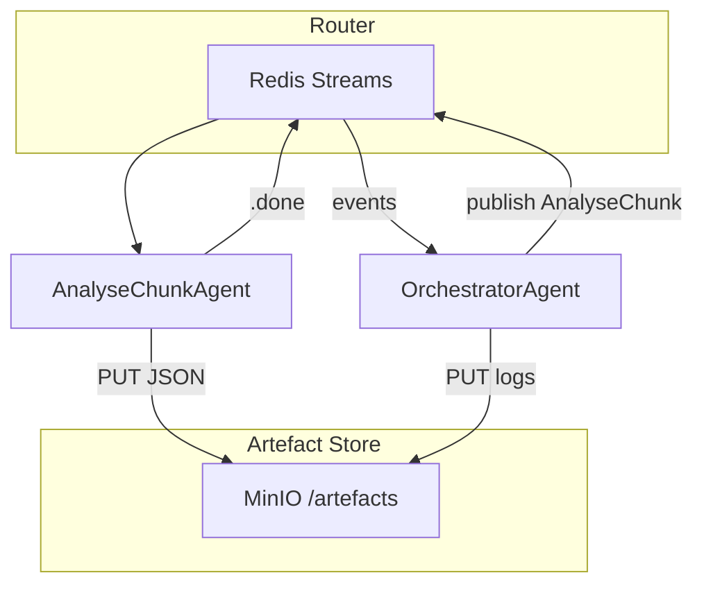

# Discernus Thin‑Orchestration PoC – Implementation Brief

## 1 · Objective

Stand up a **minimal, reproducible pipeline** that demonstrates the *THIN* architecture:

- **No bespoke parsers** for frameworks or outputs.
- **Artefact‑oriented caching** so finished LLM calls are never repeated.
- **Abort / resume** and **cost‑guard** controls proven in practice.

The PoC targets a 10‑document sample corpus and a single uploaded framework (CAF\_v4.3) running on one LiteLLM model.

---

## 2 · Core Concepts (Glossary)

| Term                  | Plain‑English meaning                                                                        |
| --------------------- | -------------------------------------------------------------------------------------------- |
| **Redis Stream**      | A shared append‑only task list.                                                              |
| **MinIO**             | Local S3‑compatible object store for artefacts.                                              |
| **Artefact**          | Any file (JSON, Parquet, prompt) saved by SHA‑256.                                           |
| **Router**            | 150‑line Python service that moves tasks between Redis streams—nothing else.                 |
| **Agent**             | Stateless container whose entrypoint is *“read task → call LLM with prompt → write result.”* |
| **OrchestratorAgent** | The *only* reasoning component; decides which tasks to queue next.                           |

---

## 3 · PoC Scope & Non‑Goals

### In‑Scope

1. Skeleton Router (Redis Streams).
2. Local MinIO + tiny CLI (`put|get|lookup`).
3. Two agents: **AnalyseChunkAgent** & **OrchestratorAgent**.
4. Artefact hashing + cache check.
5. Pause / resume via Redis `run_status`.
6. Live vs dev mode cost guard (Lua script).

### Out‑of‑Scope (for now)

- ValidationAgent, non‑deterministic averaging, composite synthesis, PostHocMathAgent.
- Multi‑framework support beyond CAF\_v4.3.

---

## 4 · Architecture Overview



---

## 5 · Implementation Phases & Estimates

| #     | Deliverable                      | Timebox (hrs) | Key Tasks                                                                                                                                                     |
| ----- | -------------------------------- | ------------- | ------------------------------------------------------------------------------------------------------------------------------------------------------------- |
| **1** | **Skeleton Router**              | 2             | • Set up Redis Streams `tasks` / `tasks.done`.• Consumer group example.                                                                                       |
| **2** | **Artefact Registry CLI**        | 2             | • MinIO docker‑compose.• CLI commands: `put`, `get`, `lookup`.                                                                                                |
| **3** | **Agents & Prompts**             | 4             | • Externalise prompts to `agents/*/prompt.yaml`.• AnalyseChunkAgent splits corpus, calls LiteLLM proxy.• OrchestratorAgent hard‑codes simple linear pipeline. |
| **4** | **Cache & Resume**               | 2             | • SHA‑256 before enqueue.• Redis key `run:{id}:status` (RUNNING/PAUSED).                                                                                      |
| **5** | **Cost Guard** (optional in PoC) | 2             | • Pre‑run cost estimate via LiteLLM `/pricing`.• Lua script aborts run if `spent > cap` in live mode.                                                         |

*Total*: **12 hrs dev time**.

---

## 6 · Acceptance Criteria

1. **Run Success**: `discernus run experiment.yaml --mode live` completes, producing analysis JSON artefacts and a run log in MinIO.
2. **Pause / Resume**: While RUNNING, `discernus pause <run_id>` pauses; `discernus resume <run_id>` completes without duplicate LLM calls (verified via LiteLLM proxy logs).
3. **Cache Hit**: Re‑running the identical experiment makes **zero** LLM calls.
4. **Cost Prompt** (live mode): CLI displays estimated \$ cost and requires `y/N` confirmation.
5. **Dev Mode**: `--mode dev` auto‑confirms and bypasses cost guard.

---

## 7 · Example Commands

```bash
# Start infra
$ docker compose up -d redis minio

# Put sample corpus & framework
$ discernus artefact put data/corpus/sample1.txt
$ discernus artefact put frameworks/CAF_v4.3.md

# Run experiment (live)
$ discernus run experiments/caf_sample.yaml --mode live

# Pause mid‑run
$ discernus pause RUN123
# Resume
$ discernus resume RUN123

# Re‑run (should hit cache)
$ discernus run experiments/caf_sample.yaml --mode live
```

---

## 8 · Next‑Step Wishlist (post‑PoC)

1. Precision‑aware normaliser & framework `precision` field.
2. `non_deterministic` averaging and `runs_per_chunk`.
3. ValidationAgent for custom schemas.
4. PostHocMathAgent for retro metrics.
5. Composite framework synthesis.

---

*Questions → Jeff • Last updated 2025‑07‑22*

---

## Environment: venv first (Docker optional)

You already run Redis locally and are comfortable with Python `venv`, so the PoC defaults to **pure‑venv**. Docker remains an optional convenience—handy if you (or a future contributor) want a one‑liner setup, but *not required*.

| Option                                                          | When to use                            | Quick start |
| --------------------------------------------------------------- | -------------------------------------- | ----------- |
| **venv (default)**                                              | Solo dev box with Redis pre‑installed. | \`\`\`bash  |
| python3 -m venv .venv && source .venv/bin/activate              |                                        |             |
| pip install -r requirements.txt  # includes redis, minio, boto3 |                                        |             |

## start MinIO locally or point to an S3 bucket

export AWS\_ENDPOINT\_URL=[http://localhost:9000](http://localhost:9000)  # if using MinIO python router.py  # starts thin router

````|
| **Docker / Compose** | You need a reproducible package of Redis + MinIO + router in one command or intend to ship to a teammate/server. | ```bash
# optional
docker compose up  # spins Redis, MinIO, router service
``` |

> **Tip**  
> Even in venv mode you can run MinIO as a single binary: `minio server /data &`. Nothing else changes in the code.

---

---
## Appendix A · End‑to‑End Walk‑through (Successful PoC Run)

*This appendix is **executable** as‑written on macOS/Linux once the repo is cloned. Replace `<YOUR_PATH>` as needed.*

### A. Directory layout (after cloning repo)
```text
Discernus/
├─ agents/
│  ├─ AnalyseChunkAgent/
│  │   ├─ prompt_v1.yaml
│  │   └─ config.json
│  ├─ OrchestratorAgent/
│  │   └─ prompt_v1.yaml
│  └─ _shared_utils/
│  |   └─ json_normalise.py
├─ frameworks/
│  └─ caf_v4.3.md                # sample framework
├─ corpus/
│  ├─ 01.txt                     # 10 tiny files, <2 KB each
│  └─ …
├─ experiments/
│  └─ caf_demo.yaml
├─ scripts/
│  ├─ router.py                  # 150‑line Redis stream router
│  ├─ registry_cli.py            # put/get/lookup artefacts
│  └─ discernus_cli.py           # run, pause, resume wrapper
├─ requirements.txt
└─ README.md
```

### B. One‑time environment bootstrap (venv route)
```bash
python3 -m venv .venv && source .venv/bin/activate
pip install -r requirements.txt  # redis~=5.0, boto3, litellm, pyyaml, typer, minio
# Ensure Redis is running (homebrew/apt)
redis-server --daemonize yes  # or brew services start redis

# Start standalone MinIO (artefact bucket)
wget https://dl.min.io/server/minio/release/linux-amd64/minio
chmod +x minio && ./minio server /tmp/minio &
export MINIO_ROOT_USER=minio MINIO_ROOT_PASSWORD=minio123
```

> **Note** : If you already have an S3 bucket handy, export `AWS_ACCESS_KEY_ID`, `AWS_SECRET_ACCESS_KEY`, and skip MinIO.

### C. Initialise artefact bucket and test CLI
```bash
python scripts/registry_cli.py init-bucket  # idempotent
python scripts/registry_cli.py put frameworks/caf_v4.3.md
# → Stored ➜ sha256:ab12…9f  path: s3://discernus-artifacts/frameworks/ab12…9f
```

### D. Key file contents (abbreviated snippets)

**agents/AnalyseChunkAgent/prompt_v1.yaml**
```yaml
system: |
  You are AnalyseChunkAgent. Your job is to score a text chunk using the provided framework.
  • Never invent keys not present in `framework_spec`.
  • Output a single JSON object **without Markdown fencing**.
user: |
  <<framework_spec>>
  ---
  <<text_chunk>>
  ---
  Respond with JSON.
```

**agents/AnalyseChunkAgent/config.json**
```json
{
  "model": "gpt-4o-mini",
  "temperature": 0.0,
  "max_tokens": 1024
}
```

**scripts/router.py (excerpt)**
```python
# ... imports ...
STREAM = "tasks"
DONE   = "tasks.done"

def main():
    r = redis.Redis()
    while True:
        msg = r.xreadgroup("discernus", "router", {STREAM: ">"}, count=1, block=5000)
        if not msg:
            continue
        stream, entries = msg[0]
        _id, data = entries[0]
        task_type = data[b"type"].decode()
        if task_type == "analyse":
            subprocess.Popen(["python", "agents/AnalyseChunkAgent/run.py", _id.decode()])
        # ... additional task routes ...
        r.xadd(DONE, data, id="*")
```

**scripts/registry_cli.py (commands implemented with Typer)**
```bash
registry_cli.py init-bucket          # create artefact bucket if absent
registry_cli.py put <file>           # upload and print sha256
registry_cli.py get <sha> <dest>     # download
registry_cli.py list <run_id>        # list artefacts for run
```

### E. Demo experiment spec (`experiments/caf_demo.yaml`)
```yaml
name: caf_demo
framework_file: frameworks/caf_v4.3.md
corpus_dir: corpus/
model: gpt-4o-mini
mode: dev                # skips cost prompt
run_id: RUN1             # CLI auto‑generates if omitted
budget_cap: 1.00         # USD, ignored in dev mode
```

### F. Kick off the run
```bash
python scripts/discernus_cli.py run experiments/caf_demo.yaml
# Console →
# [Orchestrator] RUN1 created (mode=dev)
# Queued 10 analyse tasks (10 corpus × 1 framework)
# [AnalyseChunkAgent:01] cache MISS ➜ calling LLM (512 prompt tokens)
# ...
# [Orchestrator] synthesis task queued
# [SynthesisAgent] result sha256:f9a… uploaded
# RUN1 COMPLETE ✔  cost=$0.26  elapsed=45s
```

### G. Pause / resume
```bash
python scripts/discernus_cli.py pause RUN1
# → status: PAUSED, tasks_inflight=3
python scripts/discernus_cli.py resume RUN1
# → skipped 7 cached artefacts, completed remaining 3, run COMPLETE
```

### H. Cost guard (live mode)
```bash
python scripts/discernus_cli.py run experiments/caf_demo.yaml --mode live
# Orchestrator: estimated cost $0.27 (cap $1.00). Continue? [y/N] n
# Aborted – no tasks queued
```

### I. Post‑hoc metric (retro)
```bash
python scripts/discernus_cli.py add_metric \
    --run RUN1 \
    --math_script scripts/tension_metric_v2.py
# → PostHocMathAgent output sha256:c2d… (column `tension_score`)
```

### J. Artefact verification
```bash
registry_cli.py list RUN1
# sha256:e13… 01_analysis.json
# ... (10 lines)
# sha256:f9a… synthesis.parquet
registry_cli.py get sha256:f9a… /tmp/synthesis.parquet
```

---

## Appendix B · Task Message Schema (JSON)
Every agent agrees on this minimal schema for Redis stream messages:
```jsonc
{
  "task_id"      : "ANL-01-abcdef",   // uuid
  "run_id"       : "RUN1",
  "type"         : "analyse",         // analyse | synth | math | ...
  "payload_uri"  : "s3://discernus-artifacts/tmp/01.txt", // or list of URIs
  "framework_sha": "ab12…9f",        // SHA of framework file
  "model_id"     : "gpt-4o-mini",
  "reply_to"     : "tasks.done"
}
```
Agents must **echo** the full message plus any `result_sha` when pushing to `tasks.done`.

---

### Ready‑to‑copy acceptance script (bash)
```bash
# 0. bootstrap env (see §B), then:
make quicktest  # alias that runs: clean → run → pause → resume → rerun
# Success = "ALL TESTS PASS" banner.
```

---
_Last updated 2025‑07‑22 by Jeff_

````
