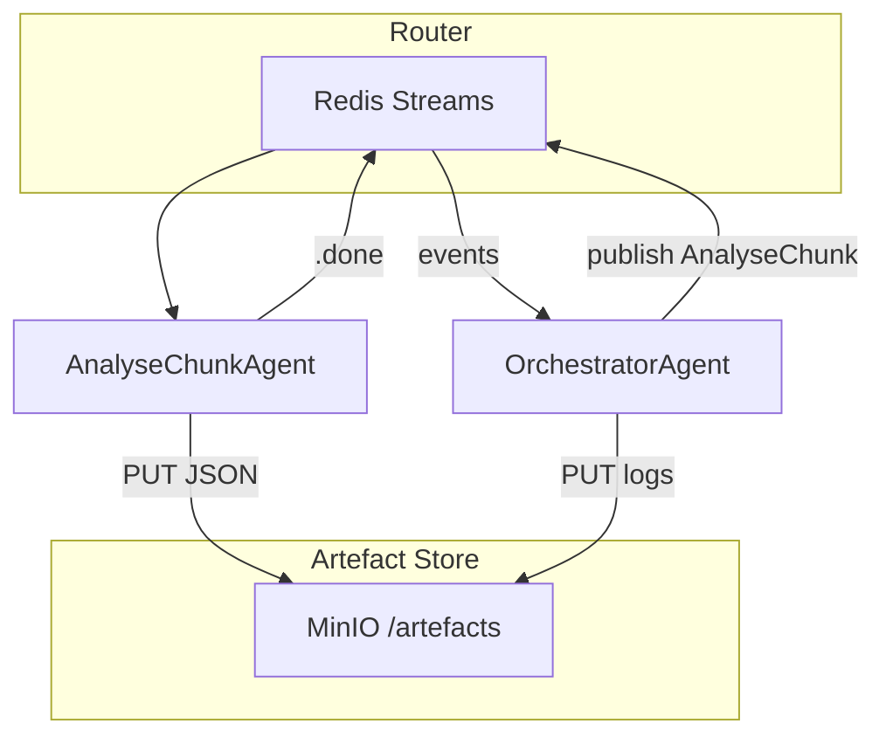

# Discernus Thin‑Orchestration PoC – Implementation Brief

## 1 · Objective

Stand up a **minimal, reproducible pipeline** that demonstrates the *THIN* architecture:

- **No bespoke parsers** for frameworks or outputs.
- **Artefact‑oriented caching** so finished LLM calls are never repeated.
- **Abort / resume** and **cost‑guard** controls proven in practice.

The PoC targets a 10‑document sample corpus and a single uploaded framework (CAF\_v4.3) running on one LiteLLM model.

---

## 2 · Core Concepts (Glossary)

| Term                  | Plain‑English meaning                                                                        |
| --------------------- | -------------------------------------------------------------------------------------------- |
| **Redis Stream**      | A shared append‑only task list.                                                              |
| **MinIO**             | Local S3‑compatible object store for artefacts.                                              |
| **Artefact**          | Any file (JSON, Parquet, prompt) saved by SHA‑256.                                           |
| **Router**            | 150‑line Python service that moves tasks between Redis streams—nothing else.                 |
| **Agent**             | Stateless container whose entrypoint is *“read task → call LLM with prompt → write result.”* |
| **OrchestratorAgent** | The *only* reasoning component; decides which tasks to queue next.                           |

---

## 3 · PoC Scope & Non‑Goals

### In‑Scope

1. Skeleton Router (Redis Streams).
2. Local MinIO + tiny CLI (`put|get|lookup`).
3. Two agents: **AnalyseChunkAgent** & **OrchestratorAgent**.
4. Artefact hashing + cache check.
5. Pause / resume via Redis `run_status`.
6. Live vs dev mode cost guard (Lua script).

### Out‑of‑Scope (for now)

- ValidationAgent, non‑deterministic averaging, composite synthesis, PostHocMathAgent.
- Multi‑framework support beyond CAF\_v4.3.

---

## 4 · Architecture Overview



---

## 5 · Implementation Phases & Estimates

| #     | Deliverable                      | Timebox (hrs) | Key Tasks                                                                                                                                                     |
| ----- | -------------------------------- | ------------- | ------------------------------------------------------------------------------------------------------------------------------------------------------------- |
| **1** | **Skeleton Router**              | 2             | • Set up Redis Streams `tasks` / `tasks.done`.• Consumer group example.                                                                                       |
| **2** | **Artefact Registry CLI**        | 2             | • MinIO docker‑compose.• CLI commands: `put`, `get`, `lookup`.                                                                                                |
| **3** | **Agents & Prompts**             | 4             | • Externalise prompts to `agents/*/prompt.yaml`.• AnalyseChunkAgent splits corpus, calls LiteLLM proxy.• OrchestratorAgent hard‑codes simple linear pipeline. |
| **4** | **Cache & Resume**               | 2             | • SHA‑256 before enqueue.• Redis key `run:{id}:status` (RUNNING/PAUSED).                                                                                      |
| **5** | **Cost Guard** (optional in PoC) | 2             | • Pre‑run cost estimate via LiteLLM `/pricing`.• Lua script aborts run if `spent > cap` in live mode.                                                         |

*Total*: **12 hrs dev time**.

---

## 6 · Acceptance Criteria

1. **Run Success**: `discernus run experiment.yaml --mode live` completes, producing analysis JSON artefacts and a run log in MinIO.
2. **Pause / Resume**: While RUNNING, `discernus pause <run_id>` pauses; `discernus resume <run_id>` completes without duplicate LLM calls (verified via LiteLLM proxy logs).
3. **Cache Hit**: Re‑running the identical experiment makes **zero** LLM calls.
4. **Cost Prompt** (live mode): CLI displays estimated \$ cost and requires `y/N` confirmation.
5. **Dev Mode**: `--mode dev` auto‑confirms and bypasses cost guard.

---

## 7 · Example Commands

```bash
# Start infra
$ docker compose up -d redis minio

# Put sample corpus & framework
$ discernus artefact put data/corpus/sample1.txt
$ discernus artefact put frameworks/CAF_v4.3.md

# Run experiment (live)
$ discernus run experiments/caf_sample.yaml --mode live

# Pause mid‑run
$ discernus pause RUN123
# Resume
$ discernus resume RUN123

# Re‑run (should hit cache)
$ discernus run experiments/caf_sample.yaml --mode live
```

---

## 8 · Next‑Step Wishlist (post‑PoC)

1. Precision‑aware normaliser & framework `precision` field.
2. `non_deterministic` averaging and `runs_per_chunk`.
3. ValidationAgent for custom schemas.
4. PostHocMathAgent for retro metrics.
5. Composite framework synthesis.

---

*Questions → Jeff • Last updated 2025‑07‑22*

---

## Technical Implementation Scaffolding

### Redis Streams - Concrete Patterns

**Setup Commands (run once):**
```bash
# Create consumer group
redis-cli XGROUP CREATE tasks discernus $ MKSTREAM
redis-cli XGROUP CREATE tasks.done discernus $ MKSTREAM
```

**Router Core Loop (scripts/router.py):**
```python
import redis
import json

r = redis.Redis(host='localhost', port=6379, db=0)

def router_main_loop():
    while True:
        # Read completed tasks
        msgs = r.xreadgroup('discernus', 'router', 
                           {'tasks.done': '>'}, count=1, block=1000)
        
        for stream, messages in msgs:
            for msg_id, fields in messages:
                task = json.loads(fields[b'data'])
                handle_completed_task(task)
                r.xack('tasks.done', 'discernus', msg_id)
        
        # Route new tasks (orchestrator decides what goes where)
        # Router just moves tasks between streams - NO LOGIC

def enqueue_task(task_type, task_data):
    """Simple task publisher - called by OrchestratorAgent"""
    r.xadd('tasks', {'type': task_type, 'data': json.dumps(task_data)})

def complete_task(task_id, result_data):
    """Called by agents when done"""
    r.xadd('tasks.done', {'task_id': task_id, 'data': json.dumps(result_data)})
```

### Thin Agent Wrapper Pattern

**agents/AnalyseChunkAgent/main.py (25 lines total):**
```python
#!/usr/bin/env python3
import redis, json, yaml, os
from litellm import completion
from minio_client import get_artifact, put_artifact

def main():
    r = redis.Redis()
    
    while True:
        # Get task (blocking read)
        msgs = r.xreadgroup('discernus', 'analyze-chunk', 
                           {'tasks': '>'}, count=1, block=0)
        
        for stream, messages in msgs:
            for msg_id, fields in messages:
                task = json.loads(fields[b'data'])
                
                # Get artifacts (no parsing - just retrieval)
                chunk_text = get_artifact(task['chunk_hash'])
                framework_text = get_artifact(task['framework_hash'])
                
                # Load prompt template
                with open('prompt.yaml') as f:
                    prompt = yaml.safe_load(f)['template']
                
                # Call LLM (thin wrapper)
                response = completion(
                    model=task['model'],
                    messages=[{"role": "user", "content": 
                              prompt.format(framework=framework_text, chunk=chunk_text)}]
                )
                
                # Store result (no processing/parsing)
                result_hash = put_artifact(response.choices[0].message.content)
                
                # Signal completion
                r.xadd('tasks.done', {
                    'original_task_id': msg_id,
                    'result_hash': result_hash,
                    'status': 'complete'
                })
                r.xack('tasks', 'analyze-chunk', msg_id)

if __name__ == '__main__':
    main()
```

### MinIO Client (minio_client.py)

```python
from minio import Minio
import hashlib
import os

client = Minio('localhost:9000',
               access_key=os.getenv('MINIO_ROOT_USER', 'minio'),
               secret_key=os.getenv('MINIO_ROOT_PASSWORD', 'minio123'),
               secure=False)

BUCKET = 'discernus-artifacts'

def put_artifact(content: str) -> str:
    """Store content, return SHA256 hash"""
    content_bytes = content.encode('utf-8')
    hash_id = hashlib.sha256(content_bytes).hexdigest()
    
    # Check if already exists (cache hit)
    try:
        client.stat_object(BUCKET, hash_id)
        return hash_id  # Already exists
    except:
        pass
    
    # Store new artifact
    from io import BytesIO
    client.put_object(BUCKET, hash_id, BytesIO(content_bytes), len(content_bytes))
    return hash_id

def get_artifact(hash_id: str) -> str:
    """Retrieve content by hash"""
    response = client.get_object(BUCKET, hash_id)
    return response.read().decode('utf-8')

def artifact_exists(hash_id: str) -> bool:
    """Check cache without downloading"""
    try:
        client.stat_object(BUCKET, hash_id)
        return True
    except:
        return False
```

### External Prompt Pattern

**agents/AnalyseChunkAgent/prompt.yaml:**
```yaml
version: 1.0
template: |
  You are analyzing a text chunk using this analytical framework:

  FRAMEWORK:
  {framework}

  TEXT TO ANALYZE:
  {chunk}

  Please provide your analysis as a JSON object with the framework's specified dimensions.
  Be thorough but concise. Follow the framework's measurement scales exactly.

# No complex prompt processing - just string formatting
```

### LLM Orchestrator Agent Pattern

**agents/OrchestratorAgent/main.py:**
```python
#!/usr/bin/env python3
import redis, json, yaml
from litellm import completion
from minio_client import get_artifact, put_artifact

def main():
    r = redis.Redis()
    
    # Get orchestration task
    msgs = r.xreadgroup('discernus', 'orchestrator', 
                       {'orchestrator.tasks': '>'}, count=1, block=0)
    
    for stream, messages in msgs:
        for msg_id, fields in messages:
            experiment = json.loads(fields[b'data'])
            
            # Load orchestrator prompt
            with open('orchestrator_prompt.yaml') as f:
                prompt = yaml.safe_load(f)['template']
            
            # Ask LLM what tasks to create
            planning_response = completion(
                model="gpt-4o-mini",
                messages=[{"role": "user", "content": 
                          prompt.format(experiment=json.dumps(experiment, indent=2))}]
            )
            
            # LLM returns task specifications
            # NO PARSING - just execute what LLM says
            tasks = json.loads(planning_response.choices[0].message.content)
            
            for task in tasks['task_queue']:
                r.xadd('tasks', {
                    'type': task['type'],
                    'data': json.dumps(task['params'])
                })
            
            r.xack('orchestrator.tasks', 'orchestrator', msg_id)

if __name__ == '__main__':
    main()
```

### Critical Anti-Pattern Guards

**What Cursor Agents Must NOT Do:**
```python
# ❌ THICK - Don't parse framework structure
if framework_data['type'] == 'CFF':
    dimensions = parse_cff_dimensions(framework_data)

# ✅ THIN - Let LLM handle framework understanding
llm_response = completion(messages=[{
    "role": "user", 
    "content": f"Framework: {framework_text}\nChunk: {chunk_text}\nAnalyze:"
}])

# ❌ THICK - Don't parse LLM responses
json_response = extract_json_from_markdown(llm_output)

# ✅ THIN - Store raw response, let next LLM handle it
put_artifact(llm_response.choices[0].message.content)
```

### Orchestrator Prompt Template

**agents/OrchestratorAgent/orchestrator_prompt.yaml:**
```yaml
version: 1.0
template: |
  You are the Discernus experiment orchestrator. Your job is to create a task queue for this experiment:

  EXPERIMENT SPECIFICATION:
  {experiment}

  Based on this experiment, return a JSON object with a "task_queue" array containing the tasks needed.

  For each corpus file, you should create an "analyze_chunk" task. Then create a "synthesize_results" task.

  Example response format:
  {{
    "task_queue": [
      {{
        "type": "analyze_chunk",
        "params": {{
          "chunk_hash": "sha256:abc123...",
          "framework_hash": "sha256:def456...", 
          "model": "gpt-4o-mini",
          "chunk_name": "01.txt"
        }}
      }},
      {{
        "type": "synthesize_results", 
        "params": {{
          "analysis_hashes": ["sha256:result1...", "sha256:result2..."],
          "framework_hash": "sha256:def456...",
          "model": "gpt-4o"
        }}
      }}
    ]
  }}

  Be intelligent about parallelization - multiple analyze_chunk tasks can run simultaneously.
  Only create synthesis after all analysis tasks are complete.
  
  Return only the JSON object, no additional text.
```

### CLI Patterns

**scripts/discernus_cli.py:**
```python
#!/usr/bin/env python3
import sys, yaml, redis, json
from minio_client import put_artifact, artifact_exists
import os, hashlib

def hash_file(filepath):
    with open(filepath, 'rb') as f:
        return hashlib.sha256(f.read()).hexdigest()

def run_experiment(experiment_file, mode='dev'):
    with open(experiment_file) as f:
        experiment = yaml.safe_load(f)
    
    # Pre-hash all artifacts
    framework_hash = put_artifact(open(experiment['framework_file']).read())
    
    corpus_hashes = {}
    for txt_file in os.listdir(experiment['corpus_dir']):
        if txt_file.endswith('.txt'):
            content = open(f"{experiment['corpus_dir']}/{txt_file}").read()
            corpus_hashes[txt_file] = put_artifact(content)
    
    # Check cache - if ALL expected results exist, skip
    expected_results = []
    for chunk_name in corpus_hashes.keys():
        # Predict result hash based on inputs (this is why THIN works!)
        input_combo = framework_hash + corpus_hashes[chunk_name] + experiment['model']
        expected_hash = hashlib.sha256(input_combo.encode()).hexdigest()
        
        if not artifact_exists(expected_hash):
            break
        expected_results.append(expected_hash)
    else:
        print(f"✅ Cache hit - experiment already complete!")
        return expected_results
    
    # Cost estimation (if live mode)
    if mode == 'live':
        estimated_cost = estimate_cost(corpus_hashes, experiment['model'])
        response = input(f"Estimated cost: ${estimated_cost:.2f} - Continue? [y/N]: ")
        if response.lower() != 'y':
            print("Aborted by user")
            return
    
    # Queue orchestrator task
    r = redis.Redis()
    orchestrator_task = {
        'experiment': experiment,
        'framework_hash': framework_hash,
        'corpus_hashes': corpus_hashes
    }
    
    r.xadd('orchestrator.tasks', {'data': json.dumps(orchestrator_task)})
    print(f"🚀 Experiment queued - run ID: {experiment['name']}")

def pause_experiment(run_id):
    r = redis.Redis()
    r.set(f'run:{run_id}:status', 'PAUSED')
    print(f"⏸️  Paused {run_id}")

def resume_experiment(run_id):
    r = redis.Redis()
    r.set(f'run:{run_id}:status', 'RUNNING')  
    print(f"▶️  Resumed {run_id}")

if __name__ == '__main__':
    if sys.argv[1] == 'run':
        mode = 'live' if '--mode=live' in sys.argv else 'dev'
        run_experiment(sys.argv[2], mode)
    elif sys.argv[1] == 'pause':
        pause_experiment(sys.argv[2])
    elif sys.argv[1] == 'resume':
        resume_experiment(sys.argv[2])
```

---

## Environment: venv first (Docker optional)

You already run Redis locally and are comfortable with Python `venv`, so the PoC defaults to **pure‑venv**. Docker remains an optional convenience—handy if you (or a future contributor) want a one‑liner setup, but *not required*.

| Option                                                          | When to use                            | Quick start |
| --------------------------------------------------------------- | -------------------------------------- | ----------- |
| **venv (default)**                                              | Solo dev box with Redis pre‑installed. | \`\`\`bash  |
| python3 -m venv .venv && source .venv/bin/activate              |                                        |             |
| pip install -r requirements.txt  # includes redis, minio, boto3 |                                        |             |

## start MinIO locally or point to an S3 bucket

export AWS\_ENDPOINT\_URL=[http://localhost:9000](http://localhost:9000)  # if using MinIO python router.py  # starts thin router

````|
| **Docker / Compose** | You need a reproducible package of Redis + MinIO + router in one command or intend to ship to a teammate/server. | ```bash
# optional
docker compose up  # spins Redis, MinIO, router service
``` |

> **Tip**  
> Even in venv mode you can run MinIO as a single binary: `minio server /data &`. Nothing else changes in the code.

---

---
## Appendix A · End‑to‑End Walk‑through (Successful PoC Run)

### A. Directory layout (after cloning repo)
````

Discernus/ ├─ agents/ │  ├─ AnalyseChunkAgent/ │  │   ├─ prompt\_v1.yaml │  │   └─ config.json │  ├─ OrchestratorAgent/ │  │   └─ prompt\_v1.yaml │  └─ \_shared\_utils/ │      └─ json\_normalise.py ├─ frameworks/ │  └─ caf\_v4.3.md            # sample framework ├─ corpus/ │  ├─ 01.txt │  ├─ 02.txt │  └─ … (total 10 files) ├─ experiments/ │  └─ caf\_demo.yaml ├─ scripts/ │  ├─ router.py              # 150‑line Redis stream router │  └─ registry\_cli.py        # put/get/lookup artefacts ├─ requirements.txt └─ README.md

````

### B. One‑time environment bootstrap (venv route)
```bash
$ python3 -m venv .venv
$ source .venv/bin/activate
$ pip install -r requirements.txt    # redis, minio, litellm, pyyaml, etc.

# Ensure Redis is running (homebrew, apt, or service)
$ redis-server --daemonize yes

# Start a local MinIO bucket for artefacts
$ wget https://dl.min.io/server/minio/release/linux-amd64/minio
$ chmod +x minio && ./minio server /tmp/minio &
# Export creds for CLI access
$ export MINIO_ROOT_USER=minio MINIO_ROOT_PASSWORD=minio123
````

### C. Create artefact registry bucket & test CLI

```bash
$ python scripts/registry_cli.py put frameworks/caf_v4.3.md
Stored ➜ sha256:ab12…9f
```

### D. Inspect the demo experiment spec (`experiments/caf_demo.yaml`)

```yaml
name: caf_demo
framework_file: frameworks/caf_v4.3.md
corpus_dir: corpus/
model: gpt-4o-mini
mode: dev              # auto‑confirm, no budget cap
runs_per_chunk: 1
precision: 6
budget_cap: 1.00       # ignored in dev mode
```

### E. Kick off the run

```bash
$ python scripts/discernus_cli.py experiments/caf_demo.yaml
[Orchestrator] Estimated cost: $0.27   (dev mode ➜ auto‑continue)
[Router] task queued: analyse:01.txt
[AnalyseChunkAgent] chunk 01.txt hashed ➜ sha256:e13…
[Router] … (repeat for 10 chunks)
[Orchestrator] synthesis queued
[SynthesisAgent] output ➜ sha256:f9a… saved to s3://discernus‑artifacts/caf_demo/synthesis.parquet
Run caf_demo COMPLETE ✔  cost=$0.26, duration=42 s
```

### F. Pause / resume demo

```bash
# In new terminal
$ python scripts/discernus_cli.py pause caf_demo
Paused run caf_demo. 3 tasks still in‑flight.
# Wait a moment, verify Redis run_status = PAUSED
$ python scripts/discernus_cli.py resume caf_demo
Resuming… Skipped 7 cached chunks (hash present). Remaining queued: 0
Run caf_demo COMPLETE ✔ (resume)
```

### G. Cost guard (live mode)

```bash
$ python scripts/discernus_cli.py experiments/caf_demo.yaml --mode live
Estimated cost: $0.27 (cap $1.00)  Continue? [y/N] n
Aborted by user – no tasks queued.
```

### H. Inspect artefacts & provenance

```bash
# List artefacts for run
$ python scripts/registry_cli.py list caf_demo
sha256:e13… 01_analysis.json
sha256:…     …
sha256:f9a… synthesis.parquet

# Pull synthesis to local R notebook
$ python scripts/registry_cli.py get sha256:f9a… /tmp/results.parquet
```

### I. Retro‑metric / Post‑hoc math

```bash
$ python scripts/discernus_cli.py add_metric \
      --input_run caf_demo \
      --math_script scripts/tension_metric_v2.py
PostHocMathAgent ➜ output sha256:c2d…  added column `tension_score`
```

You’ve now validated every thin‑stack capability:

- **LLM analysis cached** – resume skipped duplicates
- **Budget prompt** – live mode requires consent
- **Pause / resume** – safe recovery proven
- **Artefact registry** – synthesis pulled to laptop
- **Post‑hoc metric** – additive, no rerun of analysis

Share these commands verbatim with Cursor; they form the acceptance test for the PoC.

