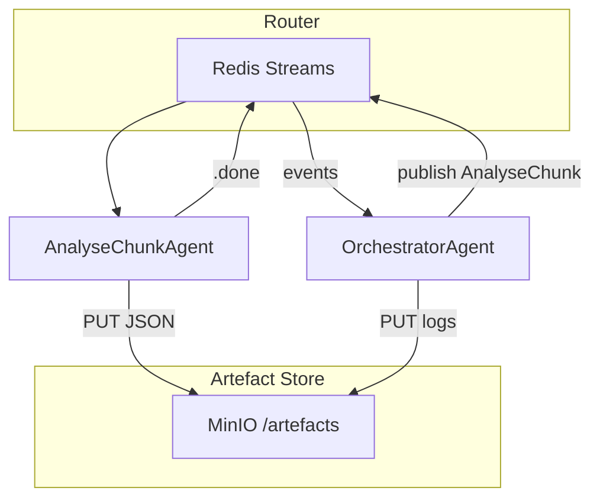

# Discernus Thin‑Orchestration PoC – Implementation Brief

## 1 · Objective

Stand up a **minimal, reproducible pipeline** that demonstrates the *THIN* architecture:

- **No bespoke parsers** for frameworks or outputs.
- **Artefact‑oriented caching** so finished LLM calls are never repeated.
- **Abort / resume** and **cost‑guard** controls proven in practice.

The PoC targets a 10‑document sample corpus and a single uploaded framework (CAF\_v4.3) running on one LiteLLM model.

---

## 2 · Core Concepts (Glossary)

| Term                  | Plain‑English meaning                                                                        |
| --------------------- | -------------------------------------------------------------------------------------------- |
| **Redis Stream**      | A shared append‑only task list.                                                              |
| **MinIO**             | Local S3‑compatible object store for artefacts.                                              |
| **Artefact**          | Any file (JSON, Parquet, prompt) saved by SHA‑256.                                           |
| **Router**            | 150‑line Python service that moves tasks between Redis streams—nothing else.                 |
| **Agent**             | Stateless container whose entrypoint is *“read task → call LLM with prompt → write result.”* |
| **OrchestratorAgent** | The *only* reasoning component; decides which tasks to queue next.                           |

---

## 3 · PoC Scope & Non‑Goals

### In‑Scope

1. Skeleton Router (Redis Streams).
2. Local MinIO + tiny CLI (`put|get|lookup`).
3. Two agents: **AnalyseChunkAgent** & **OrchestratorAgent**.
4. Artefact hashing + cache check.
5. Pause / resume via Redis `run_status`.
6. Live vs dev mode cost guard (Lua script).

### Out‑of‑Scope (for now)

- ValidationAgent, non‑deterministic averaging, composite synthesis, PostHocMathAgent.
- Multi‑framework support beyond CAF\_v4.3.

---

## 4 · Architecture Overview



---

## 5 · Implementation Phases & Estimates

| #     | Deliverable                      | Timebox (hrs) | Key Tasks                                                                                                                                                     |
| ----- | -------------------------------- | ------------- | ------------------------------------------------------------------------------------------------------------------------------------------------------------- |
| **1** | **Skeleton Router**              | 2             | • Set up Redis Streams `tasks` / `tasks.done`.• Consumer group example.                                                                                       |
| **2** | **Artefact Registry CLI**        | 2             | • MinIO docker‑compose.• CLI commands: `put`, `get`, `lookup`.                                                                                                |
| **3** | **Agents & Prompts**             | 4             | • Externalise prompts to `agents/*/prompt.yaml`.• AnalyseChunkAgent splits corpus, calls LiteLLM proxy.• OrchestratorAgent hard‑codes simple linear pipeline. |
| **4** | **Cache & Resume**               | 2             | • SHA‑256 before enqueue.• Redis key `run:{id}:status` (RUNNING/PAUSED).                                                                                      |
| **5** | **Cost Guard** (optional in PoC) | 2             | • Pre‑run cost estimate via LiteLLM `/pricing`.• Lua script aborts run if `spent > cap` in live mode.                                                         |

*Total*: **12 hrs dev time**.

---

## 5.5 · Implementation FAQs (decisions)

| Question from Cursor             | Decision for PoC                                                                                                                                                                   | Rationale                                                                                    |
| -------------------------------- | ---------------------------------------------------------------------------------------------------------------------------------------------------------------------------------- | -------------------------------------------------------------------------------------------- |
| **LiteLLM proxy setup**          | *Integrate with the existing proxy* we already run. No infra spin‑up.                                                                                                              | Keeps PoC surface minimal; in production users will point to their own.                      |
| **Cache‑hit strategy**           | **Dependency‑aware artefact check**: For each *(chunk, framework\_hash)* ensure analysis JSON exists before enqueue.                                                               | Guarantees we skip only what is truly complete; avoids false positives when corpora overlap. |
| **Artefact manifest format**     | **JSON** file (`runs/<run_id>/manifest.json`) containing: `{sha256, uri, parent_sha256, task_type, timestamp, prompt_hash}`. *Optional Markdown* summary auto‑generated from JSON. | JSON is machine‑diffable; Markdown is human‑readable.                                        |
| **File reconstruction / naming** | Preserve **original filename** & MIME in manifest; retrieval still by SHA hash.                                                                                                    | Aids human traceability without weakening immutability guarantees.                           |
| **Next blocker to tackle first** | 1. `SynthesisAgent` ➜ run completion2. PEL reclaim on resume3. Live‑mode cost guard end‑to‑end test4. JSON manifest writer                                                         | Unblocks cache hit demo, then reliability, then safety.                                      |

---

## 6 · Acceptance Criteria

1. **Run Success**: `discernus run experiment.yaml --mode live` completes, producing analysis JSON artefacts and a run log in MinIO.
2. **Pause / Resume**: While RUNNING, `discernus pause <run_id>` pauses; `discernus resume <run_id>` completes without duplicate LLM calls (verified via LiteLLM proxy logs).
3. **Cache Hit**: Re‑running the identical experiment makes **zero** LLM calls.
4. **Cost Prompt** (live mode): CLI displays estimated \$ cost and requires `y/N` confirmation.
5. **Dev Mode**: `--mode dev` auto‑confirms and bypasses cost guard.

---

## 7 · Example Commands

```bash
# Start infra
$ docker compose up -d redis minio

# Put sample corpus & framework
$ discernus artefact put data/corpus/sample1.txt
$ discernus artefact put frameworks/CAF_v4.3.md

# Run experiment (live)
$ discernus run experiments/caf_sample.yaml --mode live

# Pause mid‑run
$ discernus pause RUN123
# Resume
$ discernus resume RUN123

# Re‑run (should hit cache)
$ discernus run experiments/caf_sample.yaml --mode live
```

---

## 8 · Security Hardening – Guarding the Orchestrator Attack Surface

> **Threat model**: A compromised prompt or malicious framework convinces the **OrchestratorAgent** to enqueue tasks that exfiltrate secrets, invoke shell commands, or leak private data to remote endpoints.

### 8.1 Static policy gate (router‑side, deterministic)

| Check                      | Enforcement                                                                      | Failure action                |          |                          |
| -------------------------- | -------------------------------------------------------------------------------- | ----------------------------- | -------- | ------------------------ |
| \`\`\*\* allow‑list\*\*    | Router rejects any message whose `type` ∉ {analyse, synth, math, pause, resume}. | Drop + log ERR\_INVALID\_TYPE |          |                          |
| \`\`\*\* scheme & path\*\* | Must match regex \`^s3://discernus-artifacts/(corpus                             | frameworks                    | runs)/\` | Drop + log ERR\_BAD\_URI |
| \`\`\*\* allow‑list\*\*    | Must be in `models.yml` (gpt‑4o-mini, llama3‑70b‑instruct, …).                   | Drop + log ERR\_BAD\_MODEL    |          |                          |
| \`\`\*\* length\*\*        | Exactly 64 hex chars.                                                            | Drop                          |          |                          |
| **Max tasks per run**      | Config param (e.g., 1 000).                                                      | Abort run when exceeded       |          |                          |

### 8.2 Runtime sentinel agent (cheap LLM watchdog)

- `SecuritySentinelAgent` subscribes to `tasks` and **mirrors** each message through an “adversarial lens”:
  - Quickly inspects for `.env`, PEM blocks, or URLs outside approved domains.
  - Flagged tasks are moved to `tasks.quarantine`; Orchestrator is notified.

### 8.3 Sandboxing & least privilege

| Component             | Execution profile                                                                                | Limits                                                        |
| --------------------- | ------------------------------------------------------------------------------------------------ | ------------------------------------------------------------- |
| **Agent containers**  | Docker with `--network none` (egress blocked) unless task type requires external call (LiteLLM). | Read‑only mount of `/corpus`, temp scratch dir wiped on exit. |
| **OrchestratorAgent** | Same container stack; *no* OS shell allowed.                                                     | Only IPC is Redis.                                            |

### 8.4 Prompt integrity

1. **Hash pinning** – Every prompt file hash is included in the task metadata; Router validates it matches what is in Git.
2. **Immutable system preamble** – Prefix each prompt with a non‑editable UUID line. If payload lacks the preamble → reject.

### 8.5 Secrets scanning before artefact upload

- `registry_cli.py put` runs a regex + entropy scan (<30 LOC) to refuse uploading `.env`, SSH keys, or AWS creds.

---

## 9 · Next‑Step Wishlist (post‑PoC)

1. Precision‑aware normaliser & framework `precision` field.
2. `non_deterministic` averaging and `runs_per_chunk`.
3. ValidationAgent for custom schemas.
4. PostHocMathAgent for retro metrics.
5. Composite framework synthesis.
6. **Security package above once PoC stabilises.**

---

*Last updated 2025‑07‑22 by Jeff*

