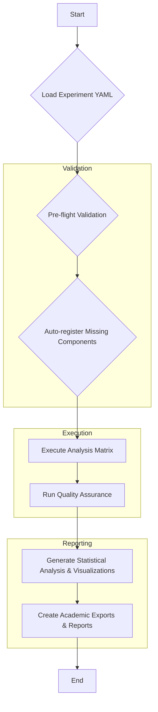

# Orchestration Scripts

This directory contains high-level scripts for orchestrating complex, end-to-end workflows within the Discernus platform. These scripts are the primary entry points for running experiments and production tasks.

---

## `comprehensive_experiment_orchestrator.py`

This is the main entry point for all academic research and validation workflows. It is a sophisticated, multi-stage script that handles the entire experiment lifecycle, ensuring reproducibility, data integrity, and methodological rigor.

### Key Responsibilities

-   **Experiment Definition Parsing**: Reads a YAML experiment definition file.
-   **Pre-Flight Validation**: Validates all components (frameworks, corpora, models) before execution.
-   **Component Auto-Registration**: Registers new components in the database if they don't exist.
-   **Analysis Execution**: Runs the analysis matrix across all specified texts and models.
-   **Quality Assurance**: Integrates the `LLMQualityAssuranceSystem` to validate results.
-   **Academic Export**: Generates publication-ready data (R, Stata, Jupyter) and reports.
-   **Checkpointing**: Saves experiment state to allow for resuming interrupted runs.

### High-Level Workflow

The orchestrator follows a precise sequence of steps to ensure a valid and reproducible experiment.


*This diagram will be expanded and moved to the central architecture documentation (Action Plan 9.2).*

### Basic Usage

```bash
# Run a new experiment
python scripts/applications/comprehensive_experiment_orchestrator.py /path/to/your/experiment.yaml

# Resume a failed or interrupted experiment
python scripts/applications/comprehensive_experiment_orchestrator.py --resume
```

---

## Other Orchestration Scripts

-   **`check_existing_systems.py`**: A utility script for developers and AI assistants to check if functionality already exists before starting new work.
-   **`...`**: Other high-level scripts will be documented here as they are promoted to production status. 