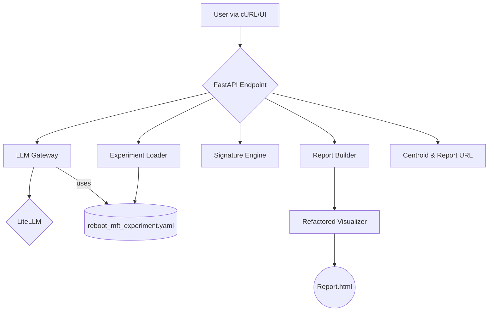

# 03: The Conversational MVP Plan (Phase 1)

This document details the components and workflow of the successfully implemented Conversational MVP, which answers **Researcher Question #1**.

## Goal

> *"What is the moral signature of this single piece of text according to a specific framework, and what does that look like geometrically?"*

## Architecture

The MVP was built using a clean, modular architecture that is isolated in the `src/reboot/` directory.

## Key Components

1.  **FastAPI Endpoint (`api/main.py`):**
    - Provides a simple `/analyze` endpoint.
    - Orchestrates the flow between the other components.
    - Serves the final HTML report from a static directory.

2.  **Self-Contained Experiment (`experiments/reboot_mft_experiment.yaml`):**
    - A single, glossary-compliant YAML file.
    - Contains all necessary `framework` definitions (axes, anchors, descriptions).
    - Includes detailed `prompt_guidance` to ensure high-quality, reproducible LLM analysis.

3.  **Prompt Engine (`engine/prompt_engine.py`):**
    - Dynamically constructs a rich, detailed prompt for the LLM using the guidance and framework definitions from the experiment file.

4.  **LLM Gateway (`gateway/`):**
    - Reuses the powerful, legacy `LiteLLMClient` but in a locally-copied, isolated, and refactored form.
    - Uses the `PromptEngine` to get its prompt.
    - Handles all communication with cloud and local LLMs.

5.  **Signature Engine (`engine/signature_engine.py`):**
    - Calculates the final `(x, y)` centroid from the LLM scores and the framework's anchor definitions.
    - Acts as the single source of truth for this calculation.

6.  **Report Builder & Visualizer (`reporting/`):**
    - The legacy `PlotlyCircularVisualizer` was copied and "power washed" to be fully glossary-compliant.
    - The `ReportBuilder` orchestrates calling the visualizer to generate a shareable HTML file.

## Outcome

The result is a lean but robust system that correctly analyzes a single text and provides both a data response (the centroid) and a visual artifact (the report URL), fully answering the first researcher question. 