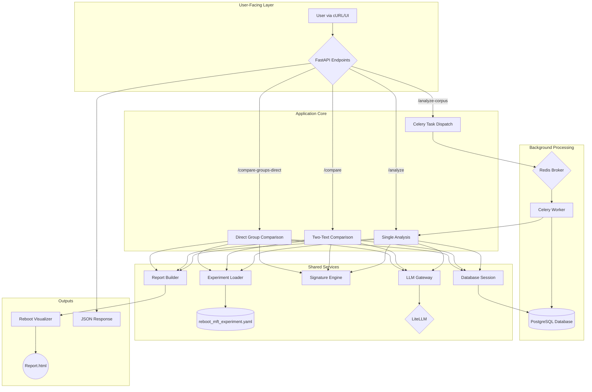

# 03: System Architecture & Capabilities

This document details the components and workflow of the Discernus Reboot platform, which currently answers **Researcher Questions #1, #2, #3, and #4**.

## Goal

> *"What is the moral signature of a text? How do two texts compare? How do groups of texts compare? And what is the geometric distance between them?"*

## Architecture

The system is built using a clean, modular architecture that is isolated in the `src/reboot/` directory. It supports multiple, high-performance workflows with a robust PostgreSQL persistence layer.

## Key Components

1.  **FastAPI Endpoints (`api/main.py`):**
    - Provides a suite of endpoints to answer the core research questions:
        - `/analyze`: For a single text.
        - `/compare`: For direct two-text comparison.
        - `/compare-groups-direct`: For high-performance, parallel comparison of two text groups.
        - `/analyze-corpus`: For asynchronous batch processing of a list of text files.
        - `/results/{job_id}`: To retrieve batch results.
        - `/compare-groups`: To compare the results of two completed batch jobs.
    - Orchestrates the flow between the other components.
    - Serves the final HTML reports from a static directory.

2.  **Self-Contained Experiment (`experiments/reboot_mft_experiment.yaml`):**
    - A single, glossary-compliant YAML file.
    - Contains all necessary `framework` definitions (axes, anchors, descriptions).
    - Includes detailed `prompt_guidance` to ensure high-quality, reproducible LLM analysis.

3.  **Prompt Engine (`engine/prompt_engine.py`):**
    - Dynamically constructs a rich, detailed prompt for the LLM using the guidance and framework definitions from the experiment file.

4.  **LLM Gateway (`gateway/`):**
    - Reuses the powerful, legacy `LiteLLMClient` but in a locally-copied, isolated, and refactored form.
    - Uses the `PromptEngine` to get its prompt.
    - Handles all communication with cloud and local LLMs.

5.  **Signature Engine (`engine/signature_engine.py`):**
    - `calculate_coordinates`: Calculates the final `(x, y)` centroid from the LLM scores and the framework's anchor definitions.
    - `calculate_distance`: Calculates the Euclidean distance between two centroids.
    - Acts as the single source of truth for all geometric calculations.

6.  **Report Builder & Visualizer (`reporting/`):**
    - The legacy `PlotlyCircularVisualizer` was copied and "power washed" to be fully glossary-compliant.
    - The `ReportBuilder` uses Jinja2 templates to generate shareable HTML files for all analysis types: single, comparison, and group comparison.
    - The reports for group comparisons now visualize the individual texts as well as the group centroids.

7.  **Persistence Layer (`database/`):**
    - **Models (`models.py`):** SQLAlchemy ORM models for `AnalysisJob` and `AnalysisResult` tables.
    - **Session (`session.py`):** Database session management with dependency injection for FastAPI.
    - **Migration (`alembic/`):** Dedicated Alembic environment for schema management, isolated from legacy systems.
    - **Storage:** All asynchronous job data is now persisted in PostgreSQL, eliminating temporary file dependencies.

8.  **Background Processing (`tasks.py`):**
    - Celery workers that process analysis tasks asynchronously.
    - Results are saved directly to the `AnalysisResult` table with proper error handling.
    - Job status tracking through the `AnalysisJob` model.

## Outcome

The result is a lean but robust system that correctly analyzes and compares texts and groups of texts, providing both data responses (centroids, distances) and rich visual artifacts (the reports). The system fully answers the first four researcher questions and is built on a scalable, production-ready foundation with persistent data storage.

## Foundational Improvements

### ✅ Completed: Persistence Layer (PostgreSQL)

**Status:** Successfully implemented and deployed.

The temporary file-based result store has been completely replaced with a robust PostgreSQL persistence layer:

- **Database Models:** `AnalysisJob` and `AnalysisResult` tables with proper relationships and foreign keys.
- **Migration Applied:** Database schema created using dedicated Alembic environment (`src/reboot/alembic/`).
- **Application Integration:** All endpoints (`/analyze-corpus`, `/results/{job_id}`, `/compare-groups`) now use database operations.
- **Celery Integration:** Background workers save results directly to PostgreSQL with error handling and job status updates.
- **Technical Debt Eliminated:** No more temporary files, filesystem dependencies, or data persistence concerns.

### Next Up: Testing & CI

To ensure the long-term stability and maintainability of the platform, the next foundational step is to implement a lean testing harness and a Continuous Integration (CI) pipeline.

#### 1. Test Harness (`pytest`)

- **Dependencies:** Add `pytest`, `pytest-asyncio`, and `httpx` (for the `TestClient`) to `requirements.txt`.
- **Structure:** Create a `tests/reboot/` directory to house all new tests, mirroring the application structure.
- **Initial Tests:**
    - Create `tests/reboot/api/test_main.py` for API-level smoke tests.
    - Use FastAPI's `TestClient` to test the primary endpoints (`/analyze`, `/compare`, `/compare-groups-direct`).
    - **Mocking Strategy:** The external call to the LLM Gateway (`get_llm_analysis`) will be mocked. This ensures tests are fast, free, and test only our application's logic, not external services.

#### 2. Continuous Integration (GitHub Actions)

- **Workflow:** Create a `.github/workflows/ci.yml` file.
- **Trigger:** The workflow will run on every `push` to the main development branch.
- **Steps:**
    1.  Check out the code.
    2.  Set up the correct Python version.
    3.  Install dependencies from `requirements.txt`.
    4.  Run the test suite via `pytest`.

This approach provides an immediate safety net against regressions, improves code quality, and makes future development faster and safer. 